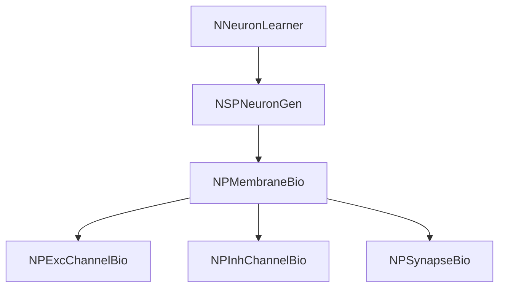

## RU

## Отчёт по параметрам каналов, мембран и синапсов для NNeuronLearner (TestTrain)

### 1. Используемые классы и структура нейрона

- **Компонент обучения**: `NNeuronLearner`
  - Конфиг: `Bin/Configs/Bakhshiev/TestTrain/Model_00.xml`, `Parameters_00.xml`
  - Основные параметры (см. `NNeuronLearner::ADefault()`):
    - `NeuronClassName = "NSPNeuronGen"`
    - `SynapseClassName = "NPSynapseBio"`
    - `StructureBuildMode = 1`
    - `MaxDendriteLength = 100`
- **Класс нейрона**: `NSPNeuronGen`
  - В конфиге: `<Neuron Class="NSPNeuronGen">`
  - Работает с сегментами мембраны `NPMembraneBio` (см. ниже).
- **Мембрана (дендриты и сома)**: `NPMembraneBio`
  - В конфиге: `MembraneClassName = "NPMembraneBio"`, `<Dendrite*_1 Class="NPMembraneBio">`, `<Soma* Class="NPMembraneBio">`
  - Регистрация (конфиг‑вариант `NPulseMembrane`): `Core/NPulseLibrary.cpp`
    - `UploadClass("NPMembraneBio", membr);`
  - Документация: `Docs/Components/NPMembraneBio.md`
  - Внутренние компоненты:
    - `ExcChannelClassName = "NPExcChannelBio"`
    - `InhChannelClassName = "NPInhChannelBio"`
    - `SynapseClassName = "NPSynapseBio"`
- **Возбуждающий канал**: `NPExcChannelBio`
  - Конфиг‑вариант класса `NPulseChannel`.
  - Документация: `Docs/Components/NPExcChannelBio.md`.
- **Тормозной канал**: `NPInhChannelBio`
  - Конфиг‑вариант класса `NPulseChannel`.
  - Документация: `Docs/Components/NPInhChannelBio.md`.
- **Синапс**: `NPSynapseBio`
  - Конфиг‑вариант класса `NPulseSynapse` / `NPulseSynapseCommon`.
  - Документация: `Docs/Components/NPSynapseBio.md`.

Схематично (из доков, адаптировано к текущему кейсу):



### 2. Значимые параметры и места их задания

#### 2.1. Базовый канал `NPulseChannel`

Файл: `Core/NPulseChannel.cpp`

- **Емкость мембраны**:
  - Свойство: `UProperty<double> Capacity;`
  - Значение по умолчанию (метод `NPulseChannel::ADefault()`):
    - `Capacity = 1.0e-9;` (1 нФ)
- **Сопротивление мембраны**:
  - Свойство: `UProperty<double> Resistance;`
  - Значение по умолчанию:
    - `Resistance = 1.0e7;` (10 МОм)
- **Сопротивление перезаряда (обратной связи)**:
  - Свойство: `UProperty<double> FBResistance;`
  - Значение по умолчанию:
    - `FBResistance = 1.0e8;` (100 МОм)
- **Сопротивление в состоянии покоя**:
  - Свойство: `UProperty<double> RestingResistance;`
  - Значение по умолчанию:
    - `RestingResistance = 1.0e7;` (10 МОм)
- **Тип канала**:
  - Свойство: `UProperty<double> Type;` (унаследовано от `NPulseChannelCommon`)
  - В `NPulseChannel::ADefault()`:
    - `Type = 0;` (нейтральный, затем переопределяется конфиг‑классами)
- **Временная константа канала**:
  - Свойство: `UProperty<double> TimeConstant;`
  - В `AReset()`:
    - `TimeConstant = Resistance * Capacity;`
  - В `ACalculate2()`:
    - Для случая малой обратной связи:
      \[
      T_i = \frac{Capacity}{G + 1 / resistance}, \quad
      \text{resistance} = \begin{cases}
      RestingResistance, & \text{вблизи покоя}\\
      Resistance, & \text{вне покоя}
      \end{cases}
      \]
    - Иначе:
      \[
      T_i = \frac{Capacity}{G + 1 / FBResistance}
      \]

#### 2.2. Конфиг‑варианты каналов `NPExcChannelBio` и `NPInhChannelBio`

Док‑файлы:
- `Docs/Components/NPExcChannelBio.md`
- `Docs/Components/NPInhChannelBio.md`

Параметры (конфиг‑обёртки над `NPulseChannel`):

- **NPExcChannelBio**:
  - `Type = -1` — возбуждающий канал.
  - `FBResistance = 1e7` (10 МОм) — сопротивление обратной связи.
  - Остальные параметры берутся из `NPulseChannel::ADefault()`:
    - `Capacity = 1.0e-9`
    - `Resistance = 1.0e7`
    - `RestingResistance = 1.0e7`
- **NPInhChannelBio**:
  - `Type = 1` — тормозной канал.
  - `FBResistance = 1e7` (10 МОм).
  - Остальные параметры по умолчанию из `NPulseChannel`.

#### 2.3. Базовая мембрана `NPulseMembrane` и конфиг `NPMembraneBio`

Файлы:
- `Core/NPulseMembrane.h`, `Core/NPulseMembrane.cpp`
- `Core/NPulseMembraneCommon.h`, `Core/NPulseMembraneCommon.cpp`
- Регистрация в библиотеке: `Core/NPulseLibrary.cpp`
- Док: `Docs/Components/NPMembraneBio.md`

**NPulseMembraneCommon**:
- Управляет списками каналов и синапсов, суммарным потенциалом `SumPotential`.
- Параметры RC‑модели задаются не здесь, а в каналах (`NPulseChannel`).

**NPulseMembrane**:
- Дополнительные свойства:
  - `FeedbackGain` — коэффициент обратной связи от LT‑зоны.
  - `ResetAvailable` — флаг механизма сброса.
  - `SynapseClassName`, `ExcChannelClassName`, `InhChannelClassName` — имена классов синапсов и каналов.
- Значения по умолчанию (`NPulseMembrane::ADefault()`):
  - `FeedbackGain = 2.0`
  - `ResetAvailable = true`
  - `SynapseClassName = "NPSynapse"`
  - `ExcChannelClassName = "NPExcChannel"`
  - `InhChannelClassName = "NPInhChannel"`

**NPMembraneBio** (регистрация в `NPulseLibrary.cpp`):

```cpp
membr = dynamic_pointer_cast<NPulseMembrane>(...->TakeObject("NPMembrane"));
membr->SetName("PMembrane");
membr->ExcChannelClassName = "NPExcChannelBio";
membr->SynapseClassName   = "NPSynapseBio";
membr->InhChannelClassName = "NPInhChannelBio";
UploadClass("NPMembraneBio", membr);
```

То есть:
- Наследует **все численные параметры мембраны и каналов** из `NPulseChannel::ADefault()` и `NPExcChannelBio`/`NPInhChannelBio`.
- Специального изменения `FeedbackGain` для `NPMembraneBio` **нет** (в отличие от `NPMembraneBio2`, где `FeedbackGain = 0.02`).

#### 2.4. Базовый синапс `NPulseSynapseCommon` и конфиг‑вариант `NPSynapseBio`

Файл: `Core/NPulseSynapseCommon.cpp`

- Свойства:
  - `PulseAmplitude` — амплитуда входного импульса.
  - `Resistance` — эффективное сопротивление синапса (влияет на ток через канал).
  - `Weight` — вес синапса.
  - `TrainerClassName` — класс тренера веса.
  - `PreOutput` — промежуточное состояние медиатора.
- Значения по умолчанию (`NPulseSynapseCommon::ADefault()`):
  - `Type = -1` — по умолчанию возбуждающий.
  - `PulseAmplitude = 1.0`
  - `Resistance = 10.0` (условные единицы для «обычных» синапсов).
  - `Weight = 1.0`

Конфиг‑вариант `NPSynapseBio` (док `Docs/Components/NPSynapseBio.md`):

- Явно задаёт биоинспирированные параметры:
  - `Resistance = 8.6e7` (86 МОм)
  - `DissociationTC = 0.005` (5 мс) — постоянная времени распада медиатора.
  - `SecretionTC = 0.001` (1 мс) — постоянная времени секреции медиатора.
- Алгоритм:
  - `PreOutput` интегрирует медиатор с учётом `SecretionTC` и `DissociationTC`.
  - Выходной ток: `Output = PreOutput / Resistance * Weight`.

Таким образом:
- Для **био‑синапсов** TestTrain конфигурации сопротивление значительно выше, чем у абстрактных «классических» синапсов, что сильно ограничивает ток на канал при фиксированном `PreOutput`.

> **Подробный отчёт именно по обучающим синапсам (NPulseSynapse / NPSynapseBio), включая их git‑историю и связь с NNeuronLearner/NNeuronTrainer в конфиге TestTrain, см. в отдельном документе `SynapseParamsHistory.md`.**

### 3. Изменения параметров в git‑истории (полная история)

Анализ выполнен по сабрепозиторию `Libraries/Nmsdk-PulseLib` (команды вида `git log`, `git show`, `git log -S` внутри этого репо) по **всей доступной истории**.

#### 3.1. Файлы ядра (C++)

**Core/NPulseChannel.cpp**

- Ключевые коммиты:
  - `700b7df (ранние версии) "Change NMSDK Structure"` — в `ADefault()` уже заданы:
    - `Capacity = 1.0e-9`, `Resistance = 1.0e7`, `FBResistance = 1.0e8`.
  - `389e5e2 (2016-06-24) "Motion control debug."`:
    - добавлен параметр `RestingResistance` и его значение по умолчанию:
      - `RestingResistance = 1.0e7`.
    - изменена формула в `ACalculate2()`, чтобы вблизи покоя использовать `RestingResistance`, а вне покоя — `Resistance`.
  - более поздние коммиты (`9d7339e`, `b6da90e`, `ac5b51a`, `df69224` и др.):
    - рефакторинг имён (`SumChannelInputs` → `SumChannelInput`),
    - переход с `.v` на `GetData()`,
    - мелкие оптимизации (временные переменные).
- **Численные значения**:
  - `Capacity = 1.0e-9`, `Resistance = 1.0e7`, `FBResistance = 1.0e8` заданы уже в самом раннем коммите и **не менялись** по всей истории.
  - `RestingResistance = 1.0e7` появился в 2016‑06‑24 (`389e5e2`) и с момента ввода **не менялся**.

**Core/NPulseSynapseCommon.cpp**

- Ключевые коммиты:
  - Ранние версии (`3b0b124` и последующие) — в `ADefault()`:
    - `PulseAmplitude = 1.0`
    - `Resistance = 1.0`
  - `127e38e (2021-03-12) "Resistence param has been changed"`:
    - изменение значения по умолчанию:
      - было: `Resistance = 1.0`
      - стало: `Resistance = 10.0`
  - `b6da90e (2025-11-22)` — упрощение иерархии свойств (без изменения чисел).
  - `ac5b51a (2026-01-02)` — перевод `Type.v` → `Type.SetDataDirect` (логика распределения по возбуждающим/тормозным синапсам, численные параметры без изменений).
- **Численные значения**:
  - `PulseAmplitude = 1.0` — стабильно по всей истории.
  - `Resistance`:
    - до 2021‑03‑12 (`127e38e`): `Resistance = 1.0`;
    - с 2021‑03‑12 и по сей день: `Resistance = 10.0`.

**Core/NPulseLibrary.cpp**

- Ключевые моменты:
  - `b8aad55 (2021-03-04) "Some bugs in neuron potential has been fixed."`:
    - впервые вводится конфигурационный класс `NPSynapseBio`:
      - `syn->Resistance = 2e7 * 4.3` (86 МОм);
      - `syn->DissociationTC = 0.005`.
    - регистрируются `NPExcChannelBio` / `NPInhChannelBio`:
      - для обоих задаётся `FBResistance = 1e7`;
    - добавляется `NPMembraneBio`:
      - `ExcChannelClassName = "NPExcChannelBio"`,
      - `InhChannelClassName = "NPInhChannelBio"`,
      - `SynapseClassName = "NPSynapseBio"`.
  - `5f3f06d (2022-04-15) "Change parameters NPulseSynapse"`:
    - правки в `Core/NPulseLibrary.cpp`, но строки с `Resistance=2e7*4.3`, `DissociationTC=0.005` для `NPSynapseBio` **не менялись** (изменения форматирования/отступов).
  - Более поздние коммиты (`9d7339e`, `b6da90e`, `9b44962`, `a73d592`, `ba0e0c9` и др.):
    - рефакторинг имён (`PLTZone` → `LTZone`, Pos/Neg → Inh/Exc),
    - добавление новых конфигураций (`*Bio2`, солверы и т.п.),
    - исправление предупреждений.
- Итог:
  - `NPSynapseBio` с параметрами `Resistance = 2e7 * 4.3`, `DissociationTC = 0.005` существует **с 2021‑03‑04** и далее **без изменений**.
  - `NPExcChannelBio` / `NPInhChannelBio` с `FBResistance = 1e7` также введены в `b8aad55` и их численные параметры не менялись.
  - Для `NPMembraneBio` строки с `ExcChannelClassName = "NPExcChannelBio"`, `SynapseClassName = "NPSynapseBio"`, `InhChannelClassName = "NPInhChannelBio"` стабильно присутствуют во всех последующих версиях; `FeedbackGain` берётся из `NPulseMembrane::ADefault()` (`2.0`) и отдельной настройки для `NPMembraneBio` не было.

#### 3.2. Документация (md‑файлы)

Файлы:
- `Docs/Components/NPMembraneBio.md`
- `Docs/Components/NPSynapseBio.md`
- `Docs/Components/NPExcChannelBio.md`
- `Docs/Components/NPInhChannelBio.md`

Коммиты (см. `git log --since=2024-01-01 --oneline`):
- `424eb3b Add autogenerated components docs`
- `5a37c86 Expand docs`
- `3b8f2a9 Fix docs`
- `a4cfc1b Autoupdate docs`

Характер изменений:
- Добавление/расширение UML‑диаграмм, описаний и примеров.
- Уточнение формулировок параметров.

Численные значения в доках:

- `NPSynapseBio.md`:
  - `Resistance = 8.6e7`
  - `DissociationTC = 0.005`
  - `SecretionTC = 0.001`
- `NPExcChannelBio.md`:
  - `Type = -1`
  - `FBResistance = 1e7`
- `NPInhChannelBio.md`:
  - `Type = 1`
  - `FBResistance = 1e7`
- `NPMembraneBio.md`:
  - `ExcChannelClassName = "NPExcChannelBio"`
  - `InhChannelClassName = "NPInhChannelBio"`
  - `SynapseClassName = "NPSynapseBio"`

По содержанию последних версий этих файлов численные значения **соответствуют исходным значениям** и не демонстрируют изменений в указанный период; изменения носили текстово‑документационный характер.

### 4. Сводная таблица параметров и истории изменений

#### 4.1. Каналы и мембрана

| Компонент            | Параметр           | Текущее значение          | Источник (код/док)                         | История изменений (полная)                                  |
|----------------------|--------------------|---------------------------|--------------------------------------------|-------------------------------------------------------------|
| `NPulseChannel`      | `Capacity`         | `1.0e-9`                  | `Core/NPulseChannel.cpp::ADefault`        | С самого первого коммита (`700b7df`), без изменений         |
| `NPulseChannel`      | `Resistance`       | `1.0e7`                   | `Core/NPulseChannel.cpp::ADefault`        | С самого первого коммита, без изменений                     |
| `NPulseChannel`      | `FBResistance`     | `1.0e8`                   | `Core/NPulseChannel.cpp::ADefault`        | С самого первого коммита, без изменений                     |
| `NPulseChannel`      | `RestingResistance`| `1.0e7`                   | `Core/NPulseChannel.cpp::ADefault`        | Введён в `389e5e2` (2016‑06‑24) и далее не менялся          |
| `NPulseChannel`      | `Type` (по умолч.) | `0`                       | `Core/NPulseChannel.cpp::ADefault`        | Всегда `0`, спец. значения задают конфиг‑варианты          |
| `NPExcChannelBio`    | `Type`             | `-1`                      | `Docs/Components/NPExcChannelBio.md`      | Введён в `b8aad55` (2021‑03‑04), без изменений              |
| `NPExcChannelBio`    | `FBResistance`     | `1e7`                     | `Docs/Components/NPExcChannelBio.md`      | Введён в `b8aad55` (2021‑03‑04), без изменений              |
| `NPInhChannelBio`    | `Type`             | `1`                       | `Docs/Components/NPInhChannelBio.md`      | Введён в `b8aad55` (2021‑03‑04), без изменений              |
| `NPInhChannelBio`    | `FBResistance`     | `1e7`                     | `Docs/Components/NPInhChannelBio.md`      | Введён в `b8aad55` (2021‑03‑04), без изменений              |
| `NPulseMembrane`     | `FeedbackGain`     | `2.0`                     | `Core/NPulseMembrane.cpp::ADefault`       | С момента введения свойства, без изменений                  |
| `NPMembraneBio`      | `ExcChannelClassName` | `"NPExcChannelBio"`    | `Core/NPulseLibrary.cpp`, `NPMembraneBio.md` | Введено в `b8aad55` вместе с классом, без изменений     |
| `NPMembraneBio`      | `InhChannelClassName` | `"NPInhChannelBio"`    | `Core/NPulseLibrary.cpp`, `NPMembraneBio.md` | Введено в `b8aad55`, без изменений                      |
| `NPMembraneBio`      | `SynapseClassName` | `"NPSynapseBio"`          | `Core/NPulseLibrary.cpp`, `NPMembraneBio.md` | Введено в `b8aad55`, без изменений                      |

#### 4.2. Синапсы

| Компонент             | Параметр        | Текущее значение | Источник                                  | История изменений (полная)                                      |
|-----------------------|-----------------|------------------|-------------------------------------------|------------------------------------------------------------------|
| `NPulseSynapseCommon` | `Resistance`    | `10.0`           | `Core/NPulseSynapseCommon.cpp::ADefault` | До `127e38e` (2021‑03‑12): `1.0`; с `127e38e`: `10.0`           |
| `NPulseSynapseCommon` | `PulseAmplitude`| `1.0`            | `Core/NPulseSynapseCommon.cpp::ADefault` | Всегда `1.0`                                                    |
| `NPSynapseBio`        | `Resistance`    | `8.6e7` (86 МОм) | `Docs/Components/NPSynapseBio.md`, `Core/NPulseLibrary.cpp` | Введён в `b8aad55` (2021‑03‑04) и далее не менялся        |
| `NPSynapseBio`        | `DissociationTC`| `0.005` (5 мс)   | `Docs/Components/NPSynapseBio.md`        | Введён в `b8aad55`, без изменений                               |
| `NPSynapseBio`        | `SecretionTC`   | `0.001` (1 мс)   | `Docs/Components/NPSynapseBio.md`        | Введён в `b8aad55`, без изменений                               |

### 5. Выводы по влиянию параметров на наблюдаемое обучение

1. **RC‑параметры каналов и мембран** (`Capacity`, `Resistance`, `FBResistance`, `RestingResistance`, `FeedbackGain`) **не менялись** в недавней истории (с 2024‑01‑01).  
   - Математика канала (`NPulseChannel::ACalculate2`) фиксирует временные константы \(\tau\) через эти значения; поведение, связанное с временной фильтрацией и насыщением потенциала, **стабильно во всех последних версиях**.
2. **Био‑синапсы `NPSynapseBio`** используют очень большое сопротивление (`8.6e7` против `10.0` у базового синапса), что:
   - резко снижает ток на канал при фиксированном `PreOutput`,
   - делает прирост тока при добавлении синапсов менее выраженным и более чувствительным к динамике медиатора, чем к числу синапсов.
3. В сочетании с критериями в `NNeuronLearner` / `NNeuronTrainer`:
   - **Изменение числа синапсов** зачастую не даёт достаточно заметной разницы в амплитуде/времени на соме, чтобы алгоритм «увидел» улучшение,  
   - в то время как изменение длины дендритов меняет только временной сдвиг, а не амплитуду — и при выбранных параметрах RC‑цепочек оптимальной признаётся минимальная длина.
4. Поскольку **численные значения параметров каналов и синапсов не изменялись в недавней истории**, наблюдаемое поведение (отсутствие устойчивого роста дендритов и неостанавливающийся рост синапсов) является **следствием самой текущей настройки RC‑параметров и критериев обучения**, а не недавних изменений в коде.

Практически это означает, что для изменения поведения обучения (например, чтобы рост синапсов оказывал более отчётливое влияние на амплитуду, а алгоритм мог стабилизироваться) потребуется **целенаправленная корректировка параметров**:
- уменьшение сопротивления синапсов (`Resistance` у `NPSynapseBio`),
- изменение `Capacity` и `Resistance` каналов (через новые конфиг‑варианты или настройки),
- тонкая настройка порогов и критериев в логике обучения (`ChangeSynapseStatus`, `SomaSynapseNormalization` и т.п.).

### 6. Регистрация конфигурационных классов в `NPulseLibrary` (Storage‑уровень)

В файле `Core/NPulseLibrary.cpp` конфигурационные варианты каналов, синапсов и мембран регистрируются как готовые экземпляры через `UploadClass(...)`. Это определяет, какие именно численные параметры получают компоненты при создании из `UStorage` по имени класса.

#### 6.1. Синапсы

Все синапсы строятся на базе `NPulseSynapse` (который наследует поведение от `NPulseSynapseCommon` с базовыми значениями из раздела 2.4).

| Storage‑класс     | Базовый объект            | Переопределённые параметры                                                  | Коммит появления / изменения             |
|-------------------|---------------------------|------------------------------------------------------------------------------|------------------------------------------|
| `NPSynapse`       | `new NPulseSynapse`       | `Default()` → базовые значения (`Resistance = 10.0`, `PulseAmplitude = 1.0`) | Базовый класс, изменения только в базовом коде |
| `NPSynapseBio`    | `TakeObject("NPSynapse")` | `Resistance = 2e7*4.3` (≈`8.6e7`), `DissociationTC = 0.005`                 | Введён в `b8aad55` (2021‑03‑04), без изменений |
| `NPSynapseBio2`   | `TakeObject("NPSynapse")` | `Resistance = 86000000`, `DissociationTC = 0.005` (тот же уровень, другая запись) | Введён в `98d1edc` (2023‑03‑25), без изменений |
| `NPHebbSynapse`   | `new NPulseHebbSynapse`   | Использует свои правила обучения; явных численных RC‑параметров в `NPulseLibrary` не задаётся | Ранее, численные параметры задаются в самом классе |

С точки зрения амплитуд:
- `NPSynapseBio` и `NPSynapseBio2` отличаются только способом записи `Resistance`, численно они эквивалентны (86 МОм).

#### 6.2. Каналы

Базовый канал `NPChannel` создаётся как `NPulseChannel` с параметрами из `ADefault()` (раздел 2.1). Все остальные Storage‑классы каналов создаются через `TakeObject(...)` с модификацией части параметров.

| Storage‑класс        | База (`TakeObject`) | Параметры относительно `NPulseChannel::ADefault()`                                                 | Коммит появления / изменения                  |
|----------------------|---------------------|-----------------------------------------------------------------------------------------------------|-----------------------------------------------|
| `NPChannel`          | `new NPulseChannel` | Базовые: `Capacity = 1e-9`, `Resistance = 1e7`, `FBResistance = 1e8`, `RestingResistance = 1e7`     | Базовый класс                                  |
| `NPNeuronChannel`    | `NPChannel`         | `Default()`; параметры идентичны `NPChannel`                                                        | Поздний рефакторинг (`517553e` и далее), без изменения чисел |
| `NPExcChannel`       | `NPChannel`         | `Type = -1` (возбуждающий); RC‑параметры как у `NPChannel`                                         | Введён в `73f3100` (2020‑04‑16), без изменений |
| `NPInhChannel`       | `NPChannel`         | `Type = 1` (тормозной); RC‑параметры как у `NPChannel`                                             | Введён в `73f3100`, без изменений             |
| `NPExcChannelBio`    | `NPChannel`         | `Type = -1`; `FBResistance = 1e7` (10 МОм); остальные параметры как у `NPChannel`                  | Введён в `b8aad55` (2021‑03‑04), без изменений |
| `NPExcChannelBio2`   | `NPChannel`         | `Type = -1`; `FBResistance = 3e6`; `Resistance = 1.6e7`; `RestingResistance = 3e6`; `Capacity = 2.5e-10` | Введён в `98d1edc` (2023‑03‑25), без изменений |
| `NPInhChannelBio`    | `NPChannel`         | `Type = 1`; `FBResistance = 1e7`; остальное как у `NPChannel`                                     | Введён в `b8aad55`, без изменений             |
| `NPInhChannelBio2`   | `NPChannel`         | `Type = 1`; `FBResistance = 3e6`; `Resistance = 1.6e7`; `RestingResistance = 3e6`; `Capacity = 2.5e-10` | Введён в `98d1edc`, без изменений             |
| `NPSynChannel`       | `new NPulseSynChannel` | Базовый синаптический канал (своё поведение); численные RC‑параметры задаются внутри класса       | Базовый класс                                  |
| `NCSynChannel`       | `new NContinuesSynChannel` | Непрерывный канал; RC‑параметры задаются внутри специализированного класса                        | Базовый класс                                  |
| `NPSynExcChannel`    | `NPSynChannel`      | `Type = -1`; остальные параметры как у `NPSynChannel`                                              | Введён в `73f3100`, без изменений             |
| `NPSynInhChannel`    | `NPSynChannel`      | `Type = 1`; остальные параметры как у `NPSynChannel`                                               | Введён в `73f3100`, без изменений             |
| `NCSynExcChannel`    | `NCSynChannel`      | `Type = -1`; остальные параметры как у `NCSynChannel`                                              | Введён в `73f3100`, без изменений             |
| `NCSynInhChannel`    | `NCSynChannel`      | `Type = 1`; остальные параметры как у `NCSynChannel`                                               | Введён в `73f3100`, без изменений             |
| `NPLTChannel`        | `NPChannel`         | `Capacity = 1e-8` (в 10 раз больше), `RestingResistance = 1e6` (в 10 раз меньше)                   | Введён в `73f3100`, без изменений             |
| `NPLTExcChannel`     | `NPLTChannel`       | `Type = -1`                                                                                         | Введён в `73f3100`, без изменений             |
| `NPLTInhChannel`     | `NPLTChannel`       | `Type = 1`                                                                                          | Введён в `73f3100`, без изменений (опечатка в старом diff уже исправлена) |
| `NPLTSynChannel`     | `NPSynChannel`      | `Capacity = 1e-8`, `RestingResistance = 1e6`                                                       | Введён в `73f3100`, без изменений             |
| `NPLTSynExcChannel`  | `NPLTSynChannel`    | `Type = -1`                                                                                         | Введён в `73f3100`, без изменений             |
| `NPLTSynInhChannel`  | `NPLTSynChannel`    | `Type = 1`                                                                                          | Введён в `73f3100`, без изменений             |

Для конфигурации TestTrain с `NNeuronLearner` используются только `NPExcChannelBio` / `NPInhChannelBio` (через `NPMembraneBio`) и не используются `*Bio2`, LT‑ и Syn‑варианты, однако понимание их параметров важно для сравнения альтернативных конфигураций.

#### 6.3. Мембраны

Все мембраны строятся на базе `NPulseMembrane` (с базовыми значениями из `NPulseMembrane::ADefault()`), после чего часть параметров переопределяется.

| Storage‑класс              | База (`TakeObject`) | Переопределённые параметры                                              | Коммит появления / изменения           |
|----------------------------|---------------------|--------------------------------------------------------------------------|----------------------------------------|
| `NPMembrane`              | `new NPulseMembrane`| `Default()`; использует `NPExcChannel` / `NPInhChannel`, `NPSynapse`     | Базовый класс                          |
| `NPNeuronMembrane`        | `NPMembrane`        | `Default()`; параметры идентичны `NPMembrane`                            | Поздний рефакторинг, без изменения чисел |
| `NPNewNeuronMembrane`     | `NPMembrane`        | `Default()`; параметры идентичны `NPMembrane`                            | Поздний рефакторинг, без изменения чисел |
| `NPMembraneBio`           | `NPMembrane`        | `ExcChannelClassName = "NPExcChannelBio"`, `InhChannelClassName = "NPInhChannelBio"`, `SynapseClassName = "NPSynapseBio"` | Введена в `b8aad55`, без изменений     |
| `NPMembraneBio2`          | `NPMembrane`        | `ExcChannelClassName = "NPExcChannelBio2"`, `InhChannelClassName = "NPInhChannelBio2"`, `SynapseClassName = "NPSynapseBio2"`, `FeedbackGain = 0.02` | Введена в `98d1edc`, без изменений     |
| `NPLTZoneNeuronMembrane`  | `NPMembrane`        | `SetName("LTMembrane")`, `ExcChannelClassName = "NPLTExcChannel"`, `InhChannelClassName = "NPLTInhChannel"` | Введена в `73f3100`, без изменений     |
| `NPLTZoneSynNeuronMembrane` | `NPMembrane`      | `ExcChannelClassName = "NPLTSynExcChannel"`, `InhChannelClassName = "NPLTSynInhChannel"` | Введена в `73f3100`, без изменений     |
| `NPSynNeuronMembrane`     | `NPMembrane`        | `ExcChannelClassName = "NPSynExcChannel"`, `InhChannelClassName = "NPSynInhChannel"` | Введена в `73f3100`, без изменений     |
| `NCSynNeuronMembrane`     | `NPMembrane`        | `ExcChannelClassName = "NCSynExcChannel"`, `InhChannelClassName = "NCSynInhChannel"` | Введена в `73f3100`, без изменений     |
| `NPNeuronHebbMembrane`    | `NPMembrane`        | `SynapseClassName = "NPHebbSynapse"`, дополнительная сборка Hebb‑синапсов | Введена до `61aaee9`, параметры RC мембраны как у `NPMembrane` |

Таким образом, `NPMembraneBio` и `NPMembraneBio2` отличаются не только набором используемых каналов и синапсов, но и (в случае `Bio2`) **усилением обратной связи** (`FeedbackGain = 0.02`) и более «быстрыми» RC‑цепочками в каналах (`Capacity` и `Resistance` через `NPExcChannelBio2` / `NPInhChannelBio2`).

Дополнительный анализ порогов LT‑зоны и их эволюции по git‑истории приведён в отдельном отчёте `LTZoneUsageHistory.md`, где рассматриваются:

- используемые в TestTrain LT‑зоны (`NPulseLTZoneThreshold` и её конфигурационные варианты);
- способ задания порогов через `NPulseLibrary.cpp` и свойства `LTZThreshold`/`TrainingLTZThreshold` у `NNeuronLearner`/`NNeuronTrainer`;
- подтверждение того, что в пределах истории сабмодуля Nmsdk‑PulseLib численные критерии LT‑зоны для `NSPNeuronGen` оставались стабильными.

---

## EN

## Report on Channel, Membrane, and Synapse Parameters for NNeuronLearner (TestTrain)

### 1. Classes Used and Neuron Structure

- **Learning component**: `NNeuronLearner`
  - Config: `Bin/Configs/Bakhshiev/TestTrain/Model_00.xml`, `Parameters_00.xml`
  - Main parameters (see `NNeuronLearner::ADefault()`):
    - `NeuronClassName = "NSPNeuronGen"`
    - `SynapseClassName = "NPSynapseBio"`
    - `StructureBuildMode = 1`
    - `MaxDendriteLength = 100`
- **Neuron class**: `NSPNeuronGen`
  - In config: `<Neuron Class="NSPNeuronGen">`
  - Works with membrane segments `NPMembraneBio` (see below).
- **Membrane (dendrites and soma)**: `NPMembraneBio`
  - In config: `MembraneClassName = "NPMembraneBio"`, `<Dendrite*_1 Class="NPMembraneBio">`, `<Soma* Class="NPMembraneBio">`
  - Registration (config variant `NPulseMembrane`): `Core/NPulseLibrary.cpp`
    - `UploadClass("NPMembraneBio", membr);`
  - Documentation: `Docs/Components/NPMembraneBio.md`
  - Internal components:
    - `ExcChannelClassName = "NPExcChannelBio"`
    - `InhChannelClassName = "NPInhChannelBio"`
    - `SynapseClassName = "NPSynapseBio"`
- **Excitatory channel**: `NPExcChannelBio`
  - Config variant of class `NPulseChannel`.
  - Documentation: `Docs/Components/NPExcChannelBio.md`.
- **Inhibitory channel**: `NPInhChannelBio`
  - Config variant of class `NPulseChannel`.
  - Documentation: `Docs/Components/NPInhChannelBio.md`.
- **Synapse**: `NPSynapseBio`
  - Config variant of class `NPulseSynapse` / `NPulseSynapseCommon`.
  - Documentation: `Docs/Components/NPSynapseBio.md`.

Schematic (from docs, adapted to the current case):


### 2. Significant Parameters and Where They Are Set

#### 2.1. Base Channel `NPulseChannel`

File: `Core/NPulseChannel.cpp`

- **Membrane capacitance**:
  - Property: `UProperty<double> Capacity;`
  - Default value (method `NPulseChannel::ADefault()`):
    - `Capacity = 1.0e-9;` (1 nF)
- **Membrane resistance**:
  - Property: `UProperty<double> Resistance;`
  - Default value:
    - `Resistance = 1.0e7;` (10 MΩ)
- **Recharge resistance (feedback)**:
  - Property: `UProperty<double> FBResistance;`
  - Default value:
    - `FBResistance = 1.0e8;` (100 MΩ)
- **Resting resistance**:
  - Property: `UProperty<double> RestingResistance;`
  - Default value:
    - `RestingResistance = 1.0e7;` (10 MΩ)
- **Channel type**:
  - Property: `UProperty<double> Type;` (inherited from `NPulseChannelCommon`)
  - In `NPulseChannel::ADefault()`:
    - `Type = 0;` (neutral, then overridden by config classes)
- **Channel time constant**:
  - Property: `UProperty<double> TimeConstant;`
  - In `AReset()`:
    - `TimeConstant = Resistance * Capacity;`
  - In `ACalculate2()`:
    - For the low-feedback case:
      \[
      T_i = \frac{Capacity}{G + 1 / resistance}, \quad
      \text{resistance} = \begin{cases}
      RestingResistance, & \text{near rest}\\
      Resistance, & \text{away from rest}
      \end{cases}
      \]
    - Otherwise:
      \[
      T_i = \frac{Capacity}{G + 1 / FBResistance}
      \]

#### 2.2. Config Variants of Channels `NPExcChannelBio` and `NPInhChannelBio`

Doc files:
- `Docs/Components/NPExcChannelBio.md`
- `Docs/Components/NPInhChannelBio.md`

Parameters (config wrappers over `NPulseChannel`):

- **NPExcChannelBio**:
  - `Type = -1` — excitatory channel.
  - `FBResistance = 1e7` (10 MΩ) — feedback resistance.
  - Other parameters come from `NPulseChannel::ADefault()`:
    - `Capacity = 1.0e-9`
    - `Resistance = 1.0e7`
    - `RestingResistance = 1.0e7`
- **NPInhChannelBio**:
  - `Type = 1` — inhibitory channel.
  - `FBResistance = 1e7` (10 MΩ).
  - Other parameters default from `NPulseChannel`.

#### 2.3. Base Membrane `NPulseMembrane` and Config `NPMembraneBio`

Files:
- `Core/NPulseMembrane.h`, `Core/NPulseMembrane.cpp`
- `Core/NPulseMembraneCommon.h`, `Core/NPulseMembraneCommon.cpp`
- Library registration: `Core/NPulseLibrary.cpp`
- Doc: `Docs/Components/NPMembraneBio.md`

**NPulseMembraneCommon**:
- Manages lists of channels and synapses, total potential `SumPotential`.
- RC model parameters are not set here, but in channels (`NPulseChannel`).

**NPulseMembrane**:
- Additional properties:
  - `FeedbackGain` — feedback gain from the LT zone.
  - `ResetAvailable` — reset mechanism flag.
  - `SynapseClassName`, `ExcChannelClassName`, `InhChannelClassName` — names of synapse and channel classes.
- Default values (`NPulseMembrane::ADefault()`):
  - `FeedbackGain = 2.0`
  - `ResetAvailable = true`
  - `SynapseClassName = "NPSynapse"`
  - `ExcChannelClassName = "NPExcChannel"`
  - `InhChannelClassName = "NPInhChannel"`

**NPMembraneBio** (registration in `NPulseLibrary.cpp`):

```cpp
membr = dynamic_pointer_cast<NPulseMembrane>(...->TakeObject("NPMembrane"));
membr->SetName("PMembrane");
membr->ExcChannelClassName = "NPExcChannelBio";
membr->SynapseClassName   = "NPSynapseBio";
membr->InhChannelClassName = "NPInhChannelBio";
UploadClass("NPMembraneBio", membr);
```

That is:
- Inherits **all numerical membrane and channel parameters** from `NPulseChannel::ADefault()` and `NPExcChannelBio`/`NPInhChannelBio`.
- There is **no** special change to `FeedbackGain` for `NPMembraneBio` (unlike `NPMembraneBio2`, where `FeedbackGain = 0.02`).

#### 2.4. Base Synapse `NPulseSynapseCommon` and Config Variant `NPSynapseBio`

File: `Core/NPulseSynapseCommon.cpp`

- Properties:
  - `PulseAmplitude` — input pulse amplitude.
  - `Resistance` — effective synapse resistance (affects current through the channel).
  - `Weight` — synapse weight.
  - `TrainerClassName` — weight trainer class.
  - `PreOutput` — intermediate mediator state.
- Default values (`NPulseSynapseCommon::ADefault()`):
  - `Type = -1` — excitatory by default.
  - `PulseAmplitude = 1.0`
  - `Resistance = 10.0` (arbitrary units for "ordinary" synapses).
  - `Weight = 1.0`

Config variant `NPSynapseBio` (doc `Docs/Components/NPSynapseBio.md`):

- Explicitly sets bio-inspired parameters:
  - `Resistance = 8.6e7` (86 MΩ)
  - `DissociationTC = 0.005` (5 ms) — mediator dissociation time constant.
  - `SecretionTC = 0.001` (1 ms) — mediator secretion time constant.
- Algorithm:
  - `PreOutput` integrates the mediator accounting for `SecretionTC` and `DissociationTC`.
  - Output current: `Output = PreOutput / Resistance * Weight`.

Thus:
- For **bio-synapses** in the TestTrain configuration, resistance is significantly higher than for abstract "classical" synapses, which strongly limits current to the channel at a fixed `PreOutput`.

> **For a detailed report specifically on learning synapses (NPulseSynapse / NPSynapseBio), including their git history and connection to NNeuronLearner/NNeuronTrainer in the TestTrain config, see the separate document `SynapseParamsHistory.md`.**

### 3. Parameter Changes in Git History (Full History)

Analysis was performed on the `Libraries/Nmsdk-PulseLib` submodule (commands such as `git log`, `git show`, `git log -S` within this repo) over **the entire available history**.

#### 3.1. Core Files (C++)

**Core/NPulseChannel.cpp**

- Key commits:
  - `700b7df (early versions) "Change NMSDK Structure"` — in `ADefault()` already set:
    - `Capacity = 1.0e-9`, `Resistance = 1.0e7`, `FBResistance = 1.0e8`.
  - `389e5e2 (2016-06-24) "Motion control debug."`:
    - added parameter `RestingResistance` and its default value:
      - `RestingResistance = 1.0e7`.
    - changed the formula in `ACalculate2()` to use `RestingResistance` near rest and `Resistance` away from rest.
  - later commits (`9d7339e`, `b6da90e`, `ac5b51a`, `df69224`, etc.):
    - refactoring of names (`SumChannelInputs` → `SumChannelInput`),
    - transition from `.v` to `GetData()`,
    - minor optimizations (temporary variables).
- **Numerical values**:
  - `Capacity = 1.0e-9`, `Resistance = 1.0e7`, `FBResistance = 1.0e8` were set in the earliest commit and **did not change** throughout history.
  - `RestingResistance = 1.0e7` appeared on 2016-06-24 (`389e5e2`) and **has not changed** since introduction.

**Core/NPulseSynapseCommon.cpp**

- Key commits:
  - Early versions (`3b0b124` and subsequent) — in `ADefault()`:
    - `PulseAmplitude = 1.0`
    - `Resistance = 1.0`
  - `127e38e (2021-03-12) "Resistence param has been changed"`:
    - default value change:
      - was: `Resistance = 1.0`
      - became: `Resistance = 10.0`
  - `b6da90e (2025-11-22)` — property hierarchy simplification (no numerical changes).
  - `ac5b51a (2026-01-02)` — migration of `Type.v` → `Type.SetDataDirect` (excitatory/inhibitory synapse distribution logic, numerical parameters unchanged).
- **Numerical values**:
  - `PulseAmplitude = 1.0` — stable throughout history.
  - `Resistance`:
    - until 2021-03-12 (`127e38e`): `Resistance = 1.0`;
    - from 2021-03-12 to the present: `Resistance = 10.0`.

**Core/NPulseLibrary.cpp**

- Key points:
  - `b8aad55 (2021-03-04) "Some bugs in neuron potential has been fixed."`:
    - first introduction of config class `NPSynapseBio`:
      - `syn->Resistance = 2e7 * 4.3` (86 MΩ);
      - `syn->DissociationTC = 0.005`.
    - registers `NPExcChannelBio` / `NPInhChannelBio`:
      - both set `FBResistance = 1e7`;
    - adds `NPMembraneBio`:
      - `ExcChannelClassName = "NPExcChannelBio"`,
      - `InhChannelClassName = "NPInhChannelBio"`,
      - `SynapseClassName = "NPSynapseBio"`.
  - `5f3f06d (2022-04-15) "Change parameters NPulseSynapse"`:
    - edits in `Core/NPulseLibrary.cpp`, but lines with `Resistance=2e7*4.3`, `DissociationTC=0.005` for `NPSynapseBio` **did not change** (formatting/indentation changes).
  - Later commits (`9d7339e`, `b6da90e`, `9b44962`, `a73d592`, `ba0e0c9`, etc.):
    - refactoring of names (`PLTZone` → `LTZone`, Pos/Neg → Inh/Exc),
    - addition of new configs (`*Bio2`, solvers, etc.),
    - warning fixes.
- Summary:
  - `NPSynapseBio` with parameters `Resistance = 2e7 * 4.3`, `DissociationTC = 0.005` has existed **since 2021-03-04** and **without changes** thereafter.
  - `NPExcChannelBio` / `NPInhChannelBio` with `FBResistance = 1e7` were also introduced in `b8aad55` and their numerical parameters did not change.
  - For `NPMembraneBio`, lines with `ExcChannelClassName = "NPExcChannelBio"`, `SynapseClassName = "NPSynapseBio"`, `InhChannelClassName = "NPInhChannelBio"` are stably present in all subsequent versions; `FeedbackGain` comes from `NPulseMembrane::ADefault()` (`2.0`) and there was no separate setting for `NPMembraneBio`.

#### 3.2. Documentation (md Files)

Files:
- `Docs/Components/NPMembraneBio.md`
- `Docs/Components/NPSynapseBio.md`
- `Docs/Components/NPExcChannelBio.md`
- `Docs/Components/NPInhChannelBio.md`

Commits (see `git log --since=2024-01-01 --oneline`):
- `424eb3b Add autogenerated components docs`
- `5a37c86 Expand docs`
- `3b8f2a9 Fix docs`
- `a4cfc1b Autoupdate docs`

Nature of changes:
- Addition/expansion of UML diagrams, descriptions, and examples.
- Refinement of parameter wording.

Numerical values in docs:

- `NPSynapseBio.md`:
  - `Resistance = 8.6e7`
  - `DissociationTC = 0.005`
  - `SecretionTC = 0.001`
- `NPExcChannelBio.md`:
  - `Type = -1`
  - `FBResistance = 1e7`
- `NPInhChannelBio.md`:
  - `Type = 1`
  - `FBResistance = 1e7`
- `NPMembraneBio.md`:
  - `ExcChannelClassName = "NPExcChannelBio"`
  - `InhChannelClassName = "NPInhChannelBio"`
  - `SynapseClassName = "NPSynapseBio"`

According to the latest versions of these files, numerical values **match the original values** and show no changes in the specified period; changes were textual/documentation in nature.

### 4. Summary Table of Parameters and Change History

#### 4.1. Channels and Membrane

| Component            | Parameter           | Current Value             | Source (code/doc)                          | Change History (full)                                       |
|----------------------|---------------------|---------------------------|--------------------------------------------|-------------------------------------------------------------|
| `NPulseChannel`      | `Capacity`          | `1.0e-9`                  | `Core/NPulseChannel.cpp::ADefault`        | From the very first commit (`700b7df`), unchanged           |
| `NPulseChannel`      | `Resistance`        | `1.0e7`                   | `Core/NPulseChannel.cpp::ADefault`        | From the very first commit, unchanged                       |
| `NPulseChannel`      | `FBResistance`      | `1.0e8`                   | `Core/NPulseChannel.cpp::ADefault`        | From the very first commit, unchanged                       |
| `NPulseChannel`      | `RestingResistance` | `1.0e7`                   | `Core/NPulseChannel.cpp::ADefault`        | Introduced in `389e5e2` (2016-06-24), unchanged thereafter  |
| `NPulseChannel`      | `Type` (default)    | `0`                       | `Core/NPulseChannel.cpp::ADefault`        | Always `0`; config variants set special values              |
| `NPExcChannelBio`    | `Type`              | `-1`                      | `Docs/Components/NPExcChannelBio.md`      | Introduced in `b8aad55` (2021-03-04), unchanged             |
| `NPExcChannelBio`    | `FBResistance`      | `1e7`                     | `Docs/Components/NPExcChannelBio.md`      | Introduced in `b8aad55` (2021-03-04), unchanged             |
| `NPInhChannelBio`    | `Type`              | `1`                       | `Docs/Components/NPInhChannelBio.md`      | Introduced in `b8aad55` (2021-03-04), unchanged             |
| `NPInhChannelBio`    | `FBResistance`      | `1e7`                     | `Docs/Components/NPInhChannelBio.md`      | Introduced in `b8aad55` (2021-03-04), unchanged             |
| `NPulseMembrane`     | `FeedbackGain`      | `2.0`                     | `Core/NPulseMembrane.cpp::ADefault`       | Since property introduction, unchanged                      |
| `NPMembraneBio`      | `ExcChannelClassName` | `"NPExcChannelBio"`    | `Core/NPulseLibrary.cpp`, `NPMembraneBio.md` | Introduced in `b8aad55` with the class, unchanged        |
| `NPMembraneBio`      | `InhChannelClassName` | `"NPInhChannelBio"`    | `Core/NPulseLibrary.cpp`, `NPMembraneBio.md` | Introduced in `b8aad55`, unchanged                       |
| `NPMembraneBio`      | `SynapseClassName`  | `"NPSynapseBio"`          | `Core/NPulseLibrary.cpp`, `NPMembraneBio.md` | Introduced in `b8aad55`, unchanged                       |

#### 4.2. Synapses

| Component             | Parameter        | Current Value    | Source                                   | Change History (full)                                           |
|-----------------------|------------------|------------------|------------------------------------------|----------------------------------------------------------------|
| `NPulseSynapseCommon` | `Resistance`     | `10.0`           | `Core/NPulseSynapseCommon.cpp::ADefault` | Until `127e38e` (2021-03-12): `1.0`; from `127e38e`: `10.0`    |
| `NPulseSynapseCommon` | `PulseAmplitude` | `1.0`            | `Core/NPulseSynapseCommon.cpp::ADefault` | Always `1.0`                                                  |
| `NPSynapseBio`        | `Resistance`     | `8.6e7` (86 MΩ)  | `Docs/Components/NPSynapseBio.md`, `Core/NPulseLibrary.cpp` | Introduced in `b8aad55` (2021-03-04), unchanged thereafter |
| `NPSynapseBio`        | `DissociationTC` | `0.005` (5 ms)   | `Docs/Components/NPSynapseBio.md`        | Introduced in `b8aad55`, unchanged                            |
| `NPSynapseBio`        | `SecretionTC`    | `0.001` (1 ms)   | `Docs/Components/NPSynapseBio.md`        | Introduced in `b8aad55`, unchanged                            |

### 5. Conclusions on Parameter Impact on Observed Learning

1. **RC parameters of channels and membranes** (`Capacity`, `Resistance`, `FBResistance`, `RestingResistance`, `FeedbackGain`) **did not change** in recent history (since 2024-01-01).
   - Channel math (`NPulseChannel::ACalculate2`) fixes time constants \(\tau\) through these values; behavior related to temporal filtering and potential saturation is **stable in all recent versions**.
2. **Bio-synapses `NPSynapseBio`** use very large resistance (`8.6e7` vs. `10.0` for the base synapse), which:
   - sharply reduces current to the channel at a fixed `PreOutput`,
   - makes current increase from adding synapses less pronounced and more sensitive to mediator dynamics than to synapse count.
3. Combined with criteria in `NNeuronLearner` / `NNeuronTrainer`:
   - **Changing synapse count** often does not produce a sufficiently noticeable difference in amplitude/time at the soma for the algorithm to "see" improvement,
   - while changing dendrite length only changes temporal shift, not amplitude — and with the chosen RC chain parameters, minimum length is recognized as optimal.
4. Since **numerical values of channel and synapse parameters did not change in recent history**, the observed behavior (lack of stable dendrite growth and unbounded synapse growth) is a **consequence of the current RC parameter settings and learning criteria**, not recent code changes.

In practice, this means that to change learning behavior (for example, so that synapse growth has a more pronounced effect on amplitude and the algorithm can stabilize), **targeted parameter adjustment** will be required:
- reducing synapse resistance (`Resistance` for `NPSynapseBio`),
- changing channel `Capacity` and `Resistance` (via new config variants or settings),
- fine-tuning thresholds and criteria in learning logic (`ChangeSynapseStatus`, `SomaSynapseNormalization`, etc.).

### 6. Registration of Config Classes in `NPulseLibrary` (Storage Level)

In `Core/NPulseLibrary.cpp`, config variants of channels, synapses, and membranes are registered as ready-made instances via `UploadClass(...)`. This determines which numerical parameters components receive when created from `UStorage` by class name.

#### 6.1. Synapses

All synapses are built on `NPulseSynapse` (which inherits behavior from `NPulseSynapseCommon` with base values from section 2.4).

| Storage Class     | Base Object               | Overridden Parameters                                                        | Commit of Introduction / Change                |
|-------------------|---------------------------|------------------------------------------------------------------------------|------------------------------------------------|
| `NPSynapse`       | `new NPulseSynapse`       | `Default()` → base values (`Resistance = 10.0`, `PulseAmplitude = 1.0`)     | Base class; changes only in base code          |
| `NPSynapseBio`    | `TakeObject("NPSynapse")` | `Resistance = 2e7*4.3` (≈`8.6e7`), `DissociationTC = 0.005`                  | Introduced in `b8aad55` (2021-03-04), unchanged |
| `NPSynapseBio2`   | `TakeObject("NPSynapse")` | `Resistance = 86000000`, `DissociationTC = 0.005` (same level, different notation) | Introduced in `98d1edc` (2023-03-25), unchanged |
| `NPHebbSynapse`   | `new NPulseHebbSynapse`   | Uses its own learning rules; no explicit numerical RC parameters set in `NPulseLibrary` | Earlier; numerical parameters set in the class itself |

From an amplitude perspective:
- `NPSynapseBio` and `NPSynapseBio2` differ only in how `Resistance` is written; numerically they are equivalent (86 MΩ).

#### 6.2. Channels

Base channel `NPChannel` is created as `NPulseChannel` with parameters from `ADefault()` (section 2.1). All other Storage channel classes are created via `TakeObject(...)` with modification of some parameters.

| Storage Class        | Base (`TakeObject`)    | Parameters Relative to `NPulseChannel::ADefault()`                                                  | Commit of Introduction / Change                 |
|----------------------|------------------------|-----------------------------------------------------------------------------------------------------|-------------------------------------------------|
| `NPChannel`          | `new NPulseChannel`    | Base: `Capacity = 1e-9`, `Resistance = 1e7`, `FBResistance = 1e8`, `RestingResistance = 1e7`      | Base class                                      |
| `NPNeuronChannel`    | `NPChannel`            | `Default()`; parameters identical to `NPChannel`                                                    | Late refactoring (`517553e` and later), no numerical changes |
| `NPExcChannel`       | `NPChannel`            | `Type = -1` (excitatory); RC parameters as in `NPChannel`                                          | Introduced in `73f3100` (2020-04-16), unchanged |
| `NPInhChannel`       | `NPChannel`            | `Type = 1` (inhibitory); RC parameters as in `NPChannel`                                           | Introduced in `73f3100`, unchanged              |
| `NPExcChannelBio`    | `NPChannel`            | `Type = -1`; `FBResistance = 1e7` (10 MΩ); other parameters as in `NPChannel`                     | Introduced in `b8aad55` (2021-03-04), unchanged |
| `NPExcChannelBio2`   | `NPChannel`            | `Type = -1`; `FBResistance = 3e6`; `Resistance = 1.6e7`; `RestingResistance = 3e6`; `Capacity = 2.5e-10` | Introduced in `98d1edc` (2023-03-25), unchanged |
| `NPInhChannelBio`    | `NPChannel`            | `Type = 1`; `FBResistance = 1e7`; rest as in `NPChannel`                                         | Introduced in `b8aad55`, unchanged              |
| `NPInhChannelBio2`   | `NPChannel`            | `Type = 1`; `FBResistance = 3e6`; `Resistance = 1.6e7`; `RestingResistance = 3e6`; `Capacity = 2.5e-10` | Introduced in `98d1edc`, unchanged              |
| `NPSynChannel`       | `new NPulseSynChannel` | Base synaptic channel (own behavior); numerical RC parameters set inside the class                 | Base class                                      |
| `NCSynChannel`       | `new NContinuesSynChannel` | Continuous channel; RC parameters set inside the specialized class                            | Base class                                      |
| `NPSynExcChannel`    | `NPSynChannel`         | `Type = -1`; other parameters as in `NPSynChannel`                                                 | Introduced in `73f3100`, unchanged              |
| `NPSynInhChannel`    | `NPSynChannel`         | `Type = 1`; other parameters as in `NPSynChannel`                                                  | Introduced in `73f3100`, unchanged              |
| `NCSynExcChannel`    | `NCSynChannel`         | `Type = -1`; other parameters as in `NCSynChannel`                                                 | Introduced in `73f3100`, unchanged              |
| `NCSynInhChannel`    | `NCSynChannel`         | `Type = 1`; other parameters as in `NCSynChannel`                                                  | Introduced in `73f3100`, unchanged              |
| `NPLTChannel`        | `NPChannel`            | `Capacity = 1e-8` (10× larger), `RestingResistance = 1e6` (10× smaller)                            | Introduced in `73f3100`, unchanged              |
| `NPLTExcChannel`     | `NPLTChannel`          | `Type = -1`                                                                                         | Introduced in `73f3100`, unchanged              |
| `NPLTInhChannel`     | `NPLTChannel`          | `Type = 1`                                                                                          | Introduced in `73f3100`, unchanged (typo in old diff already fixed) |
| `NPLTSynChannel`     | `NPSynChannel`         | `Capacity = 1e-8`, `RestingResistance = 1e6`                                                       | Introduced in `73f3100`, unchanged              |
| `NPLTSynExcChannel`  | `NPLTSynChannel`       | `Type = -1`                                                                                         | Introduced in `73f3100`, unchanged              |
| `NPLTSynInhChannel`  | `NPLTSynChannel`       | `Type = 1`                                                                                          | Introduced in `73f3100`, unchanged              |

For the TestTrain configuration with `NNeuronLearner`, only `NPExcChannelBio` / `NPInhChannelBio` (via `NPMembraneBio`) are used, and `*Bio2`, LT, and Syn variants are not used; however, understanding their parameters is important for comparing alternative configurations.

#### 6.3. Membranes

All membranes are built on `NPulseMembrane` (with base values from `NPulseMembrane::ADefault()`), after which some parameters are overridden.

| Storage Class              | Base (`TakeObject`) | Overridden Parameters                                                                               | Commit of Introduction / Change        |
|----------------------------|---------------------|-----------------------------------------------------------------------------------------------------|----------------------------------------|
| `NPMembrane`              | `new NPulseMembrane`| `Default()`; uses `NPExcChannel` / `NPInhChannel`, `NPSynapse`                                      | Base class                             |
| `NPNeuronMembrane`        | `NPMembrane`        | `Default()`; parameters identical to `NPMembrane`                                                   | Late refactoring, no numerical changes |
| `NPNewNeuronMembrane`     | `NPMembrane`        | `Default()`; parameters identical to `NPMembrane`                                                   | Late refactoring, no numerical changes |
| `NPMembraneBio`           | `NPMembrane`        | `ExcChannelClassName = "NPExcChannelBio"`, `InhChannelClassName = "NPInhChannelBio"`, `SynapseClassName = "NPSynapseBio"` | Introduced in `b8aad55`, unchanged    |
| `NPMembraneBio2`          | `NPMembrane`        | `ExcChannelClassName = "NPExcChannelBio2"`, `InhChannelClassName = "NPInhChannelBio2"`, `SynapseClassName = "NPSynapseBio2"`, `FeedbackGain = 0.02` | Introduced in `98d1edc`, unchanged     |
| `NPLTZoneNeuronMembrane`  | `NPMembrane`        | `SetName("LTMembrane")`, `ExcChannelClassName = "NPLTExcChannel"`, `InhChannelClassName = "NPLTInhChannel"` | Introduced in `73f3100`, unchanged     |
| `NPLTZoneSynNeuronMembrane` | `NPMembrane`      | `ExcChannelClassName = "NPLTSynExcChannel"`, `InhChannelClassName = "NPLTSynInhChannel"`          | Introduced in `73f3100`, unchanged     |
| `NPSynNeuronMembrane`     | `NPMembrane`        | `ExcChannelClassName = "NPSynExcChannel"`, `InhChannelClassName = "NPSynInhChannel"`                | Introduced in `73f3100`, unchanged     |
| `NCSynNeuronMembrane`     | `NPMembrane`        | `ExcChannelClassName = "NCSynExcChannel"`, `InhChannelClassName = "NCSynInhChannel"`                | Introduced in `73f3100`, unchanged     |
| `NPNeuronHebbMembrane`    | `NPMembrane`        | `SynapseClassName = "NPHebbSynapse"`, additional Hebb synapse assembly                                | Introduced before `61aaee9`; membrane RC parameters as in `NPMembrane` |

Thus, `NPMembraneBio` and `NPMembraneBio2` differ not only in the set of channels and synapses used, but also (in the case of `Bio2`) in **feedback gain** (`FeedbackGain = 0.02`) and faster RC chains in channels (`Capacity` and `Resistance` via `NPExcChannelBio2` / `NPInhChannelBio2`).

Additional analysis of LT zone thresholds and their evolution in git history is provided in the separate report `LTZoneUsageHistory.md`, which covers:

- LT zones used in TestTrain (`NPulseLTZoneThreshold` and its config variants);
- how thresholds are set via `NPulseLibrary.cpp` and properties `LTZThreshold`/`TrainingLTZThreshold` on `NNeuronLearner`/`NNeuronTrainer`;
- confirmation that within the Nmsdk-PulseLib submodule history, numerical LT zone criteria for `NSPNeuronGen` remained stable.
