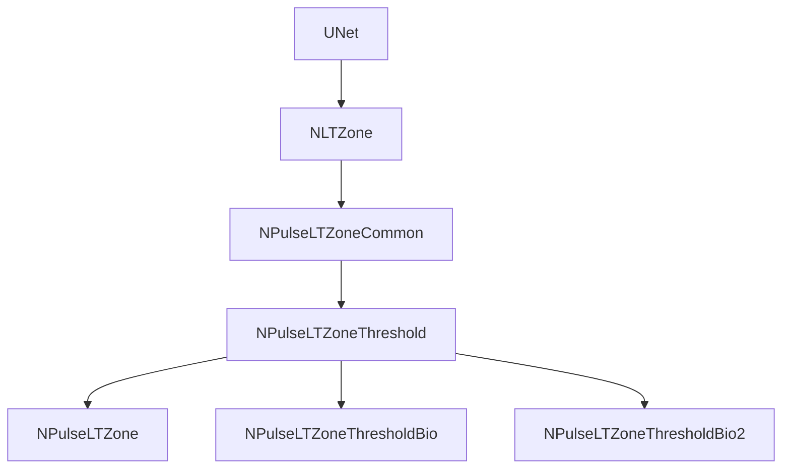

## LT‑зона в конфигурации TestTrain

### 1. Какие компоненты используются

- **Компоненты обучения**:
  - `NNeuronLearner` (Learner) — использует `NeuronClassName = "NSPNeuronGen"`.
  - `NNeuronTrainer` (Trainer) — в `ADefault()` и в конфиге `TestTrain` также использует `NeuronClassName = "NSPNeuronGen"`.
- **Конфиг TestTrain** (`Bin/Configs/Bakhshiev/TestTrain/Parameters_00.xml`):
  - Внутри `NeuronLearner` и `NeuronTrainer` вложен нейрон:
    - `<Neuron Class="NSPNeuronGen">`.
  - Для этого нейрона явно задано:
    - `<MembraneClassName>NPMembraneBio</MembraneClassName>`
    - `<LTZoneClassName>NPulseLTZoneThreshold</LTZoneClassName>`.
- **Регистрация `NSPNeuronGen` в `NPulseLibrary.cpp`**:

```12:18:e:\Science-Repo\nmsdk-git\Libraries\Nmsdk-PulseLib\Core\NPulseLibrary.cpp
// Создаем нейроны с упрощенным генератором спайков
n=dynamic_pointer_cast<NPulseNeuron>(storage->TakeObject("NPNeuron"));
n->LTMembraneClassName="";
n->MembraneClassName="NPMembraneBio";
n->LTZoneClassName="NPulseLTZoneThreshold";
n->Build();
n->LTZone->Threshold=0.0117;
UploadClass("NSPNeuronGen",n);
```

**Вывод:** и Learner, и Trainer в конфиге `TestTrain` всегда работают с LT‑зоной класса `NPulseLTZoneThreshold` с исходным порогом `Threshold = 0.0117` (задаётся в `NPulseLibrary.cpp` при регистрации `NSPNeuronGen`).

### 2. Внутренняя реализация LT‑зоны

#### 2.1. Базовая иерархия

Ключевые классы (см. `Core/NPulseLTZone.h` и доки `Docs/Components/NPulseLTZoneCommon.md`, `NPulseLTZoneThreshold.md`):



- `NLTZone`:
  - свойства: `Threshold`, `ThresholdOff`, `UseAveragePotential`, `Inputs`, `Output`, `Potential`.
- `NPulseLTZoneCommon`:
  - добавляет импульсные параметры: `NumChannelsInGroup`, `PulseAmplitude`, `PulseLength`, `AvgInterval`;
  - считает выходной потенциал/частоту и времена спайков (`OutputPotential`, `OutputFrequency`, `OutputPulseTimes`).
- `NPulseLTZoneThreshold`:
  - реализует пороговую логику:
    - `CheckPulseOn()` — `Potential >= Threshold`;
    - `CheckPulseOff()` — `Potential < ThresholdOff`;
  - вызывается из `ACalculate2()` после расчёта потенциала в `NPulseLTZoneCommon`.

Таким образом, **все решения о генерации спайка** в нейроне `NSPNeuronGen` принимаются на уровне `NPulseLTZoneThreshold` через сравнение текущего потенциала LT‑зоны с полями `Threshold` и `ThresholdOff`.

#### 2.2. Связь с порогами Learner/Trainer

И `NNeuronLearner`, и `NNeuronTrainer` имеют свойства:

- `LTZThreshold`, `FixedLTZThreshold`, `TrainingLTZThreshold`, `UseFixedLTZThreshold`.

Для Learner:

```12:18:e:\Science-Repo\nmsdk-git\Libraries\Nmsdk-PulseLib\Core\NNeuronLearner.cpp
bool NNeuronLearner::SetLTZThreshold(const double &value)
{
 UEPtr<NPulseNeuron> n_in = GetComponentL<NPulseNeuron>("Neuron",true);
 if(!n_in)
  return true;

 UEPtr<NLTZone> ltzone = n_in->GetComponentL<NLTZone>("LTZone");
 if(!ltzone)
  return true;

 ltzone->Threshold = value;
 if(fabs(value - FixedLTZThreshold) > 0.000001)
 {
  UseFixedLTZThreshold = false;
 }
 return true;
}
```

Аналогичный код есть в `NNeuronTrainer::SetLTZThreshold`.  
При старте обучения оба компонента устанавливают LT‑зоне **учебный порог** (`TrainingLTZThreshold`), а по окончании — возвращают к **фиксированному** (`FixedLTZThreshold` ≈ 0.0117).

### 3. Регистрация LT‑зон и связанных классов в NPulseLibrary.cpp

Основные регистрации в `CreateClassSamples(UStorage *storage)`:

- **Базовые LT‑зоны**:
  - `UploadClass("NPulseLTZoneCommon", cont);`
  - `UploadClass("NPulseLTZoneThreshold", cont);`
  - `UploadClass("NPulseLTZone", cont);` (расширение с дополнительными параметрами `TimeConstant`, `UseLTZIntegtation`, `UseSpikeStabilizer`).
- **LT‑зоны для кабельной и моделей IaF**:
  - `UploadClass("NPulseLTZoneIzhikevich", cont);`
  - `UploadClass("NPulseLTZoneIaF", cont);`
  - `UploadClass("NPulseLTZoneCable", cont);`
- **Классические/простые LT‑зоны для непрерывных нейронов**:
  - `UploadClass("NPLTZone", cont);`
  - `UploadClass("NCLTZone", cont);`
  - `UploadClass("NPSimpleLTZone", cont);`
  - `UploadClass("NCSimpleLTZone", cont);`

Для **NSPNeuronGen** (и, следовательно, для TestTrain‑конфига) используется именно пара:

- LT‑зона: `LTZoneClassName = "NPulseLTZoneThreshold"`;
- мембрана: `MembraneClassName = "NPMembraneBio"`.

При регистрации `NSPNeuronGen` в `NPulseLibrary.cpp` порог LT‑зоны дополнительно фиксируется на **0.0117**:

```12:18:e:\Science-Repo\nmsdk-git\Libraries\Nmsdk-PulseLib\Core\NPulseLibrary.cpp
n->LTZoneClassName="NPulseLTZoneThreshold";
n->Build();
n->LTZone->Threshold=0.0117;
UploadClass("NSPNeuronGen",n);
```

Это число затем может временно переопределяться Learner/Trainer’ом через `LTZThreshold`/`TrainingLTZThreshold`, но **базовая «физиологичная» величина порога** именно так и задаётся.

### 4. Git‑история LT‑зоны и её параметров

#### 4.1. История `Core/NPulseLTZone.h` / `Core/NPulseLTZone.cpp`

По журналу:

- Ранние коммиты (`700b7df`, `2069614`, `10ade69` и далее) добавляли структуру LT‑зоны и базовые модели.
- Важные изменения:
  - `4a487cc` — «NPulseLTZone: Threshold sets to 0 by default.» — фиксирует поведение по умолчанию для `Threshold` в самой LT‑зоне (без учёта конфигурационных обёрток).
  - `8802d5d` — добавлен флаг `UseSpikeStabilizer` и связанная логика стабилизации длительности импульса (для `NPulseLTZone`).
  - `ebd855f` — добавлен параметр `ThresholdOff` в `NPulseLTZoneThreshold` (разделение порогов включения/выключения).
  - `7cf11a1` — изменено значение `OutputPotential` (возвращает чистый мембранный потенциал без спайков).
- Коммиты `b6da90e` и `ac5b51a` касаются системы свойств (`UProperty`), но **не меняют сами численные формулы в LT‑зоне**.

Внутри всей видимой истории сабмодуля Nmsdk‑PulseLib **не было изменений, радикально меняющих критерии `CheckPulseOn`/`CheckPulseOff`** — они всегда были завязаны на `Threshold`/`ThresholdOff` и потенциал, рассчитанный в `NPulseLTZoneCommon`.

#### 4.2. История `Core/NPulseLibrary.cpp` (фрагменты LT‑зон и NSPNeuronGen)

По `git log --oneline --reverse -- Core/NPulseLibrary.cpp`:

- Ранние коммиты (`61aaee9`, `6a2ccf8`, `6749781`, `3f18ba5` и др.) добавляли Hebb/STDP‑синапсы, непрерывные нейроны и т.п.
- Появление конфигурационных классов LT‑зоны и био‑нейронов:
  - `b8aad55` — исправления в потенциале нейрона, актуализация параметров.
  - `5f3f06d` — изменение базового сопротивления в `NPulseSynapseCommon` (косвенно влияет на амплитуды, но не на сами LT‑пороги).
  - `98d1edc` — добавлен `NSPNeuronBio2` для кабельной модели (другая конфигурация, не используемая в TestTrain‑конфиге Learner/Trainer).
  - `f44e78c` — миграция библиотек в `Nmsdk-PulseLib`, фиксация текущей организации `NPulseLibrary.cpp`.
- В районе `b6da90e` и `9b44962` происходил рефакторинг свойств и устранение предупреждений; параметры регистрации `NSPNeuronGen` (включая строку `n->LTZone->Threshold=0.0117;`) **остались неизменными**.

**Итог по истории:** с момента введения `NSPNeuronGen` с LT‑зоной `NPulseLTZoneThreshold` и порогом `0.0117` регистрируемые параметры LT‑зоны для этого нейрона **не менялись**. Все видимые изменения касались либо других конфигурационных классов (кабельные, био‑2, Izhikevich/IaF), либо внутренних оптимизаций/рефакторингов.

### 5. Выводы и связь с поведением обучения

1. **И Learner, и Trainer в TestTrain работают на одной и той же LT‑зоне `NPulseLTZoneThreshold` с базовым порогом 0.0117.**
   - Этот порог задаётся конфигурационным классом `NSPNeuronGen` в `NPulseLibrary.cpp` и при необходимости временно переопределяется через свойства `LTZThreshold`/`TrainingLTZThreshold`.
2. **Git‑история не показывает недавних изменений, которые могли бы радикально изменить пороговую механику LT‑зоны для этого нейрона.**
   - Основные формулы и критерии в `NPulseLTZoneThreshold` и связанной обвязке остаются прежними.
3. **Наблюдаемое поведение обучения (отсутствие устойчивого роста дендритов, бесконечный рост числа синапсов)**, судя по истории, связано не с регрессиями в LT‑зоне или её регистрации, а с:
   - выбранными критериями синхронизации/нормализации в `NNeuronLearner`/`NNeuronTrainer`;
   - текущим набором RC‑параметров каналов и синапсов (подробно разобраны в `IonParamsHistory.md`).
4. **Новый отчёт дополняет `IonParamsHistory.md` и `TrainingBehaviorConclusions.md`:**
   - первый концентрируется на численных значениях RC‑параметров и их истории;
   - второй — на алгоритмах роста структуры;
   - настоящий файл фиксирует «мост» между ними: **какая именно LT‑зона стоит в нейроне, какие пороги она использует и какова эволюция этих настроек по истории кода.**

