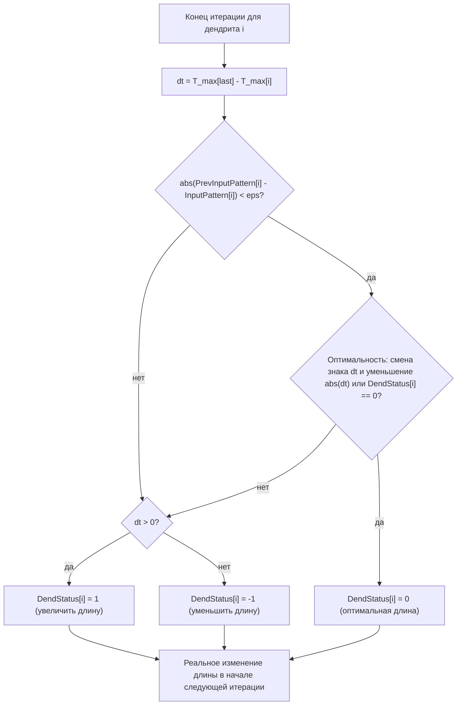
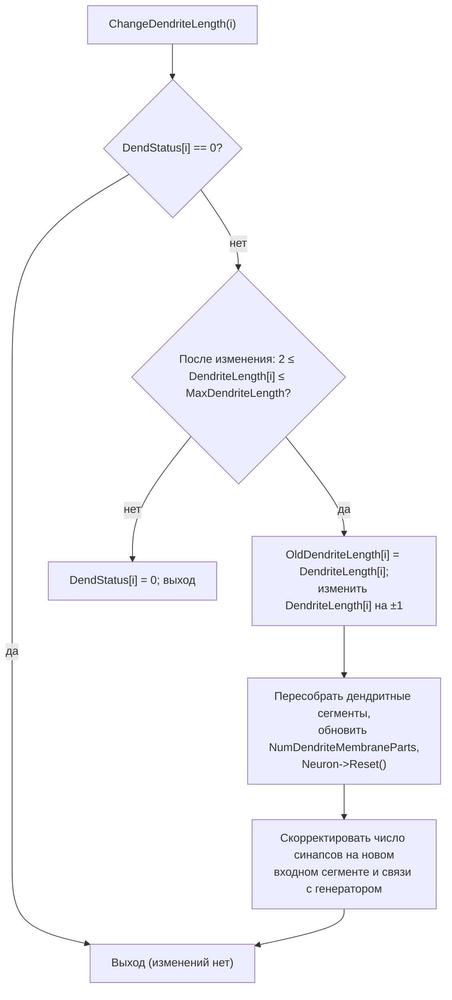
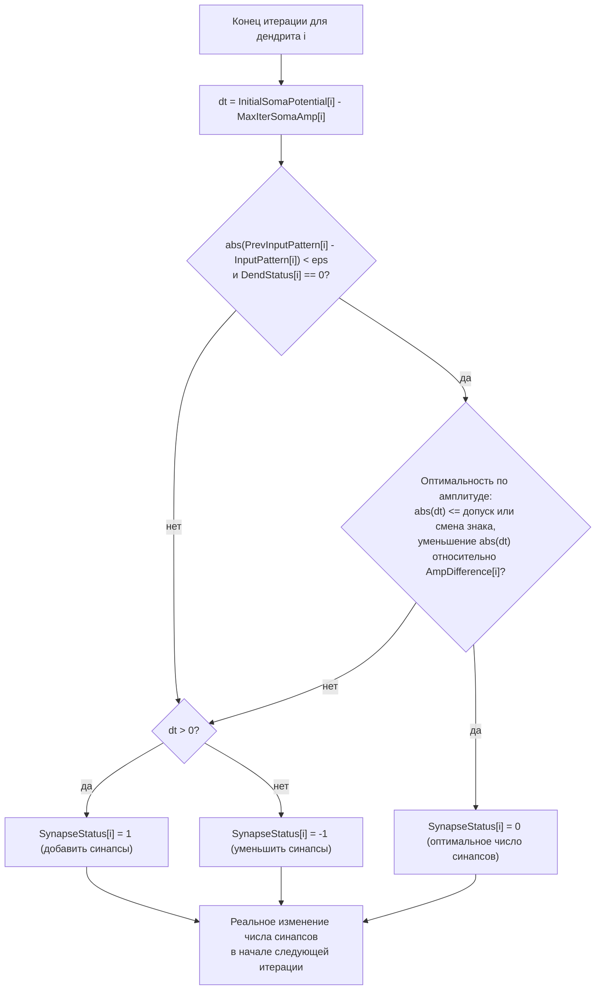
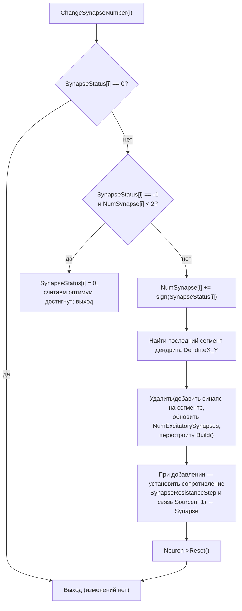
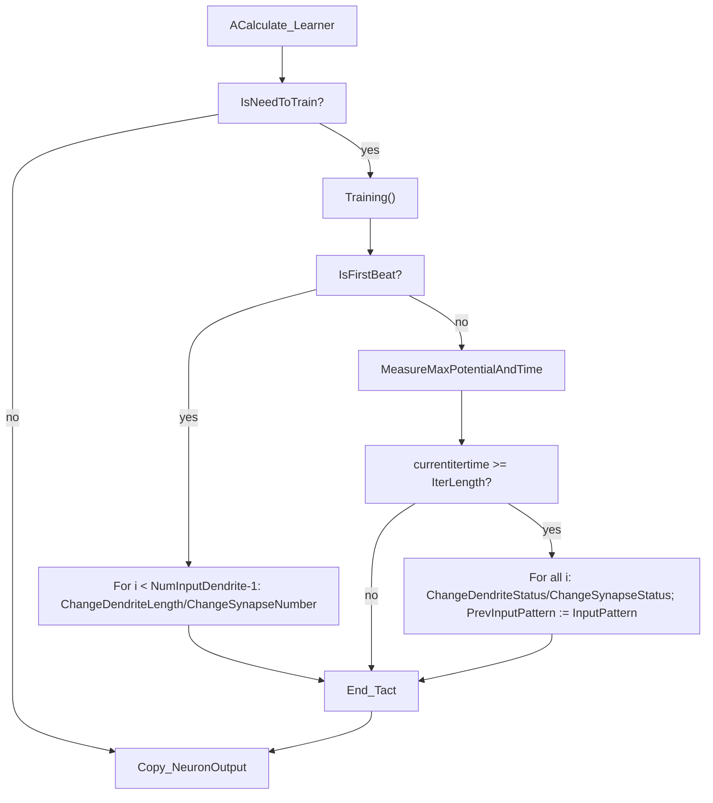
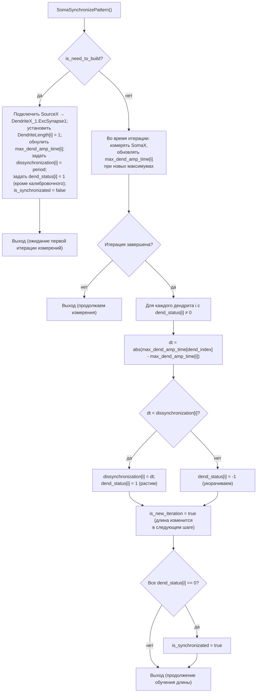
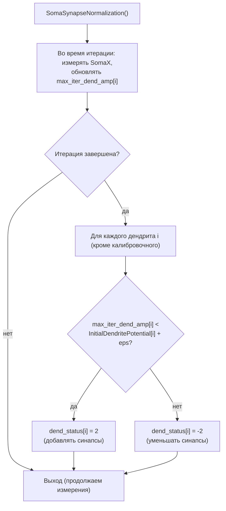
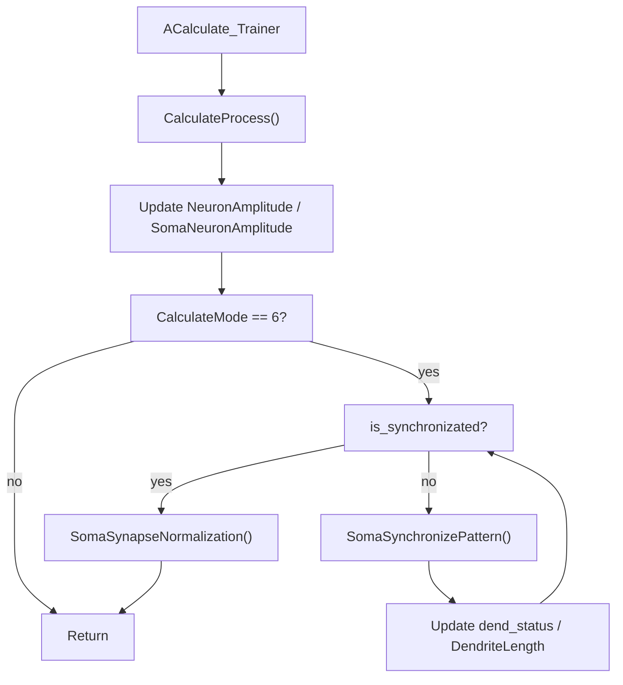

## RU

## Цель документа

Систематизировать выводы по поведению обучения структуры (рост длины дендритов и числа синапсов) в компонентах `NNeuronLearner` и `NNeuronTrainer` при использовании конфига `TestTrain`, а также зафиксировать результаты анализа git‑истории и параметров ионных элементов. Документ основан на:

- исходном коде `NNeuronLearner` и `NNeuronTrainer` в `Libraries/Nmsdk-PulseLib/Core`;
- логах из `Bin/Configs/Bakhshiev/TestTrain/EventsLog`;
- отчёте по параметрам каналов и синапсов `IonParamsHistory.md`;
- специализированном отчёте по параметрам обучающих синапсов `SynapseParamsHistory.md` (NPulseSynapse / NPSynapseBio, их git‑история и связь с Learner/Trainer).
- анализе реализации `UProperty` и связанных рефакторингов.

Документ предназначен как обзорный отчёт, а не как спецификация API.

## 1. Поведение NNeuronLearner в конфиге TestTrain

### 1.1. Краткий обзор алгоритма

Основные файлы:

- `Libraries/Nmsdk-PulseLib/Core/NNeuronLearner.h`
- `Libraries/Nmsdk-PulseLib/Core/NNeuronLearner.cpp`

Ключевые параметры и состояния:

- Структура и режимы:
  - `NumInputDendrite`, `MaxDendriteLength`, `DendriteLength`, `NumSynapse`;
  - `StructureBuildMode`, `CalculateMode`, `IsNeedToTrain`, `ExperimentMode`, `ExperimentNum`;
  - пороги LT‑зоны: `LTZThreshold`, `FixedLTZThreshold`, `TrainingLTZThreshold`, `UseFixedLTZThreshold`.
- Временные и обучающие состояния:
  - `IsFirstBeat`, `CountIteration`, `StartIterTime`, `IterLength`;
  - `MaxIterSomaAmp`, `TimeOfMaxIterSomaAmp`, `InitialSomaPotential`;
  - статусы структуры: `DendStatus`, `SynapseStatus`, `Dissynchronization`, `AmpDifference`;
  - флаг `CanChangeDendLength`, управляющий разрешением на изменение длины дендритов.

Структура временного цикла:

- **Такт** — один вызов `ACalculate()`.
- **Итерация** — интервал времени длиной `IterLength` между изменениями структуры. Внутри итерации:
  - при первом такте (`IsFirstBeat == true`) вызывается `Training()` в ветке «подготовка итерации»;
  - далее на каждом такте вызывается `MeasureMaxPotentialAndTime()` для накопления максимумов на сомах;
  - при достижении конца итерации (`currentitertime >= IterLength`) вызываются `ChangeDendriteStatus()` и `ChangeSynapseStatus()` для всех дендритов, после чего переход к следующей итерации.

Рост структуры реализован в двух уровнях:

- логический уровень — изменение статусов `DendStatus[i]` и `SynapseStatus[i]` по результатам анализа временных и амплитудных характеристик;
- структурный уровень — физическое изменение длины дендритов (`ChangeDendriteLength()`) и числа синапсов (`ChangeSynapseNumber()`) в начале следующей итерации, если статусы ненулевые.

### 1.2. Решение об изменении длины дендритов

Функция `ChangeDendriteStatus(int num)`:

- вычисляет рассинхронизацию по времени максимумов сомы между текущим дендритом и «калибровочным»:

  ```cpp
  dt = TimeOfMaxIterSomaAmp[NumInputDendrite - 1] - TimeOfMaxIterSomaAmp[num];
  ```

- считает длину оптимальной (`DendStatus[num] = 0`), если:
  - `dt == 0.0`, либо
  - при неизменном паттерне (`|PrevInputPattern[num] - InputPattern[num]| < eps`) рассинхронизация сменила знак и уменьшилась по модулю, либо статус уже был нулевым;
- во всех остальных случаях:
  - если `dt > 0` — `DendStatus[num] = 1` (следует **увеличить** длину);
  - если `dt < 0` — `DendStatus[num] = -1` (следует **уменьшить** длину).

Функция `ChangeDendriteLength(int num)`:

- игнорирует изменения, если `DendStatus[num] == 0`;
- предотвращает удаление последнего сегмента (`DendriteLength[num] < 2`) и превышение `MaxDendriteLength`;
- при реальном изменении:
  - обновляет `OldDendriteLength[num]` и `DendriteLength[num]`;
  - пересобирает структуру нейрона (`NumDendriteMembraneParts` / `NumDendriteMembranePartsVec`, `Reset()` нейрона);
  - настраивает число синапсов на новом входном сегменте и восстанавливает связи с генератором.

Важная деталь реализации: в `Training()` структурные изменения происходят в цикле:

```cpp
for (int i = 0; i < NumInputDendrite - 1; i++)
{
    if (CanChangeDendLength)
        ChangeDendriteLength(i);
    ChangeSynapseNumber(i);
}
```

Последний дендрит (с индексом `NumInputDendrite - 1`) используется как калибровочный и **никогда не меняет длину**.

#### 1.2.1. Блок‑схема принятия решения по длине дендрита



#### 1.2.2. Блок‑схема `ChangeDendriteLength(i)`



### 1.3. Алгоритм изменения числа синапсов

Алгоритм работы с числом синапсов логически симметричен росту длины дендритов и реализован в двух функциях: `ChangeSynapseStatus(int num)` и `ChangeSynapseNumber(int num)`.

- `ChangeSynapseStatus(int num)`:
  - вычисляет разность по амплитуде сомы

    ```cpp
    dt = InitialSomaPotential[num] - MaxIterSomaAmp[num];
    ```

    где `InitialSomaPotential[num]` — максимум амплитуды на соме при **единичной длине** дендрита и минимальном числе синапсов;
  - для экспериментального режима (`ExperimentNum == 2` и `!CanChangeDendLength`) временно «замораживает» изменение длины дендрита (обнуляя `DendStatus[num]`), чтобы подобрать оптимальное число синапсов при фиксированной длине;
  - при неизменном паттерне (`|PrevInputPattern[num] - InputPattern[num]| < eps`) и уже нулевом статусе дендрита рассматривает три случая оптимальности по амплитуде:
    - уже стоит нулевой статус у синапсов;
    - `|dt|` не превышает малого допуска;
    - знак `dt` сменился и модуль уменьшился относительно `AmpDifference[num]`;
    во всех этих случаях устанавливается `SynapseStatus[num] = 0`;
  - во всех прочих случаях:
    - если `dt > 0` (текущая амплитуда **меньше исходной**) — `SynapseStatus[num] = 1` (нужно **добавлять** синапсы);
    - если `dt < 0` (амплитуда **больше исходной**) — `SynapseStatus[num] = -1` (нужно **уменьшать** число синапсов);
  - вектор `AmpDifference` запоминает последнее значение `dt` для дальнейшего анализа направления изменений.

- `ChangeSynapseNumber(int num)`:
  - ничего не делает, если `SynapseStatus[num] == 0`;
  - если требуется удалить единственный оставшийся синапс (`SynapseStatus[num] == -1` и `NumSynapse[num] < 2`), рассматривает это как достижение оптимума и обнуляет статус;
  - в остальных случаях:
    - изменяет `NumSynapse[num]` на `+1` или `-1` в зависимости от статуса;
    - находит последний сегмент соответствующего дендрита (`DendriteX_Y`);
    - при удалении синапса предварительно разрывает его связи;
    - обновляет `NumExcitatorySynapses` у сегмента, вызывает `Build()` для перестройки;
    - при добавлении нового синапса:
      - устанавливает его сопротивление `SynapseResistanceStep`;
      - создаёт связь от генератора `Source(num+1)` к входу синапса (если такой связи ещё нет);
    - после всех изменений вызывает `Neuron->Reset()` для пересчёта внутреннего состояния.

Таким образом, рост числа синапсов в `NNeuronLearner` управляется знаками и модулем амплитудной разницы на соме, с учётом стабилизации при достижении малой разницы, и учитывает как добавление, так и возможное сокращение синапсов.

#### 1.3.1. Блок‑схема принятия решения по числу синапсов



#### 1.3.2. Блок‑схема `ChangeSynapseNumber(i)`



### 1.4. Временная структура обучения и Training()

Алгоритм обучения структуры в `NNeuronLearner` сосредоточен в методе `Training()`, который вызывается из `ACalculate()` при поднятом флаге `IsNeedToTrain`.

- **Первый такт итерации (`IsFirstBeat == true`)**:
  - фиксируется время начала итерации: `StartIterTime = Environment->GetTime().GetDoubleTime()`;
  - вычисляется длительность итерации:

    ```cpp
    IterLength = (1.0 / SpikesFrequency) - (1.0 / double(TimeStep));
    ```

  - обнуляются массивы максимумов амплитуды сомы и времени максимумов:

    ```cpp
    MaxIterSomaAmp.assign(NumInputDendrite, 0.0);
    TimeOfMaxIterSomaAmp.assign(NumInputDendrite, 0.0);
    ```

  - выполняется структурное изменение для **всех входных дендритов, кроме калибровочного**:

    ```cpp
    for (int i = 0; i < NumInputDendrite - 1; i++)
    {
        if (CanChangeDendLength)
            ChangeDendriteLength(i);
        ChangeSynapseNumber(i);
    }
    ```

    здесь `CanChangeDendLength` может запрещать рост/сжатие длины в отдельных экспериментальных сценариях;
  - флаг `IsFirstBeat` сбрасывается в `false`, и такт завершается.

- **Последующие такты той же итерации (`IsFirstBeat == false`)**:
  - на каждом такте вызывается `MeasureMaxPotentialAndTime()`:
    - для каждой сомы `SomaX` измеряется текущий потенциал;
    - если он превышает ранее зафиксированный максимум `MaxIterSomaAmp[i]`, обновляются и максимум, и время его достижения `TimeOfMaxIterSomaAmp[i]`;
    - при этом для дендритов единичной длины (`DendriteLength[i] == 1`) `InitialSomaPotential[i]` захватывает наибольший из наблюдённых максимумов, формируя «эталонную» амплитуду.
  - в конце итерации рассчитывается текущая длительность:

    ```cpp
    double currentitertime =
        Environment->GetTime().GetDoubleTime() - StartIterTime;
    ```

  - если `currentitertime >= IterLength`, считается, что итерация завершена:
    - для каждого дендрита `i = 0 .. NumInputDendrite - 1` вычисляется и обновляется статус длины: `ChangeDendriteStatus(i)`;
    - затем вычисляется и обновляется статус числа синапсов: `ChangeSynapseStatus(i)`;
    - `PrevInputPattern[i]` запоминает текущий паттерн `InputPattern[i]` перед следующей итерацией;
    - `IsFirstBeat` снова устанавливается в `true`;
    - счётчик итераций `CountIteration` увеличивается на 1.

Сам вызов `Training()` встроен в `ACalculate()` таким образом, что при `CalculateMode == 0` и `CountIteration > 0` возможна ранняя проверка «обученности» через `EndOfLearning()` и, при успехе, автоматический сброс `IsNeedToTrain`.

### 1.5. Flowchart цикла обучения NNeuronLearner

Для наглядности временную структуру работы `NNeuronLearner` можно представить следующей блок‑схемой:



В этой диаграмме:

- узлы без пробелов в идентификаторах (`acCalcLearner`, `checkTrainLearner` и т.п.) соответствуют шагам алгоритма;
- подписи в кавычках дают краткое текстовое описание шага.

### 1.6. Поведение по логам (NNeuronLearner)

В логе `NeuroModeler.TimLenovo.log.INFO.20260226-184641.1360` для `NNeuronLearner` (конфиг `TestTrain`) наблюдается следующая картина:

В логе `NeuroModeler.TimLenovo.log.INFO.20260226-184641.1360` для `NNeuronLearner` (конфиг `TestTrain`) наблюдается следующая картина:

- длины дендритов 0–2 **временно увеличиваются** с 1 до 2, но затем возвращаются к 1;
- статусы `DendStatus` переключаются в `1` при улучшении синхронизации, но при последующей итерации часто становятся `-1`, что приводит к укорочению;
- синапсы на первых дендритах наращиваются (рост `NumSynapse`), а затем могут стабилизироваться либо продолжить рост в зависимости от амплитудных критериев;
- флаг `IsNeedToTrain` автоматически сбрасывается, когда одновременно для всех дендритов и синапсов выполняется условие «нет структурных изменений» (`DendStatus[i] == 0` и `SynapseStatus[i] == 0`), даже если итоговая длина дендритов минимальна (1 сегмент).

### 1.7. Выводы по NNeuronLearner

1. **Дендриты изменяются, но не закрепляются на длине >1.**
   - Алгоритм кратковременно увеличивает длину, но последующий анализ временных максимумов сом приводит к признанию новой длины худшей (по критерию рассинхронизации), и структура возвращается к длине 1.
2. **Автоматическое снятие `IsNeedToTrain` соответствует задумке алгоритма.**
   - Сброс флага привязан к отсутствию дальнейших структурных изменений, а не к минимально требуемой длине дендритов. С точки зрения текущего критерия, «обученность» достигается при длине 1.
3. **Факт «отсутствия роста дендритов» на уровне параметров — следствие критерия, а не того, что код веток роста не выполняется.**
   - Ветки роста/сжатия реально выполняются, но решение по критерию приводит к возврату в минимальную структуру.

## 2. Поведение NNeuronTrainer в конфиге TestTrain

### 2.1. Алгоритм синхронизации длины дендритов

Основные файлы:

- `Libraries/Nmsdk-PulseLib/Core/NNeuronTrainer.h`
- `Libraries/Nmsdk-PulseLib/Core/NNeuronTrainer.cpp`

Ключевые функции для `CalculateMode == 6`:

- `SomaSynchronizePattern()` — синхронизация по времени максимумов на сомах, управляет ростом/сжатием длины дендритов через `dend_status`.
- `SomaSynapseNormalization()` — нормализация числа синапсов по амплитуде на соме, использует `dend_status == 2/-2` для добавления/удаления синапсов.
- `CalculateProcess()` — «оркестратор», который вызывает эти функции и управляет порогом LT‑зоны во время обучения.

`SomaSynchronizePattern()`:

- при первом входе (`is_need_to_build`):
  - подключает для всех входов `SourceX` к `DendriteX_1.ExcSynapse1`;
  - устанавливает `DendriteLength[i] = 1`;
  - инициализирует:
    - `max_dend_amp_time[i] = 0`,
    - `dissynchronization[i] = period` (для калибровочного дендрита `dend_index` — 0),
    - `dend_status[i] = 1` (кроме калибровочного, у которого 0),
    - `is_synchronizated = false`.
- в каждой итерации:
  - на тактах измеряет амплитуды на сомах `SomaX`, накапливая максимумы и времена максимумов;
  - по завершении итерации вычисляет для каждого дендрита с ненулевым `dend_status`:

    ```cpp
    dt = fabs(max_dend_amp_time[dend_index] - max_dend_amp_time[i]);
    if (dt < dissynchronization[i]) {
        dissynchronization[i] = dt;
        dend_status[i] = 1;   // растим
    } else {
        dend_status[i] = -1;  // укорачиваем
    }
    ```

  - флаг `is_new_iteration` инициирует рост/сжатие на следующем шаге: при `dend_status == 1` длина увеличивается на 1, при `-1` уменьшается.
- обучение считается завершённым (для части по длине), когда **все** `dend_status[i] == 0`, после чего `is_synchronizated = true`.

#### 2.1.1. Блок‑схема `SomaSynchronizePattern()`



#### 2.1.2. Блок‑схема `SomaSynapseNormalization()`



### 2.2. Наблюдения по логам (NNeuronTrainer)

В логе `NeuroModeler.TimLenovo.log.INFO.20260226-191806.27644` видно:

- старт тренера с `DendriteLength=[1,1,1,1,1]` (4 «рабочих» дендрита + 1 калибровочный);
- первая итерация при длине 1:
  - для входов 0–3 значения `dt` порядка `0.0405`, `0.03`, `0.0205`, `0.0105`;
  - `dissynchronization` инициализируется этими же значениями;
  - `dend_status` устанавливается в `1` (решение растить дендриты).
- после наращивания длины до 2:
  - следующая итерация даёт `dt` около `0.707`, `0.6965`, `0.687`, `0.677` при старых `dissynchronization` порядка `0.04…`;
  - алгоритм считает, что синхронизация **ухудшилась**, и устанавливает `dend_status = -1` для всех 4 дендритов;
  - при выполнении этапа структуры длины уменьшаются обратно до 1.
- на следующем шаге все `dend_status[i]` становятся 0, и `SomaSynchronizePattern` логирует:

  > `TRAINED; DendriteLength=[1,1,1,1,1]`

Таким образом, для данной конфигурации `TestTrain` текущий критерий синхронизации приводит к **закреплению длины 1** как оптимальной: попытка увеличить длину даёт существенное ухудшение `dt`, и алгоритм корректно (с точки зрения своих формул) возвращает исходное состояние.

### 2.3. Алгоритм изменения числа синапсов и его поведение

`SomaSynapseNormalization()`:

- хранит `InitialDendritePotential[i]` — максимум амплитуды на соме при длине дендрита 1 и начальном числе синапсов;
- на каждой итерации вычисляет `max_iter_dend_amp[i]` — максимум амплитуды на соме за текущую итерацию;
- по завершении итерации сравнивает:

```cpp
if (max_iter_dend_amp[i] < InitialDendritePotential[i] + 0.000005) {
    dend_status[i] = 2;   // добавлять синапсы
} else {
    dend_status[i] = -2;  // уменьшать число синапсов
}
```

- при `dend_status == 2` на следующем шаге увеличивает `SynapseNum[i]` и число возбуждающих синапсов на соответствующем сегменте мембраны; при `-2` — удаляет последний синапс.

В логе `...191806.27644`:

- при `is_synchronizated = 1` (длины уже признаны оптимальными) многократно наблюдаются строки:

  > `SomaSynapseNormalization: iter done; i=k max_iter_dend_amp=0.0157814 InitialDendritePotential=0.0157814 dend_status=2`

- `max_iter_dend_amp[i]` **численно совпадает** с `InitialDendritePotential[i]`, но из‑за допуска `+ 0.000005` условие «меньше исходной + eps» остаётся истинным;
- в результате `dend_status[i]` постоянно равен `2`, и на каждой итерации добавляется по одному синапсу: `SynapseNum` растёт без остановки.

### 2.4. Выводы по NNeuronTrainer

1. **Отсутствие устойчивого роста длины дендритов — результат критерия синхронизации.**
   - Для текущего паттерна входов длина 2 приводит к значительно большему `dt`, чем длина 1, поэтому алгоритм рационально возвращает длину 1 и объявляет обучение завершённым.
2. **Бесконечный рост числа синапсов — следствие «границы» в критерии по амплитуде.**
   - Разность `max_iter_dend_amp - InitialDendritePotential` стремится к нулю; наличие допуска `+ 0.000005` в условии интерпретирует даже нулевую разность как «ещё меньше исходной», и ветка «удалить синапсы» (`dend_status = -2`) никогда не активируется.
3. **Поведение согласовано с математикой алгоритма и не указывает на явный баг внедрённого логирования.**
   - Логирование показывает осмысленные значения времени максимумов и амплитуд; проблема в самих критериях оптимальности и их чувствительности, а не в том, что ветки кода не выполняются.

### 2.5. Flowchart режима обучения NNeuronTrainer (режим 6)

Ниже приведена блок‑схема для основного режима обучения `NNeuronTrainer` при `CalculateMode == 6`, который использует комбинацию `SomaSynchronizePattern` и `SomaSynapseNormalization`:



Эта схема подчёркивает:

- раздельные этапы синхронизации по времени (рост/сжатие длины дендритов) и нормализации по амплитуде (рост/сжатие числа синапсов);
- зависимость между булевыми флагами `is_need_to_build`, `is_synchronizated`, `is_first_iter`, `is_new_iteration`, которые управляют тем, когда именно происходят структурные изменения.

## 3. Сравнение алгоритмов NNeuronLearner и NNeuronTrainer

### 3.1. Общие черты

У `NNeuronLearner` и `NNeuronTrainer` много структурных сходств:

- оба компонента работают во временной области с разделением на **такты** (вызовы `ACalculate`) и **итерации** (интервалы, в пределах которых накапливается статистика и затем обновляется структура);
- оба измеряют **максимум потенциала** и **время максимума** в пределах итерации:
  - Learner — через `MeasureMaxPotentialAndTime` (на сомах);
  - Trainer — внутри `SomaSynchronizePattern` / `SomaSynapseNormalization` (на сомах);
- оба используют **вектор статусов** для управления длиной дендритов:
  - `DendStatus` в Learner;
  - `dend_status` в Trainer;
- оба имеют отдельный алгоритм нормализации числа синапсов по амплитуде:
  - Learner — `ChangeSynapseStatus` + `ChangeSynapseNumber`;
  - Trainer — `SomaSynapseNormalization` с переходами `dend_status = 2/-2`.

### 3.2. Отличия в росте длины дендритов

Ключевые различия:

- **Формула и использование `dt`**:
  - Learner:

    ```cpp
    dt = TimeOfMaxIterSomaAmp[last] - TimeOfMaxIterSomaAmp[num];
    ```

    где `last` — последний (калибровочный) дендрит; учитывается не только знак и модуль `dt`, но и история `Dissynchronization[num]` и факт смены знака;
  - Trainer:

    ```cpp
    dt = fabs(max_dend_amp_time[dend_index] - max_dend_amp_time[i]);
    if (dt < dissynchronization[i]) dend_status[i] = 1;
    else dend_status[i] = -1;
    ```

    используется абсолютное значение и простое сравнение с предыдущим `dissynchronization[i]`.

- **Диапазон исследуемых длин**:
  - в Learner длины могут изменяться произвольно в рамках `1 .. MaxDendriteLength`, но последний дендрит используется как калибровочный и не меняется;
  - в Trainer в режиме 6 также используется калибровочный дендрит `dend_index`, но логика роста более жёсткая: часто практически исследуются только длины `1` и `2`, после чего при ухудшении `dt` происходит немедленный откат.

- **Условия «оптимальности»**:
  - Learner допускает более тонкую проверку оптимальности через комбинацию `dt`, `Dissynchronization` и изменения знака;
  - Trainer использует однократное сравнение с прошлым `dissynchronization[i]`, что делает критерий более агрессивным: любое ухудшение ведёт к немедленному сокращению длины.

### 3.3. Отличия в алгоритмах изменения числа синапсов

Оба алгоритма сравнивают текущую амплитуду с некоторой **исходной**:

- у Learner `dt = InitialSomaPotential[num] - MaxIterSomaAmp[num]`, при этом:
  - учитывается равенство паттернов (`PrevInputPattern` и `InputPattern`);
  - наличие/отсутствие изменений по дендриту (`DendStatus[num] == 0`);
  - история амплитудной разницы `AmpDifference[num]` и её знак;
  - критерий оптимальности более сложный и позволяет обнулять `SynapseStatus` при малых изменениях или смене направления.

- у Trainer в `SomaSynapseNormalization` критерий гораздо проще:

  ```cpp
  if (max_iter_dend_amp[i] < InitialDendritePotential[i] + 0.000005)
      dend_status[i] = 2;
  else
      dend_status[i] = -2;
  ```

  - используется только порог по амплитуде с фиксированным допуском;
  - не учитываются изменения паттерна и история знака разницы;
  - в результате в наблюдаемой конфигурации возникает «границевая» ситуация, когда амплитуда почти не меняется, и алгоритм всегда считает, что нужно добавлять синапсы.

### 3.4. Связь отличий с наблюдаемым поведением

С учётом различий:

- **Learner**:
  - демонстрирует временный рост длины дендритов, но за счёт более сложного критерия может «принять решение», что длина 1 оптимальна, даже если длина 2 некоторое время исследовалась;
  - алгоритм по синапсам способен как добавлять, так и удалять синапсы, однако конечное поведение зависит от точной формы амплитудных кривых.

- **Trainer**:
  - из‑за более жёсткого критерия по времени склонен очень быстро возвращаться к длине 1 и объявлять структуру обученной;
  - из‑за простого порога по амплитуде и малого допуска легко попадает в режим бесконечного роста числа синапсов.

Вместе это объясняет, почему в конфиге `TestTrain` обе системы ведут себя похоже в части выбора минимальной длины, но `NNeuronTrainer` дополнительно демонстрирует явно неостанавливающийся рост числа синапсов.

## 4. Параметры каналов, мембран и синапсов и их git‑история

### 3.1. Используемые классы и параметры (обзор)

См. подробный отчёт в `IonParamsHistory.md`. Краткое резюме по ключевым компонентам, используемым через `NNeuronLearner`/`NNeuronTrainer` в конфиге `TestTrain`:

- Нейрон: `NSPNeuronGen`.
- Мембрана: `NPMembraneBio` (для сом и дендритов).
  - внутри использует `NPExcChannelBio`, `NPInhChannelBio`, `NPSynapseBio`.
- Базовые RC‑параметры каналов (`NPulseChannel`):
  - `Capacity = 1.0e-9`;
  - `Resistance = 1.0e7`;
  - `FBResistance = 1.0e8`;
  - `RestingResistance = 1.0e7` (добавлен в 2016‑м и далее без изменений).
- Базовый синапс (`NPulseSynapseCommon`):
  - `Resistance` изменён с `1.0` на `10.0` в 2021‑м;
  - `PulseAmplitude = 1.0` неизменен.
- Био‑синапс (`NPSynapseBio`):
  - `Resistance = 8.6e7` (86 МОм);
  - временные константы: `DissociationTC = 0.005` (5 мс), `SecretionTC = 0.001` (1 мс).
- Био‑каналы (`NPExcChannelBio`, `NPInhChannelBio`):
  - `FBResistance = 1e7`;
  - фиксированные типы каналов (`Type = -1` / `1`).

Все эти значения и соответствующие классы регистрируются и настраиваются в `Core/NPulseLibrary.cpp` через `UploadClass(...)` и модификацию параметров перед регистрацией.

### 3.2. Итоги анализа git‑истории параметров

Результаты, зафиксированные в `IonParamsHistory.md`:

- **Параметры `NPulseChannel`** (ёмкости и сопротивления) с момента их появления либо **никогда не менялись**, либо менялись один раз много лет назад и затем были стабильны.
- **Сопротивление `NPulseSynapseCommon`** увеличилось с `1.0` до `10.0` в одном коммите 2021‑го года и с тех пор постоянно.
- **Био‑конфигурации** (`NPSynapseBio`, `NPExcChannelBio`, `NPInhChannelBio`, `NPMembraneBio` и LT‑/Syn‑варианты каналов) были введены в ограниченном наборе коммитов и их параметры (численные значения) **не изменялись** после введения.

Это означает:

- наблюдаемое поведение (отсутствие устойчивого роста дендритов, бесконечный рост числа синапсов) **не связано с недавно изменёнными RC‑параметрами** каналов и синапсов;
- скорее всего, оно отражает исходный дизайн численных значений и критериев обучения, а не регресс, вызванный недавними изменениями в `Libraries/Nmsdk-PulseLib`.

## 5. Проверка влияния UProperty и рефакторинга свойств

### 4.1. Расположение и структура `UProperty`

Класс `UProperty` реализован в сабмодуле `Rdk`, файл:

- `Rdk/Core/Engine/UProperty.h`

Ключевые моменты реализации:

- шаблон `UProperty<T, OwnerT, type, is_iterable>` наследуется от `UVProperty<T, OwnerT>`;
- операторы присваивания и методы `SetData` реализованы таким образом, что:
  - при присваивании значения `property = value;` или вызове `SetData(value)`:
    - сначала вызывается соответствующий сеттер во владельце (например, `NNeuronTrainer::SetLTZThreshold`);
    - затем, при наличии подключённых свойств или внешнего источника (`ExternalDataSource`), значение транслируется дальше.

Это критично для понимания строчек вида:

```cpp
LTZThreshold = local_trainigLTZtresh;
UseFixedLTZThreshold = false;
```

— они **гарантированно вызывают** `SetLTZThreshold()` / `SetUseFixedLTZThreshold()` и обновляют пороги в LT‑зоне, а не только меняют внутреннее поле.

### 4.2. Рефакторинг иерархии свойств

История в сабмодуле `Libraries/Rdk-BasicLib`:

- коммиты вида `Simplify property class hierarchy`, `Disable direct access to property over .v field` затрагивали использование свойств в базовых компонентах (IO, источники, статистика), но:
  - не изменяли семантику базового `UProperty` в `Rdk/Core/Engine/UProperty.h`;
  - не меняли контракт «присваивание вызывает сеттер».

Сравнение версий файлов (например, `UNoise.h`) до и после этих коммитов показывает, что интерфейс `UProperty` (конструктор, оператор `=`, `GetData`/`SetData`) остаётся прежним.

### 4.3. Выводы по UProperty

1. **Рефакторинг системы свойств не ломал механизм обновления порогов и параметров обучения.**
   - `UProperty` по‑прежнему вызывает соответствующие сеттеры владельцев при присваивании.
2. **Поведение `NNeuronLearner` и `NNeuronTrainer` в части порогов LT‑зоны согласуется с кодом.**
   - Изменения порога в сеттерах (например, при включении/выключении `IsNeedToTrain`) должны работать так же, как и до рефакторинга.
3. **Наблюдаемые проблемы обучения нельзя объяснить отказом `UProperty` вызывать сеттеры.**

## 6. Гипотезы о причинах и рекомендации

### 5.1. Гипотезы по причинам текущего поведения

1. **Критерий синхронизации (по времени максимумов) действительно выбирает минимальную длину как оптимальную.**
   - Для конкретного паттерна `TestTrain` длина 1 даёт минимальный рассинхрон пиков на сомах; при длине 2 временной сдвиг становится существенно больше.
   - Алгоритм обучающего роста в `NNeuronTrainer` и `NNeuronLearner` интерпретирует это корректно в рамках своих формул, даже если с точки зрения задачи хотелось бы более длинные дендриты.
2. **Критерий нормализации числа синапсов находится на «границе» численной точности.**
   - Амплитуда на соме при увеличении числа синапсов практически совпадает с исходной при длине 1 и одном синапсе.
   - Формула `max_iter_dend_amp < InitialDendritePotential + 0.000005` трактует это состояние как «всё ещё ниже исходной амплитуды» и не даёт алгоритму переключиться в режим уменьшения числа синапсов.
3. **Выбор калибровочного дендрита может не совпадать с интуитивной «опорной» ветвью.**
   - И в `NNeuronLearner`, и в `NNeuronTrainer` калибровочный дендрит выбирается по индексу или по максимальной задержке; если реальная структура/паттерн отличаются от того, что предполагалось при проектировании, критерий минимизации `dt` может сравнивать сигналы по «неудачной» опорной ветви.
4. **RC‑параметры каналов и синапсов слишком «жёсткие» для текущей схемы критериев.**
   - Высокие сопротивления синапсов и фиксированные параметры каналов могут приводить к тому, что добавление синапсов практически не изменяет амплитуду, а изменение длины даёт резкие скачки по времени.
   - Это усиливает склонность алгоритма к выбору минимальной длины и бесконечному росту количества синапсов.

### 5.2. Рекомендации по дальнейшей работе

На уровне алгоритмов (без немедленного изменения кода, а как направления для экспериментов):

- **Для длины дендритов:**
  - рассмотреть возможность:
    - не «замораживать» дендрит сразу после одной неудачной попытки длины 2, а исследовать несколько длин с накоплением статистики по `dt`;
    - вводить допуск по `dt` (зону, в которой более длинный дендрит допускается, если другие метрики улучшаются);
    - комбинировать критерий по времени с критерием по суммарной амплитуде или энергии.
- **Для числа синапсов:**
  - модифицировать критерий в духе:

    ```cpp
    double diff = max_iter_dend_amp[i] - InitialDendritePotential[i];
    const double eps = 1e-6;
    if (fabs(diff) <= eps)
        dend_status[i] = 0;
    else if (diff < 0.0)
        dend_status[i] = 2;
    else
        dend_status[i] = -2;
    ```

  - добавить явную верхнюю границу по `SynapseNum`, после которой рост прекращается независимо от амплитуд;
  - при необходимости ввести простую гистерезисную логику с разными порогами для добавления и удаления синапсов.
- **Для параметров RC:**
  - в экспериментальной ветке попробовать ослабить синаптическое сопротивление или скорректировать параметры каналов так, чтобы разница между состояниями «до/после» добавления синапса была больше численного допуска критериев.

### 5.3. Итоговый вывод

Совокупный анализ:

- кода `NNeuronLearner` и `NNeuronTrainer`,
- логов работы на конфиге `TestTrain`,
- параметров ионных компонентов и их истории,
- реализации системы свойств `UProperty`

показывает, что **наблюдаемое поведение обучения структуры не является следствием недавних регрессий** в ядре или параметрах, а в первую очередь отражает исходный дизайн критериев оптимальности и численных параметров модели. Для изменения поведения (рост дендритов, остановка роста синапсов) потребуется либо:

- корректировать сами критерии (`dt` и амплитудные сравнения), либо
- подбирать другие наборы RC‑параметров и конфигураций каналов/синапсов, более чувствительные к структурным изменениям.

---

## EN

## Document Purpose

This document systematizes conclusions about structure training behavior (dendrite length growth and synapse count) in the `NNeuronLearner` and `NNeuronTrainer` components when using the `TestTrain` config, and records the results of git history analysis and ionic element parameters. The document is based on:

- source code of `NNeuronLearner` and `NNeuronTrainer` in `Libraries/Nmsdk-PulseLib/Core`;
- logs from `Bin/Configs/Bakhshiev/TestTrain/EventsLog`;
- the channel and synapse parameters report `IonParamsHistory.md`;
- the specialized training synapse parameters report `SynapseParamsHistory.md` (NPulseSynapse / NPSynapseBio, their git history and connection to Learner/Trainer).
- analysis of the `UProperty` implementation and related refactorings.

The document is intended as an overview report, not as an API specification.

## 1. NNeuronLearner Behavior in the TestTrain Config

### 1.1. Algorithm Overview

Main files:

- `Libraries/Nmsdk-PulseLib/Core/NNeuronLearner.h`
- `Libraries/Nmsdk-PulseLib/Core/NNeuronLearner.cpp`

Key parameters and states:

- Structure and modes:
  - `NumInputDendrite`, `MaxDendriteLength`, `DendriteLength`, `NumSynapse`;
  - `StructureBuildMode`, `CalculateMode`, `IsNeedToTrain`, `ExperimentMode`, `ExperimentNum`;
  - LT-zone thresholds: `LTZThreshold`, `FixedLTZThreshold`, `TrainingLTZThreshold`, `UseFixedLTZThreshold`.
- Temporal and training states:
  - `IsFirstBeat`, `CountIteration`, `StartIterTime`, `IterLength`;
  - `MaxIterSomaAmp`, `TimeOfMaxIterSomaAmp`, `InitialSomaPotential`;
  - structure statuses: `DendStatus`, `SynapseStatus`, `Dissynchronization`, `AmpDifference`;
  - flag `CanChangeDendLength`, controlling permission to change dendrite length.

Temporal cycle structure:

- **Beat (tact)** — one call to `ACalculate()`.
- **Iteration** — a time interval of length `IterLength` between structure changes. Within an iteration:
  - on the first beat (`IsFirstBeat == true`), `Training()` is called in the "iteration preparation" branch;
  - thereafter, on each beat `MeasureMaxPotentialAndTime()` is called to accumulate soma maxima;
  - when the iteration ends (`currentitertime >= IterLength`), `ChangeDendriteStatus()` and `ChangeSynapseStatus()` are called for all dendrites, then transition to the next iteration.

Structure growth is implemented at two levels:

- logical level — changing `DendStatus[i]` and `SynapseStatus[i]` statuses based on analysis of temporal and amplitude characteristics;
- structural level — physical change of dendrite length (`ChangeDendriteLength()`) and synapse count (`ChangeSynapseNumber()`) at the start of the next iteration, if statuses are non-zero.

### 1.2. Dendrite Length Change Decision

Function `ChangeDendriteStatus(int num)`:

- computes desynchronization by soma maximum time between the current dendrite and the "calibration" dendrite:

  ```cpp
  dt = TimeOfMaxIterSomaAmp[NumInputDendrite - 1] - TimeOfMaxIterSomaAmp[num];
  ```

- considers length optimal (`DendStatus[num] = 0`) if:
  - `dt == 0.0`, or
  - with an unchanged pattern (`|PrevInputPattern[num] - InputPattern[num]| < eps`) desynchronization changed sign and decreased in magnitude, or status was already zero;
- in all other cases:
  - if `dt > 0` — `DendStatus[num] = 1` (should **increase** length);
  - if `dt < 0` — `DendStatus[num] = -1` (should **decrease** length).

Function `ChangeDendriteLength(int num)`:

- ignores changes if `DendStatus[num] == 0`;
- prevents removal of the last segment (`DendriteLength[num] < 2`) and exceeding `MaxDendriteLength`;
- on actual change:
  - updates `OldDendriteLength[num]` and `DendriteLength[num]`;
  - rebuilds neuron structure (`NumDendriteMembraneParts` / `NumDendriteMembranePartsVec`, neuron `Reset()`);
  - configures synapse count on the new input segment and restores connections to the generator.

Important implementation detail: in `Training()`, structural changes occur in a loop:

```cpp
for (int i = 0; i < NumInputDendrite - 1; i++)
{
    if (CanChangeDendLength)
        ChangeDendriteLength(i);
    ChangeSynapseNumber(i);
}
```

The last dendrite (index `NumInputDendrite - 1`) is used as calibration and **never changes length**.

#### 1.2.1. Dendrite Length Decision Flowchart


#### 1.2.2. `ChangeDendriteLength(i)` Flowchart


### 1.3. Synapse Count Change Algorithm

The synapse count algorithm is logically symmetric to dendrite length growth and is implemented in two functions: `ChangeSynapseStatus(int num)` and `ChangeSynapseNumber(int num)`.

- `ChangeSynapseStatus(int num)`:
  - computes soma amplitude difference

    ```cpp
    dt = InitialSomaPotential[num] - MaxIterSomaAmp[num];
    ```

    where `InitialSomaPotential[num]` is the maximum soma amplitude at **unit** dendrite length and minimum synapse count;
  - for experimental mode (`ExperimentNum == 2` and `!CanChangeDendLength`) temporarily "freezes" dendrite length change (zeroing `DendStatus[num]`) to tune optimal synapse count at fixed length;
  - with unchanged pattern (`|PrevInputPattern[num] - InputPattern[num]| < eps`) and already zero dendrite status, considers three amplitude optimality cases:
    - synapse status is already zero;
    - `|dt|` does not exceed a small tolerance;
    - sign of `dt` changed and magnitude decreased relative to `AmpDifference[num]`;
    in all these cases `SynapseStatus[num] = 0` is set;
  - in all other cases:
    - if `dt > 0` (current amplitude **less than initial**) — `SynapseStatus[num] = 1` (need to **add** synapses);
    - if `dt < 0` (amplitude **greater than initial**) — `SynapseStatus[num] = -1` (need to **decrease** synapse count);
  - vector `AmpDifference` stores the last `dt` value for further change-direction analysis.

- `ChangeSynapseNumber(int num)`:
  - does nothing if `SynapseStatus[num] == 0`;
  - if the only remaining synapse must be removed (`SynapseStatus[num] == -1` and `NumSynapse[num] < 2`), treats this as optimum reached and zeroes status;
  - otherwise:
    - changes `NumSynapse[num]` by `+1` or `-1` depending on status;
    - finds the last segment of the corresponding dendrite (`DendriteX_Y`);
    - when removing a synapse, breaks its connections first;
    - updates `NumExcitatorySynapses` on the segment, calls `Build()` for rebuild;
    - when adding a new synapse:
      - sets its resistance to `SynapseResistanceStep`;
      - creates a connection from generator `Source(num+1)` to synapse input (if such connection does not yet exist);
    - after all changes calls `Neuron->Reset()` to recalculate internal state.

Thus, synapse count growth in `NNeuronLearner` is controlled by sign and magnitude of soma amplitude difference, with stabilization when a small difference is reached, and accounts for both addition and possible reduction of synapses.

#### 1.3.1. Synapse Count Decision Flowchart


#### 1.3.2. `ChangeSynapseNumber(i)` Flowchart


### 1.4. Training Temporal Structure and Training()

The structure training algorithm in `NNeuronLearner` is concentrated in method `Training()`, called from `ACalculate()` when flag `IsNeedToTrain` is set.

- **First beat of iteration (`IsFirstBeat == true`)**:
  - iteration start time is recorded: `StartIterTime = Environment->GetTime().GetDoubleTime()`;
  - iteration duration is computed:

    ```cpp
    IterLength = (1.0 / SpikesFrequency) - (1.0 / double(TimeStep));
    ```

  - soma amplitude maximum and maximum time arrays are zeroed:

    ```cpp
    MaxIterSomaAmp.assign(NumInputDendrite, 0.0);
    TimeOfMaxIterSomaAmp.assign(NumInputDendrite, 0.0);
    ```

  - structural change is performed for **all input dendrites except the calibration dendrite**:

    ```cpp
    for (int i = 0; i < NumInputDendrite - 1; i++)
    {
        if (CanChangeDendLength)
            ChangeDendriteLength(i);
        ChangeSynapseNumber(i);
    }
    ```

    here `CanChangeDendLength` may prohibit length growth/shrinkage in certain experimental scenarios;
  - flag `IsFirstBeat` is reset to `false`, and the beat completes.

- **Subsequent beats of the same iteration (`IsFirstBeat == false`)**:
  - on each beat `MeasureMaxPotentialAndTime()` is called:
    - for each soma `SomaX` current potential is measured;
    - if it exceeds previously recorded maximum `MaxIterSomaAmp[i]`, both maximum and time of achievement `TimeOfMaxIterSomaAmp[i]` are updated;
    - for unit-length dendrites (`DendriteLength[i] == 1`) `InitialSomaPotential[i]` captures the largest observed maximum, forming the "reference" amplitude.
  - at iteration end current duration is computed:

    ```cpp
    double currentitertime =
        Environment->GetTime().GetDoubleTime() - StartIterTime;
    ```

  - if `currentitertime >= IterLength`, iteration is considered complete:
    - for each dendrite `i = 0 .. NumInputDendrite - 1` length status is computed and updated: `ChangeDendriteStatus(i)`;
    - then synapse count status is computed and updated: `ChangeSynapseStatus(i)`;
    - `PrevInputPattern[i]` stores current pattern `InputPattern[i]` before the next iteration;
    - `IsFirstBeat` is set to `true` again;
    - iteration counter `CountIteration` is incremented by 1.

The `Training()` call itself is embedded in `ACalculate()` such that when `CalculateMode == 0` and `CountIteration > 0`, early "trained" check via `EndOfLearning()` is possible and, on success, automatic reset of `IsNeedToTrain`.

### 1.5. NNeuronLearner Training Cycle Flowchart

For clarity, the temporal structure of `NNeuronLearner` operation can be represented by the following flowchart:


In this diagram:

- nodes without spaces in identifiers (`acCalcLearner`, `checkTrainLearner`, etc.) correspond to algorithm steps;
- quoted labels give brief textual step descriptions.

### 1.6. Log Behavior (NNeuronLearner)

In log `NeuroModeler.TimLenovo.log.INFO.20260226-184641.1360` for `NNeuronLearner` (config `TestTrain`) the following picture is observed:

In log `NeuroModeler.TimLenovo.log.INFO.20260226-184641.1360` for `NNeuronLearner` (config `TestTrain`) the following picture is observed:

- dendrite lengths 0–2 are **temporarily increased** from 1 to 2, but then return to 1;
- `DendStatus` statuses switch to `1` when synchronization improves, but on subsequent iteration often become `-1`, leading to shortening;
- synapses on the first dendrites grow (increase in `NumSynapse`), then may stabilize or continue growing depending on amplitude criteria;
- flag `IsNeedToTrain` is automatically reset when simultaneously for all dendrites and synapses the condition "no structural changes" holds (`DendStatus[i] == 0` and `SynapseStatus[i] == 0`), even if final dendrite length is minimal (1 segment).

### 1.7. NNeuronLearner Conclusions

1. **Dendrites change but do not settle at length >1.**
   - The algorithm briefly increases length, but subsequent analysis of soma temporal maxima leads to recognizing the new length as worse (by desynchronization criterion), and structure returns to length 1.
2. **Automatic clearing of `IsNeedToTrain` matches algorithm intent.**
   - Flag reset is tied to absence of further structural changes, not to minimally required dendrite length. From the current criterion's perspective, "trained" is achieved at length 1.
3. **The fact of "no dendrite growth" at the parameter level is a consequence of the criterion, not that growth branches do not execute.**
   - Growth/shrinkage branches actually execute, but the criterion decision leads back to minimal structure.

## 2. NNeuronTrainer Behavior in the TestTrain Config

### 2.1. Dendrite Length Synchronization Algorithm

Main files:

- `Libraries/Nmsdk-PulseLib/Core/NNeuronTrainer.h`
- `Libraries/Nmsdk-PulseLib/Core/NNeuronTrainer.cpp`

Key functions for `CalculateMode == 6`:

- `SomaSynchronizePattern()` — synchronization by soma maximum times, controls dendrite length growth/shrinkage via `dend_status`.
- `SomaSynapseNormalization()` — synapse count normalization by soma amplitude, uses `dend_status == 2/-2` for adding/removing synapses.
- `CalculateProcess()` — "orchestrator" that calls these functions and manages LT-zone threshold during training.

`SomaSynchronizePattern()`:

- on first entry (`is_need_to_build`):
  - connects all inputs `SourceX` to `DendriteX_1.ExcSynapse1`;
  - sets `DendriteLength[i] = 1`;
  - initializes:
    - `max_dend_amp_time[i] = 0`,
    - `dissynchronization[i] = period` (for calibration dendrite `dend_index` — 0),
    - `dend_status[i] = 1` (except calibration, which is 0),
    - `is_synchronizated = false`.
- in each iteration:
  - on beats measures amplitudes on somas `SomaX`, accumulating maxima and maximum times;
  - on iteration completion computes for each dendrite with non-zero `dend_status`:

    ```cpp
    dt = fabs(max_dend_amp_time[dend_index] - max_dend_amp_time[i]);
    if (dt < dissynchronization[i]) {
        dissynchronization[i] = dt;
        dend_status[i] = 1;   // grow
    } else {
        dend_status[i] = -1;  // shrink
    }
    ```

  - flag `is_new_iteration` initiates growth/shrinkage on the next step: at `dend_status == 1` length increases by 1, at `-1` decreases.
- training is considered complete (for the length part) when **all** `dend_status[i] == 0`, after which `is_synchronizated = true`.

#### 2.1.1. `SomaSynchronizePattern()` Flowchart


#### 2.1.2. `SomaSynapseNormalization()` Flowchart


### 2.2. Log Observations (NNeuronTrainer)

In log `NeuroModeler.TimLenovo.log.INFO.20260226-191806.27644`:

- trainer starts with `DendriteLength=[1,1,1,1,1]` (4 "working" dendrites + 1 calibration);
- first iteration at length 1:
  - for inputs 0–3 `dt` values on the order of `0.0405`, `0.03`, `0.0205`, `0.0105`;
  - `dissynchronization` is initialized with these same values;
  - `dend_status` is set to `1` (decision to grow dendrites).
- after length increase to 2:
  - next iteration gives `dt` around `0.707`, `0.6965`, `0.687`, `0.677` with old `dissynchronization` on the order of `0.04…`;
  - algorithm considers synchronization **worsened** and sets `dend_status = -1` for all 4 dendrites;
  - on structure stage execution lengths decrease back to 1.
- on next step all `dend_status[i]` become 0, and `SomaSynchronizePattern` logs:

  > `TRAINED; DendriteLength=[1,1,1,1,1]`

Thus, for this `TestTrain` configuration the current synchronization criterion leads to **locking length at 1** as optimal: attempt to increase length yields substantial `dt` worsening, and the algorithm correctly (from its formulas' perspective) returns to initial state.

### 2.3. Synapse Count Change Algorithm and Its Behavior

`SomaSynapseNormalization()`:

- stores `InitialDendritePotential[i]` — maximum soma amplitude at dendrite length 1 and initial synapse count;
- on each iteration computes `max_iter_dend_amp[i]` — maximum soma amplitude for current iteration;
- on iteration completion compares:

```cpp
if (max_iter_dend_amp[i] < InitialDendritePotential[i] + 0.000005) {
    dend_status[i] = 2;   // add synapses
} else {
    dend_status[i] = -2;  // decrease synapse count
}
```

- at `dend_status == 2` on next step increases `SynapseNum[i]` and excitatory synapse count on corresponding membrane segment; at `-2` — removes last synapse.

In log `...191806.27644`:

- with `is_synchronizated = 1` (lengths already recognized as optimal) lines are repeatedly observed:

  > `SomaSynapseNormalization: iter done; i=k max_iter_dend_amp=0.0157814 InitialDendritePotential=0.0157814 dend_status=2`

- `max_iter_dend_amp[i]` **numerically matches** `InitialDendritePotential[i]`, but due to tolerance `+ 0.000005` condition "less than initial + eps" remains true;
- as a result `dend_status[i]` is constantly `2`, and one synapse is added each iteration: `SynapseNum` grows without stopping.

### 2.4. NNeuronTrainer Conclusions

1. **Lack of stable dendrite length growth is a result of the synchronization criterion.**
   - For current input pattern length 2 leads to significantly larger `dt` than length 1, so the algorithm rationally returns to length 1 and declares training complete.
2. **Unbounded synapse count growth is a consequence of a "boundary" in the amplitude criterion.**
   - Difference `max_iter_dend_amp - InitialDendritePotential` tends to zero; presence of tolerance `+ 0.000005` in the condition interprets even zero difference as "still below initial", and the "remove synapses" branch (`dend_status = -2`) never activates.
3. **Behavior is consistent with algorithm mathematics and does not indicate an obvious bug in implemented logging.**
   - Logging shows meaningful maximum time and amplitude values; the problem is in the optimality criteria themselves and their sensitivity, not that code branches fail to execute.

### 2.5. NNeuronTrainer Training Mode Flowchart (Mode 6)

Below is a flowchart for the main `NNeuronTrainer` training mode at `CalculateMode == 6`, which uses combination of `SomaSynchronizePattern` and `SomaSynapseNormalization`:


This diagram emphasizes:

- separate stages of time synchronization (dendrite length growth/shrinkage) and amplitude normalization (synapse count growth/shrinkage);
- dependency between boolean flags `is_need_to_build`, `is_synchronizated`, `is_first_iter`, `is_new_iteration`, which control when structural changes actually occur.

## 3. Comparison of NNeuronLearner and NNeuronTrainer Algorithms

### 3.1. Common Features

`NNeuronLearner` and `NNeuronTrainer` share many structural similarities:

- both components operate in the time domain with separation into **beats** (`ACalculate` calls) and **iterations** (intervals within which statistics accumulate and structure is then updated);
- both measure **potential maximum** and **maximum time** within an iteration:
  - Learner — via `MeasureMaxPotentialAndTime` (on somas);
  - Trainer — inside `SomaSynchronizePattern` / `SomaSynapseNormalization` (on somas);
- both use a **status vector** to control dendrite length:
  - `DendStatus` in Learner;
  - `dend_status` in Trainer;
- both have a separate synapse count normalization algorithm by amplitude:
  - Learner — `ChangeSynapseStatus` + `ChangeSynapseNumber`;
  - Trainer — `SomaSynapseNormalization` with transitions `dend_status = 2/-2`.

### 3.2. Differences in Dendrite Length Growth

Key differences:

- **`dt` formula and usage**:
  - Learner:

    ```cpp
    dt = TimeOfMaxIterSomaAmp[last] - TimeOfMaxIterSomaAmp[num];
    ```

    where `last` is the last (calibration) dendrite; not only sign and magnitude of `dt` are considered, but also history `Dissynchronization[num]` and sign change;
  - Trainer:

    ```cpp
    dt = fabs(max_dend_amp_time[dend_index] - max_dend_amp_time[i]);
    if (dt < dissynchronization[i]) dend_status[i] = 1;
    else dend_status[i] = -1;
    ```

    absolute value is used and simple comparison with previous `dissynchronization[i]`.

- **Range of explored lengths**:
  - in Learner lengths can change arbitrarily within `1 .. MaxDendriteLength`, but last dendrite is calibration and does not change;
  - in Trainer mode 6 also uses calibration dendrite `dend_index`, but growth logic is stricter: often only lengths `1` and `2` are practically explored, then on `dt` worsening immediate rollback occurs.

- **"Optimality" conditions**:
  - Learner allows finer optimality check via combination of `dt`, `Dissynchronization`, and sign change;
  - Trainer uses one-time comparison with past `dissynchronization[i]`, making criterion more aggressive: any worsening leads to immediate length reduction.

### 3.3. Differences in Synapse Count Change Algorithms

Both algorithms compare current amplitude with some **initial** value:

- in Learner `dt = InitialSomaPotential[num] - MaxIterSomaAmp[num]`, with:
  - pattern equality considered (`PrevInputPattern` and `InputPattern`);
  - presence/absence of dendrite changes (`DendStatus[num] == 0`);
  - amplitude difference history `AmpDifference[num]` and its sign;
  - optimality criterion is more complex and allows zeroing `SynapseStatus` on small changes or direction reversal.

- in Trainer `SomaSynapseNormalization` criterion is much simpler:

  ```cpp
  if (max_iter_dend_amp[i] < InitialDendritePotential[i] + 0.000005)
      dend_status[i] = 2;
  else
      dend_status[i] = -2;
  ```

  - only amplitude threshold with fixed tolerance is used;
  - pattern changes and difference sign history are not considered;
  - as a result in observed configuration a "boundary" situation arises where amplitude barely changes and algorithm always considers synapses should be added.

### 3.4. Connection of Differences to Observed Behavior

Given the differences:

- **Learner**:
  - demonstrates temporary dendrite length growth, but due to more complex criterion can "decide" length 1 is optimal even if length 2 was explored for some time;
  - synapse algorithm can both add and remove synapses, however final behavior depends on exact shape of amplitude curves.

- **Trainer**:
  - due to stricter time criterion tends to return to length 1 very quickly and declare structure trained;
  - due to simple amplitude threshold and small tolerance easily enters unbounded synapse count growth mode.

Together this explains why in `TestTrain` config both systems behave similarly regarding minimum length choice, but `NNeuronTrainer` additionally demonstrates clearly non-stopping synapse count growth.

## 4. Channel, Membrane, and Synapse Parameters and Their Git History

### 3.1. Classes and Parameters Used (Overview)

See detailed report in `IonParamsHistory.md`. Brief summary of key components used via `NNeuronLearner`/`NNeuronTrainer` in `TestTrain` config:

- Neuron: `NSPNeuronGen`.
- Membrane: `NPMembraneBio` (for somas and dendrites).
  - internally uses `NPExcChannelBio`, `NPInhChannelBio`, `NPSynapseBio`.
- Base RC channel parameters (`NPulseChannel`):
  - `Capacity = 1.0e-9`;
  - `Resistance = 1.0e7`;
  - `FBResistance = 1.0e8`;
  - `RestingResistance = 1.0e7` (added in 2016 and unchanged since).
- Base synapse (`NPulseSynapseCommon`):
  - `Resistance` changed from `1.0` to `10.0` in 2021;
  - `PulseAmplitude = 1.0` unchanged.
- Bio synapse (`NPSynapseBio`):
  - `Resistance = 8.6e7` (86 MΩ);
  - time constants: `DissociationTC = 0.005` (5 ms), `SecretionTC = 0.001` (1 ms).
- Bio channels (`NPExcChannelBio`, `NPInhChannelBio`):
  - `FBResistance = 1e7`;
  - fixed channel types (`Type = -1` / `1`).

All these values and corresponding classes are registered and configured in `Core/NPulseLibrary.cpp` via `UploadClass(...)` and parameter modification before registration.

### 3.2. Git History Parameter Analysis Results

Results recorded in `IonParamsHistory.md`:

- **`NPulseChannel` parameters** (capacitances and resistances) since introduction either **never changed**, or changed once many years ago and were then stable.
- **`NPulseSynapseCommon` resistance** increased from `1.0` to `10.0` in one 2021 commit and has been constant since.
- **Bio configurations** (`NPSynapseBio`, `NPExcChannelBio`, `NPInhChannelBio`, `NPMembraneBio` and LT-/Syn- channel variants) were introduced in a limited set of commits and their parameters (numerical values) **did not change** after introduction.

This means:

- observed behavior (lack of stable dendrite growth, unbounded synapse count growth) is **not related to recently changed RC parameters** of channels and synapses;
- most likely it reflects original design of numerical values and training criteria, not a regression caused by recent changes in `Libraries/Nmsdk-PulseLib`.

## 5. UProperty and Property Refactoring Impact Check

### 4.1. `UProperty` Location and Structure

Class `UProperty` is implemented in submodule `Rdk`, file:

- `Rdk/Core/Engine/UProperty.h`

Key implementation points:

- template `UProperty<T, OwnerT, type, is_iterable>` inherits from `UVProperty<T, OwnerT>`;
- assignment operators and `SetData` methods are implemented such that:
  - on assignment `property = value;` or call `SetData(value)`:
    - corresponding owner setter is called first (e.g., `NNeuronTrainer::SetLTZThreshold`);
    - then, if connected properties or external source (`ExternalDataSource`) exist, value is propagated further.

This is critical for understanding lines like:

```cpp
LTZThreshold = local_trainigLTZtresh;
UseFixedLTZThreshold = false;
```

— they **guaranteedly invoke** `SetLTZThreshold()` / `SetUseFixedLTZThreshold()` and update LT-zone thresholds, not just change internal field.

### 4.2. Property Hierarchy Refactoring

History in submodule `Libraries/Rdk-BasicLib`:

- commits like `Simplify property class hierarchy`, `Disable direct access to property over .v field` affected property usage in base components (IO, sources, statistics), but:
  - did not change base `UProperty` semantics in `Rdk/Core/Engine/UProperty.h`;
  - did not change "assignment invokes setter" contract.

Comparing file versions (e.g., `UNoise.h`) before and after these commits shows `UProperty` interface (constructor, operator `=`, `GetData`/`SetData`) remains the same.

### 4.3. UProperty Conclusions

1. **Property system refactoring did not break threshold and training parameter update mechanism.**
   - `UProperty` still invokes corresponding owner setters on assignment.
2. **`NNeuronLearner` and `NNeuronTrainer` LT-zone threshold behavior is consistent with code.**
   - Threshold changes in setters (e.g., when toggling `IsNeedToTrain`) should work the same as before refactoring.
3. **Observed training issues cannot be explained by `UProperty` failing to invoke setters.**

## 6. Cause Hypotheses and Recommendations

### 5.1. Hypotheses on Current Behavior Causes

1. **Synchronization criterion (by maximum times) genuinely selects minimum length as optimal.**
   - For specific `TestTrain` pattern length 1 gives minimum soma peak desynchronization; at length 2 temporal shift becomes substantially larger.
   - Training growth algorithm in `NNeuronTrainer` and `NNeuronLearner` interprets this correctly within their formulas, even if longer dendrites were desired from task perspective.
2. **Synapse count normalization criterion sits at "boundary" of numerical precision.**
   - Soma amplitude when increasing synapse count practically matches initial at length 1 and one synapse.
   - Formula `max_iter_dend_amp < InitialDendritePotential + 0.000005` treats this state as "still below initial amplitude" and prevents algorithm from switching to synapse reduction mode.
3. **Calibration dendrite choice may not match intuitive "reference" branch.**
   - In both `NNeuronLearner` and `NNeuronTrainer` calibration dendrite is chosen by index or by maximum delay; if actual structure/pattern differs from design assumptions, `dt` minimization criterion may compare signals against an "unfortunate" reference branch.
4. **RC parameters of channels and synapses are too "stiff" for current criterion scheme.**
   - High synapse resistances and fixed channel parameters may cause adding synapses to practically not change amplitude, while length change gives sharp time jumps.
   - This reinforces algorithm tendency toward minimum length choice and unbounded synapse count growth.

### 5.2. Recommendations for Further Work

At algorithm level (without immediate code change, as directions for experiments):

- **For dendrite length:**
  - consider possibility to:
    - not "freeze" dendrite immediately after one failed length-2 attempt, but explore several lengths accumulating `dt` statistics;
    - introduce `dt` tolerance (zone where longer dendrite is allowed if other metrics improve);
    - combine time criterion with total amplitude or energy criterion.
- **For synapse count:**
  - modify criterion along lines of:

    ```cpp
    double diff = max_iter_dend_amp[i] - InitialDendritePotential[i];
    const double eps = 1e-6;
    if (fabs(diff) <= eps)
        dend_status[i] = 0;
    else if (diff < 0.0)
        dend_status[i] = 2;
    else
        dend_status[i] = -2;
    ```

  - add explicit upper bound on `SynapseNum` after which growth stops regardless of amplitudes;
  - if needed introduce simple hysteresis logic with different thresholds for adding and removing synapses.
- **For RC parameters:**
  - in experimental branch try weakening synaptic resistance or adjusting channel parameters so difference between "before/after" synapse addition states exceeds numerical tolerance of criteria.

### 5.3. Final Conclusion

Combined analysis of:

- `NNeuronLearner` and `NNeuronTrainer` code,
- operation logs on `TestTrain` config,
- ionic component parameters and their history,
- `UProperty` property system implementation

shows that **observed structure training behavior is not a consequence of recent regressions** in core or parameters, but primarily reflects original design of optimality criteria and model numerical parameters. To change behavior (dendrite growth, synapse growth stopping) will require either:

- adjusting the criteria themselves (`dt` and amplitude comparisons), or
- selecting other RC parameter sets and channel/synapse configurations more sensitive to structural changes.

