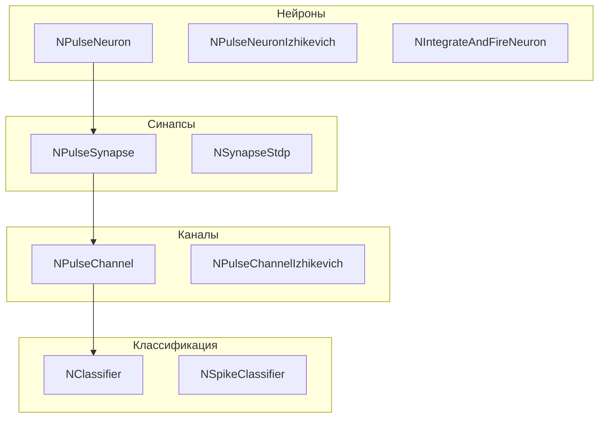
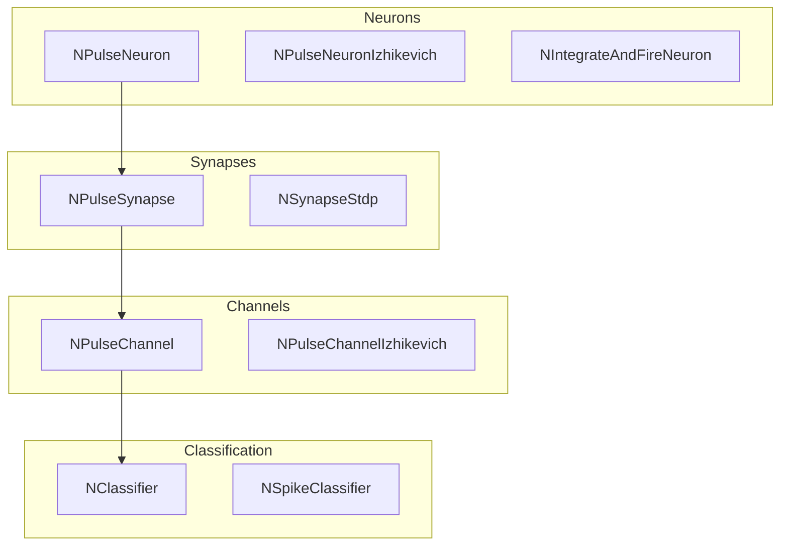

# Архитектура Nmsdk-PulseLib

## RU

### Обзор

Nmsdk-PulseLib реализует импульсные нейронные сети с различными моделями нейронов и механизмами обучения.

### Структура библиотеки



### Основные модули

#### 1. Базовые компоненты сетей

- **NNet** - базовый класс сети импульсных нейронов. Контейнер для организации нейронов и синапсов в сеть
- **NModel** - модель импульсной нейронной сети. Высокоуровневый компонент для работы с полными моделями
- **NLifeNet** - сеть с жизненным циклом нейронов

#### 2. Нейроны

- **NNeuron** - базовый класс нейрона
- **NPulseNeuron** - импульсный нейрон, основной компонент для моделирования нейронов, генерирующих спайки (импульсы)
- **NPulseNeuronCommon** - общая реализация импульсного нейрона
- **NPulseNeuronIzhikevich** - нейрон по модели Ижикевича (Izhikevich model), эффективная модель для имитации различных типов нейронов
- **NIntegrateAndFireNeuron** - нейрон модели "интегрировать и стрелять" (Integrate-and-Fire), классическая модель импульсного нейрона
- **NPulseLifeNeuron** - нейрон с жизненным циклом
- **NNeuronLife** - жизненный цикл нейрона
- **NAfferentNeuron** - афферентный нейрон (входной нейрон, получающий внешние сигналы)
- **NNeuronFreqGroup** - группа нейронов с частотной кодировкой
- **NNeuronFreqGroupLayer** - слой групп нейронов с частотной кодировкой
- **NNeuronsLayer** - слой нейронов

#### 3. Синапсы

- **NPulseSynapse** - базовый класс синапса (соединения между нейронами)
- **NPulseSynapseCommon** - общая реализация синапса
- **NPulseSynapseStdp** - синапс с пластичностью STDP (Spike-Timing Dependent Plasticity), механизм обучения на основе временных корреляций спайков
- **NPulseHebbSynapse** - синапс с правилом Хебба для обучения
- **NPulseHebbLifeSynapse** - синапс Хебба с жизненным циклом
- **NSynapseStdp** - синапс STDP (общая реализация)
- **NSynapseClassic** - классический синапс
- **NSynapseClassicSlv** - классический синапс с решателем
- **NPulseSynChannel** - синаптический канал

#### 4. Каналы

- **NPulseChannel** - базовый класс канала передачи импульсов
- **NPulseChannelCommon** - общая реализация канала
- **NPulseChannelIzhikevich** - канал для модели Ижикевича
- **NPulseChannelIaF** - канал для модели Integrate-and-Fire
- **NPulseChannelCable** - кабельный канал (моделирование аксона как кабеля)
- **NPulseChannelClassic** - классический канал

#### 5. Мембраны

- **NPulseMembrane** - мембрана нейрона
- **NPulseMembraneCommon** - общая реализация мембраны
- **NPulseMembraneIzhikevich** - мембрана для модели Ижикевича

#### 6. Зоны

- **NPulseLTZone** - зона долгосрочной потенциации (Long-Term)
- **NPulseLTZoneCommon** - общая реализация зоны
- **NPulseLTZoneIzhikevich** - зона для модели Ижикевича

#### 7. Генераторы импульсов

- **NPulseGenerator** - генератор импульсов (спайков)
- **NPulseGeneratorDelay** - генератор с задержкой
- **NPulseGeneratorMulti** - множественный генератор
- **NConstGenerator** - генератор постоянного сигнала
- **NSinusGenerator** - генератор синусоидального сигнала
- **NFileGenerator** - генератор из файла

#### 8. Задержки

- **NPulseDelay** - задержка импульсов

#### 9. Рецепторы и источники

- **NReceptor** - рецептор, компонент для приема внешних сигналов
- **NSource** - источник сигналов
- **NReceiver** - приемник сигналов

#### 10. Классификаторы

- **NClassifier** - базовый классификатор на основе импульсных нейросетей
- **NSpikeClassifier** - классификатор спайков
- **NPCAClassifier** - классификатор с использованием PCA
- **NConditionedReflex** - условный рефлекс (классификация с обучением)

#### 11. Обучение

- **NNeuronTrainer** - тренер нейронов
- **NNeuronLearner** - обучающийся нейрон
- **NSynapseTrainer** - тренер синапсов
- **NSynapseTrainerStdp** - тренер синапсов с STDP

#### 12. Перцептроны

- **NPulsePerseptron** - импульсный перцептрон

#### 13. Предсказатели

- **NPredictor** - предсказатель на основе импульсных нейросетей
- **NStatePredictor** - предсказатель состояния
- **NMExtrapolator** - экстраполятор движения

#### 14. Ассоциации

- **NAssociationFormer** - формирователь ассоциаций

#### 15. Рефлексы

- **NPainReflexSimple** - простой болевой рефлекс

#### 16. Данные и паттерны

- **NPattern** - паттерн (образец) для обучения и классификации
- **NDataset** - датасет для обучения

#### 17. Логические операции

- **NLogicalNot** - логическое НЕ
- **NSum** - сумматор сигналов

#### 18. Мышцы и эффекторы

- **NMuscle** - мышца, эффектор для управления движением
- **NEyeMuscle** - мышца глаза

#### 19. PAC (Pulse Activity Counter)

- **NPac** - счетчик активности импульсов

#### 20. Решатель ODE

- **NOdeSolver** - решатель обыкновенных дифференциальных уравнений (ODE) для моделирования динамики нейронов. Используется опционально при наличии библиотеки ODE Solver

### Модели нейронов

#### Модель Ижикевича (Izhikevich)

Эффективная модель, способная имитировать различные типы нейронов:
- Регулярно спайкующие
- Быстро спайкующие
- Медленно спайкующие
- И другие типы

Компоненты:
- `NPulseNeuronIzhikevich`
- `NPulseChannelIzhikevich`
- `NPulseMembraneIzhikevich`
- `NPulseLTZoneIzhikevich`

#### Модель Integrate-and-Fire

Классическая модель импульсного нейрона:
- `NIntegrateAndFireNeuron`
- `NPulseChannelIaF`

#### Классические модели

- `NSynapseClassic` - классический синапс
- `NPulseChannelClassic` - классический канал

### Механизмы обучения

#### STDP (Spike-Timing Dependent Plasticity)

Обучение на основе временных корреляций спайков:
- `NPulseSynapseStdp`
- `NSynapseStdp`
- `NSynapseTrainerStdp`

#### Правило Хебба

Обучение по правилу Хебба:
- `NPulseHebbSynapse`
- `NPulseHebbLifeSynapse`

#### Обучение нейронов

- `NNeuronTrainer` - тренер нейронов
- `NNeuronLearner` - обучающийся нейрон

### Ключевые классы

#### NPulseLibrary

Главный класс библиотеки, наследник `ULibrary`.

Библиотека автоматически загружается при инициализации:

```cpp
libs_list.push_back(&NMSDK::PulseLibrary);
```

### Зависимости

- **rdk.static.qt** - ядро Rdk (обязательно)
- **Rdk-BasicLib.qt** - базовая библиотека для источников данных и статистики (обязательно)
- **ODE Solver** - опционально, для `NOdeSolver` компонента

### Зависимости от этой библиотеки

- **Nmsdk-MotionControlLib** - использует импульсные нейросети для управления движением

### Примеры использования

#### Создание простой сети

```cpp
// Создание сети
NNet* net = storage->CreateComponent<NNet>();

// Создание нейронов
NPulseNeuronIzhikevich* neuron1 = storage->CreateComponent<NPulseNeuronIzhikevich>();
NPulseNeuronIzhikevich* neuron2 = storage->CreateComponent<NPulseNeuronIzhikevich>();

// Создание синапса
NPulseSynapseStdp* synapse = storage->CreateComponent<NPulseSynapseStdp>();

// Соединение компонентов
net->AddComponent(neuron1);
net->AddComponent(neuron2);
net->AddComponent(synapse);
// Настройка соединений...
```

#### Генератор импульсов

```cpp
// Создание генератора
NPulseGenerator* generator = storage->CreateComponent<NPulseGenerator>();
// Настройка частоты и параметров
```

#### Классификатор

```cpp
// Создание классификатора
NClassifier* classifier = storage->CreateComponent<NClassifier>();
// Обучение и классификация
```

### Файлы библиотеки

Библиотека содержит 140 файлов (70 .cpp, 70 .h) в директории `Core/`, реализующих все перечисленные компоненты.

### См. также

- [Usage-Examples.md](Usage-Examples.md) - примеры использования
- [API-Overview.md](API-Overview.md) - обзор API

---

## EN

### Overview

Nmsdk-PulseLib implements spiking neural networks with various neuron models and learning mechanisms.

### Library Structure



The library is structured around spiking neuron models, synapses (including STDP), channels for spike propagation, and classifiers operating on spike trains. Components are combined into networks using standard Rdk engine connection mechanisms.

### Main Modules

#### 1. Basic Network Components

- **NNet** - base class for spiking neuron networks. Container for organizing neurons and synapses into a network
- **NModel** - spiking neural network model. High-level component for working with complete models
- **NLifeNet** - network with neuron lifecycle

#### 2. Neurons

- **NNeuron** - base neuron class
- **NPulseNeuron** - spiking neuron, main component for modeling neurons that generate spikes (pulses)
- **NPulseNeuronCommon** - common spiking neuron implementation
- **NPulseNeuronIzhikevich** - Izhikevich model neuron, efficient model for simulating various neuron types
- **NIntegrateAndFireNeuron** - integrate-and-fire model neuron, classical spiking neuron model
- **NPulseLifeNeuron** - neuron with lifecycle
- **NNeuronLife** - neuron lifecycle
- **NAfferentNeuron** - afferent neuron (input neuron receiving external signals)
- **NNeuronFreqGroup** - neuron group with frequency encoding
- **NNeuronFreqGroupLayer** - layer of frequency-encoded neuron groups
- **NNeuronsLayer** - neuron layer

#### 3. Synapses

- **NPulseSynapse** - base synapse class (connections between neurons)
- **NPulseSynapseCommon** - common synapse implementation
- **NPulseSynapseStdp** - synapse with STDP (Spike-Timing Dependent Plasticity), learning mechanism based on temporal spike correlations
- **NPulseHebbSynapse** - synapse with Hebb's rule for learning
- **NPulseHebbLifeSynapse** - Hebb synapse with lifecycle
- **NSynapseStdp** - STDP synapse (common implementation)
- **NSynapseClassic** - classic synapse
- **NSynapseClassicSlv** - classic synapse with solver
- **NPulseSynChannel** - synaptic channel

#### 4. Channels

- **NPulseChannel** - base pulse transmission channel class
- **NPulseChannelCommon** - common channel implementation
- **NPulseChannelIzhikevich** - channel for Izhikevich model
- **NPulseChannelIaF** - channel for Integrate-and-Fire model
- **NPulseChannelCable** - cable channel (modeling axon as cable)
- **NPulseChannelClassic** - classic channel

#### 5. Membranes

- **NPulseMembrane** - neuron membrane
- **NPulseMembraneCommon** - common membrane implementation
- **NPulseMembraneIzhikevich** - membrane for Izhikevich model

#### 6. Zones

- **NPulseLTZone** - long-term potentiation zone (Long-Term)
- **NPulseLTZoneCommon** - common zone implementation
- **NPulseLTZoneIzhikevich** - zone for Izhikevich model

#### 7. Pulse Generators

- **NPulseGenerator** - pulse (spike) generator
- **NPulseGeneratorDelay** - generator with delay
- **NPulseGeneratorMulti** - multiple generator
- **NConstGenerator** - constant signal generator
- **NSinusGenerator** - sinusoidal signal generator
- **NFileGenerator** - file-based generator

#### 8. Delays

- **NPulseDelay** - pulse delay

#### 9. Receptors and Sources

- **NReceptor** - receptor, component for receiving external signals
- **NSource** - signal source
- **NReceiver** - signal receiver

#### 10. Classifiers

- **NClassifier** - base classifier based on spiking neural networks
- **NSpikeClassifier** - spike classifier
- **NPCAClassifier** - classifier using PCA
- **NConditionedReflex** - conditioned reflex (classification with learning)

#### 11. Training

- **NNeuronTrainer** - neuron trainer
- **NNeuronLearner** - learning neuron
- **NSynapseTrainer** - synapse trainer
- **NSynapseTrainerStdp** - STDP synapse trainer

#### 12. Perceptrons

- **NPulsePerseptron** - spiking perceptron

#### 13. Predictors

- **NPredictor** - predictor based on spiking neural networks
- **NStatePredictor** - state predictor
- **NMExtrapolator** - motion extrapolator

#### 14. Associations

- **NAssociationFormer** - association former

#### 15. Reflexes

- **NPainReflexSimple** - simple pain reflex

#### 16. Data and Patterns

- **NPattern** - pattern (sample) for training and classification
- **NDataset** - training dataset

#### 17. Logical Operations

- **NLogicalNot** - logical NOT
- **NSum** - signal summer

#### 18. Muscles and Effectors

- **NMuscle** - muscle, effector for motion control
- **NEyeMuscle** - eye muscle

#### 19. PAC (Pulse Activity Counter)

- **NPac** - pulse activity counter

#### 20. ODE Solver

- **NOdeSolver** - ordinary differential equation (ODE) solver for modeling neuron dynamics. Used optionally when ODE Solver library is available

### Neuron Models

#### Izhikevich Model

Efficient model capable of simulating various neuron types:
- Regularly spiking
- Fast spiking
- Slow spiking
- And other types

Components:
- `NPulseNeuronIzhikevich`
- `NPulseChannelIzhikevich`
- `NPulseMembraneIzhikevich`
- `NPulseLTZoneIzhikevich`

#### Integrate-and-Fire Model

Classical spiking neuron model:
- `NIntegrateAndFireNeuron`
- `NPulseChannelIaF`

#### Classic Models

- `NSynapseClassic` - classic synapse
- `NPulseChannelClassic` - classic channel

### Learning Mechanisms

#### STDP (Spike-Timing Dependent Plasticity)

Learning based on temporal spike correlations:
- `NPulseSynapseStdp`
- `NSynapseStdp`
- `NSynapseTrainerStdp`

#### Hebb's Rule

Learning by Hebb's rule:
- `NPulseHebbSynapse`
- `NPulseHebbLifeSynapse`

#### Neuron Training

- `NNeuronTrainer` - neuron trainer
- `NNeuronLearner` - learning neuron

### Key Classes

#### NPulseLibrary

Main library class, inherits from `ULibrary`.

The library is automatically loaded during initialization:

```cpp
libs_list.push_back(&NMSDK::PulseLibrary);
```

### Dependencies

- **rdk.static.qt** - Rdk core (required)
- **Rdk-BasicLib.qt** - basic library for data sources and statistics (required)
- **ODE Solver** - optional, for `NOdeSolver` component

### Libraries Depending on This Library

- **Nmsdk-MotionControlLib** - uses spiking neural networks for motion control

### Usage Examples

#### Creating a Simple Network

```cpp
// Create network
NNet* net = storage->CreateComponent<NNet>();

// Create neurons
NPulseNeuronIzhikevich* neuron1 = storage->CreateComponent<NPulseNeuronIzhikevich>();
NPulseNeuronIzhikevich* neuron2 = storage->CreateComponent<NPulseNeuronIzhikevich>();

// Create synapse
NPulseSynapseStdp* synapse = storage->CreateComponent<NPulseSynapseStdp>();

// Connect components
net->AddComponent(neuron1);
net->AddComponent(neuron2);
net->AddComponent(synapse);
// Configure connections...
```

#### Pulse Generator

```cpp
// Create generator
NPulseGenerator* generator = storage->CreateComponent<NPulseGenerator>();
// Configure frequency and parameters
```

#### Classifier

```cpp
// Create classifier
NClassifier* classifier = storage->CreateComponent<NClassifier>();
// Training and classification
```

### Library Files

The library contains 140 files (70 .cpp, 70 .h) in the `Core/` directory, implementing all listed components.

### See Also

- [Usage-Examples.md](Usage-Examples.md) - usage examples
- [API-Overview.md](API-Overview.md) - API overview
