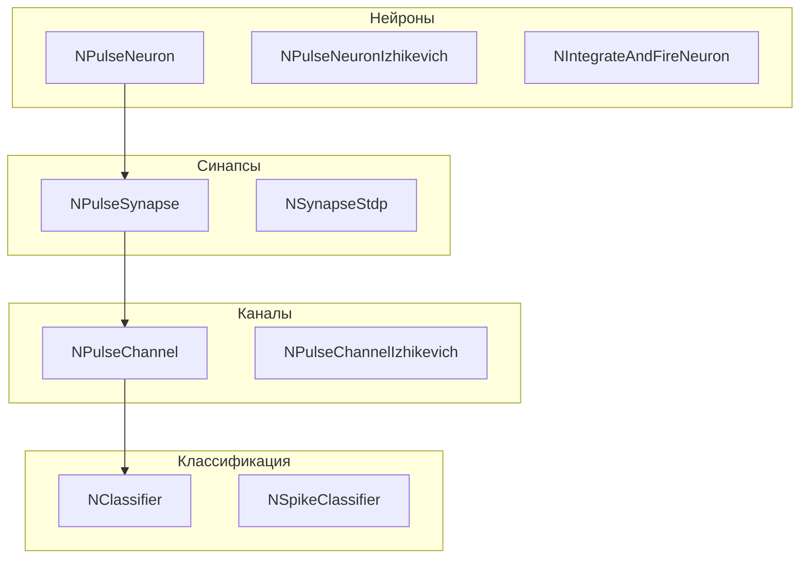

# Архитектура Nmsdk-PulseLib

## RU

### Обзор

Nmsdk-PulseLib реализует импульсные нейронные сети с различными моделями нейронов и механизмами обучения.

### Структура библиотеки

### Основные модули

#### Нейроны

- **NPulseNeuron** - базовый импульсный нейрон
- **NPulseNeuronIzhikevich** - нейрон по модели Ижикевича
- **NIntegrateAndFireNeuron** - нейрон модели "интегрировать и стрелять"

#### Синапсы

- **NPulseSynapse** - базовый синапс
- **NSynapseStdp** - синапс с STDP обучением

#### Каналы

- **NPulseChannel** - базовый канал импульсов
- **NPulseChannelIzhikevich** - канал для модели Ижикевича

#### Классификация

- **NClassifier** - базовый классификатор
- **NSpikeClassifier** - классификатор на основе спайков

#### Обучение

- **NNeuronTrainer** - обучение нейронов
- **NSynapseTrainer** - обучение синапсов

### Зависимости

- `rdk.static.qt` - ядро Rdk
- Rdk-BasicLib - базовые компоненты
- ODE Solver (опционально) - для решения дифференциальных уравнений

### См. также

- [Usage-Examples.md](Usage-Examples.md) - примеры использования
- [API-Overview.md](API-Overview.md) - обзор API

---

## EN

### Overview

Nmsdk-PulseLib implements spiking neural networks with various neuron models and learning mechanisms.

### Library Structure

### Main Modules

#### Neurons

- **NPulseNeuron** - base spiking neuron
- **NPulseNeuronIzhikevich** - Izhikevich model neuron
- **NIntegrateAndFireNeuron** - integrate-and-fire model neuron

#### Synapses

- **NPulseSynapse** - base synapse
- **NSynapseStdp** - synapse with STDP learning

#### Channels

- **NPulseChannel** - base pulse channel
- **NPulseChannelIzhikevich** - channel for Izhikevich model

#### Classification

- **NClassifier** - base classifier
- **NSpikeClassifier** - spike-based classifier

#### Training

- **NNeuronTrainer** - neuron training
- **NSynapseTrainer** - synapse training

### Dependencies

- `rdk.static.qt` - Rdk core
- Rdk-BasicLib - basic components
- ODE Solver (optional) - for differential equation solving

### See Also

- [Usage-Examples.md](Usage-Examples.md) - usage examples
- [API-Overview.md](API-Overview.md) - API overview
