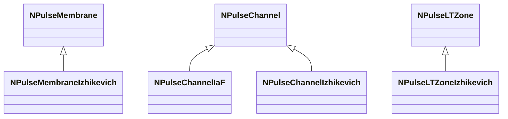

## RU

## Каналы, мембраны и LT-зоны (Nmsdk-PulseLib)

Группа включает компоненты распространения импульсов, мембранные модели и LT-зоны (долговременная пластичность).

### Каналы

- `NPulseChannelIaF`, `NPulseChannelIzhikevich`, `NPulseChannelCable`, `NPulseChannelCableMulti` — каналы для разных моделей нейронов.
- `NPulseChannel`, `NPulseChannelClassic`, `NPulseChannelCommon` — общая логика каналов.
- `NPulseSynChannel` и др. — связи с синапсами.

### Мембраны

- `NPulseMembrane`, `NPulseMembraneIzhikevich`, `NPulseMembraneCommon` — модели мембраны для разных типов нейронов.

### LT-зоны

- `NPulseLTZone`, `NPulseLTZoneIzhikevich`, `NPulseLTZoneCommon` — длительная потенциация/депрессия и пороговые механизмы.

### Storage-инстансы

Все классы регистрируются в `NPulseLibrary.cpp` и настраиваются через свойства (ёмкости, пороги, коэффициенты LT и др.).

## Источники

См. [Literature-References.md](../Literature-References.md): **[A]**, **[C]**, **7**, **25**, **26**, **29**.

---

## EN

## Channels, Membranes & LT zones — overview (Nmsdk-PulseLib)

Defines how spikes travel, how membrane potential is integrated and how long-term plasticity is implemented.

### References

See [Literature-References.md](../Literature-References.md): **[A]**, **[C]**, **7**, **25**, **26**, **29**.
