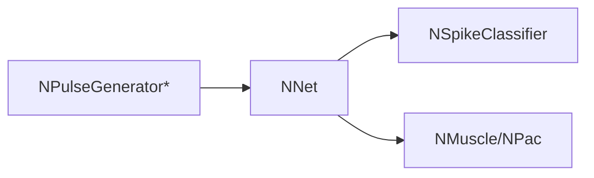

## RU

## Генераторы, IO, классификаторы и прочие (Nmsdk-PulseLib)

### Генераторы и задержки

- `NPGenerator`, `NCGenerator`, `NSinusGenerator`, `NFileGenerator`, `NPulseGenerator`, `NPulseGeneratorMulti`, `NPulseGeneratorDelay` и др. — генерация токов/спайков.
- `NPulseDelay` — задержка импульсов.

### IO

- `NReceptor`, `NSource`, `NReceiver` — ввод/вывод сигналов в сеть.

### Классификаторы, рефлексы, предсказатели

- `NClassifier`, `NSpikeClassifier`, `NPCAClassifier` — классификация по активности.
- `NConditionedReflex`, `NPainReflexSimple`, `NAssociationFormer` — условные/болевые рефлексы и ассоциации.
- `NPredictor`, `NStatePredictor` — предсказание состояния.

### Эффекторы и логика

- `NMuscle`, `NEyeMuscle`, `NPac`, `NCPac` — эффекторные и счётные элементы.
- `NLogicalNot`, `NSum` — логические/суммирующие блоки.
- `NOdeSolver` — численный решатель ОДУ.

Пояснение: блок-схема показывает поток данных/сигналов (входы → компонент → выходы).

## Источники

См. [Literature-References.md](../Literature-References.md): **1**, **6**, **8**, **9**, **10**, **14**, **19**, **31**.

---

## EN

## Generators, IO, Classifiers & Others — overview (Nmsdk-PulseLib)

Summarises non-neuron, non-synapse building blocks that provide stimuli, IO, classification, reflexes and effectors.

### References

See [Literature-References.md](../Literature-References.md): **1**, **6**, **8**, **9**, **10**, **14**, **19**, **31**.

