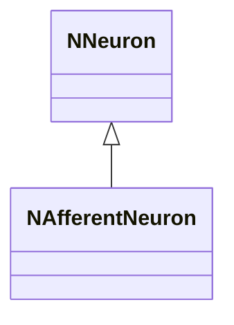
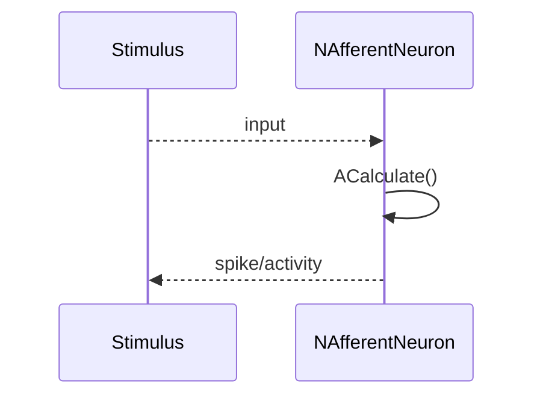
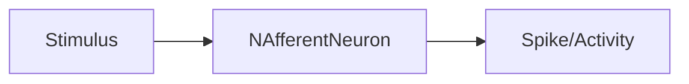
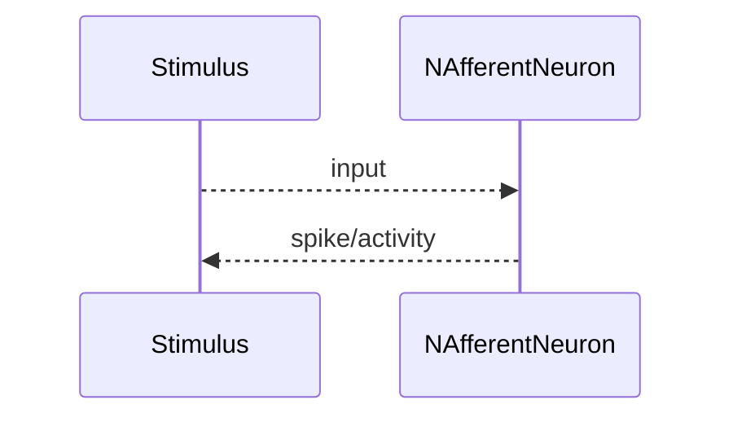

## NAfferentNeuron — афферентный нейрон (Nmsdk-PulseLib)

**Класс**: `NAfferentNeuron` — базовый афферентный нейрон для приёма внешних стимулов.  
**Регистрация**: `NPulseLibrary.cpp` → `UploadClass("NAfferentNeuron", ...)`.  
**Storage**: `ClassName = "NAfferentNeuron"` в `ClDesc/Configs`.

### Lifecycle
- **ADefault**: инициализация порогов/параметров приёма.
- **ABuild**: подключение входных токов/каналов.
- **AReset**: сброс состояния.
- **ACalculate**: приём стимула, обновление потенциала/активации.

### I/O
- Вход: внешний стимул/ток/событие.
- Выход: активность/спайк афферентного нейрона.



Пояснение: диаграмма классов показывает место компонента в иерархии и ключевые связи.



Пояснение: диаграмма последовательности показывает типовой сценарий взаимодействия и порядок вызовов.



Пояснение: блок-схема показывает поток данных/сигналов (входы → компонент → выходы).

### Config snippet

```ini
[Component]
ClassName = NAfferentNeuron
Name = Afferent1
```

---

## NAfferentNeuron — afferent neuron (EN)

Receives external stimuli and produces spike/activity output.


Description: this class diagram shows the component position in the type hierarchy and key relations.



Description: this sequence diagram shows a typical runtime interaction and call order.


Description: this flowchart shows the data/signal flow (inputs → component → outputs).
