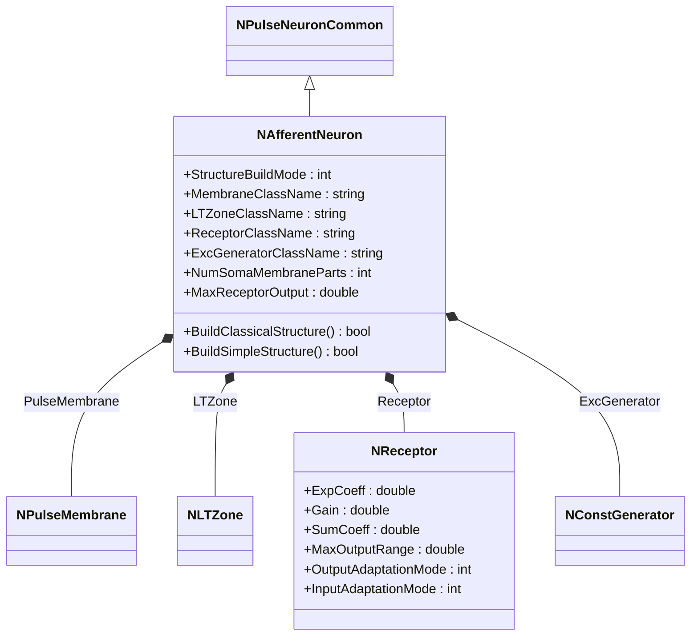
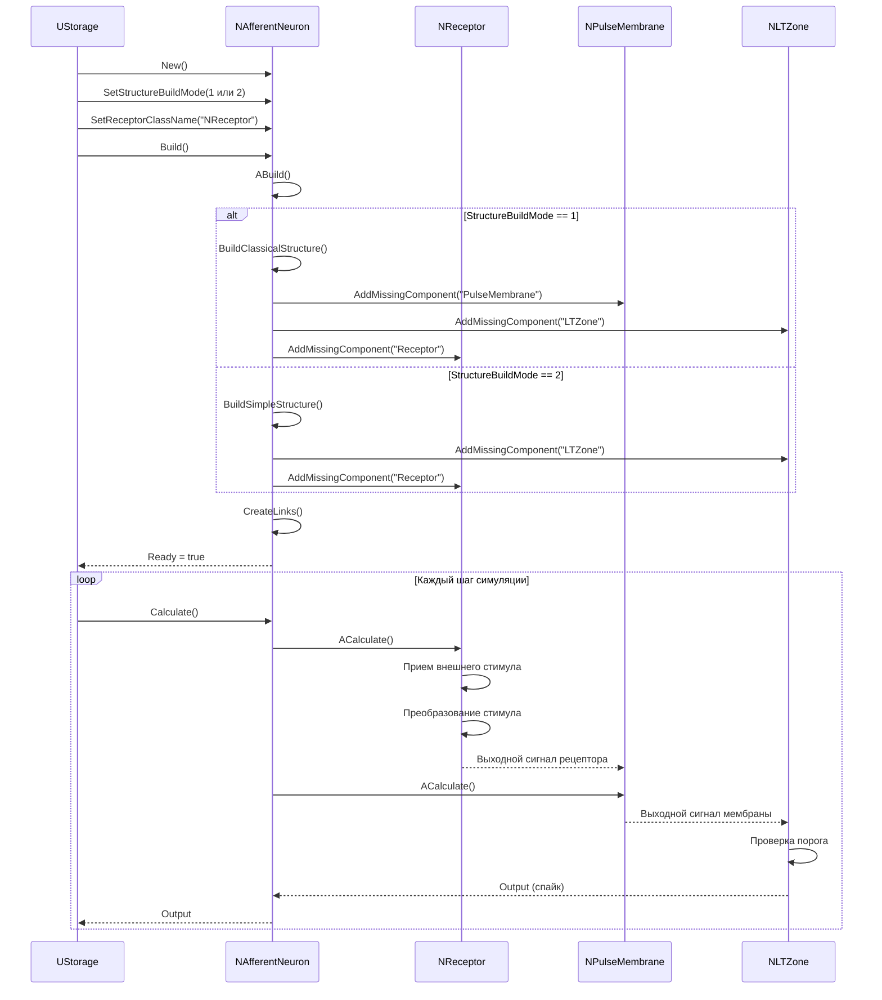
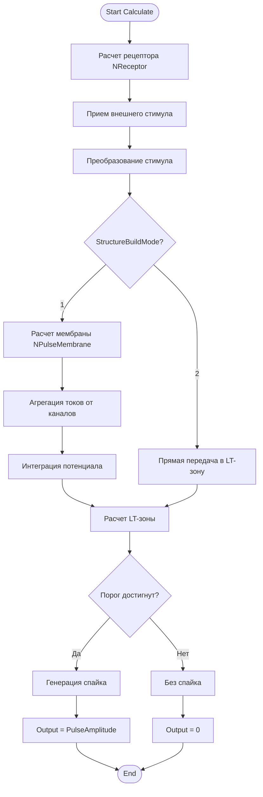
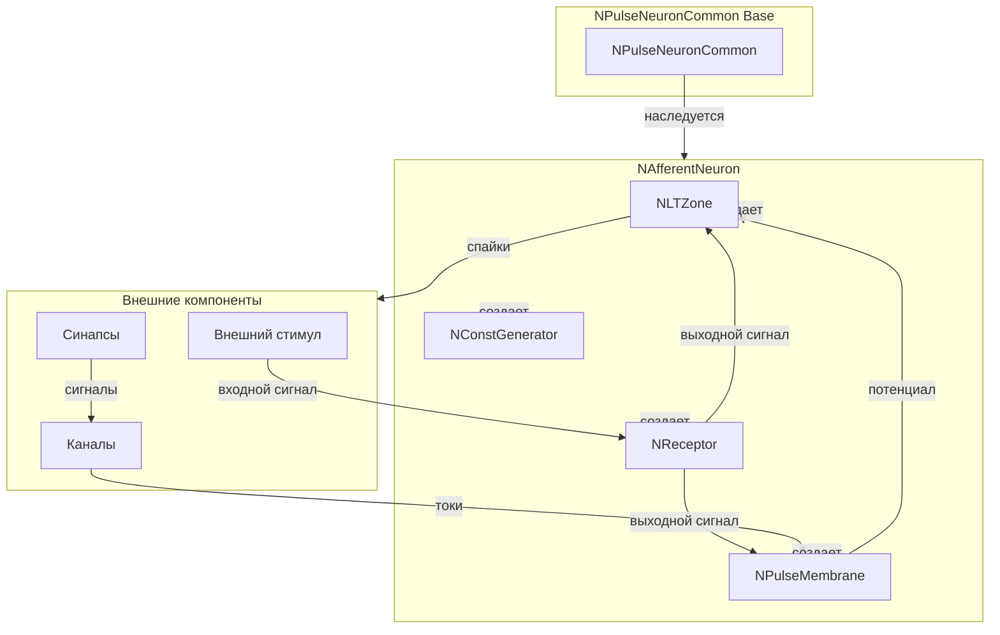
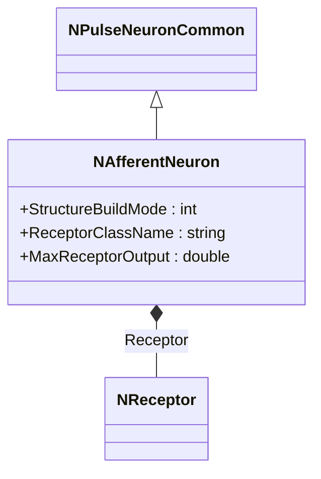
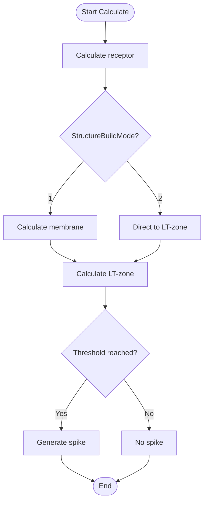
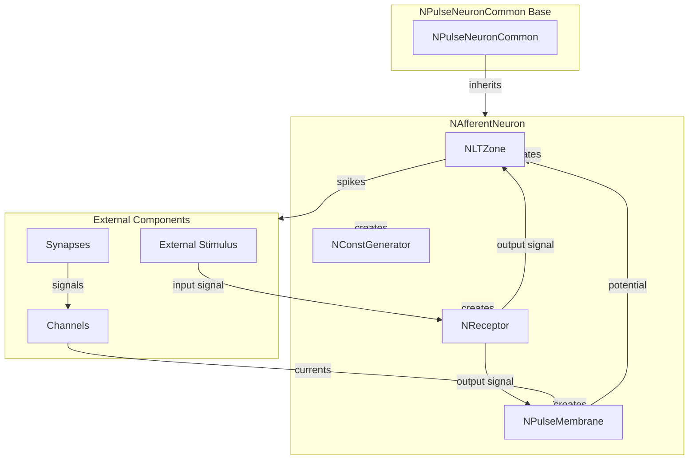

# NAfferentNeuron — афферентный нейрон

## RU

### Назначение

**Класс**: `NAfferentNeuron` — базовый афферентный нейрон для приема внешних стимулов.  
**Регистрация**: `NPulseLibrary.cpp` → `UploadClass("NAfferentNeuron", ...)`.  
**Storage-инстансы**: `ClassName = "NAfferentNeuron"` в `Bin/Configs/*/Model_*.xml`.

`NAfferentNeuron` является базовым классом для моделирования афферентных (сенсорных) нейронов, которые получают внешние стимулы через рецепторы и преобразуют их в нейронные сигналы. Наследуется от `NPulseNeuronCommon` и включает рецептор (`NReceptor`) для приема внешних стимулов.

**Использование:** Моделирование сенсорных систем, прием внешних стимулов

### UML-диаграмма классов



**Иерархия наследования:**
- `NPulseNeuronCommon` — общий импульсный нейрон
- `NAfferentNeuron` — афферентный нейрон

**Внутренняя структура:**
- **Receptor** (`NReceptor`) — рецептор для приема внешних стимулов
- **PulseMembrane** (`NPulseMembrane`) — мембрана нейрона
- **LTZone** (`NLTZone`) — LT-зона для генерации спайков
- **ExcGenerator** (`NConstGenerator`) — возбуждающий генератор

**Режимы сборки структуры:**
- `StructureBuildMode = 1` — классическая структура (мембрана + LT-зона + рецептор)
- `StructureBuildMode = 2` — простая структура (LT-зона + рецептор)

### UML-диаграмма последовательности



### UML-диаграмма состояний

```mermaid
stateDiagram-v2
    [*] --> Uninitialized: New()
    Uninitialized --> Defaulted: Default()
    Defaulted --> Building: Build()
    Building --> CheckMode{StructureBuildMode?}
    CheckMode -->|1| ClassicalBuild: BuildClassicalStructure()
    CheckMode -->|2| SimpleBuild: BuildSimpleStructure()
    ClassicalBuild --> CreatingMembrane: Создание мембраны
    CreatingMembrane --> CreatingLTZone: Создание LT-зоны
    CreatingLTZone --> CreatingReceptor: Создание рецептора
    SimpleBuild --> CreatingLTZone2: Создание LT-зоны
    CreatingLTZone2 --> CreatingReceptor2: Создание рецептора
    CreatingReceptor --> Linking: Создание связей
    CreatingReceptor2 --> Linking
    Linking --> Built: Структура построена
    Built --> Ready: Ready = true
    Ready --> Calculating: Calculate()
    Calculating --> ReceptorCalc: Расчет рецептора
    ReceptorCalc --> MembraneCalc: Расчет мембраны (если есть)
    MembraneCalc --> LTZoneCalc: Расчет LT-зоны
    ReceptorCalc --> LTZoneCalc2: Расчет LT-зоны (простая структура)
    LTZoneCalc --> CheckThreshold: Проверка порога
    LTZoneCalc2 --> CheckThreshold
    CheckThreshold -->|Порог достигнут| Spiking: Генерация спайка
    CheckThreshold -->|Порог не достигнут| Ready: Шаг завершен
    Spiking --> Ready
    Ready --> Resetting: Reset()
    Resetting --> Ready: Состояния сброшены
```

**Состояния:**
- **Uninitialized** — создан, но не инициализирован
- **Defaulted** — параметры установлены по умолчанию
- **Building** — выполняется сборка структуры
- **ClassicalBuild** — построение классической структуры (мембрана + LT-зона + рецептор)
- **SimpleBuild** — построение простой структуры (LT-зона + рецептор)
- **CreatingMembrane** — создание мембраны
- **CreatingLTZone** — создание LT-зоны
- **CreatingReceptor** — создание рецептора
- **Linking** — создание связей между компонентами
- **Built** — структура нейрона построена
- **Ready** — готов к выполнению расчетов
- **Calculating** — выполняется расчет нейрона
- **ReceptorCalc** — расчет рецептора (прием и преобразование стимула)
- **MembraneCalc** — расчет мембраны (интеграция токов)
- **LTZoneCalc** — расчет LT-зоны (проверка порога)
- **CheckThreshold** — проверка достижения порога
- **Spiking** — генерация спайка
- **Resetting** — выполняется сброс состояний

### UML-диаграмма активности



**Алгоритм расчета:**
1. Расчет рецептора: прием внешнего стимула и его преобразование
2. Для классической структуры: расчет мембраны (агрегация токов, интеграция потенциала)
3. Расчет LT-зоны: проверка порога генерации спайка
4. Генерация спайка при достижении порога
5. Обновление выходного сигнала нейрона

### UML-диаграмма компонентов



**Зависимости:**
- **Базовый класс**: `NPulseNeuronCommon`
- **Внутренние компоненты**: `NReceptor` (рецептор), `NPulseMembrane` (мембрана, для классической структуры), `NLTZone` (LT-зона), `NConstGenerator` (возбуждающий генератор)
- **Внешние компоненты**: внешние стимулы (источники входных сигналов), каналы, синапсы

### Свойства

**Публичные параметры:**
- `StructureBuildMode` (int) — режим сборки структуры (0 — без сборки, 1 — классическая структура, 2 — простая структура)
- `MembraneClassName` (string) — имя класса мембраны
- `LTZoneClassName` (string) — имя класса LT-зоны
- `ReceptorClassName` (string) — имя класса рецептора
- `ExcGeneratorClassName` (string) — имя класса возбуждающего генератора
- `NumSomaMembraneParts` (int) — количество частей сомы
- `MaxReceptorOutput` (double) — максимальный выходной сигнал рецептора (для простой структуры)

### Методы

#### Публичные методы

- **`New()`** → `NAfferentNeuron*` — создает новый экземпляр класса

- **`SetStructureBuildMode(value)`** → `bool` — устанавливает режим сборки структуры

- **`SetMembraneClassName(value)`** → `bool` — устанавливает имя класса мембраны

- **`SetLTZoneClassName(value)`** → `bool` — устанавливает имя класса LT-зоны

- **`SetReceptorClassName(value)`** → `bool` — устанавливает имя класса рецептора

- **`SetExcGeneratorClassName(value)`** → `bool` — устанавливает имя класса возбуждающего генератора

- **`SetNumSomaMembraneParts(value)`** → `bool` — устанавливает количество частей сомы

- **`SetMaxReceptorOutput(value)`** → `bool` — устанавливает максимальный выходной сигнал рецептора

#### Защищенные методы

- **`BuildClassicalStructure(...)`** → `bool` — строит классическую структуру (мембрана + LT-зона + рецептор)

- **`BuildSimpleStructure(...)`** → `bool` — строит простую структуру (LT-зона + рецептор)

- **`ADefault()`** → `bool` — инициализирует параметры по умолчанию

- **`ABuild()`** → `bool` — строит структуру нейрона в зависимости от `StructureBuildMode`

- **`AReset()`** → `bool` — сбрасывает состояния нейрона

- **`ACalculate()`** → `bool` — выполняет расчет нейрона на одном шаге

### Примеры использования

#### Пример 1: Создание классического афферентного нейрона

```cpp
auto neuron = storage->CreateComponent<NAfferentNeuron>();
neuron->SetName("AfferentNeuron");

neuron->Default();

// Настройка классической структуры
neuron->StructureBuildMode = 1;
neuron->MembraneClassName = "NPulseMembrane";
neuron->LTZoneClassName = "NPulseLTZone";
neuron->ReceptorClassName = "NReceptor";
neuron->ExcGeneratorClassName = "NPNeuronPosCGenerator";
neuron->NumSomaMembraneParts = 1;

neuron->Build();
```

#### Пример 2: Создание простого афферентного нейрона

```cpp
auto neuron = storage->CreateComponent<NAfferentNeuron>();
neuron->SetName("SimpleAfferentNeuron");

neuron->Default();

// Настройка простой структуры
neuron->StructureBuildMode = 2;
neuron->LTZoneClassName = "NPSimpleLTZone";
neuron->ReceptorClassName = "NReceptor";
neuron->MaxReceptorOutput = 200;

neuron->Build();
```

### Использование в конфигурациях

`NAfferentNeuron` используется в экспериментах с сенсорными системами:

- **Афферентные нейроны**: `Bin/Configs/!OldConfigs/NM-AfferentNeurons/`
- **Управление движением**: `Bin/Configs/!OldConfigs/OldExperiments/SimplestMotionControlSAfferent/`

**Типичные значения параметров:**
- **StructureBuildMode**: 1 (классическая структура) или 2 (простая структура)
- **ReceptorClassName**: "NReceptor" (рецептор для приема стимулов)
- **MembraneClassName**: "NPulseMembrane" (для классической структуры)
- **LTZoneClassName**: "NPulseLTZone" или "NPSimpleLTZone" (в зависимости от режима)

### См. также

- [`NPulseNeuronCommon`](NPulseNeuronCommon.md) — общий импульсный нейрон
- [`NReceptor`](NReceptor.md) — рецептор для приема стимулов
- [`NSAfferentNeuron`](NSAfferentNeuron.md) — классический афферентный нейрон
- [`NSimpleAfferentNeuron`](NSimpleAfferentNeuron.md) — простой афферентный нейрон
- [Architecture.md](../Architecture.md) — архитектура библиотеки

---

## EN

### Purpose

**Class**: `NAfferentNeuron` — base afferent neuron for receiving external stimuli.  
**Registration**: `NPulseLibrary.cpp` → `UploadClass("NAfferentNeuron", ...)`.  
**Instances**: `ClassName = "NAfferentNeuron"` in `Bin/Configs/*/Model_*.xml`.

`NAfferentNeuron` is a base class for modeling afferent (sensory) neurons that receive external stimuli through receptors and convert them into neural signals. Inherits from `NPulseNeuronCommon` and includes a receptor (`NReceptor`) for receiving external stimuli.

**Usage:** Modeling sensory systems, receiving external stimuli

### UML Class Diagram



### UML State Diagram

```mermaid
stateDiagram-v2
    [*] --> Uninitialized: New()
    Uninitialized --> Defaulted: Default()
    Defaulted --> Building: Build()
    Building --> CheckMode{StructureBuildMode?}
    CheckMode -->|1| ClassicalBuild: BuildClassicalStructure()
    CheckMode -->|2| SimpleBuild: BuildSimpleStructure()
    ClassicalBuild --> Built: Structure built
    SimpleBuild --> Built
    Built --> Ready: Ready = true
    Ready --> Calculating: Calculate()
    Calculating --> ReceptorCalc: Calculate receptor
    ReceptorCalc --> MembraneCalc: Calculate membrane
    MembraneCalc --> LTZoneCalc: Calculate LT-zone
    LTZoneCalc --> CheckThreshold: Check threshold
    CheckThreshold -->|Threshold reached| Spiking: Generate spike
    CheckThreshold -->|Not reached| Ready: Step completed
    Spiking --> Ready
```

### UML Activity Diagram



### UML Component Diagram



### Properties

- `StructureBuildMode` — режим сборки структуры (0 — без сборки, 1 — классическая структура, 2 — простая структура)
- `MembraneClassName` — имя класса мембраны
- `LTZoneClassName` — имя класса LT-зоны
- `ReceptorClassName` — имя класса рецептора
- `ExcGeneratorClassName` — имя класса возбуждающего генератора
- `NumSomaMembraneParts` — количество частей сомы
- `MaxReceptorOutput` — максимальный выходной сигнал рецептора (для простой структуры)

### Methods

- `SetStructureBuildMode(value)` — установка режима сборки структуры
- `SetMembraneClassName(value)` — установка имени класса мембраны
- `SetLTZoneClassName(value)` — установка имени класса LT-зоны
- `SetReceptorClassName(value)` — установка имени класса рецептора
- `SetExcGeneratorClassName(value)` — установка имени класса возбуждающего генератора
- `SetNumSomaMembraneParts(value)` — установка количества частей сомы
- `SetMaxReceptorOutput(value)` — установка максимального выходного сигнала рецептора
- `ADefault()` — установка параметров по умолчанию
- `ABuild()` — сборка структуры нейрона (вызывает BuildClassicalStructure или BuildSimpleStructure в зависимости от режима)
- `AReset()` — сброс состояний нейрона
- `ACalculate()` — выполнение шага расчета нейрона

### Usage in configurations

`NAfferentNeuron` is used in sensory system experiments:

- **Afferent neurons**: `Bin/Configs/!OldConfigs/NM-AfferentNeurons/`
- **Motion control**: `Bin/Configs/!OldConfigs/OldExperiments/SimplestMotionControlSAfferent/`

**Typical parameter values:**
- **StructureBuildMode**: 1 (classical structure) or 2 (simple structure)
- **ReceptorClassName**: "NReceptor" (receptor for receiving stimuli)
- **MembraneClassName**: "NPulseMembrane" (for classical structure)
- **LTZoneClassName**: "NPulseLTZone" or "NPSimpleLTZone" (depending on mode)

**Features:**
- Two structure modes: classical (membrane + LT-zone + receptor) or simple (LT-zone + receptor)
- Receptor: receives and transforms external stimuli
- Integration: converts external stimuli into neural signals

### See Also

- [`NPulseNeuronCommon`](NPulseNeuronCommon.md) — common spiking neuron
- [`NReceptor`](NReceptor.md) — receptor for receiving stimuli
- [`NSAfferentNeuron`](NSAfferentNeuron.md) — classical afferent neuron
- [`NSimpleAfferentNeuron`](NSimpleAfferentNeuron.md) — simple afferent neuron
- [Architecture.md](../Architecture.md) — library architecture
