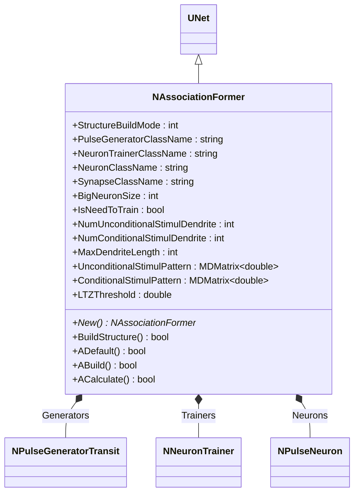
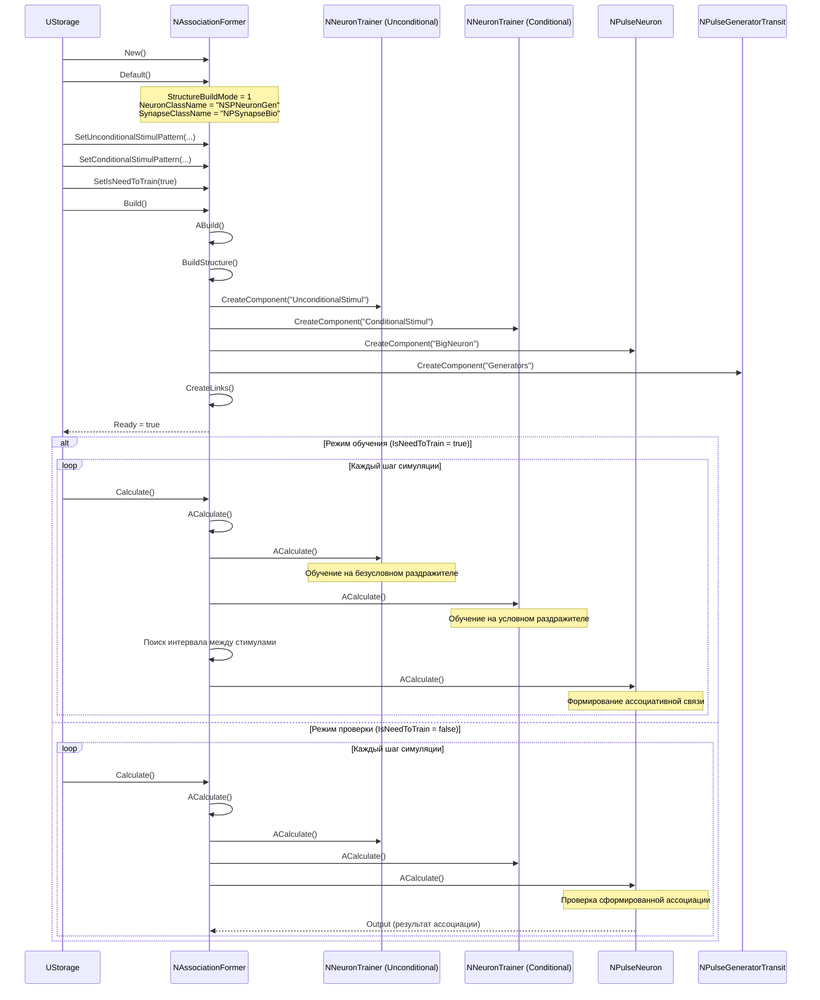
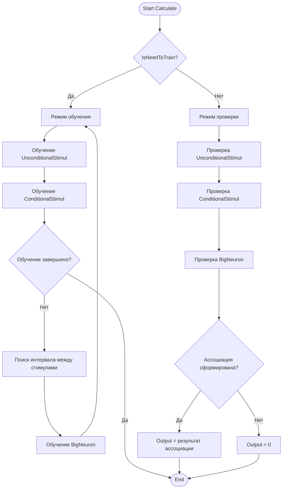
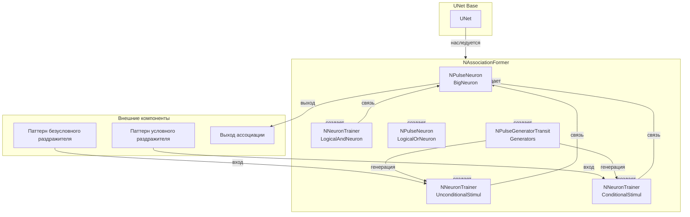
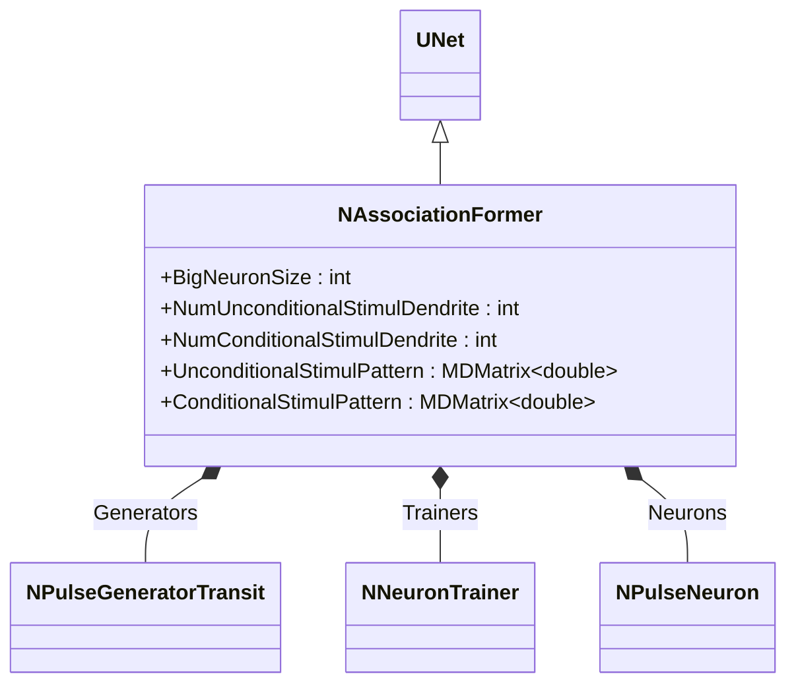
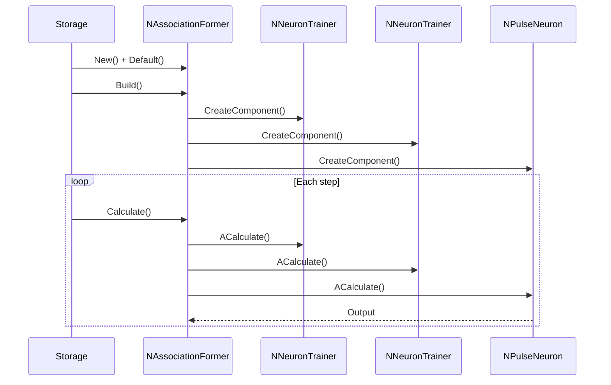
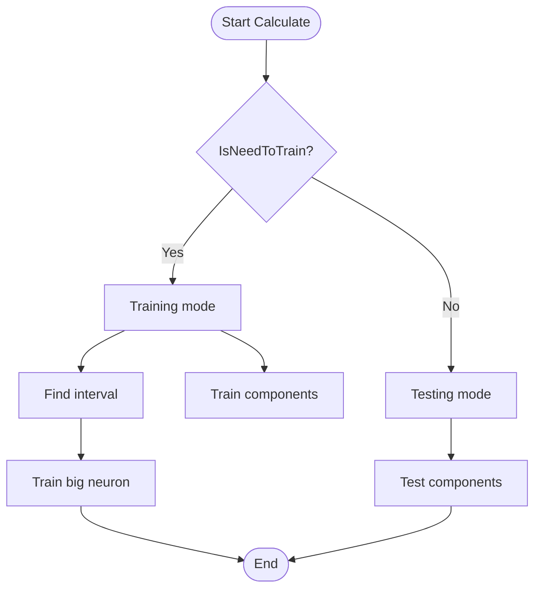
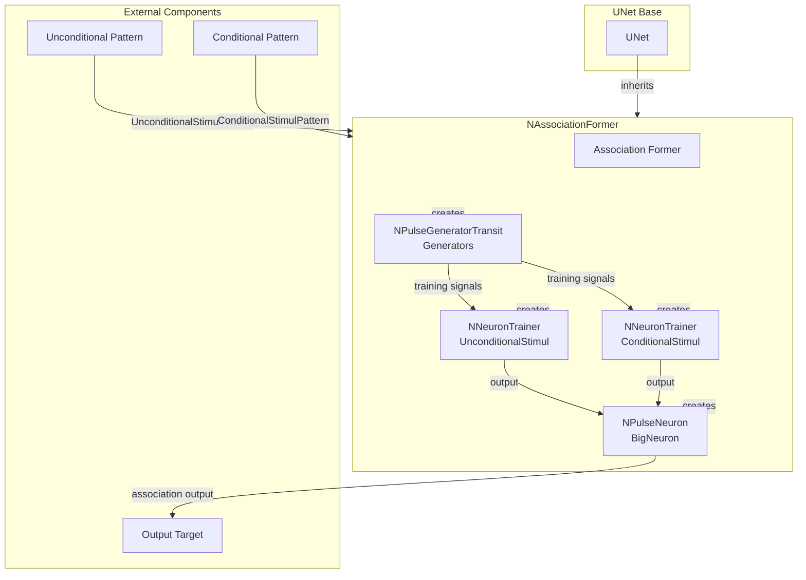

# NAssociationFormer — формирователь ассоциаций

## RU

### Назначение

**Класс**: `NAssociationFormer` — компонент для моделирования формирования ассоциативных связей.  
**Регистрация**: `NPulseLibrary.cpp` → `UploadClass("NAssociationFormer", ...)`.  
**Storage-инстансы**: `ClassName = "NAssociationFormer"` в `Bin/Configs/*/Model_*.xml`.

`NAssociationFormer` реализует компонент для формирования ассоциативных связей между двумя стимулами (условным и безусловным). Компонент создает группу нейронов для моделирования условного и безусловного раздражителей и формирует ассоциативную связь между ними при совместном предъявлении.

**Использование:** Моделирование формирования ассоциаций, обучение ассоциациям

### UML-диаграмма классов



**Иерархия наследования:**
- `UNet` — базовая сеть Rdk Framework
- `NAssociationFormer` — формирователь ассоциаций

**Связи:**
- Использует генераторы для стимулов
- Использует тренеры для обучения нейронов
- Использует нейроны для обработки стимулов

**Внутренняя структура:**
- **UnconditionalStimul** (`NNeuronTrainer`) — нейрон-тренер для безусловного раздражителя
- **ConditionalStimul** (`NNeuronTrainer`) — нейрон-тренер для условного раздражителя
- **LogicalAndNeuron** (`NNeuronTrainer`) — нейрон-тренер для логической операции И
- **BigNeuron** (`NPulseNeuron`) — большой выходной нейрон ассоциации
- **LogicalOrNeuron** (`NPulseNeuron`) — нейрон для логической операции ИЛИ
- **Generators** (`NPulseGeneratorTransit`) — генераторы импульсов для стимулов

### UML-диаграмма последовательности



**Жизненный цикл:**
1. **Инициализация**: Установка параметров формирователя ассоциаций
2. **Сборка структуры**: Создание нейронов-тренеров, большого нейрона, генераторов
3. **Режим обучения**: Совместное предъявление условного и безусловного раздражителей, поиск интервала между стимулами
4. **Режим проверки**: Проверка сформированной ассоциации при предъявлении условного раздражителя

### UML-диаграмма состояний

```mermaid
stateDiagram-v2
    [*] --> Uninitialized: New()
    Uninitialized --> Defaulted: Default()
    Defaulted --> Building: Build()
    Building --> CreatingTrainers: Создание нейронов-тренеров
    CreatingTrainers --> CreatingBigNeuron: Создание большого нейрона
    CreatingBigNeuron --> CreatingGenerators: Создание генераторов
    CreatingGenerators --> Linking: Создание связей
    Linking --> Built: Структура построена
    Built --> Ready: Ready = true
    Ready --> CheckMode{IsNeedToTrain?}
    CheckMode -->|Да| Training: Режим обучения
    CheckMode -->|Нет| Testing: Режим проверки
    Training --> TrainUnconditional: Обучение безусловного
    TrainUnconditional --> TrainConditional: Обучение условного
    TrainConditional --> FindInterval: Поиск интервала между стимулами
    FindInterval --> TrainBigNeuron: Обучение большого нейрона
    TrainBigNeuron --> CheckTrained{Обучение завершено?}
    CheckTrained -->|Нет| Training
    CheckTrained -->|Да| Ready: Обучение завершено
    Testing --> TestUnconditional: Проверка безусловного
    TestUnconditional --> TestConditional: Проверка условного
    TestConditional --> TestBigNeuron: Проверка большого нейрона
    TestBigNeuron --> Ready: Шаг завершен
    Ready --> Resetting: Reset()
    Resetting --> Ready: Состояния сброшены
```

**Состояния:**
- **Uninitialized** — создан, но не инициализирован
- **Defaulted** — параметры установлены по умолчанию
- **Building** — выполняется сборка структуры
- **CreatingTrainers** — создание нейронов-тренеров
- **CreatingBigNeuron** — создание большого нейрона
- **CreatingGenerators** — создание генераторов
- **Linking** — создание связей между компонентами
- **Built** — структура формирователя построена
- **Ready** — готов к выполнению расчетов
- **Training** — режим обучения
- **TrainUnconditional** — обучение безусловного раздражителя
- **TrainConditional** — обучение условного раздражителя
- **FindInterval** — поиск интервала между стимулами
- **TrainBigNeuron** — обучение большого нейрона
- **CheckTrained** — проверка завершения обучения
- **Testing** — режим проверки
- **TestUnconditional** — проверка безусловного раздражителя
- **TestConditional** — проверка условного раздражителя
- **TestBigNeuron** — проверка большого нейрона
- **Resetting** — выполняется сброс состояний

### UML-диаграмма активности



**Алгоритм расчета:**
1. Проверка режима работы: обучение или проверка
2. **Режим обучения**:
   - Обучение нейрона безусловного раздражителя
   - Обучение нейрона условного раздражителя
   - Поиск интервала между стимулами
   - Обучение большого нейрона (формирование ассоциативной связи)
3. **Режим проверки**:
   - Проверка срабатывания безусловного раздражителя
   - Проверка срабатывания условного раздражителя
   - Проверка срабатывания большого нейрона (ассоциации)
4. Генерация выходного сигнала

### UML-диаграмма компонентов



**Зависимости:**
- **Базовый класс**: `UNet`
- **Внутренние компоненты**: `NNeuronTrainer` (тренеры для раздражителей), `NPulseNeuron` (большой нейрон), `NPulseGeneratorTransit` (генераторы)
- **Внешние компоненты**: паттерны раздражителей (источники входных данных), выход ассоциации (получатель результатов)

### Свойства

#### Параметры (ptPubParameter)

- **`NumUnconditionalStimulDendrite`** (int) — количество входных дендритов для нейрона безусловного раздражителя. Значение по умолчанию: зависит от реализации

- **`NumConditionalStimulDendrite`** (int) — количество входных дендритов для нейрона условного раздражителя. Значение по умолчанию: зависит от реализации

- **`UnconditionalStimulPattern`** (MDMatrix<double>) — паттерн безусловного раздражителя. Значение по умолчанию: зависит от реализации

- **`ConditionalStimulPattern`** (MDMatrix<double>) — паттерн условного раздражителя. Значение по умолчанию: зависит от реализации

**Остальные параметры аналогичны `NConditionedReflex`.**

### Методы

- **`BuildStructure()`** → `bool` — строит структуру формирователя ассоциаций:
  1. Создает нейрон безусловного раздражителя
  2. Создает нейрон условного раздражителя
  3. Создает выходной нейрон (большой нейрон)
  4. Настраивает связи между нейронами

- **`ACalculate()`** → `bool` — выполняет расчет формирователя ассоциаций:
  1. Если `IsNeedToTrain = true`, выполняет обучение (совместное предъявление стимулов)
  2. Если `IsNeedToTrain = false`, проверяет сформированную ассоциацию

### Использование в конфигурациях

`NAssociationFormer` используется в экспериментах с формированием ассоциаций:

- **Формирование ассоциаций**: `Bin/Configs/!OldConfigs/*/Model_*.xml` (где требуется моделирование ассоциативных связей)

**Типичные значения параметров:**
- **StructureBuildMode**: 1 (классическая структура)
- **PulseGeneratorClassName**: "NPulseGeneratorTransit" (генератор импульсов)
- **NeuronTrainerClassName**: "NNeuronTrainer" (тренер нейронов)
- **NeuronClassName**: "NSPNeuronGen" (SP-нейрон с генератором)
- **SynapseClassName**: "NPSynapseBio" (биоинспирированный синапс)
- **BigNeuronSize**: 10 (размер большого нейрона)
- **IsNeedToTrain**: true (режим обучения), false (режим проверки)
- **NumUnconditionalStimulDendrite**: 1 (количество дендритов для безусловного раздражителя)
- **NumConditionalStimulDendrite**: 1 (количество дендритов для условного раздражителя)
- **LTZThreshold**: 0.0115 (порог LT-зоны)

## Источники

См. [Literature-References.md](../Literature-References.md): **1**, **6**, **8**, **9**, **10**.

### См. также

- [`NConditionedReflex`](NConditionedReflex.md) — условный рефлекс
- [`NNeuronTrainer`](NNeuronTrainer.md) — тренер нейронов
- [`NPulseNeuron`](NPulseNeuron.md) — импульсный нейрон
- [`NPulseGeneratorTransit`](NPulseGeneratorTransit.md) — генератор импульсов
- [Architecture.md](../Architecture.md) — архитектура библиотеки

---

## EN

### Purpose

**Class**: `NAssociationFormer` — component for modeling associative connection formation.  
**Registration**: `NPulseLibrary.cpp` → `UploadClass("NAssociationFormer", ...)`.  
**Instances**: `ClassName = "NAssociationFormer"` in `Bin/Configs/*/Model_*.xml`.

`NAssociationFormer` implements component for forming associative connections between two stimuli (conditional and unconditional). Component creates group of neurons for modeling conditional and unconditional stimuli and forms associative connection between them when presented together.

**Usage:** Modeling association formation, learning associations

### UML Class Diagram



### UML Sequence Diagram



### UML State Diagram

```mermaid
stateDiagram-v2
    [*] --> Uninitialized: New()
    Uninitialized --> Defaulted: Default()
    Defaulted --> Building: Build()
    Building --> Built: Structure built
    Built --> Ready: Ready = true
    Ready --> CheckMode{IsNeedToTrain?}
    CheckMode -->|Yes| Training: Training mode
    CheckMode -->|No| Testing: Testing mode
    Training --> FindInterval: Find interval
    FindInterval --> TrainBigNeuron: Train big neuron
    TrainBigNeuron --> Ready: Step completed
    Testing --> TestBigNeuron: Test big neuron
    TestBigNeuron --> Ready: Step completed
    Ready --> Resetting: Reset()
    Resetting --> Ready
```

### UML Activity Diagram



### UML Component Diagram



### Properties

- `StructureBuildMode` — режим пересборки структуры
- `PulseGeneratorClassName` — имя класса генератора импульсов
- `NeuronTrainerClassName` — имя класса тренера нейронов
- `NeuronClassName` — имя класса нейрона
- `SynapseClassName` — имя класса синапса
- `BigNeuronSize` — размер большого нейрона
- `IsNeedToTrain` — необходимость обучения
- `NumUnconditionalStimulDendrite` — количество дендритов для безусловного стимула
- `NumConditionalStimulDendrite` — количество дендритов для условного стимула
- `MaxDendriteLength` — максимальная длина дендрита
- `UnconditionalStimulPattern` — паттерн безусловного стимула
- `ConditionalStimulPattern` — паттерн условного стимула
- `LTZThreshold` — порог LT-зоны

### Methods

- `ADefault()` — установка параметров по умолчанию
- `ABuild()` — сборка структуры формирователя ассоциаций
- `ACalculate()` — выполнение шага обучения или проверки
- `BuildStructure()` — построение структуры нейронов и тренеров

### Usage in configurations

`NAssociationFormer` is used for modeling association formation:

- **Association formation**: `Bin/Configs/*/Model_*.xml` (where association formation is required)
- **Association learning**: experiments with learning associations between stimuli
- **Association training**: training associations on conditional and unconditional stimuli

**Features:**
- Automatic structure building: creates neurons and trainers for stimuli
- Training mode: trains neurons on conditional and unconditional stimuli
- Testing mode: tests trained association responses
- Interval finding: finds intervals between stimuli for association formation
- Flexible configuration: supports various neuron and synapse types

**Typical parameter values:**
- **NeuronClassName**: "NSPNeuronGen" (small pulse neuron)
- **NeuronTrainerClassName**: "NNeuronTrainer" (neuron trainer)
- **PulseGeneratorClassName**: "NPulseGeneratorTransit" (transit pulse generator)
- **SynapseClassName**: "NPSynapseBio" (bio synapse)

### References

See [Literature-References.md](../Literature-References.md): **1**, **6**, **8**, **9**, **10**.

### See Also

- [`NConditionedReflex`](NConditionedReflex.md) — conditioned reflex
- [`NNeuronTrainer`](NNeuronTrainer.md) — neuron trainer
- [`NPulseNeuron`](NPulseNeuron.md) — spiking neuron
- [`NPulseGeneratorTransit`](NPulseGeneratorTransit.md) — pulse generator
- [Architecture.md](../Architecture.md) — library architecture
