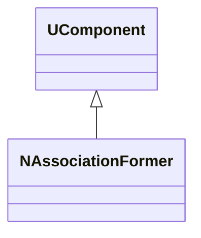
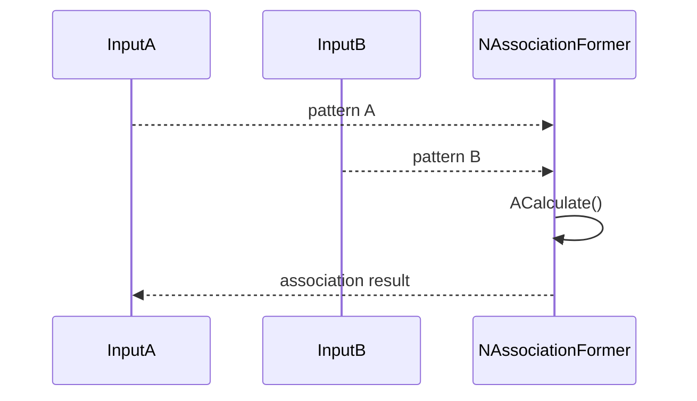
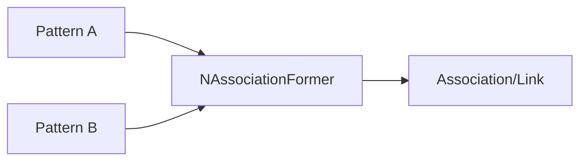
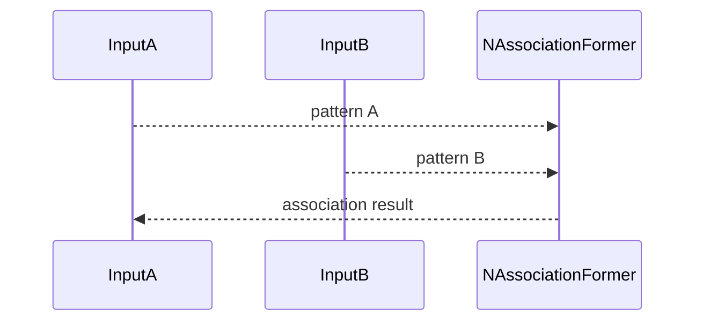
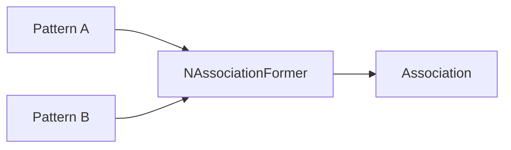

## NAssociationFormer — формирование ассоциаций (Nmsdk-PulseLib)

**Класс**: `NAssociationFormer` — создает/обновляет ассоциативные связи на основе активности.  
**Регистрация**: `NPulseLibrary.cpp` → `UploadClass("NAssociationFormer", ...)`.  
**Storage**: `ClassName = "NAssociationFormer"`.

### Lifecycle
- **ADefault**: параметры формирования ассоциаций.
- **ABuild**: связывание входных паттернов/активности.
- **AReset**: сброс ассоциаций.
- **ACalculate**: обновление/вывод ассоциативных результатов.

### I/O
- Вход: паттерны/активность (векторы/спайки).
- Выход: ассоциативный отклик/связи.



Пояснение: диаграмма классов показывает место компонента в иерархии и ключевые связи.



Пояснение: диаграмма последовательности показывает типовой сценарий взаимодействия и порядок вызовов.



Пояснение: блок-схема показывает поток данных/сигналов (входы → компонент → выходы).

### Config snippet

```ini
[Component]
ClassName = NAssociationFormer
Name = Assoc1
```

---

## NAssociationFormer — association former (EN)

Forms associations between input patterns/activities and outputs association signals.


Description: this class diagram shows the component position in the type hierarchy and key relations.



Description: this sequence diagram shows a typical runtime interaction and call order.



Description: this flowchart shows the data/signal flow (inputs → component → outputs).
