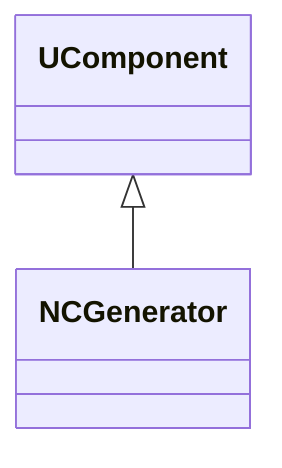
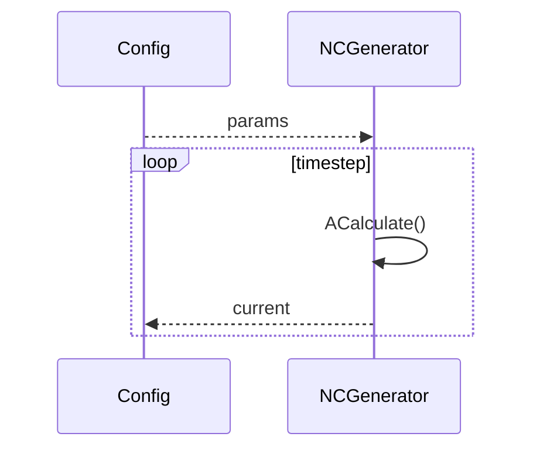
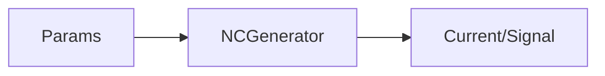
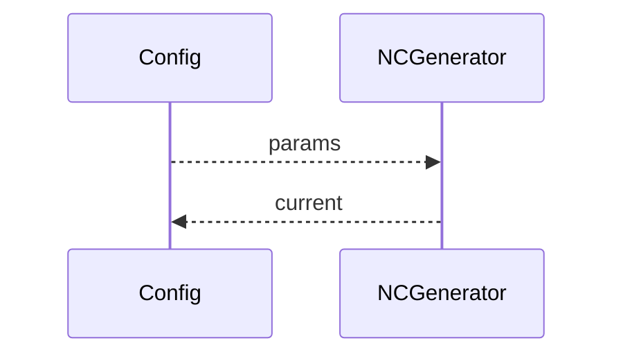

## NCGenerator — генератор токов (Nmsdk-PulseLib)

**Класс**: `NCGenerator` — генерирует токи/сигналы для нейросети.  
**Регистрация**: `UploadClass("NCGenerator", ...)` в `NPulseLibrary.cpp`.  
**Storage**: `ClassName = "NCGenerator"`.

### Lifecycle
- **ADefault**: параметры генерации (амплитуда/частота/форма).
- **ABuild**: подготовка выходов/привязка к потребителям.
- **AReset**: сброс генератора.
- **ACalculate**: выдача следующего значения.

### I/O
- Вход: (опционально) управление параметрами.
- Выход: ток/сигнал (скаляр/вектор).



Пояснение: диаграмма классов показывает место компонента в иерархии и ключевые связи.



Пояснение: диаграмма последовательности показывает типовой сценарий взаимодействия и порядок вызовов.



Пояснение: блок-схема показывает поток данных/сигналов (входы → компонент → выходы).

### Config snippet

```ini
[Component]
ClassName = NCGenerator
Name = CGen1
```

---

## NCGenerator — current generator (EN)

Generates current/signal according to configured parameters.


Description: this class diagram shows the component position in the type hierarchy and key relations.



Description: this sequence diagram shows a typical runtime interaction and call order.


Description: this flowchart shows the data/signal flow (inputs → component → outputs).
