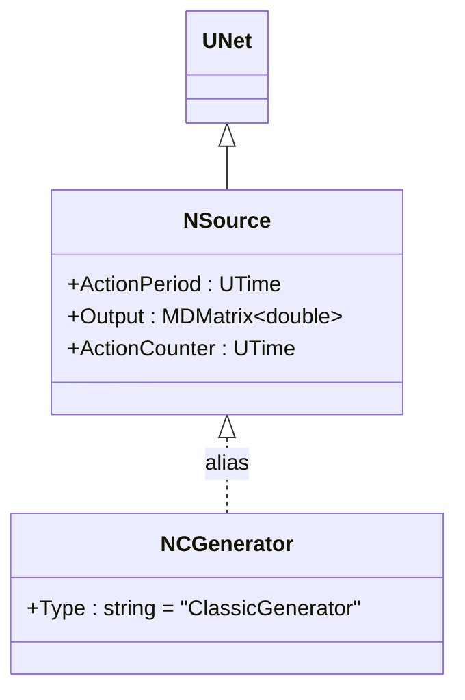
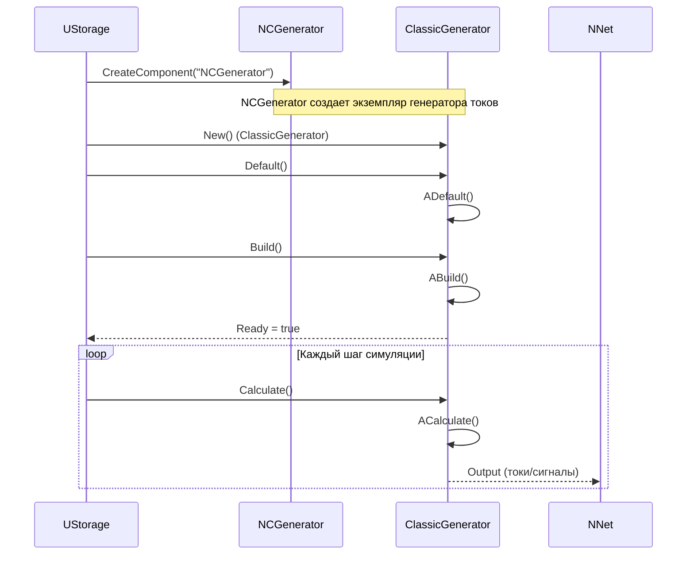
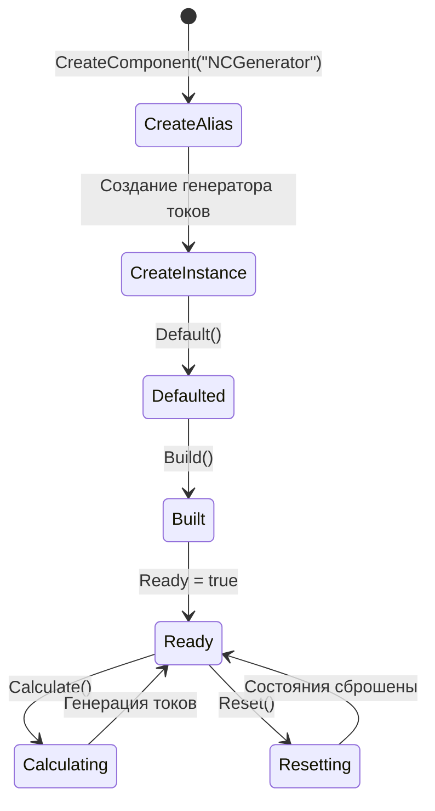
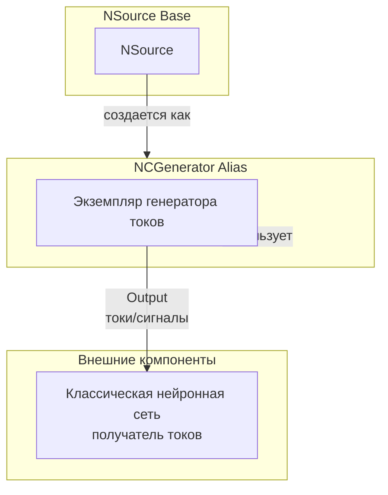
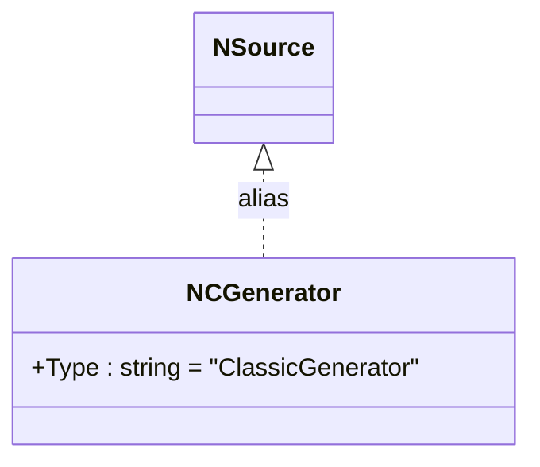
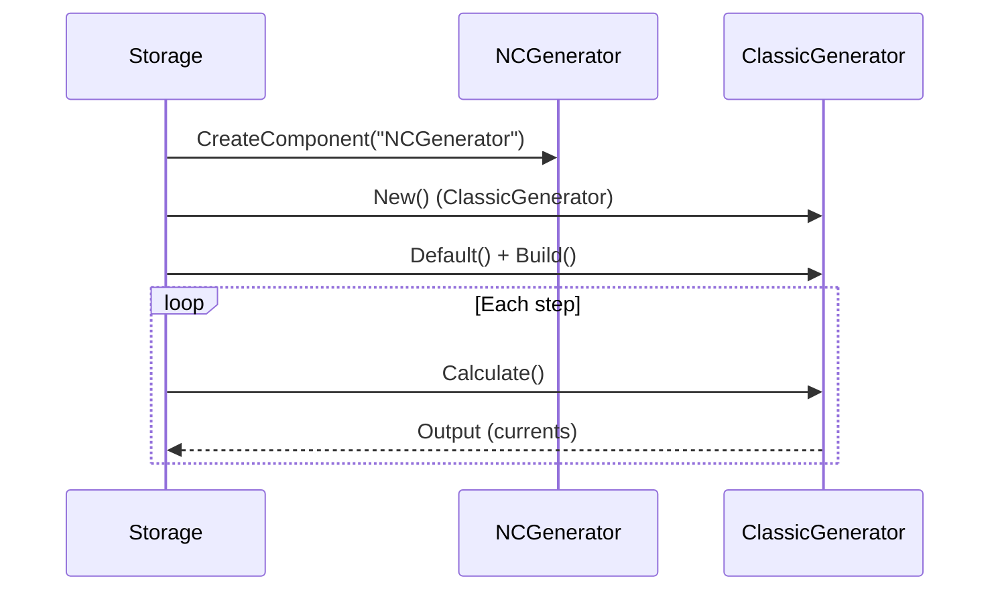
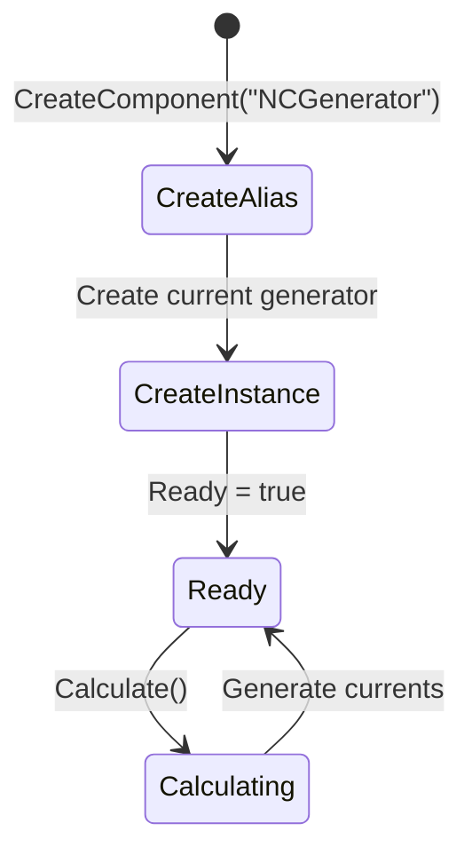
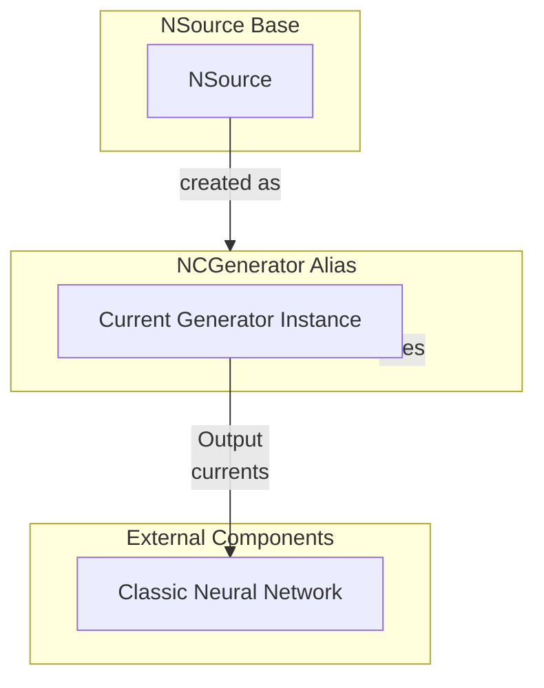

# NCGenerator — генератор токов (алиас)

## RU

### Назначение

**Класс**: `NCGenerator` — алиас для класса генератора токов (классический генератор).  
**Регистрация**: `NPulseLibrary.cpp` → `UploadClass("NCGenerator", ...)`.  
**Storage-инстансы**: `ClassName = "NCGenerator"` в `Bin/Configs/*/Model_*.xml`.

`NCGenerator` является алиасом (синонимом) для класса генератора токов. При создании компонента с `ClassName = "NCGenerator"` создается экземпляр генератора токов с параметрами по умолчанию.

Генератор токов создает непрерывные токи/сигналы для классических (не импульсных) нейронных сетей.

**Использование:** Упрощенное именование при конфигурации, генерация токов для классических моделей

### UML-диаграмма классов



**Иерархия наследования:**
- `UNet` — базовая сеть Rdk Framework
- `NSource` — базовый источник сигналов
- `NCGenerator` — алиас для генератора токов

### UML-диаграмма последовательности



**Жизненный цикл:**
1. **Создание**: При создании компонента с `ClassName = "NCGenerator"` фактически создается экземпляр генератора токов
2. **Инициализация**: Используются параметры по умолчанию генератора токов
3. **Использование**: Все методы и свойства идентичны генератору токов

### UML-диаграмма состояний



**Состояния:**
- **CreateAlias** — создание компонента через алиас
- **CreateInstance** — создание фактического экземпляра генератора токов
- **Defaulted** — параметры установлены по умолчанию
- **Built** — структура генератора построена
- **Ready** — готов к выполнению расчетов
- **Calculating** — выполняется расчет генератора (генерация токов)
- **Resetting** — выполняется сброс состояний

### UML-диаграмма активности

```mermaid
flowchart TD
    Start([Create NCGenerator]) --> CreateInstance[Создать генератор токов]
    CreateInstance --> UseDefault[Использовать параметры по умолчанию]
    UseDefault --> Build[Build()]
    Build --> Ready[Ready = true]
    Ready --> Calculate[Calculate()]
    Calculate --> GenerateCurrents[Генерация токов/сигналов]
    GenerateCurrents --> End([End])
```

### UML-диаграмма компонентов



**Зависимости:**
- **Базовый класс**: `NSource` (алиас создает экземпляр генератора токов, наследующегося от NSource)
- **Внешние компоненты**: классическая нейронная сеть (получатель токов/сигналов)

### Свойства

`NCGenerator` использует все свойства базового класса `NSource` с параметрами по умолчанию генератора токов.

**Наследуемые свойства от NSource:**
- `ActionPeriod` (UTime) — период действия
- `Output` (MDMatrix<double>) — выходной сигнал (токи)
- `ActionCounter` (UTime) — счетчик действия

### Методы

`NCGenerator` использует все методы базового класса `NSource`.

### Примеры использования

#### Пример 1: Создание генератора токов через алиас в коде C++

```cpp
// Создание генератора токов через алиас
auto generator = storage->CreateComponent("NCGenerator");
generator->SetName("CGen");

// Инициализация (использует параметры по умолчанию)
generator->Default();

// Использование
generator->Build();

// Генерация токов для классической нейронной сети
for (int step = 0; step < 1000; step++) {
    generator->Calculate();
    // Output содержит токи/сигналы для классической сети
}
```

#### Пример 2: Конфигурация XML

```xml
<CGen1 Class="NCGenerator">
    <Parameters>
        <!-- Параметры генератора токов -->
    </Parameters>
</CGen1>
```

### Использование в конфигурациях

`NCGenerator` используется в экспериментах с классическими (не импульсными) нейронными сетями:

- **Классические сети**: `Bin/Configs/!OldConfigs/*/Model_*.xml` (где используются классические модели нейронов)
- **Генерация токов**: создание входных токов для классических нейронных моделей

**Типичные значения параметров:**
- Параметры зависят от конкретной реализации генератора токов

**Особенности:**
- Упрощенное именование: алиас позволяет использовать более короткое имя в конфигурациях
- Классические модели: предназначен для генерации токов для классических (не импульсных) нейронных сетей

### См. также

- [`NSource`](NSource.md) — базовый источник сигналов
- [`NPulseGenerator`](NPulseGenerator.md) — генератор импульсов
- [`NPGenerator`](NPGenerator.md) — алиас для NPulseGenerator
- [Architecture.md](../Architecture.md) — архитектура библиотеки

---

## EN

### Purpose

**Class**: `NCGenerator` — alias for current generator class.  
**Registration**: `NPulseLibrary.cpp` → `UploadClass("NCGenerator", ...)`.  
**Instances**: `ClassName = "NCGenerator"` in `Bin/Configs/*/Model_*.xml`.

`NCGenerator` is an alias (synonym) for current generator class. When creating a component with `ClassName = "NCGenerator"`, an instance of current generator with default parameters is created.

Current generator creates continuous currents/signals for classic (non-spiking) neural networks.

**Usage:** Simplified naming in configurations, current generation for classic models

### UML Class Diagram



### UML Sequence Diagram



### UML State Diagram



### UML Activity Diagram

```mermaid
flowchart TD
    Start([Create NCGenerator]) --> CreateInstance[Create current generator]
    CreateInstance --> UseDefault[Use default parameters]
    UseDefault --> Build[Build()]
    Build --> Ready[Ready]
    Ready --> Calculate[Calculate()]
    Calculate --> GenerateCurrents[Generate currents]
    GenerateCurrents --> End([End])
```

### UML Component Diagram



### Properties

`NCGenerator` uses all properties of base class `NSource` with default parameters of current generator.

### Methods

`NCGenerator` uses all methods of base class `NSource`.

### Usage in configurations

`NCGenerator` is used in classic (non-spiking) neural network experiments:

- **Classic networks**: `Bin/Configs/!OldConfigs/*/Model_*.xml` (where classic neuron models are used)
- **Current generation**: creating input currents for classic neural models

### See Also

- [`NSource`](NSource.md) — base signal source
- [`NPulseGenerator`](NPulseGenerator.md) — pulse generator
- [`NPGenerator`](NPGenerator.md) — alias for NPulseGenerator
- [Architecture.md](../Architecture.md) — library architecture
