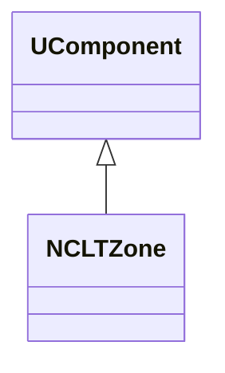
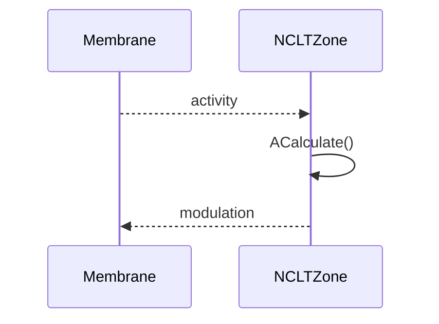
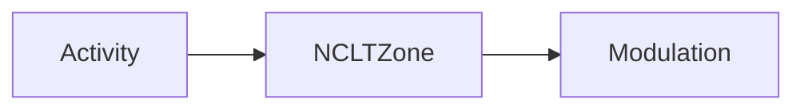
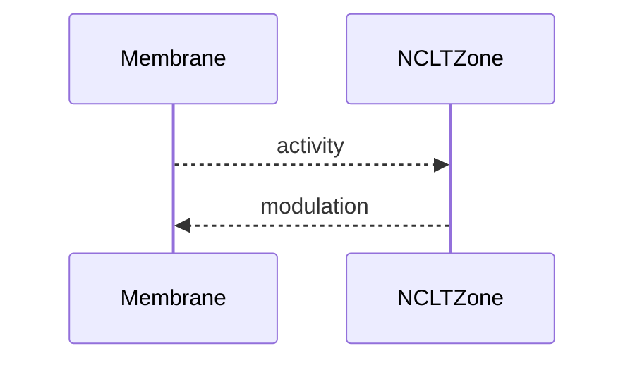

## NCLTZone — LT-зона (классическая) (Nmsdk-PulseLib)

**Класс**: `NCLTZone` — реализация LT-зоны (долговременная пластичность) для классических нейронов/каналов.  
**Регистрация**: `NPulseLibrary.cpp` → `UploadClass("NCLTZone", ...)`.  
**Storage**: `ClassName = "NCLTZone"`.

### Lifecycle
- **ADefault**: параметры LT (пороги/усиление).
- **ABuild**: подключение к мембранам/каналам.
- **AReset**: сброс состояния LT.
- **ACalculate**: обновление LT-состояния по активности.

### I/O
- Вход: активность/потенциалы.
- Выход: модифицированные сигналы/коэффициенты.



Пояснение: диаграмма классов показывает место компонента в иерархии и ключевые связи.



Пояснение: диаграмма последовательности показывает типовой сценарий взаимодействия и порядок вызовов.



Пояснение: блок-схема показывает поток данных/сигналов (входы → компонент → выходы).

### Config snippet

```ini
[Component]
ClassName = NCLTZone
Name = CLT1
```

---

## NCLTZone — long-term zone (EN)

Long-term plasticity zone for classic neurons/channels.


Description: this class diagram shows the component position in the type hierarchy and key relations.



Description: this sequence diagram shows a typical runtime interaction and call order.


Description: this flowchart shows the data/signal flow (inputs → component → outputs).
