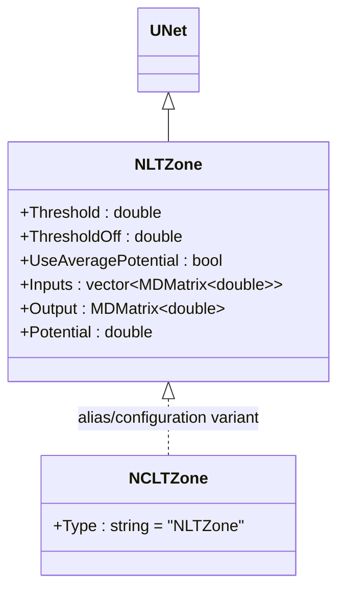
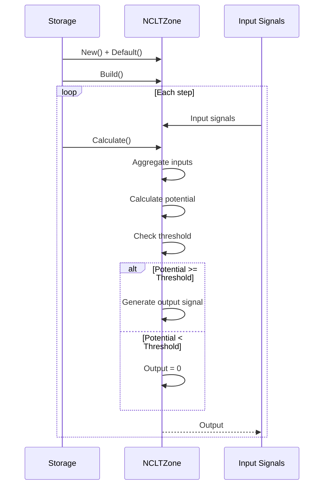
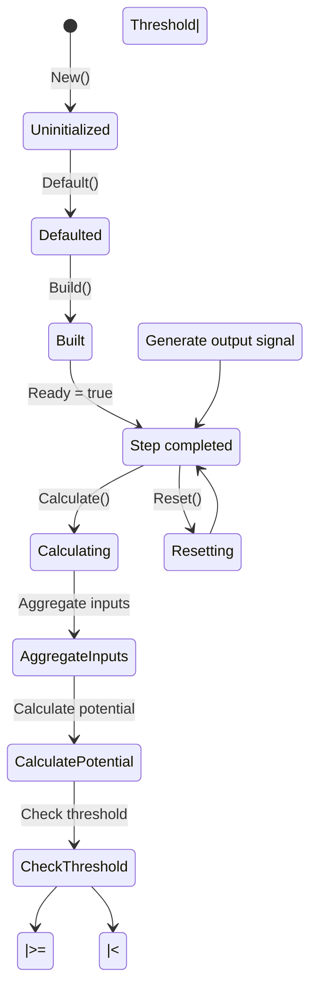
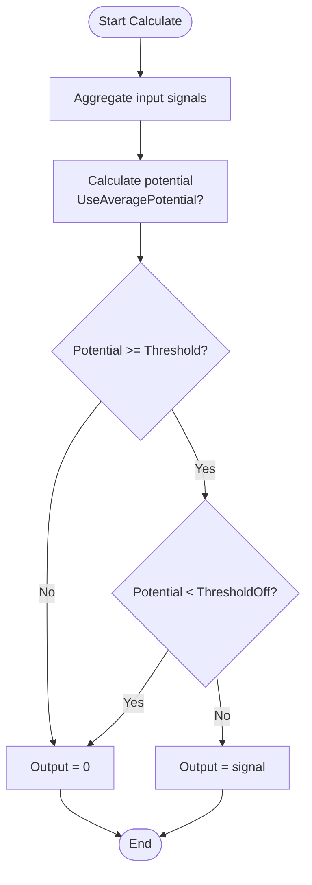
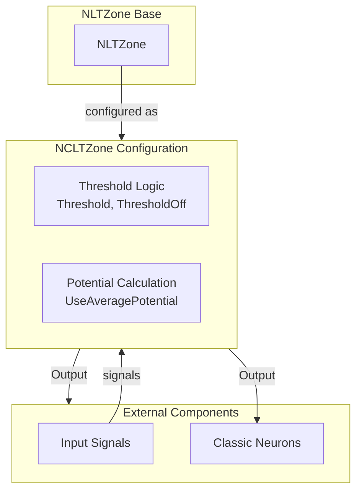

# NCLTZone — классическая LT-зона

## RU

### Назначение

**Класс**: `NCLTZone` — классическая LT-зона (долговременная пластичность) для классических нейронов/каналов.  
**Префикс**: `NC` — **C**ontinuous (непрерывный, классический), компонент с непрерывными входами/выходами; `LT` — **L**ow **T**hreshold (низкопороговая зона).  
**Регистрация**: `NPulseLibrary.cpp` → `UploadClass("NCLTZone", ...)`.  
**Storage-инстансы**: `ClassName = "NCLTZone"` в `Bin/Configs/*/Model_*.xml`.

`NCLTZone` является конфигурационным вариантом или алиасом базового класса `NLTZone` для классических (не импульсных) нейронов и каналов. При создании компонента с `ClassName = "NCLTZone"` создается экземпляр класса `NLTZone` с параметрами, оптимизированными для классических моделей.

`NLTZone` реализует базовую LT-зону с пороговыми значениями для определения момента генерации сигнала.

**Использование:** LT-зона для классических нейронов, долговременная пластичность

### UML-диаграмма классов



**Иерархия наследования:**
- `UNet` — базовая сеть Rdk Framework
- `NLTZone` — базовая LT-зона
- `NCLTZone` — алиас/конфигурационный вариант для классических моделей

### Свойства

`NCLTZone` использует все свойства базового класса `NLTZone` с параметрами по умолчанию:

- **`Threshold`** (double) — порог генерации сигнала. Значение по умолчанию: 0.0
- **`ThresholdOff`** (double) — порог завершения генерации сигнала. Значение по умолчанию: 0.0
- **`UseAveragePotential`** (bool) — использовать усреднение потенциалов. Значение по умолчанию: `true`
- **`Inputs`** (vector<MDMatrix<double>>) — вектор входных сигналов
- **`Output`** (MDMatrix<double>) — выходной сигнал
- **`Potential`** (double) — текущий потенциал LT-зоны

### Методы

`NCLTZone` использует все методы базового класса `NLTZone`.

### Примеры использования

#### Пример 1: Создание LT-зоны в коде C++

```cpp
// Создание классической LT-зоны
auto ltZone = storage->CreateComponent("NCLTZone");
ltZone->SetName("CLTZone");

// Инициализация (использует параметры по умолчанию)
ltZone->Default();

// Использование
ltZone->Build();
```

## Источники

См. [Literature-References.md](../Literature-References.md): **[A]**, **4**, **25**, **29**.

### См. также

- [`NLTZone`](NPLTZone.md) — базовая LT-зона (базовый класс)
- [`NPLTZone`](NPLTZone.md) — импульсная LT-зона
- [`NPulseLTZoneCommon`](NPulseLTZoneCommon.md) — общая импульсная LT-зона
- [Architecture.md](../Architecture.md) — архитектура библиотеки

---

## EN

### Purpose

**Class**: `NCLTZone` — classic LT-zone (long-term plasticity) for classic neurons/channels.  
**Registration**: `NPulseLibrary.cpp` → `UploadClass("NCLTZone", ...)`.  
**Instances**: `ClassName = "NCLTZone"` in `Bin/Configs/*/Model_*.xml`.

`NCLTZone` is a configuration variant or alias of the base class `NLTZone` for classic (non-spiking) neurons and channels. When creating a component with `ClassName = "NCLTZone"`, an instance of `NLTZone` with parameters optimized for classic models is created.

**Usage:** LT-zone for classic neurons, long-term plasticity

### UML Class Diagram


### UML Sequence Diagram



### UML State Diagram



### UML Activity Diagram



### UML Component Diagram



### Properties

`NCLTZone` uses all properties of base class `NLTZone` with default parameters:

- **`Threshold`** (double) — signal generation threshold. Default value: 0.0
- **`ThresholdOff`** (double) — signal termination threshold. Default value: 0.0
- **`UseAveragePotential`** (bool) — use potential averaging. Default value: `true`
- **`Inputs`** (vector<MDMatrix<double>>) — vector of input signals
- **`Output`** (MDMatrix<double>) — output signal
- **`Potential`** (double) — current LT-zone potential

### Methods

`NCLTZone` uses all methods of base class `NLTZone`.

### Usage in configurations

`NCLTZone` is used in classic neuron experiments:

- **Classic neurons**: `Bin/Configs/!OldConfigs/*/Model_*.xml` (where classic LT-zones are required)

**Typical parameter values:**
- **Threshold**: 0.0 (default threshold for signal generation)
- **ThresholdOff**: 0.0 (default threshold for signal termination)
- **UseAveragePotential**: true (use potential averaging)

**Features:**
- Classic model: optimized for classic (non-spiking) neurons
- Threshold logic: uses threshold values for signal generation
- Potential averaging: can use averaged potential for more stable behavior

### References

See [Literature-References.md](../Literature-References.md): **[A]**, **4**, **25**, **29**.

### See Also

- [`NLTZone`](NPLTZone.md) — base LT-zone (base class)
- [`NPLTZone`](NPLTZone.md) — spiking LT-zone
- [`NPulseLTZoneCommon`](NPulseLTZoneCommon.md) — common spiking LT-zone
- [Architecture.md](../Architecture.md) — library architecture
