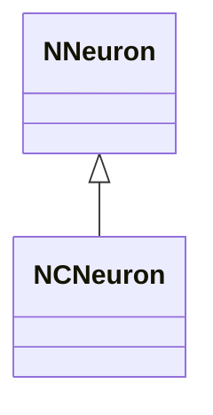
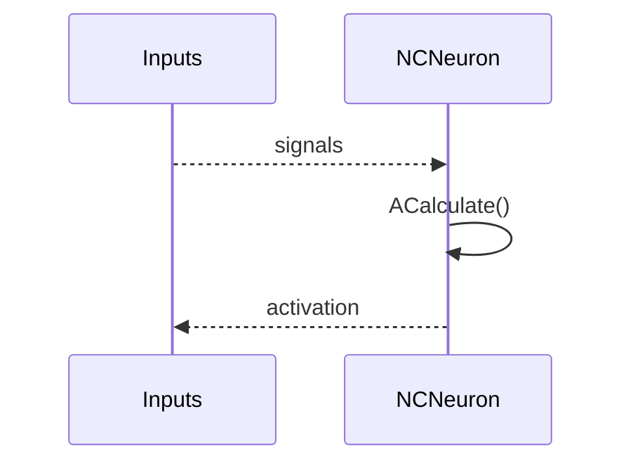
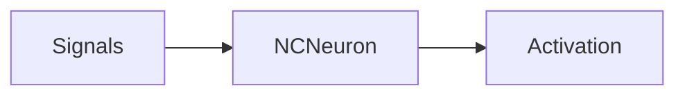
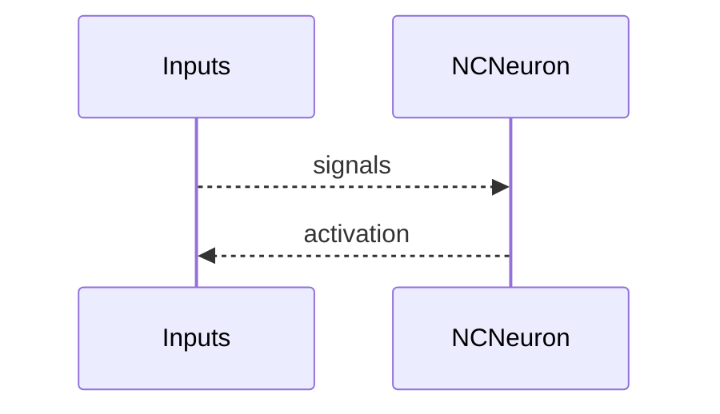

## NCNeuron — классический нейрон (Nmsdk-PulseLib)

**Класс**: `NCNeuron` — классический нейрон (непульсовый), вариант базовой модели.  
**Регистрация**: `NPulseLibrary.cpp` → `UploadClass("NCNeuron", ...)`.  
**Storage**: `ClassName = "NCNeuron"`.

### Lifecycle
- **ADefault**: параметры мембраны/активации.
- **ABuild**: подключение входов/выходов.
- **AReset**: сброс состояния.
- **ACalculate**: вычисление активации/выхода.

### I/O
- Вход: токи/сигналы.
- Выход: активация/потенциал (классический формат).



Пояснение: диаграмма классов показывает место компонента в иерархии и ключевые связи.



Пояснение: диаграмма последовательности показывает типовой сценарий взаимодействия и порядок вызовов.



Пояснение: блок-схема показывает поток данных/сигналов (входы → компонент → выходы).

### Config snippet

```ini
[Component]
ClassName = NCNeuron
Name = CNeuron1
```

---

## NCNeuron — classic neuron (EN)

Non-spiking/classic neuron variant.


Description: this class diagram shows the component position in the type hierarchy and key relations.



Description: this sequence diagram shows a typical runtime interaction and call order.


Description: this flowchart shows the data/signal flow (inputs → component → outputs).
