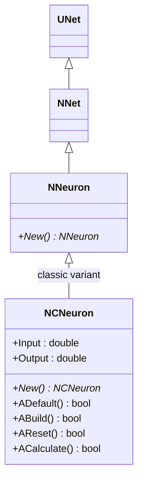
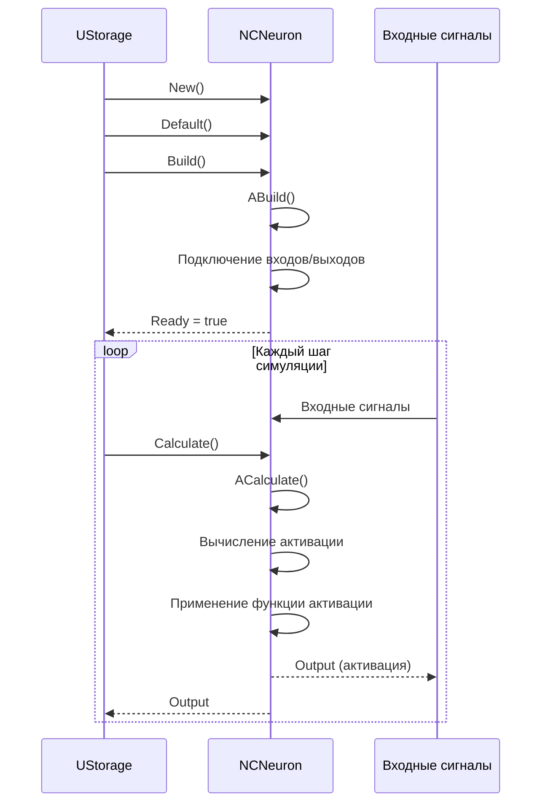
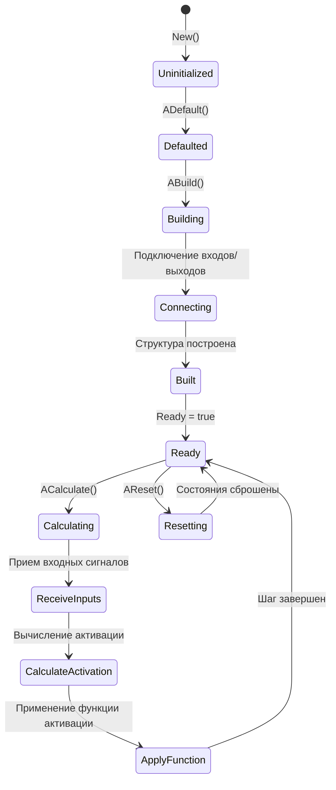
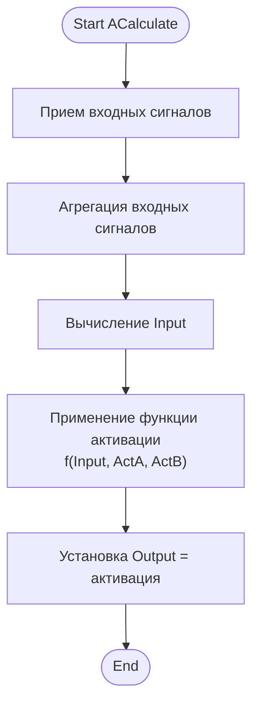
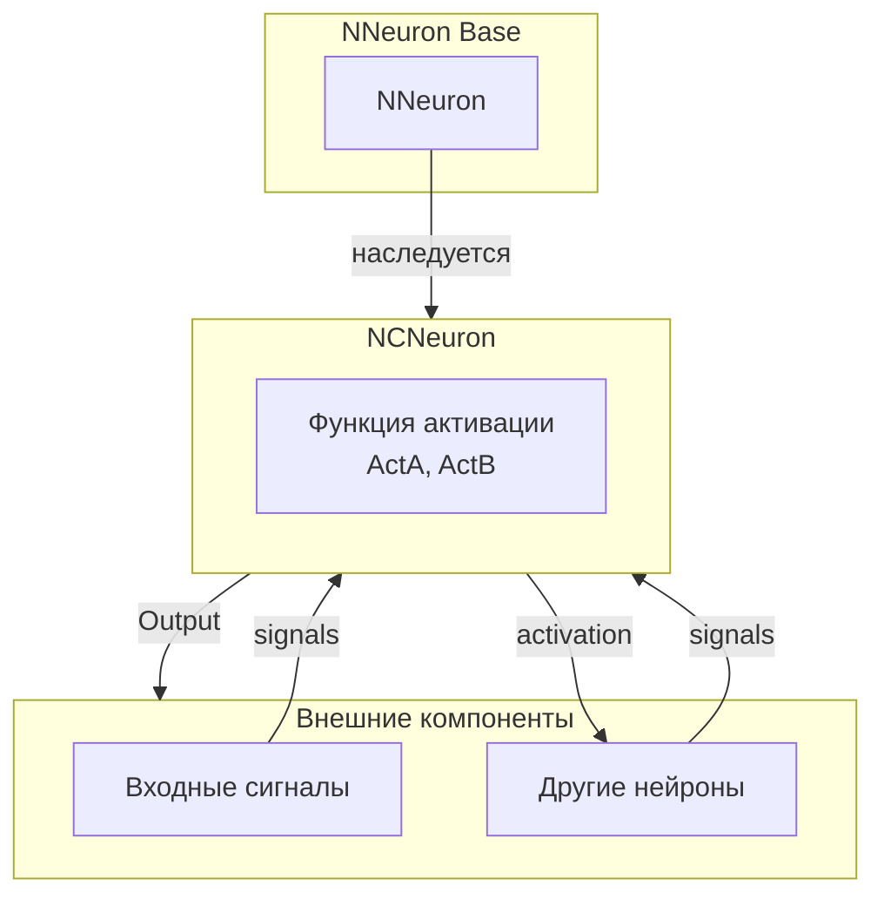
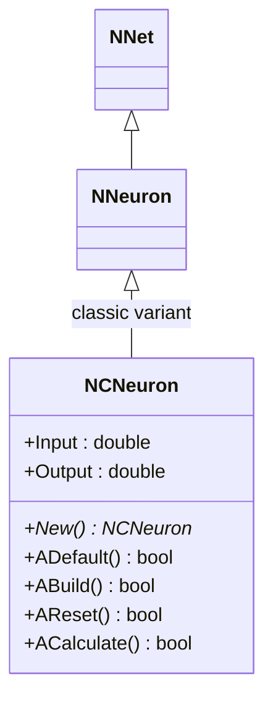
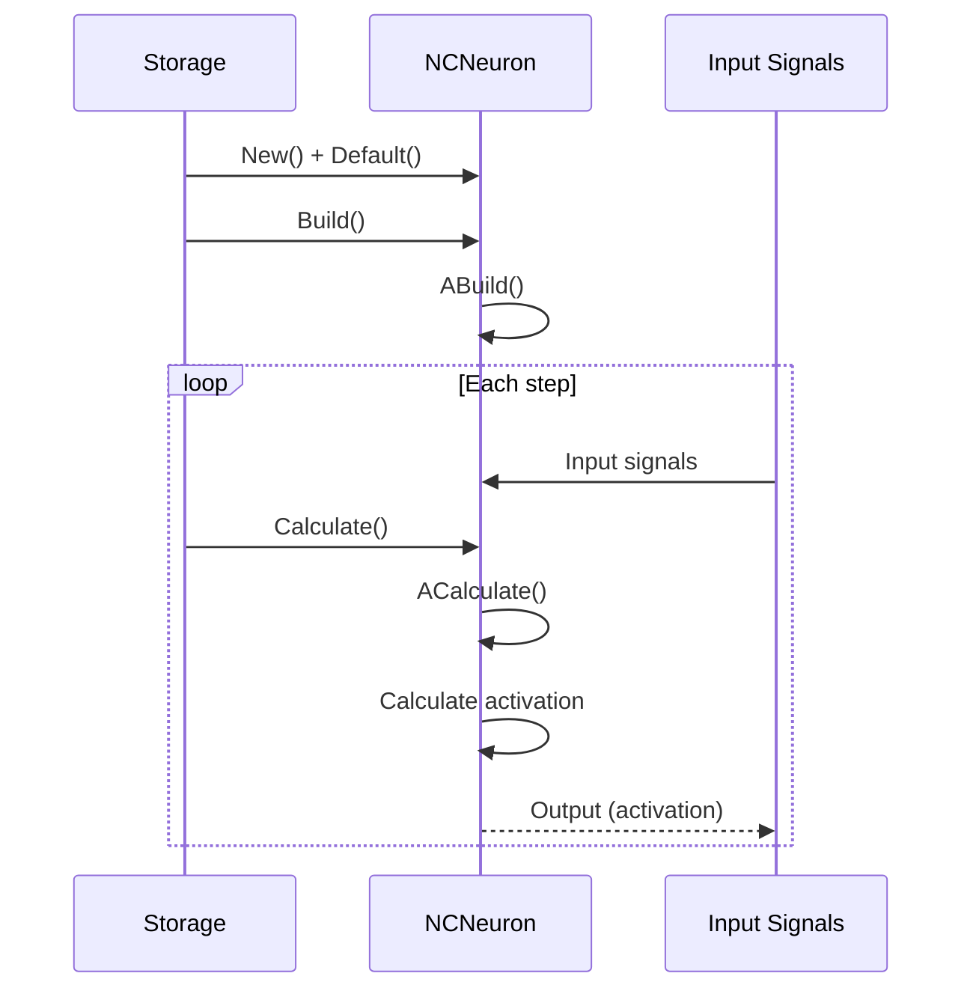
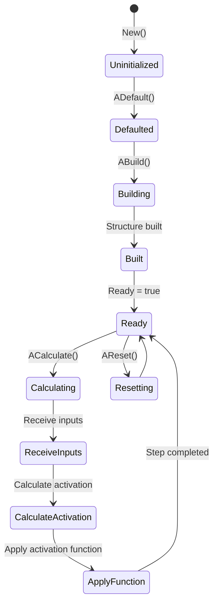
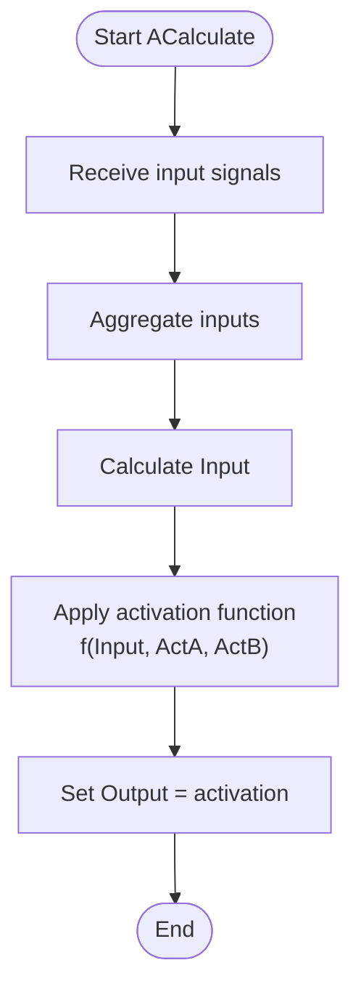
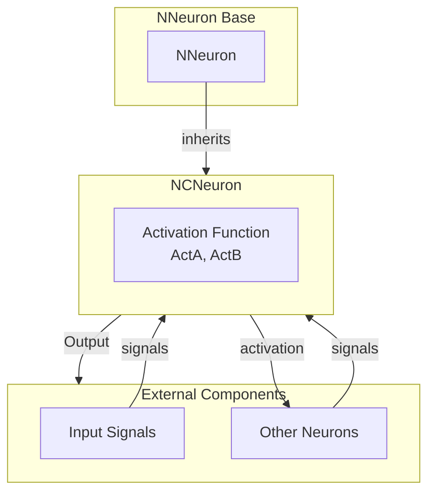

# NCNeuron — классический нейрон

## RU

### Назначение

**Класс**: `NCNeuron` — классический нейрон (непульсовый), вариант базовой модели для классических (не импульсных) нейронных сетей.  
**Префикс**: `NC` — **C**ontinuous (непрерывный, классический), компонент с непрерывными входами/выходами.  
**Регистрация**: `NPulseLibrary.cpp` → `UploadClass("NCNeuron", ...)`.  
**Storage-инстансы**: `ClassName = "NCNeuron"` в `Bin/Configs/*/Model_*.xml`.

`NCNeuron` является классическим (не импульсным) нейроном, который работает с непрерывными сигналами активации вместо дискретных спайков. Наследуется от `NNeuron` и реализует классическую модель нейрона с функцией активации.

В отличие от импульсных нейронов (`NPulseNeuron*`), классические нейроны выдают непрерывные значения активации, что делает их подходящими для классических нейронных сетей и непрерывных моделей.

**Использование:** Классические нейронные сети, непрерывные модели, непульсовые вычисления

### UML-диаграмма классов



**Иерархия наследования:**
- `UNet` (Rdk) — базовый класс для сетей компонентов
- `NNet` — базовая сеть
- `NNeuron` — базовый нейрон
- `NCNeuron` — классический нейрон

**Особенности:**
- Непрерывные сигналы: работает с непрерывными значениями активации
- Функция активации: использует параметры активации (ActA, ActB)
- Классическая модель: подходит для классических нейронных сетей

### UML-диаграмма последовательности



**Жизненный цикл:**
1. **Инициализация**: `ADefault()` — установка параметров мембраны/активации
2. **Сборка**: `ABuild()` — подключение входов/выходов
3. **Расчет**: `ACalculate()` — вычисление активации/выхода
4. **Сброс**: `AReset()` — сброс состояния

### UML-диаграмма состояний



**Состояния:**
- **Uninitialized** — создан, но не инициализирован
- **Defaulted** — параметры установлены по умолчанию
- **Building** — выполняется сборка структуры
- **Connecting** — подключение входов/выходов
- **Built** — структура нейрона построена
- **Ready** — готов к выполнению расчетов
- **Calculating** — выполняется расчет нейрона
- **ReceiveInputs** — прием входных сигналов
- **CalculateActivation** — вычисление активации
- **ApplyFunction** — применение функции активации
- **Resetting** — выполняется сброс состояний

### UML-диаграмма активности



**Алгоритм расчета:**
1. Прием входных сигналов
2. Агрегация входных сигналов в единый входной сигнал
3. Вычисление функции активации с параметрами ActA и ActB
4. Установка выходного сигнала (активация)

### UML-диаграмма компонентов



**Зависимости:**
- **Базовый класс**: `NNeuron` (классический вариант)
- **Внешние компоненты**: входные сигналы, другие нейроны

### Свойства

**Параметры функции активации:**
- `ActA` (double) — параметр A функции активации
- `ActB` (double) — параметр B функции активации

**Входы/выходы:**
- `Input` (double) — входной сигнал (агрегированный)
- `Output` (double) — выходной сигнал (активация)

### Методы

#### Публичные методы

- **`New()`** → `NCNeuron*` — создает новый экземпляр класса

#### Защищенные методы

- **`ADefault()`** → `bool` — инициализирует параметры мембраны/активации
- **`ABuild()`** → `bool` — строит структуру нейрона, подключает входы/выходы
- **`AReset()`** → `bool` — сбрасывает состояния нейрона
- **`ACalculate()`** → `bool` — вычисляет активацию/выход на одном шаге

### Примеры использования

#### Пример 1: Создание классического нейрона в коде C++

```cpp
// Создание классического нейрона
auto neuron = storage->CreateComponent("NCNeuron");
neuron->SetName("CNeuron1");

// Инициализация
neuron->Default();

// Настройка параметров активации (если доступны)
// neuron->ActA = 1.0;
// neuron->ActB = 0.0;

// Сборка
neuron->Build();

// Использование
for (int step = 0; step < 1000; step++) {
    neuron->Calculate();
    double activation = neuron->Output(0, 0);
    // Использование активации
}
```

#### Пример 2: Конфигурация XML

```xml
<CNeuron1 Class="NCNeuron">
    <Parameters>
        <!-- Параметры активации -->
    </Parameters>
</CNeuron1>
```

### Использование в конфигурациях

`NCNeuron` используется в классических нейронных сетях:

- **Классические сети**: `Bin/Configs/!OldConfigs/*/Model_*.xml` (где используются классические нейроны)

**Особенности:**
- Непрерывные сигналы: выдает непрерывные значения активации
- Классическая модель: подходит для классических нейронных сетей
- Функция активации: использует параметры ActA и ActB для вычисления активации

## Источники

См. [Literature-References.md](../Literature-References.md): **[A]**, **4**, **25**, **29**.

### См. также

- [`NNeuron`](NNeuron.md) — базовый нейрон
- [`NPulseNeuron`](NPulseNeuron.md) — импульсный нейрон
- [`NNet`](NNet.md) — базовая сеть
- [Architecture.md](../Architecture.md) — архитектура библиотеки

---

## EN

### Purpose

**Class**: `NCNeuron` — classic neuron (non-spiking), base model variant for classic (non-spiking) neural networks.  
**Registration**: `NPulseLibrary.cpp` → `UploadClass("NCNeuron", ...)`.  
**Instances**: `ClassName = "NCNeuron"` in `Bin/Configs/*/Model_*.xml`.

`NCNeuron` is a classic (non-spiking) neuron that works with continuous activation signals instead of discrete spikes. Inherits from `NNeuron` and implements classic neuron model with activation function.

Unlike spiking neurons (`NPulseNeuron*`), classic neurons output continuous activation values, making them suitable for classic neural networks and continuous models.

**Usage:** Classic neural networks, continuous models, non-spiking computations

### UML Class Diagram



### UML Sequence Diagram



### UML State Diagram



### UML Activity Diagram



### UML Component Diagram



### Properties

**Activation function parameters:**
- `ActA` (double) — parameter A of activation function
- `ActB` (double) — parameter B of activation function

**Inputs/outputs:**
- `Input` (double) — input signal (aggregated)
- `Output` (double) — output signal (activation)

### Methods

#### Public methods

- **`New()`** → `NCNeuron*` — creates new instance of the class

#### Protected methods

- **`ADefault()`** → `bool` — initializes membrane/activation parameters
- **`ABuild()`** → `bool` — builds neuron structure, connects inputs/outputs
- **`AReset()`** → `bool` — resets neuron states
- **`ACalculate()`** → `bool` — calculates activation/output for one step

### Usage in configurations

`NCNeuron` is used in classic neural networks:

- **Classic networks**: `Bin/Configs/!OldConfigs/*/Model_*.xml` (where classic neurons are used)

**Features:**
- Continuous signals: outputs continuous activation values
- Classic model: suitable for classic neural networks
- Activation function: uses ActA and ActB parameters for activation calculation

### References

See [Literature-References.md](../Literature-References.md): **[A]**, **4**, **25**, **29**.

### See Also

- [`NNeuron`](NNeuron.md) — base neuron
- [`NPulseNeuron`](NPulseNeuron.md) — spiking neuron
- [`NNet`](NNet.md) — base network
- [Architecture.md](../Architecture.md) — library architecture
