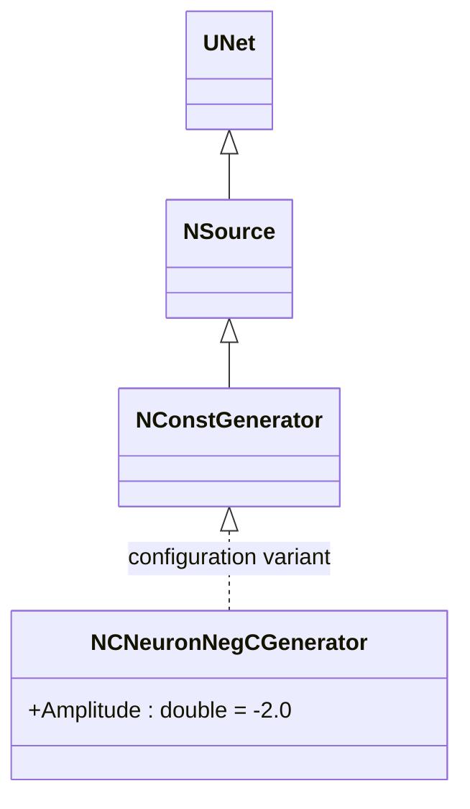
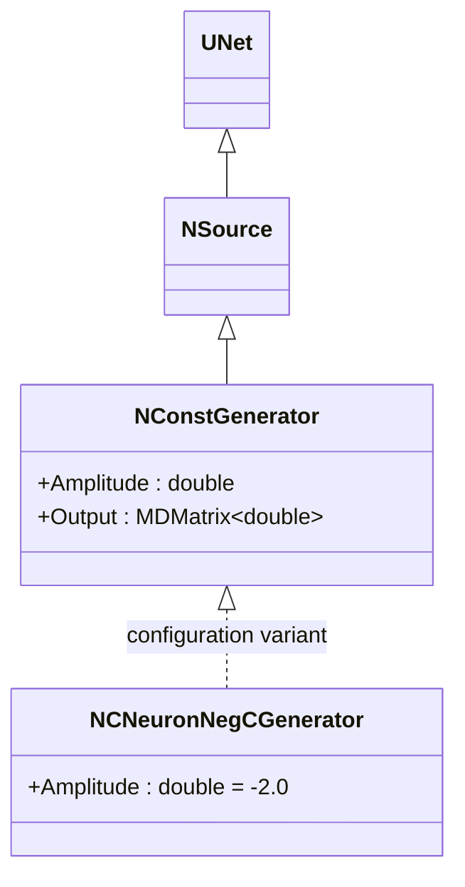
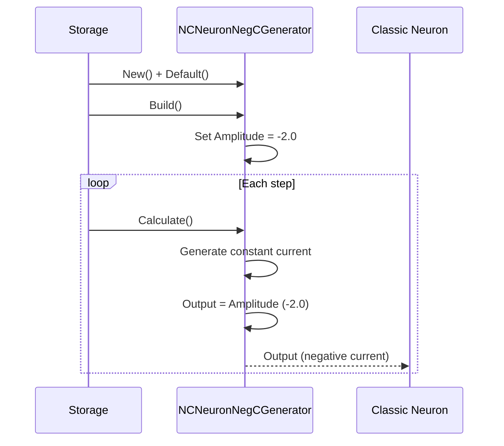
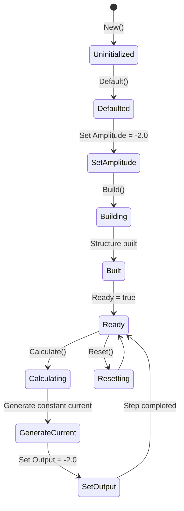
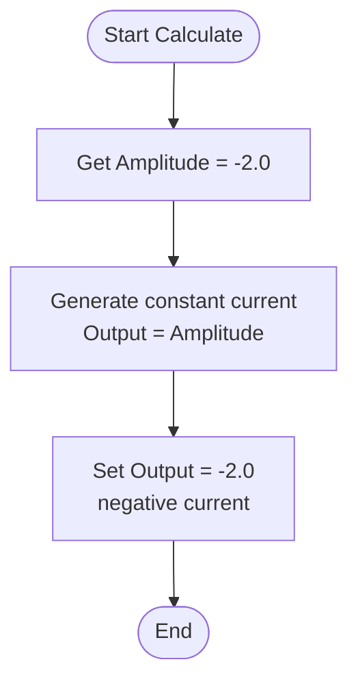
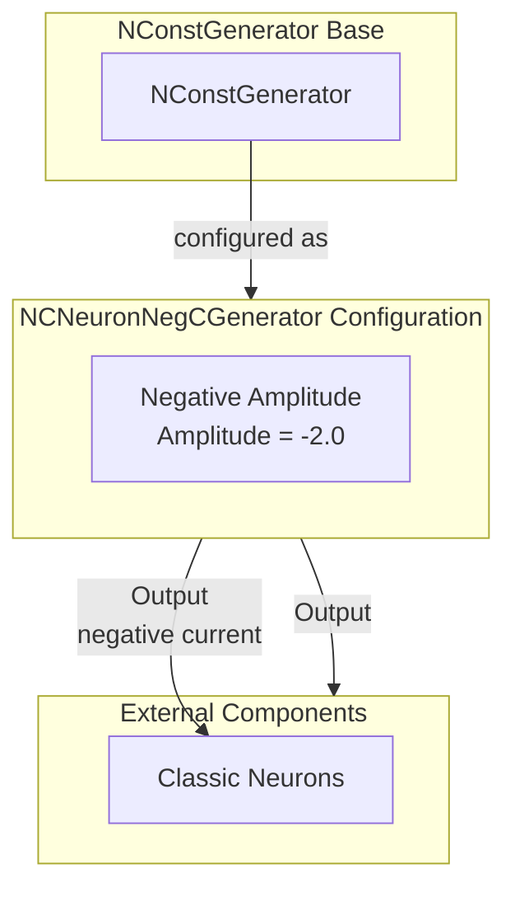

# NCNeuronNegCGenerator — генератор отрицательных токов для классических нейронов

## RU

### Назначение

**Класс**: `NCNeuronNegCGenerator` — конфигурационный вариант генератора постоянного тока с отрицательной амплитудой для классических нейронов.  
**Префикс**: `NC` — **C**ontinuous (непрерывный, классический), компонент с непрерывными входами/выходами.  
**Регистрация**: `NPulseLibrary.cpp` → `UploadClass("NCNeuronNegCGenerator", ...)`.  
**Storage-инстансы**: `ClassName = "NCNeuronNegCGenerator"` в `Bin/Configs/*/Model_*.xml`.

`NCNeuronNegCGenerator` является конфигурационным вариантом класса `NConstGenerator` с параметром `Amplitude = -2.0`. При создании компонента с `ClassName = "NCNeuronNegCGenerator"` создается экземпляр генератора постоянного тока с отрицательной амплитудой для классических нейронов.

**Использование:** Генератор отрицательных токов для классических нейронов

### UML-диаграмма классов

**Параметры конфигурации:**
- `Amplitude = -2.0` — отрицательная амплитуда для классических нейронов

## Источники

См. [Literature-References.md](../Literature-References.md): **14**, **25**.

### См. также

- [`NConstGenerator`](NCGenerator.md) — генератор постоянного тока (базовый класс)
- [`NCNeuronPosCGenerator`](NCNeuronPosCGenerator.md) — генератор положительных токов для классических нейронов
- [`NPNeuronNegCGenerator`](NPNeuronNegCGenerator.md) — генератор для импульсных нейронов

---

## EN

### Purpose

**Class**: `NCNeuronNegCGenerator` — configuration variant of constant current generator with negative amplitude for classic neurons.  
**Registration**: `NPulseLibrary.cpp` → `UploadClass("NCNeuronNegCGenerator", ...)`.  
**Instances**: `ClassName = "NCNeuronNegCGenerator"` in `Bin/Configs/*/Model_*.xml`.

`NCNeuronNegCGenerator` is a configuration variant of `NConstGenerator` class with parameter `Amplitude = -2.0`. When creating a component with `ClassName = "NCNeuronNegCGenerator"`, an instance of constant current generator with negative amplitude for classic neurons is created.

**Usage:** Negative current generator for classic neurons

### UML Class Diagram

### UML Sequence Diagram

### UML State Diagram

### UML Activity Diagram

### UML Component Diagram

### Properties

`NCNeuronNegCGenerator` uses all properties of base class `NConstGenerator` with preset value:

**Configuration parameters:**
- `Amplitude = -2.0` — negative amplitude for classic neurons

**Inherited properties:**
- `Amplitude` (double) — current amplitude (preset to -2.0)
- `Output` (MDMatrix<double>) — output current signal

### Methods

`NCNeuronNegCGenerator` uses all methods of base class `NConstGenerator`.

### Usage in configurations

`NCNeuronNegCGenerator` is used in classic neuron experiments:

- **Classic neurons**: Generates negative constant current for classic neurons
- **Negative current**: Provides negative amplitude (-2.0) for inhibition

**Features:**
- Automatically configured with negative amplitude (`Amplitude = -2.0`)
- Constant current: Generates constant negative current
- Classic model: Optimized for classic (non-spiking) neuron models

**Typical parameter values:**
- **Amplitude**: -2.0 (negative amplitude for classic neurons)

### References

See [Literature-References.md](../Literature-References.md): **14**, **25**.

### See Also

- [`NConstGenerator`](NCGenerator.md) — constant current generator (base class)
- [`NCNeuronPosCGenerator`](NCNeuronPosCGenerator.md) — positive current generator for classic neurons
- [`NPNeuronNegCGenerator`](NPNeuronNegCGenerator.md) — generator for spiking neurons
