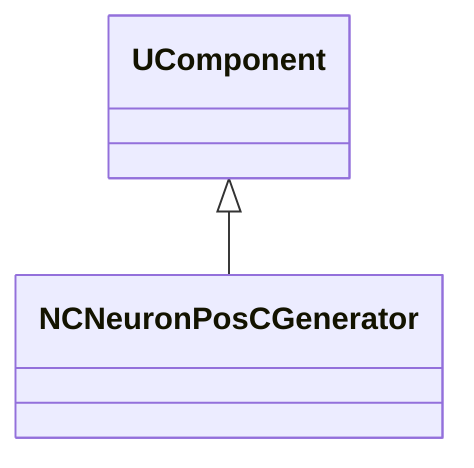
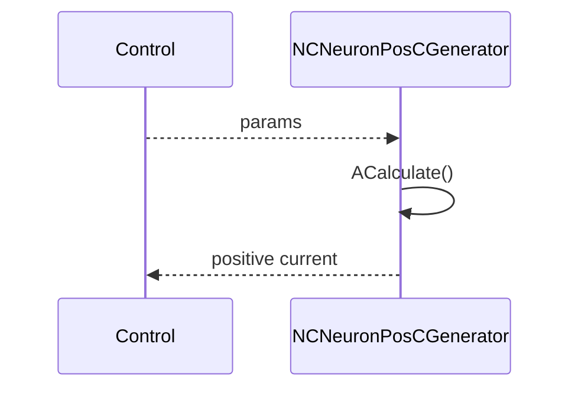
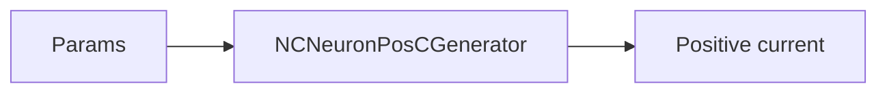
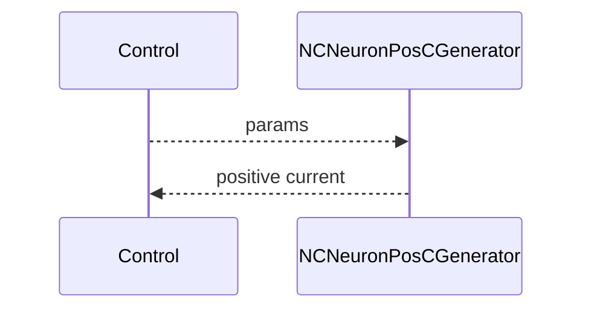

## NCNeuronPosCGenerator — генератор положительных токов (Nmsdk-PulseLib)

**Класс**: `NCNeuronPosCGenerator` — генерирует положительные токи/сигналы для классических нейронов.  
**Регистрация**: `NPulseLibrary.cpp` → `UploadClass("NCNeuronPosCGenerator", ...)`.  
**Storage**: `ClassName = "NCNeuronPosCGenerator"`.

### Lifecycle
- **ADefault**: параметры амплитуды/частоты.
- **ABuild**: подготовка выходов.
- **AReset**: сброс.
- **ACalculate**: формирование положительного тока на шаге.

### I/O
- Вход: (опционально) управление.
- Выход: положительный ток/сигнал.



Пояснение: диаграмма классов показывает место компонента в иерархии и ключевые связи.



Пояснение: диаграмма последовательности показывает типовой сценарий взаимодействия и порядок вызовов.



Пояснение: блок-схема показывает поток данных/сигналов (входы → компонент → выходы).

### Config snippet

```ini
[Component]
ClassName = NCNeuronPosCGenerator
Name = PosCGen1
```

---

## NCNeuronPosCGenerator — positive current generator (EN)

Produces positive currents for classic neurons.


Description: this class diagram shows the component position in the type hierarchy and key relations.



Description: this sequence diagram shows a typical runtime interaction and call order.


Description: this flowchart shows the data/signal flow (inputs → component → outputs).
