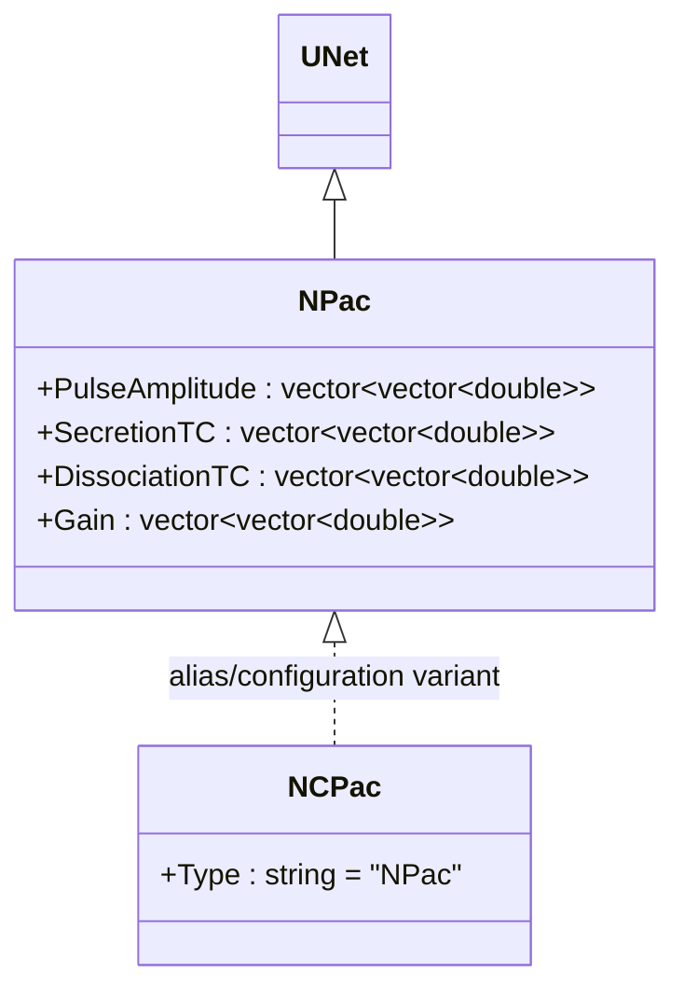
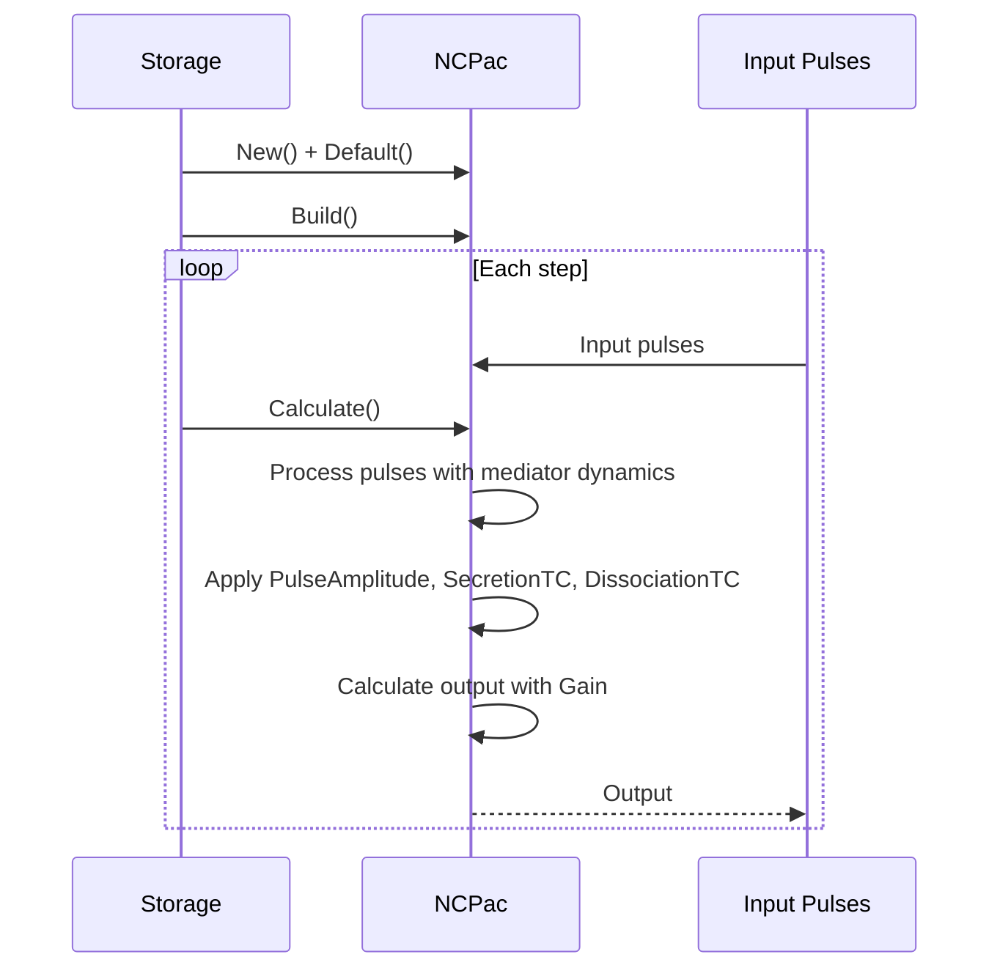
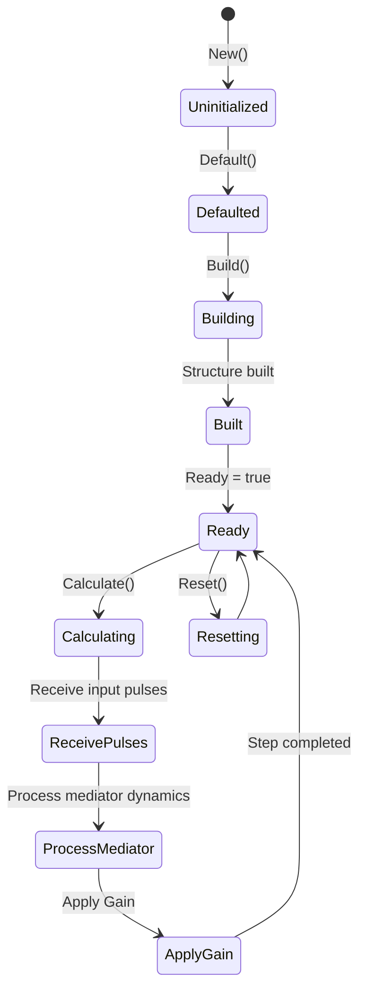
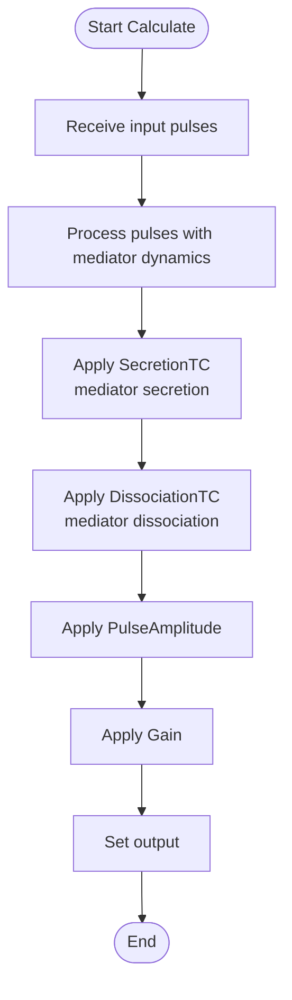
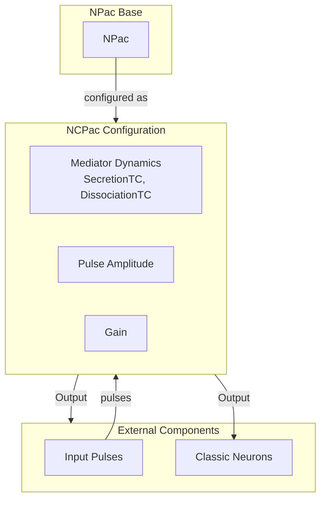

# NCPac — классический PAC

## RU

### Назначение

**Класс**: `NCPac` — классический PAC (Pulse Activity Counter) для классических моделей.  
**Префикс**: `NC` — **C**ontinuous (непрерывный, классический), компонент с непрерывными входами/выходами; `PAC` — **P**ulse **A**ctivity **C**ounter (счетчик активности импульсов).  
**Регистрация**: `NPulseLibrary.cpp` → `UploadClass("NCPac", ...)`.  
**Storage-инстансы**: `ClassName = "NCPac"` в `Bin/Configs/*/Model_*.xml`.

`NCPac` является конфигурационным вариантом или алиасом базового класса `NPac` для классических (не импульсных) моделей. При создании компонента с `ClassName = "NCPac"` создается экземпляр класса `NPac` с параметрами, оптимизированными для классических моделей.

`NPac` реализует компонент PAC, который обрабатывает входные импульсы с использованием модели динамики медиатора.

**Использование:** Классический PAC, обработка импульсов в классических моделях

### UML-диаграмма классов



**Иерархия наследования:**
- `UNet` — базовая сеть Rdk Framework
- `NPac` — PAC компонент
- `NCPac` — алиас/конфигурационный вариант для классических моделей

### Свойства

`NCPac` использует все свойства базового класса `NPac` с параметрами по умолчанию.

### Методы

`NCPac` использует все методы базового класса `NPac`.

### Примеры использования

#### Пример 1: Создание PAC в коде C++

```cpp
// Создание классического PAC
auto pac = storage->CreateComponent("NCPac");
pac->SetName("CPac");

// Инициализация (использует параметры по умолчанию)
pac->Default();

// Использование
pac->Build();
```

## Источники

См. [Literature-References.md](../Literature-References.md): **[A]**, **4**, **25**.

### См. также

- [`NPac`](NPac.md) — PAC компонент (базовый класс)
- [`NPulseSynapse`](NPulseSynapse.md) — импульсный синапс
- [Architecture.md](../Architecture.md) — архитектура библиотеки

---

## EN

### Purpose

**Class**: `NCPac` — classic PAC (Pulse Activity Counter) for classic models.  
**Registration**: `NPulseLibrary.cpp` → `UploadClass("NCPac", ...)`.  
**Instances**: `ClassName = "NCPac"` in `Bin/Configs/*/Model_*.xml`.

`NCPac` is a configuration variant or alias of the base class `NPac` for classic (non-spiking) models. When creating a component with `ClassName = "NCPac"`, an instance of `NPac` with parameters optimized for classic models is created.

**Usage:** Classic PAC, pulse processing in classic models

### UML Class Diagram


### UML Sequence Diagram



### UML State Diagram



### UML Activity Diagram



### UML Component Diagram



### Properties

`NCPac` uses all properties of base class `NPac` with default parameters:

- **`PulseAmplitude`** (vector<vector<double>>) — pulse amplitude matrix
- **`SecretionTC`** (vector<vector<double>>) — secretion time constant matrix
- **`DissociationTC`** (vector<vector<double>>) — dissociation time constant matrix
- **`Gain`** (vector<vector<double>>) — gain matrix

### Methods

`NCPac` uses all methods of base class `NPac`.

### Usage in configurations

`NCPac` is used in classic model experiments:

- **Classic models**: Used in classic (non-spiking) neural network models
- **Pulse processing**: Processes input pulses with mediator dynamics

**Features:**
- Classic model: Optimized for classic (non-spiking) models
- Mediator dynamics: Uses mediator secretion and dissociation time constants
- Gain control: Applies gain to output signals

**Typical parameter values:**
- **PulseAmplitude**: Matrix of pulse amplitudes
- **SecretionTC**: Matrix of secretion time constants
- **DissociationTC**: Matrix of dissociation time constants
- **Gain**: Matrix of gain values

### References

See [Literature-References.md](../Literature-References.md): **[A]**, **4**, **25**.

### See Also

- [`NPac`](NPac.md) — PAC component (base class)
- [`NPulseSynapse`](NPulseSynapse.md) — spiking synapse
- [Architecture.md](../Architecture.md) — library architecture
