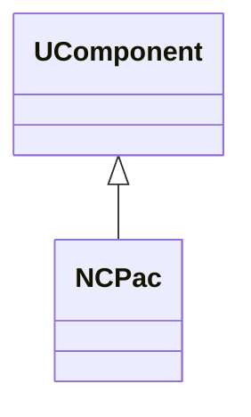
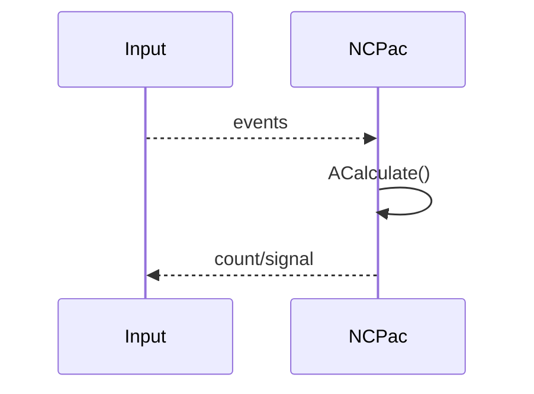
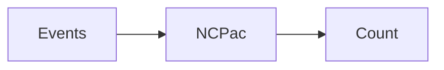
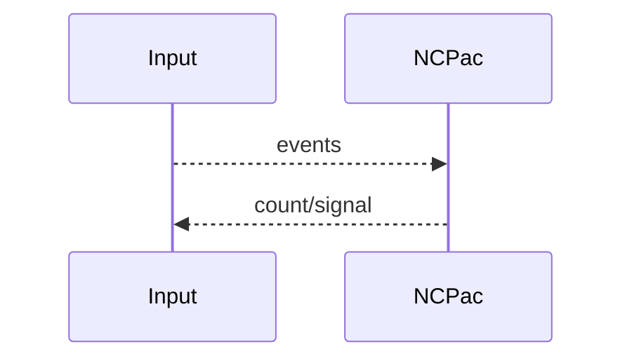

## NCPac — счётчик/активатор (Nmsdk-PulseLib)

**Класс**: `NCPac` — компонент, связанный с подсчётом/активностью (Pac).  
**Регистрация**: `NPulseLibrary.cpp` → `UploadClass("NCPac", ...)`.  
**Storage**: `ClassName = "NCPac"`.

### Lifecycle
- **ADefault**: начальные параметры.
- **ABuild**: подключение входов.
- **AReset**: сброс счётчиков.
- **ACalculate**: обновление состояния/счёта.

### I/O
- Вход: активность/события.
- Выход: счёт/сигнал активности.



Пояснение: диаграмма классов показывает место компонента в иерархии и ключевые связи.



Пояснение: диаграмма последовательности показывает типовой сценарий взаимодействия и порядок вызовов.



Пояснение: блок-схема показывает поток данных/сигналов (входы → компонент → выходы).

### Config snippet

```ini
[Component]
ClassName = NCPac
Name = CPac1
```

---

## NCPac — count/activation component (EN)

Counts or accumulates activity/events.


Description: this class diagram shows the component position in the type hierarchy and key relations.



Description: this sequence diagram shows a typical runtime interaction and call order.


Description: this flowchart shows the data/signal flow (inputs → component → outputs).
