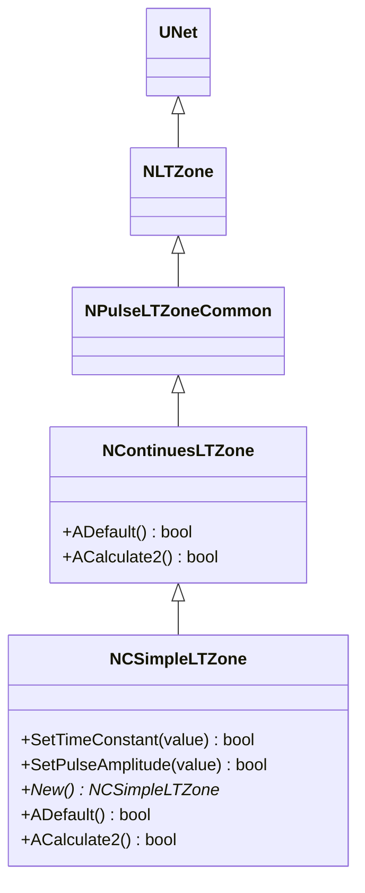
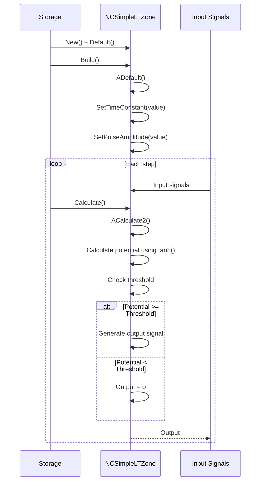
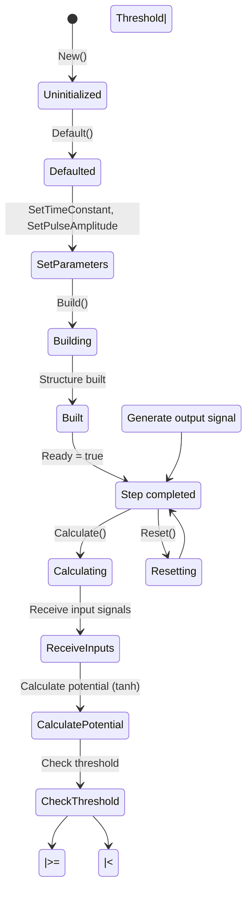
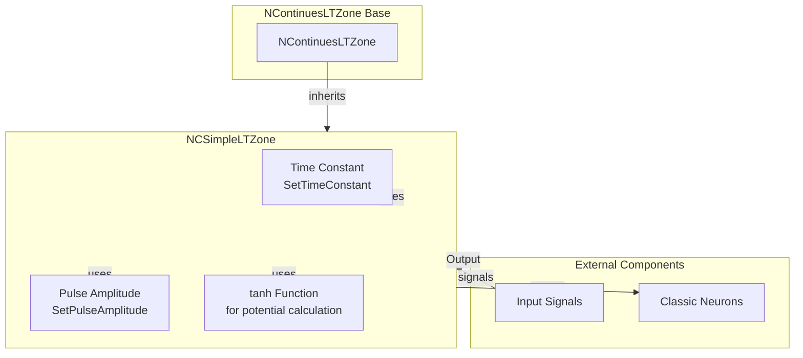

# NCSimpleLTZone — простая классическая LT-зона

## RU

### Назначение

**Класс**: `NCSimpleLTZone` — простая классическая LT-зона для непрерывных нейронов.  
**Префикс**: `NC` — **C**ontinuous (непрерывный, классический), компонент с непрерывными входами/выходами; **Аббревиатура**: `LT` — **L**ow **T**hreshold (низкопороговая зона).  
**Регистрация**: `NPulseLibrary.cpp` → `UploadClass("NCSimpleLTZone", ...)`.  
**Storage-инстансы**: `ClassName = "NCSimpleLTZone"` в `Bin/Configs/*/Model_*.xml`.

`NCSimpleLTZone` является расширением класса `NContinuesLTZone` для классических (непрерывных) нейронов. Наследуется от `NContinuesLTZone` и добавляет методы для управления временной константой и амплитудой импульсов.

**Использование:** Простая LT-зона для классических нейронов, долговременная пластичность

### UML-диаграмма классов



**Иерархия наследования:**
- `UNet` — базовая сеть Rdk Framework
- `NLTZone` — базовая LT-зона
- `NPulseLTZoneCommon` — общая импульсная LT-зона
- `NContinuesLTZone` — непрерывная LT-зона
- `NCSimpleLTZone` — простая классическая LT-зона

### Свойства

`NCSimpleLTZone` использует все свойства базовых классов `NContinuesLTZone` и `NPulseLTZoneCommon`:
- Пороги: `Threshold`, `ThresholdOff`
- Параметры импульсов: `PulseAmplitude`, `PulseLength`
- Входы/выходы: `Inputs`, `Output`, `OutputPotential`

### Методы

- **`SetTimeConstant(const double &value)`** → `bool` — устанавливает временную константу.

- **`SetPulseAmplitude(const double &value)`** → `bool` — устанавливает амплитуду импульса.

- **`ACalculate2()`** → `bool` — выполняет расчет классической LT-зоны. Использует функцию `tanh()` для расчета потенциала из `NeuralPotential`.

### Примеры использования

#### Пример 1: Создание простой классической LT-зоны в коде C++

```cpp
// Создание простой классической LT-зоны
auto ltZone = storage->CreateComponent("NCSimpleLTZone");
ltZone->SetName("CSimpleLTZone");

// Инициализация
ltZone->Default();

// Настройка параметров
ltZone->Threshold = 0.0;
ltZone->PulseAmplitude = 1.0;

// Использование
ltZone->Build();
```

## Источники

См. [Literature-References.md](../Literature-References.md): **[A]**, **4**, **25**, **29**.

### См. также

- [`NContinuesLTZone`](NPLTZone.md) — непрерывная LT-зона (базовый класс)
- [`NPSimpleLTZone`](NPSimpleLTZone.md) — простая импульсная LT-зона
- [`NCLTZone`](NCLTZone.md) — классическая LT-зона
- [Architecture.md](../Architecture.md) — архитектура библиотеки

---

## EN

### Purpose

**Class**: `NCSimpleLTZone` — simple classic LT-zone for continuous neurons.  
**Registration**: `NPulseLibrary.cpp` → `UploadClass("NCSimpleLTZone", ...)`.  
**Instances**: `ClassName = "NCSimpleLTZone"` in `Bin/Configs/*/Model_*.xml`.

`NCSimpleLTZone` is an extension of `NContinuesLTZone` class for classic (continuous) neurons. Inherits from `NContinuesLTZone` and adds methods for managing time constant and pulse amplitude.

**Usage:** Simple LT-zone for classic neurons, long-term plasticity

### UML Class Diagram


### UML Sequence Diagram



### UML State Diagram



### UML Activity Diagram

```mermaid
flowchart TD
    Start([Start ACalculate2]) --> ReceiveInputs[Receive input signals]
    ReceiveInputs --> AggregateInputs[Aggregate input signals]
    AggregateInputs --> CalculateNeuralPotential[Calculate NeuralPotential]
    CalculateNeuralPotential --> ApplyTanh[Apply tanh function<br/>potential = tanh(NeuralPotential)]
    ApplyTanh --> CheckThreshold{Potential >= Threshold?}
    CheckThreshold -->|Yes| CheckThresholdOff{Potential < ThresholdOff?}
    CheckThreshold -->|No| SetOutputZero[Output = 0]
    CheckThresholdOff -->|Yes| SetOutputZero
    CheckThresholdOff -->|No| SetOutputSignal[Output = signal<br/>PulseAmplitude]
    SetOutputZero --> End([End])
    SetOutputSignal --> End
```

### UML Component Diagram



### Properties

`NCSimpleLTZone` uses all properties of base classes `NContinuesLTZone` and `NPulseLTZoneCommon`:
- **Thresholds**: `Threshold`, `ThresholdOff`
- **Pulse parameters**: `PulseAmplitude`, `PulseLength`
- **Inputs/outputs**: `Inputs`, `Output`, `OutputPotential`

### Methods

- **`SetTimeConstant(const double &value)`** → `bool` — sets the time constant.

- **`SetPulseAmplitude(const double &value)`** → `bool` — sets the pulse amplitude.

- **`ACalculate2()`** → `bool` — performs calculation of classic LT-zone. Uses `tanh()` function to calculate potential from `NeuralPotential`.

### Usage in configurations

`NCSimpleLTZone` is used in experiments with classic neurons:

- **Classic neurons**: Simple LT-zone for classic (continuous) neurons
- **Long-term plasticity**: Implements long-term plasticity mechanisms

**Features:**
- Simple model: Uses `tanh()` function for potential calculation
- Time constant control: `SetTimeConstant()` method for managing time constant
- Pulse amplitude control: `SetPulseAmplitude()` method for managing pulse amplitude

**Typical parameter values:**
- **Threshold**: 0.0 (default threshold for signal generation)
- **PulseAmplitude**: 1.0 (default pulse amplitude)
- **Time constant**: Set via `SetTimeConstant()` method

### References

See [Literature-References.md](../Literature-References.md): **[A]**, **4**, **25**, **29**.

### See Also

- [`NContinuesLTZone`](NPLTZone.md) — continuous LT-zone (base class)
- [`NPSimpleLTZone`](NPSimpleLTZone.md) — simple spiking LT-zone
- [`NCLTZone`](NCLTZone.md) — classic LT-zone
- [Architecture.md](../Architecture.md) — library architecture
