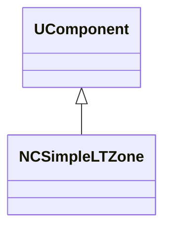
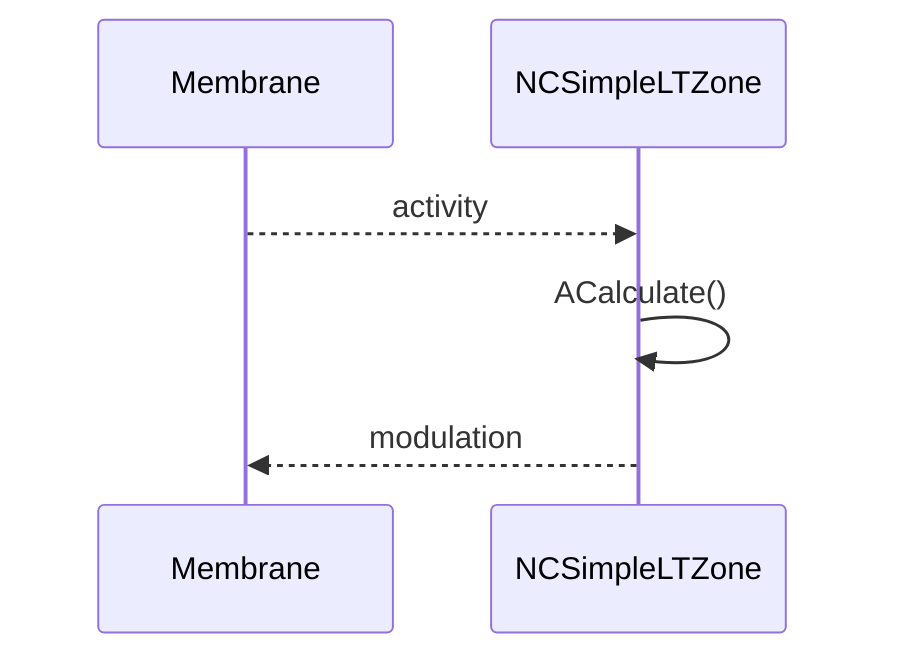
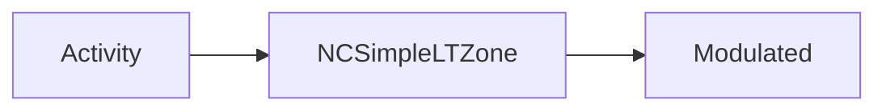
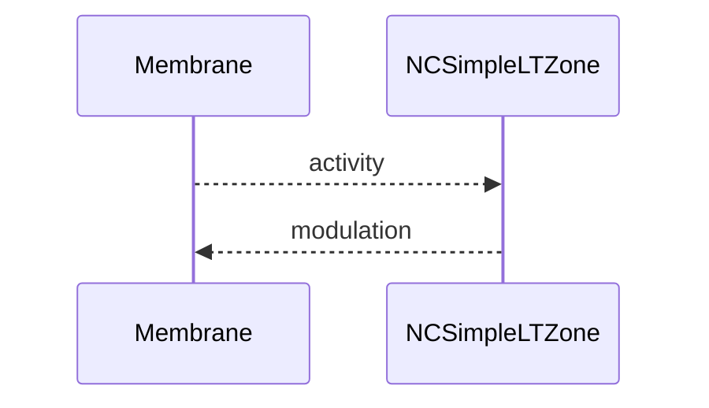

## NCSimpleLTZone — LT-зона (простая, classic)

**Класс**: `NCSimpleLTZone` — простая зона долговременной пластичности для классических нейронов.  
**Регистрация**: `NPulseLibrary.cpp` → `UploadClass("NCSimpleLTZone", ...)`.  
**Storage**: `ClassName = "NCSimpleLTZone"`.

### Lifecycle
- **ADefault**: установка порогов/усилений LT.
- **ABuild**: подключение к мембранам/каналам.
- **AReset**: сброс состояния LT.
- **ACalculate**: обновление LT-состояния по активности.

### I/O
- Вход: активность/потенциал.
- Выход: модифицированный сигнал/модуляция.



Пояснение: диаграмма классов показывает место компонента в иерархии и ключевые связи.



Пояснение: диаграмма последовательности показывает типовой сценарий взаимодействия и порядок вызовов.



Пояснение: блок-схема показывает поток данных/сигналов (входы → компонент → выходы).

### Config snippet

```ini
[Component]
ClassName = NCSimpleLTZone
Name = CLTZone1
```

---

## NCSimpleLTZone — simple LT zone (EN)

Simple long-term plasticity zone for classic neurons.


Description: this class diagram shows the component position in the type hierarchy and key relations.



Description: this sequence diagram shows a typical runtime interaction and call order.


Description: this flowchart shows the data/signal flow (inputs → component → outputs).
