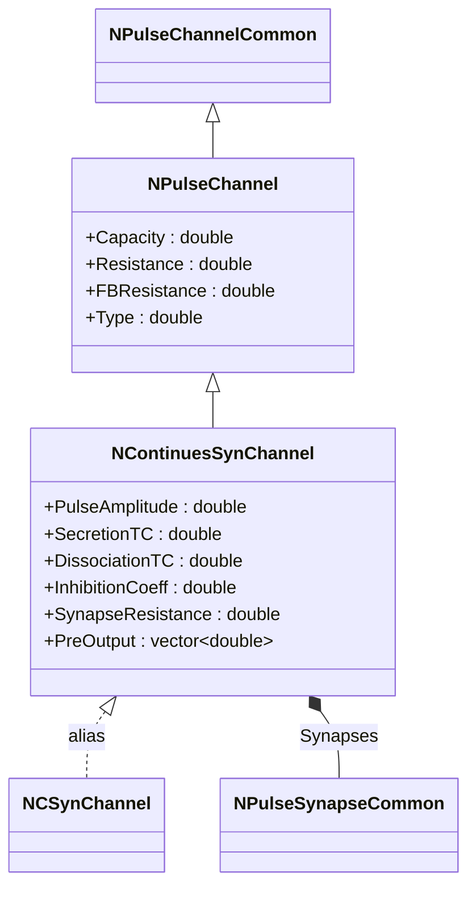
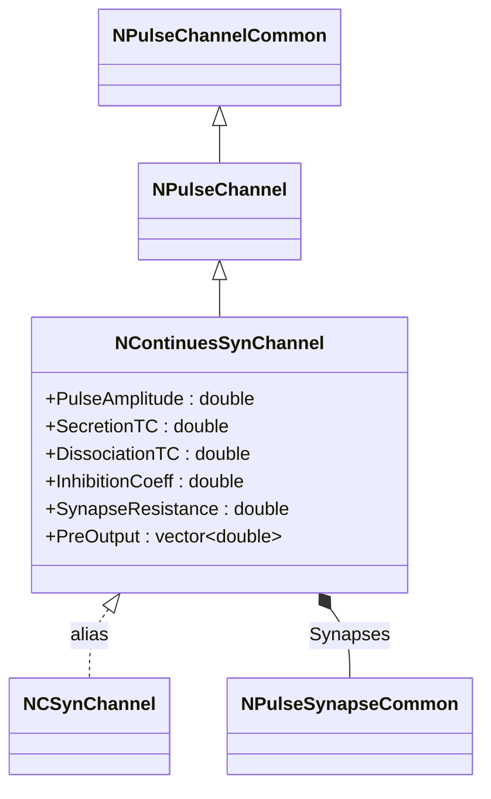
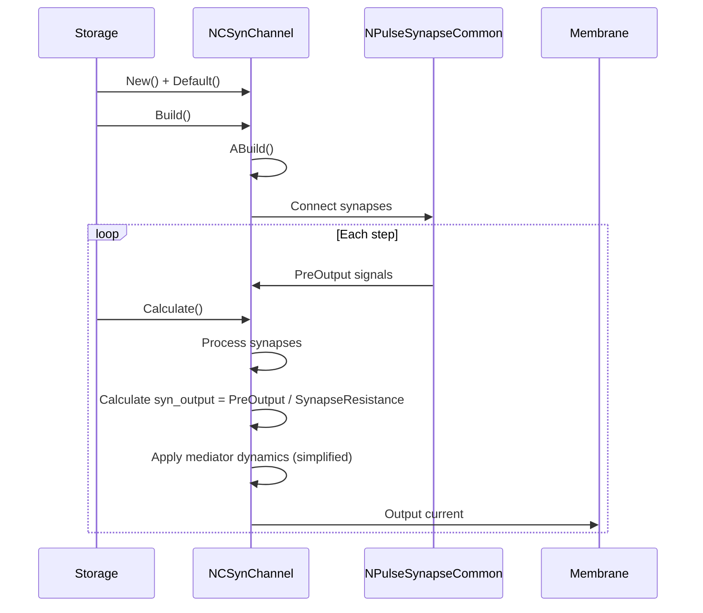
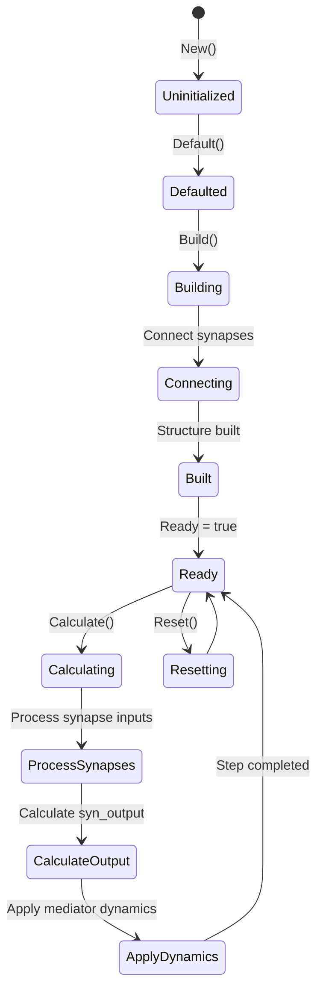
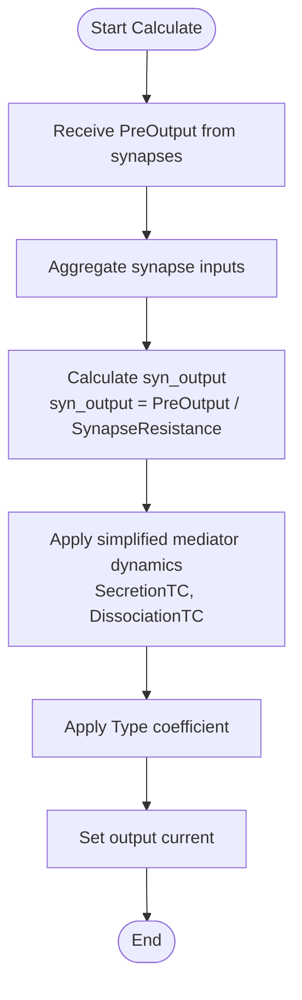
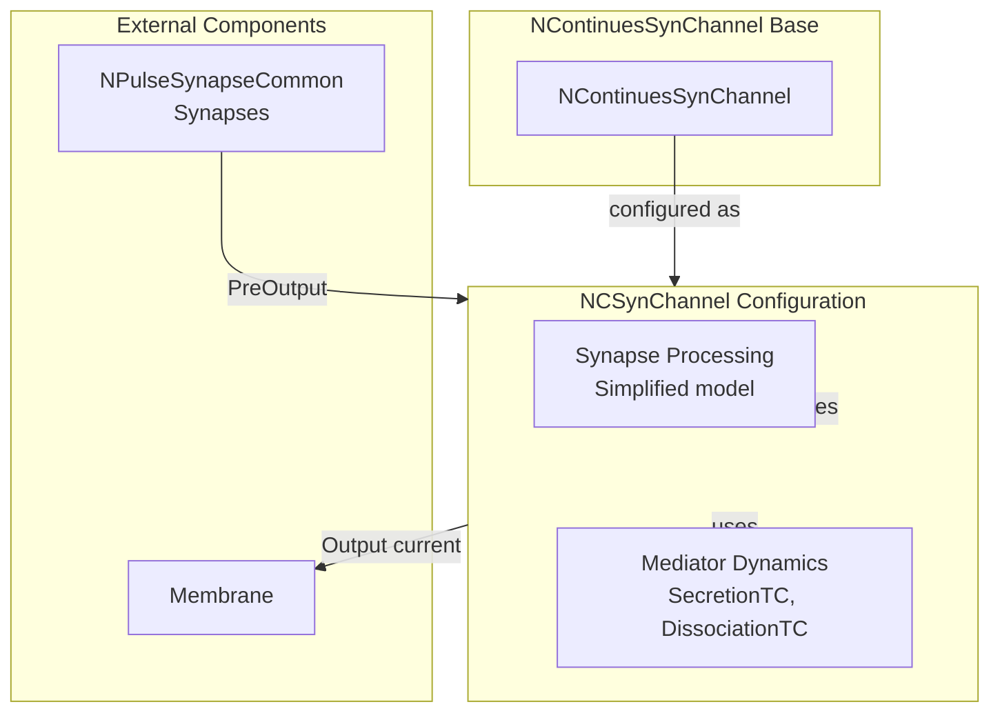

# NCSynChannel — непрерывный синаптический канал

## RU

### Назначение

**Класс**: `NCSynChannel` — алиас для класса `NContinuesSynChannel`.  
**Префикс**: `NC` — **C**ontinuous (непрерывный, классический), компонент с непрерывными входами/выходами; `Syn` — **Syn**apse (синапс).  
**Регистрация**: `NPulseLibrary.cpp` → `UploadClass("NCSynChannel", ...)`.  
**Storage-инстансы**: `ClassName = "NCSynChannel"` в `Bin/Configs/*/Model_*.xml`.

`NCSynChannel` является алиасом (синонимом) для класса `NContinuesSynChannel`. При создании компонента с `ClassName = "NCSynChannel"` фактически создается экземпляр класса `NContinuesSynChannel` с параметрами по умолчанию.

`NContinuesSynChannel` реализует непрерывный синаптический канал, который обрабатывает входы от синапсов с упрощенной моделью динамики медиатора. Отличие от `NPulseSynChannel` заключается в упрощенном расчете выходного тока синапса (`syn_output = PreOutput / SynapseResistance` вместо более сложной формулы с пресинаптическим торможением).

**Использование:** Упрощенное именование при конфигурации, обратная совместимость, непрерывная обработка синапсов

### UML-диаграмма классов



**Иерархия наследования:**
- `NPulseChannelCommon` — общий импульсный канал
- `NPulseChannel` — базовый импульсный канал
- `NContinuesSynChannel` — непрерывный синаптический канал
- `NCSynChannel` — алиас для `NContinuesSynChannel`

### Свойства

`NCSynChannel` использует все свойства класса `NContinuesSynChannel` с параметрами по умолчанию.

**Параметры по умолчанию:**
- `PulseAmplitude = 1.0`
- `SecretionTC = 0.001` (1 мс)
- `DissociationTC = 0.01` (10 мс)
- `InhibitionCoeff = 1.0` (отличается от NPulseSynChannel, где по умолчанию 0.0)
- `SynapseResistance = 1.0e8` (100 МОм)
- `Capacity = 1.0e-9` (1 нФ)
- `Resistance = 1.0e7` (10 МОм)
- `FBResistance = 1.0e8` (100 МОм)

**Особенности:**
- Упрощенный расчет выходного тока: `syn_output = PreOutput / SynapseResistance`
- Использует `NPulseSynapseCommon` для определения синапсов (в отличие от `NPulseSynapse` в `NPulseSynChannel`)

### Методы

`NCSynChannel` использует все методы класса `NContinuesSynChannel`.

### Примеры использования

#### Пример 1: Создание канала в коде C++

```cpp
// Создание непрерывного синаптического канала через алиас
auto channel = storage->CreateComponent("NCSynChannel");
channel->SetName("CSynChannel");

// Инициализация (использует параметры по умолчанию)
channel->Default();

// Использование
channel->Build();
```

#### Пример 2: Конфигурация XML

```xml
<Channel1 Class="NCSynChannel">
    <Parameters>
        <Type>0</Type>
        <Capacity>1.0e-9</Capacity>
        <Resistance>1.0e7</Resistance>
        <FBResistance>1.0e8</FBResistance>
        <PulseAmplitude>1.0</PulseAmplitude>
        <SecretionTC>0.001</SecretionTC>
        <DissociationTC>0.01</DissociationTC>
        <InhibitionCoeff>1.0</InhibitionCoeff>
        <SynapseResistance>1.0e8</SynapseResistance>
    </Parameters>
</Channel1>
```

### Использование в конфигурациях

`NCSynChannel` используется как упрощенное имя для `NContinuesSynChannel`:

- Упрощенное именование в конфигурациях
- Обратная совместимость со старыми конфигурациями
- Непрерывная обработка синапсов с упрощенной моделью

## Источники

См. [Literature-References.md](../Literature-References.md): **[A]**, **4**, **25**, **29**.

### См. также

- [`NContinuesSynChannel`](NContinuesSynChannel.md) — непрерывный синаптический канал (базовый класс)
- [`NPulseSynChannel`](NPulseSynChannel.md) — импульсный синаптический канал
- [`NCSynExcChannel`](NCSynExcChannel.md) — возбуждающий непрерывный синаптический канал
- [`NCSynInhChannel`](NCSynInhChannel.md) — тормозной непрерывный синаптический канал
- [`NPulseChannel`](NPulseChannel.md) — базовый импульсный канал
- [Architecture.md](../Architecture.md) — архитектура библиотеки

---

## EN

### Purpose

**Class**: `NCSynChannel` — alias for `NContinuesSynChannel` class.  
**Registration**: `NPulseLibrary.cpp` → `UploadClass("NCSynChannel", ...)`.  
**Instances**: `ClassName = "NCSynChannel"` in `Bin/Configs/*/Model_*.xml`.

`NCSynChannel` is an alias (synonym) for the `NContinuesSynChannel` class. When creating a component with `ClassName = "NCSynChannel"`, an instance of `NContinuesSynChannel` with default parameters is actually created.

**Usage:** Simplified naming in configurations, backward compatibility, continuous synapse processing

### UML Class Diagram



### UML Sequence Diagram



### UML State Diagram



### UML Activity Diagram



### UML Component Diagram



### Properties

`NCSynChannel` uses all properties of `NContinuesSynChannel` class with default parameters:

**Default parameters:**
- `PulseAmplitude = 1.0`
- `SecretionTC = 0.001` (1 ms)
- `DissociationTC = 0.01` (10 ms)
- `InhibitionCoeff = 1.0` (differs from NPulseSynChannel, where default is 0.0)
- `SynapseResistance = 1.0e8` (100 MΩ)
- `Capacity = 1.0e-9` (1 nF)
- `Resistance = 1.0e7` (10 MΩ)
- `FBResistance = 1.0e8` (100 MΩ)

**Features:**
- Simplified output current calculation: `syn_output = PreOutput / SynapseResistance`
- Uses `NPulseSynapseCommon` for synapse definition (unlike `NPulseSynapse` in `NPulseSynChannel`)

### Methods

`NCSynChannel` uses all methods of `NContinuesSynChannel` class.

### Usage in configurations

`NCSynChannel` is used as a simplified name for `NContinuesSynChannel`:

- **Simplified naming**: Used in configurations for easier naming
- **Backward compatibility**: Maintains compatibility with older configurations
- **Continuous synapse processing**: Processes synapses with simplified mediator model

**Typical parameter values:**
- **SecretionTC**: 0.001 (1 ms time constant for mediator secretion)
- **DissociationTC**: 0.01 (10 ms time constant for mediator dissociation)
- **SynapseResistance**: 1.0e8 (100 MΩ resistance for synapse output calculation)

**Features:**
- Simplified model: Uses simplified output current calculation compared to `NPulseSynChannel`
- Continuous processing: Processes continuous synapse signals
- Default inhibition: `InhibitionCoeff = 1.0` by default (unlike `NPulseSynChannel` where it's 0.0)

### References

See [Literature-References.md](../Literature-References.md): **[A]**, **4**, **25**, **29**.

### See Also

- [`NContinuesSynChannel`](NContinuesSynChannel.md) — continuous synaptic channel (base class)
- [`NPulseSynChannel`](NPulseSynChannel.md) — spiking synaptic channel
- [`NCSynExcChannel`](NCSynExcChannel.md) — excitatory continuous synaptic channel
- [`NCSynInhChannel`](NCSynInhChannel.md) — inhibitory continuous synaptic channel
- [`NPulseChannel`](NPulseChannel.md) — base spiking channel
- [Architecture.md](../Architecture.md) — library architecture
