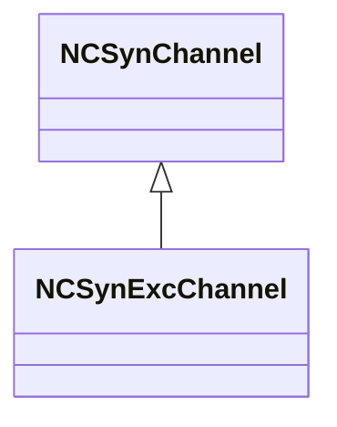
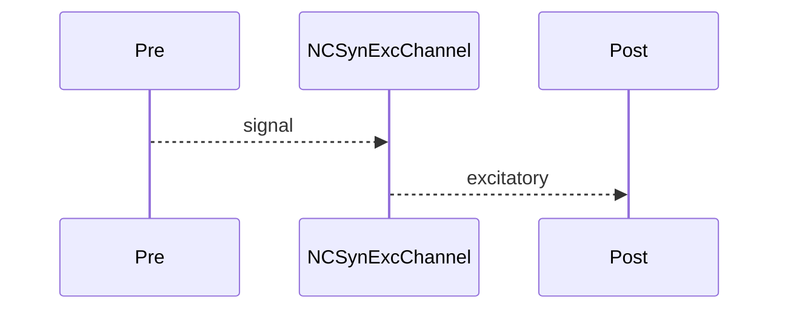

## NCSynExcChannel — возбуждающий синаптический канал (classic)

**Класс**: `NCSynExcChannel` — возбуждающий канал для классических синапсов.  
**Регистрация**: `NPulseLibrary.cpp` → `UploadClass("NCSynExcChannel", ...)`.  
**Storage**: `ClassName = "NCSynExcChannel"`.

### Lifecycle
- **ADefault**: параметры усиления/передачи.
- **ABuild**: подключение pre/post.
- **AReset**: сброс состояния.
- **ACalculate**: передача возбуждающего сигнала.

### I/O
- Вход: pre-сигнал.
- Выход: возбудительный сигнал.



Пояснение: диаграмма классов показывает место компонента в иерархии и ключевые связи.



Пояснение: диаграмма последовательности показывает типовой сценарий взаимодействия и порядок вызовов.


Пояснение: блок-схема показывает поток данных/сигналов (входы → компонент → выходы).

### Config snippet

```ini
[Component]
ClassName = NCSynExcChannel
Name = CSynExc1
```

---

## NCSynExcChannel — excitatory channel (EN)

Excitatory synaptic channel in classic form.


Description: this class diagram shows the component position in the type hierarchy and key relations.


Description: this sequence diagram shows a typical runtime interaction and call order.


Description: this flowchart shows the data/signal flow (inputs → component → outputs).
