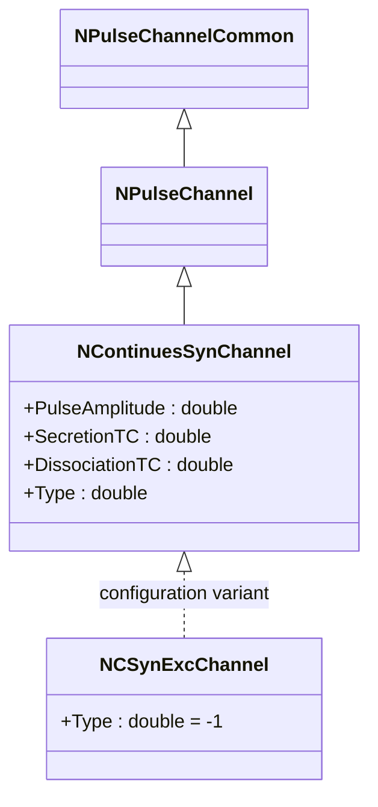
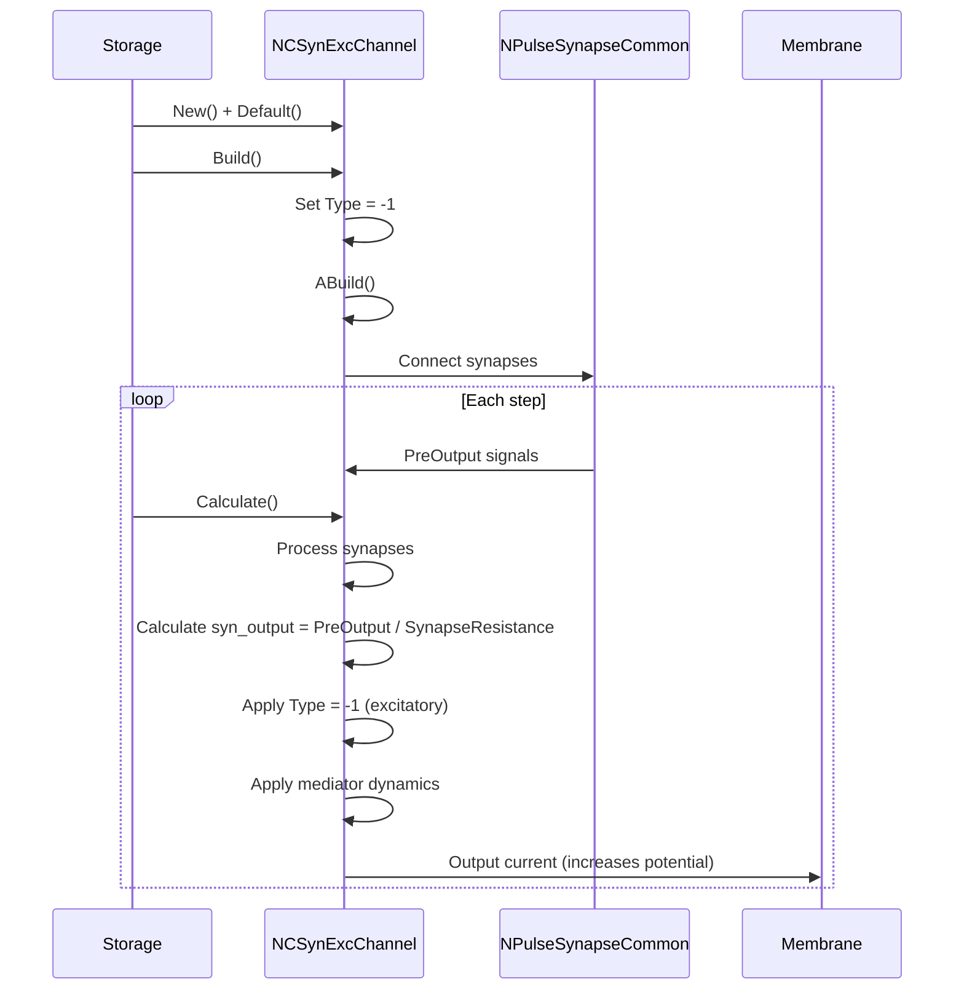
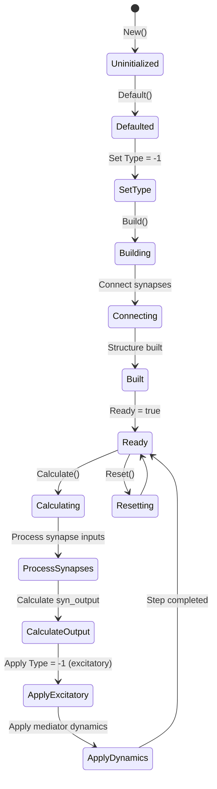
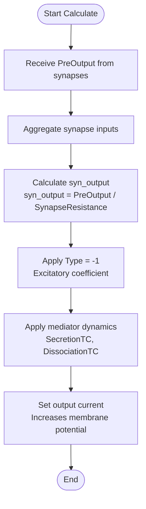
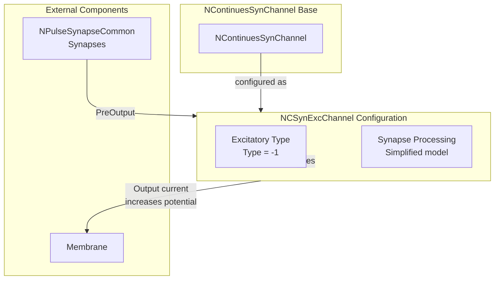

# NCSynExcChannel — возбуждающий непрерывный синаптический канал

## RU

### Назначение

**Класс**: `NCSynExcChannel` — конфигурационный вариант непрерывного синаптического канала с типом возбуждающего канала.  
**Префикс**: `NC` — **C**ontinuous (непрерывный, классический), компонент с непрерывными входами/выходами; `Syn` — **Syn**apse (синапс); `Exc` — **Exc**itatory (возбуждающий).  
**Регистрация**: `NPulseLibrary.cpp` → `UploadClass("NCSynExcChannel", ...)`.  
**Storage-инстансы**: `ClassName = "NCSynExcChannel"` в `Bin/Configs/*/Model_*.xml`.

`NCSynExcChannel` является конфигурационным вариантом базового класса `NContinuesSynChannel` с предустановленным типом возбуждающего канала. Создается из `NContinuesSynChannel` с настройкой:
- `Type = -1` — возбуждающий канал

Возбуждающий канал увеличивает потенциал мембраны при наличии входных сигналов от синапсов.

**Использование:** Моделирование возбуждающих непрерывных синаптических каналов, обработка возбуждающих синапсов

### UML-диаграмма классов



**Иерархия наследования:**
- `NPulseChannelCommon` — общий импульсный канал
- `NPulseChannel` — базовый импульсный канал
- `NContinuesSynChannel` — непрерывный синаптический канал
- `NCSynExcChannel` — конфигурационный вариант для возбуждающего канала

### Свойства

`NCSynExcChannel` использует все свойства базового класса `NContinuesSynChannel` с предустановленным значением:

**Параметры:**
- `Type = -1` — возбуждающий канал

**Остальные параметры по умолчанию:**
- `PulseAmplitude = 1.0`
- `SecretionTC = 0.001` (1 мс)
- `DissociationTC = 0.01` (10 мс)
- `InhibitionCoeff = 1.0`
- `SynapseResistance = 1.0e8` (100 МОм)
- `Capacity = 1.0e-9` (1 нФ)
- `Resistance = 1.0e7` (10 МОм)
- `FBResistance = 1.0e8` (100 МОм)

### Методы

`NCSynExcChannel` использует все методы базового класса `NContinuesSynChannel`.

### Примеры использования

#### Пример 1: Создание канала в коде C++

```cpp
// Создание возбуждающего непрерывного синаптического канала
auto channel = storage->CreateComponent("NCSynExcChannel");
channel->SetName("CSynExcChannel");

// Инициализация (использует Type = -1)
channel->Default();

// Использование
channel->Build();
```

#### Пример 2: Конфигурация XML

```xml
<Channel1 Class="NCSynExcChannel">
    <Parameters>
        <Type>-1</Type>
        <Capacity>1.0e-9</Capacity>
        <Resistance>1.0e7</Resistance>
        <FBResistance>1.0e8</FBResistance>
        <PulseAmplitude>1.0</PulseAmplitude>
        <SecretionTC>0.001</SecretionTC>
        <DissociationTC>0.01</DissociationTC>
        <SynapseResistance>1.0e8</SynapseResistance>
    </Parameters>
</Channel1>
```

### Использование в конфигурациях

`NCSynExcChannel` используется в экспериментах с возбуждающими непрерывными синаптическими каналами:

- Моделирование возбуждающих непрерывных синаптических каналов
- Обработка возбуждающих синапсов
- Эксперименты с возбуждающей синаптической передачей

**Особенности:**
- Автоматически настроен как возбуждающий канал (`Type = -1`)
- Увеличивает потенциал мембраны при наличии входных сигналов
- Использует упрощенную модель медиатора

## Источники

См. [Literature-References.md](../Literature-References.md): **[A]**, **4**, **25**, **29**.

### См. также

- [`NContinuesSynChannel`](NContinuesSynChannel.md) — непрерывный синаптический канал (базовый класс)
- [`NCSynChannel`](NCSynChannel.md) — алиас для NContinuesSynChannel
- [`NCSynInhChannel`](NCSynInhChannel.md) — тормозной непрерывный синаптический канал
- [`NPulseSynChannel`](NPulseSynChannel.md) — импульсный синаптический канал
- [`NPulseChannel`](NPulseChannel.md) — базовый импульсный канал
- [Architecture.md](../Architecture.md) — архитектура библиотеки

---

## EN

### Purpose

**Class**: `NCSynExcChannel` — configuration variant of continuous synaptic channel with excitatory channel type.  
**Registration**: `NPulseLibrary.cpp` → `UploadClass("NCSynExcChannel", ...)`.  
**Instances**: `ClassName = "NCSynExcChannel"` in `Bin/Configs/*/Model_*.xml`.

`NCSynExcChannel` is a configuration variant of the base class `NContinuesSynChannel` with preset excitatory channel type. Created from `NContinuesSynChannel` with setting:
- `Type = -1` — excitatory channel

Excitatory channel increases membrane potential when input signals from synapses are present.

**Usage:** Modeling excitatory continuous synaptic channels, processing excitatory synapses

### UML Class Diagram


### UML Sequence Diagram



### UML State Diagram



### UML Activity Diagram



### UML Component Diagram



### Properties

`NCSynExcChannel` uses all properties of base class `NContinuesSynChannel` with preset value:

**Parameters:**
- `Type = -1` — excitatory channel

**Other default parameters:**
- `PulseAmplitude = 1.0`
- `SecretionTC = 0.001` (1 ms)
- `DissociationTC = 0.01` (10 ms)
- `InhibitionCoeff = 1.0`
- `SynapseResistance = 1.0e8` (100 MΩ)
- `Capacity = 1.0e-9` (1 nF)
- `Resistance = 1.0e7` (10 MΩ)
- `FBResistance = 1.0e8` (100 MΩ)

### Methods

`NCSynExcChannel` uses all methods of base class `NContinuesSynChannel`.

### Usage in configurations

`NCSynExcChannel` is used in experiments with excitatory continuous synaptic channels:

- **Excitatory channels**: Modeling excitatory continuous synaptic channels
- **Excitatory synapses**: Processing excitatory synapses
- **Excitatory transmission**: Experiments with excitatory synaptic transmission

**Features:**
- Automatically configured as excitatory channel (`Type = -1`)
- Increases membrane potential when input signals are present
- Uses simplified mediator model

**Typical parameter values:**
- **Type**: -1 (excitatory channel type)
- **SecretionTC**: 0.001 (1 ms time constant)
- **DissociationTC**: 0.01 (10 ms time constant)

### References

See [Literature-References.md](../Literature-References.md): **[A]**, **4**, **25**, **29**.

### See Also

- [`NContinuesSynChannel`](NContinuesSynChannel.md) — continuous synaptic channel (base class)
- [`NCSynChannel`](NCSynChannel.md) — alias for NContinuesSynChannel
- [`NCSynInhChannel`](NCSynInhChannel.md) — inhibitory continuous synaptic channel
- [`NPulseSynChannel`](NPulseSynChannel.md) — spiking synaptic channel
- [`NPulseChannel`](NPulseChannel.md) — base spiking channel
- [Architecture.md](../Architecture.md) — library architecture

