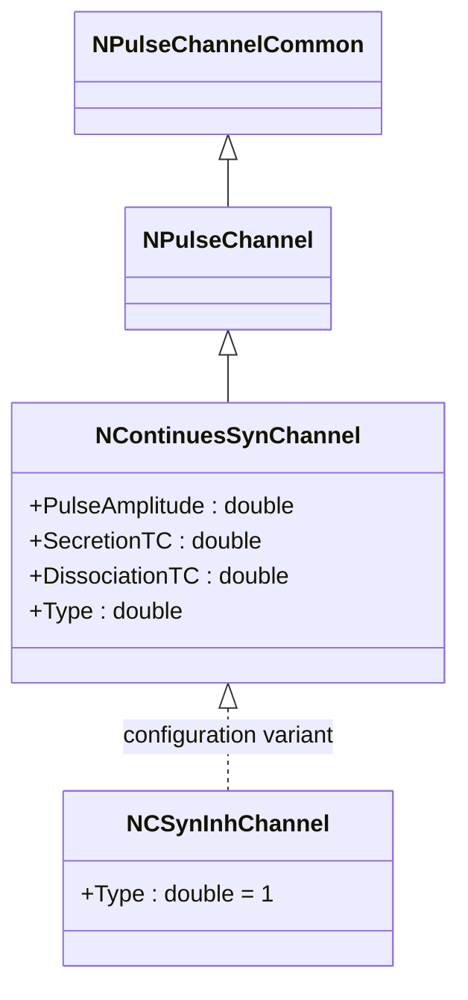
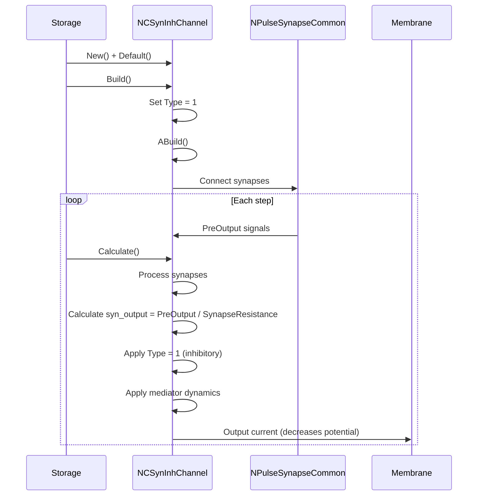
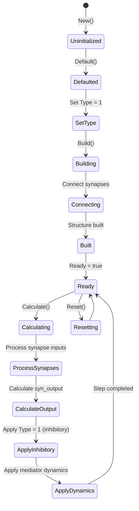
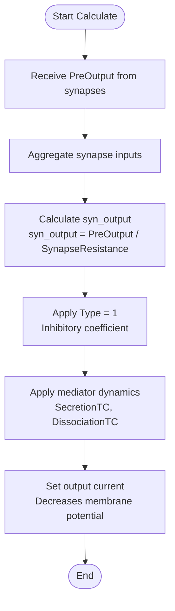
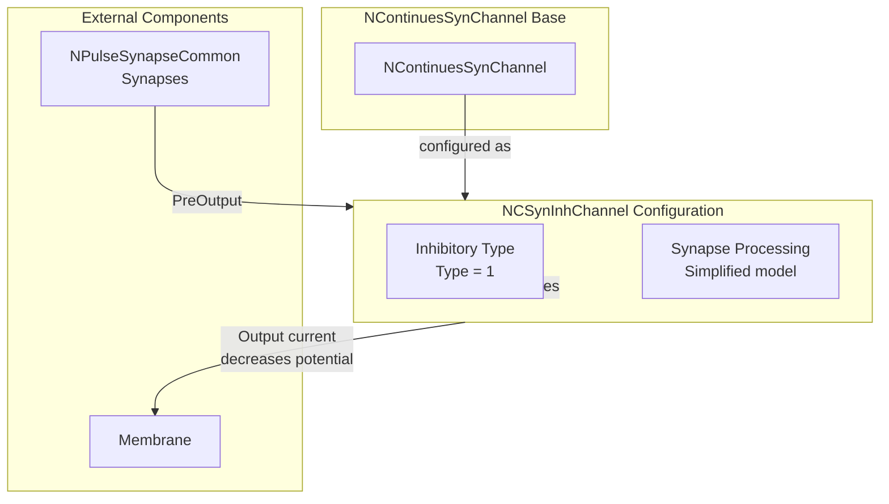

# NCSynInhChannel — тормозной непрерывный синаптический канал

## RU

### Назначение

**Класс**: `NCSynInhChannel` — конфигурационный вариант непрерывного синаптического канала с типом тормозного канала.  
**Регистрация**: `NPulseLibrary.cpp` → `UploadClass("NCSynInhChannel", ...)`.  
**Storage-инстансы**: `ClassName = "NCSynInhChannel"` в `Bin/Configs/*/Model_*.xml`.

`NCSynInhChannel` является конфигурационным вариантом базового класса `NContinuesSynChannel` с предустановленным типом тормозного канала. Создается из `NContinuesSynChannel` с настройкой:
- `Type = 1` — тормозной канал

Тормозной канал уменьшает потенциал мембраны при наличии входных сигналов от синапсов.

**Использование:** Моделирование тормозных непрерывных синаптических каналов, обработка тормозных синапсов

### UML-диаграмма классов



**Иерархия наследования:**
- `NPulseChannelCommon` — общий импульсный канал
- `NPulseChannel` — базовый импульсный канал
- `NContinuesSynChannel` — непрерывный синаптический канал
- `NCSynInhChannel` — конфигурационный вариант для тормозного канала

### Свойства

`NCSynInhChannel` использует все свойства базового класса `NContinuesSynChannel` с предустановленным значением:

**Параметры:**
- `Type = 1` — тормозной канал

**Остальные параметры по умолчанию:**
- `PulseAmplitude = 1.0`
- `SecretionTC = 0.001` (1 мс)
- `DissociationTC = 0.01` (10 мс)
- `InhibitionCoeff = 1.0`
- `SynapseResistance = 1.0e8` (100 МОм)
- `Capacity = 1.0e-9` (1 нФ)
- `Resistance = 1.0e7` (10 МОм)
- `FBResistance = 1.0e8` (100 МОм)

### Методы

`NCSynInhChannel` использует все методы базового класса `NContinuesSynChannel`.

### Примеры использования

#### Пример 1: Создание канала в коде C++

```cpp
// Создание тормозного непрерывного синаптического канала
auto channel = storage->CreateComponent("NCSynInhChannel");
channel->SetName("CSynInhChannel");

// Инициализация (использует Type = 1)
channel->Default();

// Использование
channel->Build();
```

#### Пример 2: Конфигурация XML

```xml
<Channel1 Class="NCSynInhChannel">
    <Parameters>
        <Type>1</Type>
        <Capacity>1.0e-9</Capacity>
        <Resistance>1.0e7</Resistance>
        <FBResistance>1.0e8</FBResistance>
        <PulseAmplitude>1.0</PulseAmplitude>
        <SecretionTC>0.001</SecretionTC>
        <DissociationTC>0.01</DissociationTC>
        <SynapseResistance>1.0e8</SynapseResistance>
    </Parameters>
</Channel1>
```

### Использование в конфигурациях

`NCSynInhChannel` используется в экспериментах с тормозными непрерывными синаптическими каналами:

- Моделирование тормозных непрерывных синаптических каналов
- Обработка тормозных синапсов
- Эксперименты с тормозной синаптической передачей

**Особенности:**
- Автоматически настроен как тормозной канал (`Type = 1`)
- Уменьшает потенциал мембраны при наличии входных сигналов
- Использует упрощенную модель медиатора

### См. также

- [`NContinuesSynChannel`](NContinuesSynChannel.md) — непрерывный синаптический канал (базовый класс)
- [`NCSynChannel`](NCSynChannel.md) — алиас для NContinuesSynChannel
- [`NCSynExcChannel`](NCSynExcChannel.md) — возбуждающий непрерывный синаптический канал
- [`NPulseSynChannel`](NPulseSynChannel.md) — импульсный синаптический канал
- [`NPulseChannel`](NPulseChannel.md) — базовый импульсный канал
- [Architecture.md](../Architecture.md) — архитектура библиотеки

---

## EN

### Purpose

**Class**: `NCSynInhChannel` — configuration variant of continuous synaptic channel with inhibitory channel type.  
**Registration**: `NPulseLibrary.cpp` → `UploadClass("NCSynInhChannel", ...)`.  
**Instances**: `ClassName = "NCSynInhChannel"` in `Bin/Configs/*/Model_*.xml`.

`NCSynInhChannel` is a configuration variant of the base class `NContinuesSynChannel` with preset inhibitory channel type. Created from `NContinuesSynChannel` with setting:
- `Type = 1` — inhibitory channel

Inhibitory channel decreases membrane potential when input signals from synapses are present.

**Usage:** Modeling inhibitory continuous synaptic channels, processing inhibitory synapses

### UML Class Diagram


### UML Sequence Diagram



### UML State Diagram



### UML Activity Diagram



### UML Component Diagram



### Properties

`NCSynInhChannel` uses all properties of base class `NContinuesSynChannel` with preset value:

**Parameters:**
- `Type = 1` — inhibitory channel

**Other default parameters:**
- `PulseAmplitude = 1.0`
- `SecretionTC = 0.001` (1 ms)
- `DissociationTC = 0.01` (10 ms)
- `InhibitionCoeff = 1.0`
- `SynapseResistance = 1.0e8` (100 MΩ)
- `Capacity = 1.0e-9` (1 nF)
- `Resistance = 1.0e7` (10 MΩ)
- `FBResistance = 1.0e8` (100 MΩ)

### Methods

`NCSynInhChannel` uses all methods of base class `NContinuesSynChannel`.

### Usage in configurations

`NCSynInhChannel` is used in experiments with inhibitory continuous synaptic channels:

- **Inhibitory channels**: Modeling inhibitory continuous synaptic channels
- **Inhibitory synapses**: Processing inhibitory synapses
- **Inhibitory transmission**: Experiments with inhibitory synaptic transmission

**Features:**
- Automatically configured as inhibitory channel (`Type = 1`)
- Decreases membrane potential when input signals are present
- Uses simplified mediator model

**Typical parameter values:**
- **Type**: 1 (inhibitory channel type)
- **SecretionTC**: 0.001 (1 ms time constant)
- **DissociationTC**: 0.01 (10 ms time constant)

### See Also

- [`NContinuesSynChannel`](NContinuesSynChannel.md) — continuous synaptic channel (base class)
- [`NCSynChannel`](NCSynChannel.md) — alias for NContinuesSynChannel
- [`NCSynExcChannel`](NCSynExcChannel.md) — excitatory continuous synaptic channel
- [`NPulseSynChannel`](NPulseSynChannel.md) — spiking synaptic channel
- [`NPulseChannel`](NPulseChannel.md) — base spiking channel
- [Architecture.md](../Architecture.md) — library architecture

