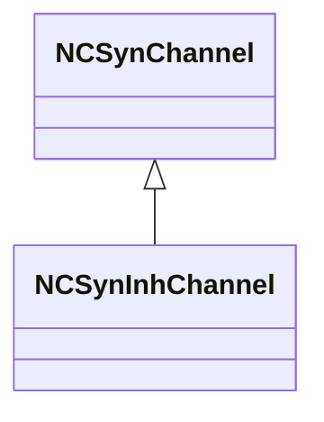
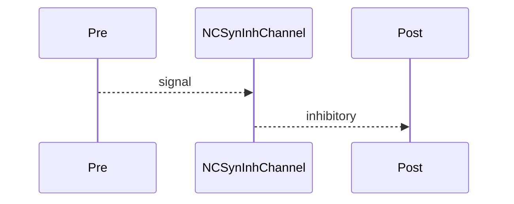

## NCSynInhChannel — тормозный синаптический канал (classic)

**Класс**: `NCSynInhChannel` — ингибирующий канал для классических синапсов.  
**Регистрация**: `NPulseLibrary.cpp` → `UploadClass("NCSynInhChannel", ...)`.  
**Storage**: `ClassName = "NCSynInhChannel"`.

### Lifecycle
- **ADefault**: параметры передачи/масштаба.
- **ABuild**: подключение pre/post.
- **AReset**: сброс.
- **ACalculate**: передача тормозного сигнала.

### I/O
- Вход: pre-сигнал.
- Выход: ингибирующий сигнал.



Пояснение: диаграмма классов показывает место компонента в иерархии и ключевые связи.



Пояснение: диаграмма последовательности показывает типовой сценарий взаимодействия и порядок вызовов.


Пояснение: блок-схема показывает поток данных/сигналов (входы → компонент → выходы).

### Config snippet

```ini
[Component]
ClassName = NCSynInhChannel
Name = CSynInh1
```

---

## NCSynInhChannel — inhibitory channel (EN)

Inhibitory classic synaptic channel.


Description: this class diagram shows the component position in the type hierarchy and key relations.


Description: this sequence diagram shows a typical runtime interaction and call order.


Description: this flowchart shows the data/signal flow (inputs → component → outputs).
