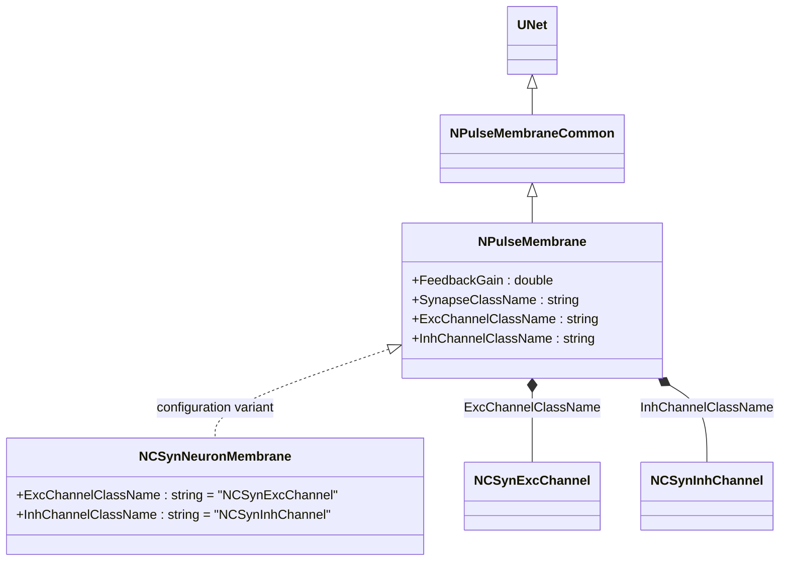
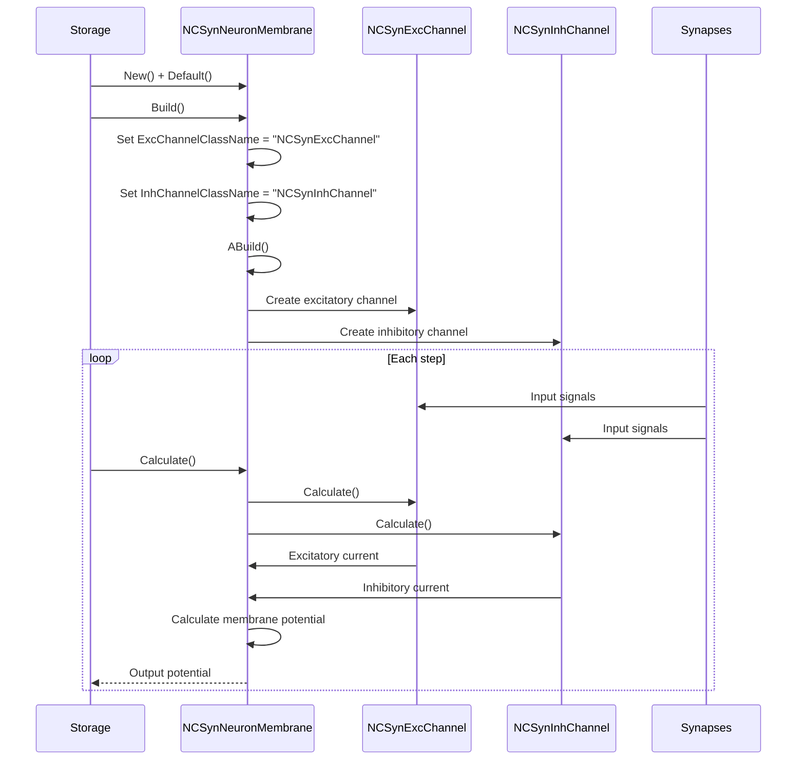
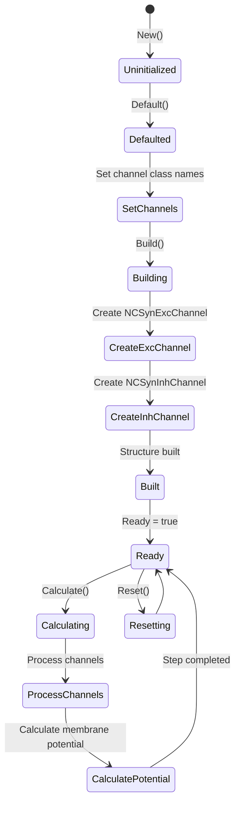
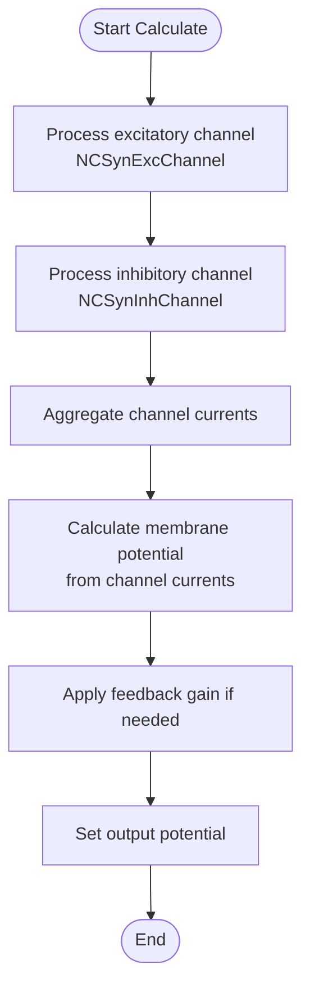

# NCSynNeuronMembrane — мембрана для непрерывных syn-нейронов

## RU

### Назначение

**Класс**: `NCSynNeuronMembrane` — конфигурационный вариант импульсной мембраны для непрерывных syn-нейронов (классических нейронов с синаптическими каналами).  
**Регистрация**: `NPulseLibrary.cpp` → `UploadClass("NCSynNeuronMembrane", ...)`.  
**Storage-инстансы**: `ClassName = "NCSynNeuronMembrane"` в `Bin/Configs/*/Model_*.xml`.

`NCSynNeuronMembrane` является конфигурационным вариантом класса `NPulseMembrane` с параметрами для непрерывных syn-нейронов. При создании компонента с `ClassName = "NCSynNeuronMembrane"` создается экземпляр `NPulseMembrane` с параметрами:
- `ExcChannelClassName = "NCSynExcChannel"` — возбуждающий непрерывный синаптический канал
- `InhChannelClassName = "NCSynInhChannel"` — тормозной непрерывный синаптический канал

**Использование:** Мембрана для непрерывных syn-нейронов, классические нейроны с синаптическими каналами

### UML-диаграмма классов



**Иерархия наследования:**
- `UNet` — базовая сеть Rdk Framework
- `NPulseMembraneCommon` — общая импульсная мембрана
- `NPulseMembrane` — базовая импульсная мембрана
- `NCSynNeuronMembrane` — конфигурационный вариант для непрерывных syn-нейронов

**Параметры конфигурации:**
- `ExcChannelClassName = "NCSynExcChannel"` — возбуждающий непрерывный синаптический канал
- `InhChannelClassName = "NCSynInhChannel"` — тормозной непрерывный синаптический канал

### Свойства

`NCSynNeuronMembrane` использует все свойства базового класса `NPulseMembrane` с параметрами:
- `ExcChannelClassName = "NCSynExcChannel"`
- `InhChannelClassName = "NCSynInhChannel"`

### Методы

`NCSynNeuronMembrane` использует все методы базового класса `NPulseMembrane`.

### Примеры использования

#### Пример 1: Создание мембраны в коде C++

```cpp
// Создание мембраны для непрерывного syn-нейрона
auto membrane = storage->CreateComponent("NCSynNeuronMembrane");
membrane->SetName("PMembrane");

// Инициализация (использует параметры по умолчанию)
membrane->Default();

// Использование
membrane->Build();
```

### См. также

- [`NPulseMembrane`](NPulseMembrane.md) — базовая импульсная мембрана (базовый класс)
- [`NPSynNeuronMembrane`](NPSynNeuronMembrane.md) — мембрана для импульсных syn-нейронов
- [`NCSynExcChannel`](NCSynExcChannel.md) — возбуждающий непрерывный синаптический канал
- [`NCSynInhChannel`](NCSynInhChannel.md) — тормозной непрерывный синаптический канал
- [Architecture.md](../Architecture.md) — архитектура библиотеки

---

## EN

### Purpose

**Class**: `NCSynNeuronMembrane` — configuration variant of spiking membrane for continuous syn-neurons (classic neurons with synaptic channels).  
**Registration**: `NPulseLibrary.cpp` → `UploadClass("NCSynNeuronMembrane", ...)`.  
**Instances**: `ClassName = "NCSynNeuronMembrane"` in `Bin/Configs/*/Model_*.xml`.

`NCSynNeuronMembrane` is a configuration variant of `NPulseMembrane` class with parameters for continuous syn-neurons. When creating a component with `ClassName = "NCSynNeuronMembrane"`, an instance of `NPulseMembrane` is created with parameters:
- `ExcChannelClassName = "NCSynExcChannel"` — excitatory continuous synaptic channel
- `InhChannelClassName = "NCSynInhChannel"` — inhibitory continuous synaptic channel

**Usage:** Membrane for continuous syn-neurons, classic neurons with synaptic channels

### UML Class Diagram


### UML Sequence Diagram



### UML State Diagram



### UML Activity Diagram



### UML Component Diagram

```mermaid
graph TB
    subgraph NPulseMembrane["NPulseMembrane Base"]
        BaseMembrane[NPulseMembrane]
    end
    
    subgraph NCSynNeuronMembrane["NCSynNeuronMembrane Configuration"]
        ExcChannelConfig[ExcChannelClassName<br/>= "NCSynExcChannel"]
        InhChannelConfig[InhChannelClassName<br/>= "NCSynInhChannel"]
    end
    
    subgraph Channels["Channels"]
        ExcChannel[NCSynExcChannel<br/>Excitatory Channel]
        InhChannel[NCSynInhChannel<br/>Inhibitory Channel]
    end
    
    subgraph External["External Components"]
        Synapses[Synapses]
        Neuron[Neuron]
    end
    
    BaseMembrane -->|configured as| NCSynNeuronMembrane
    NCSynNeuronMembrane -->|creates| ExcChannel
    NCSynNeuronMembrane -->|creates| InhChannel
    Synapses -->|Input| ExcChannel
    Synapses -->|Input| InhChannel
    ExcChannel -->|Excitatory current| NCSynNeuronMembrane
    InhChannel -->|Inhibitory current| NCSynNeuronMembrane
    NCSynNeuronMembrane -->|Output potential| Neuron
```

### Properties

`NCSynNeuronMembrane` uses all properties of base class `NPulseMembrane` with parameters:
- `ExcChannelClassName = "NCSynExcChannel"` — excitatory continuous synaptic channel
- `InhChannelClassName = "NCSynInhChannel"` — inhibitory continuous synaptic channel

**Configuration parameters:**
- `ExcChannelClassName = "NCSynExcChannel"` — preset excitatory channel class name
- `InhChannelClassName = "NCSynInhChannel"` — preset inhibitory channel class name

### Methods

`NCSynNeuronMembrane` uses all methods of base class `NPulseMembrane`.

### Usage in configurations

`NCSynNeuronMembrane` is used in experiments with continuous syn-neurons:

- **Continuous syn-neurons**: Classic neurons with synaptic channels
- **Classic models**: Used in classic (non-spiking) neural network models

**Features:**
- Automatically configured with continuous synaptic channels (`NCSynExcChannel` and `NCSynInhChannel`)
- Simplified configuration: Channel class names are preset
- Classic model: Optimized for classic (non-spiking) neuron models

**Typical parameter values:**
- **ExcChannelClassName**: "NCSynExcChannel" (excitatory continuous synaptic channel)
- **InhChannelClassName**: "NCSynInhChannel" (inhibitory continuous synaptic channel)

### See Also

- [`NPulseMembrane`](NPulseMembrane.md) — base spiking membrane (base class)
- [`NPSynNeuronMembrane`](NPSynNeuronMembrane.md) — membrane for spiking syn-neurons
- [`NCSynExcChannel`](NCSynExcChannel.md) — excitatory continuous synaptic channel
- [`NCSynInhChannel`](NCSynInhChannel.md) — inhibitory continuous synaptic channel
- [Architecture.md](../Architecture.md) — library architecture
