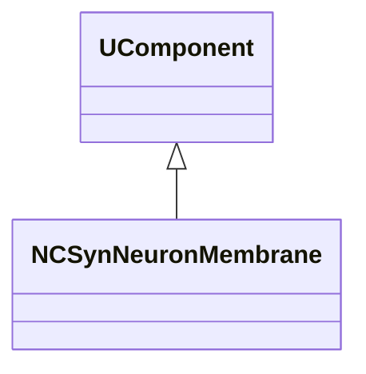
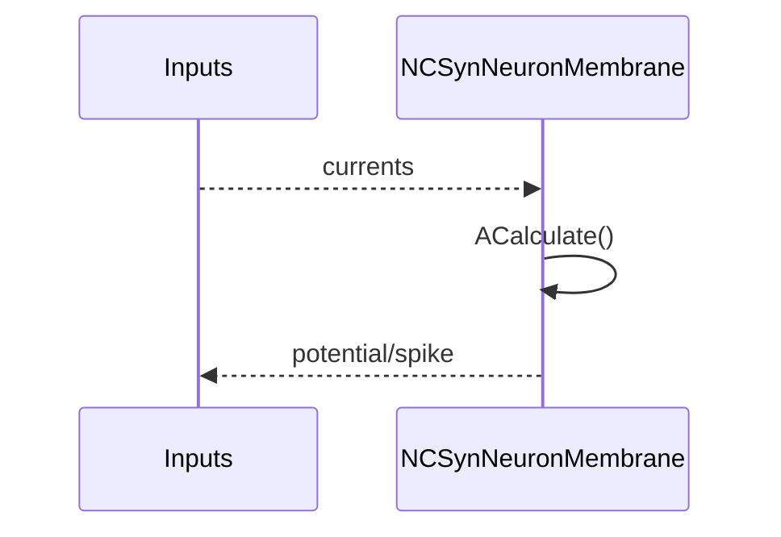
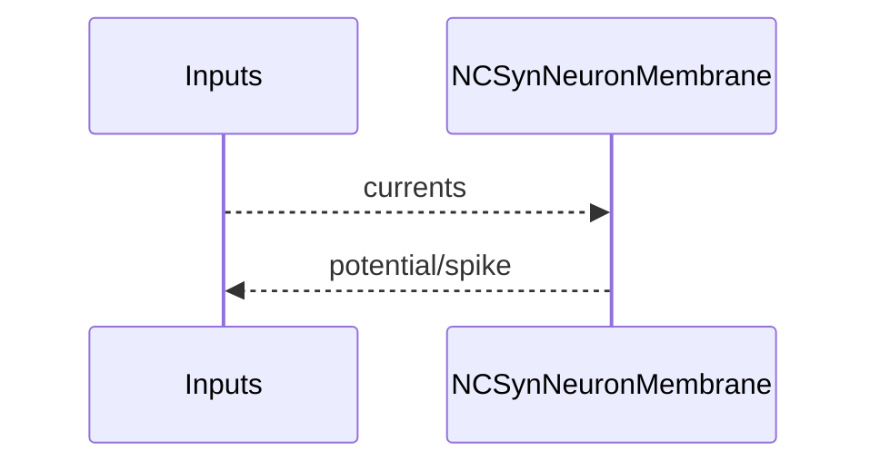

## NCSynNeuronMembrane — мембрана син. нейрона (classic)

**Класс**: `NCSynNeuronMembrane` — мембранная модель для син. нейронов (classic).  
**Регистрация**: `NPulseLibrary.cpp` → `UploadClass("NCSynNeuronMembrane", ...)`.  
**Storage**: `ClassName = "NCSynNeuronMembrane"`.

### Lifecycle
- **ADefault**: параметры мембраны.
- **ABuild**: подключение к каналам/синапсам.
- **AReset**: сброс потенциала.
- **ACalculate**: обновление потенциала/спайка.

### I/O
- Вход: токи/сигналы.
- Выход: потенциал/спайк.



Пояснение: диаграмма классов показывает место компонента в иерархии и ключевые связи.



Пояснение: диаграмма последовательности показывает типовой сценарий взаимодействия и порядок вызовов.


Пояснение: блок-схема показывает поток данных/сигналов (входы → компонент → выходы).

### Config snippet

```ini
[Component]
ClassName = NCSynNeuronMembrane
Name = CMem1
```

---

## NCSynNeuronMembrane — synaptic neuron membrane (EN)

Membrane model for synaptic/classic neurons.


Description: this class diagram shows the component position in the type hierarchy and key relations.



Description: this sequence diagram shows a typical runtime interaction and call order.


Description: this flowchart shows the data/signal flow (inputs → component → outputs).
