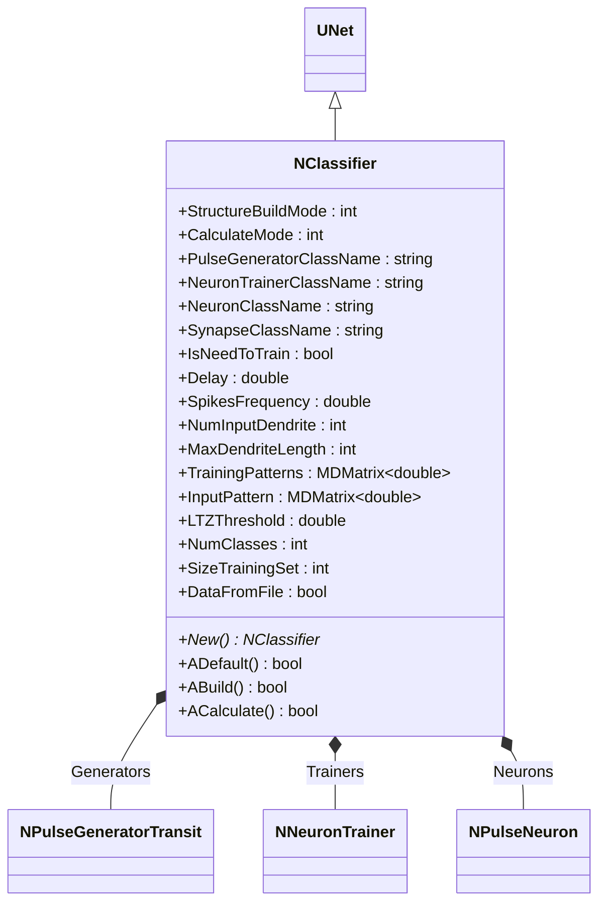
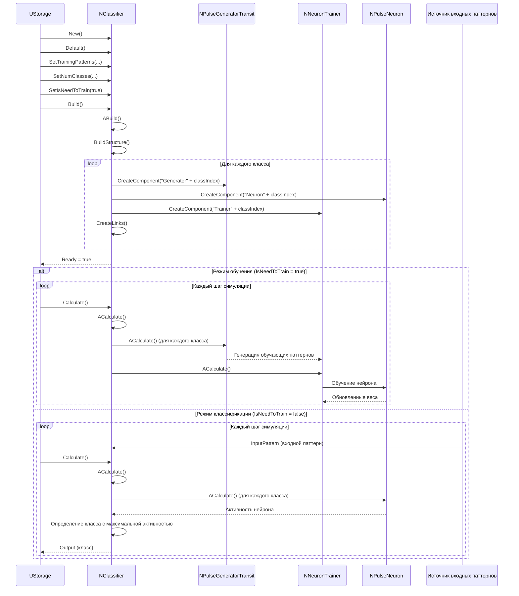
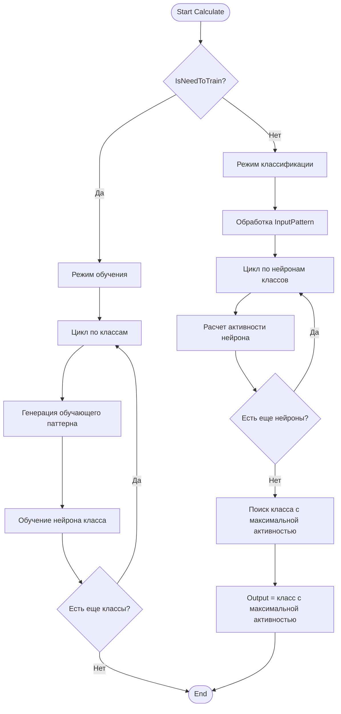
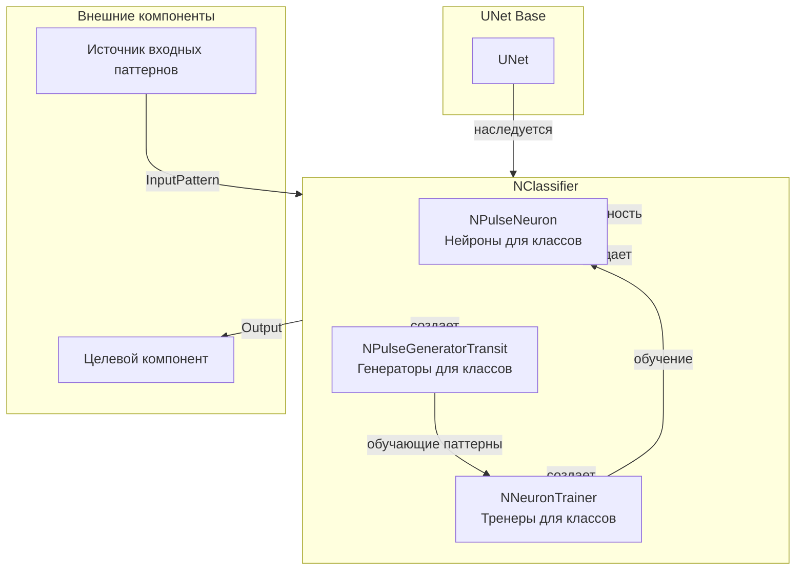
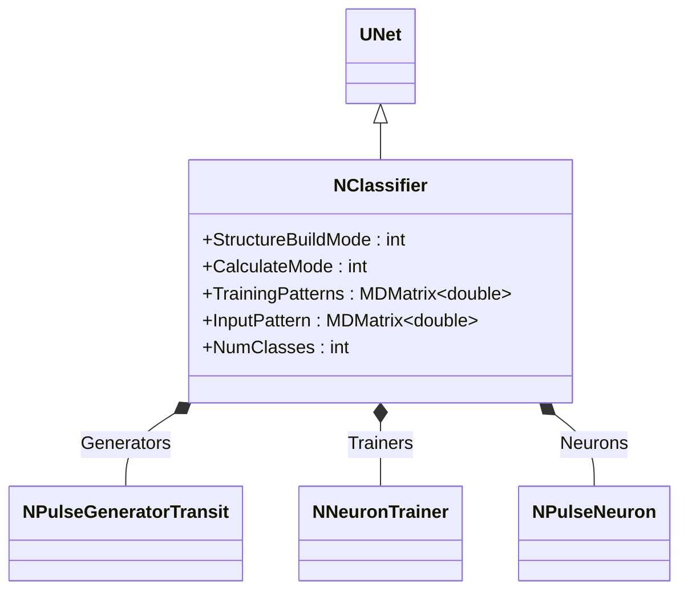
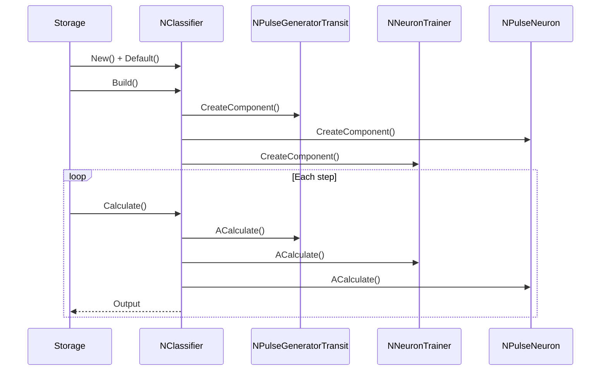
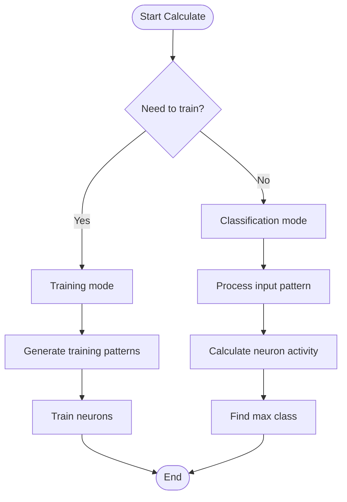
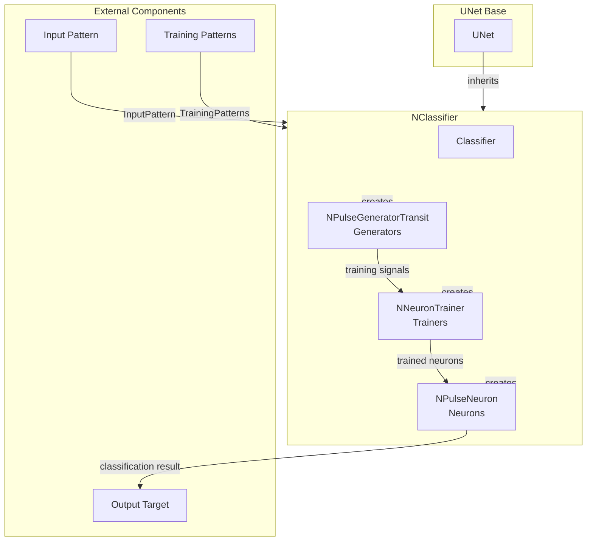

# NClassifier — классификатор

## RU

### Назначение

**Класс**: `NClassifier` — базовый классификатор для распознавания паттернов импульсов.  
**Регистрация**: `NPulseLibrary.cpp` → `UploadClass("NClassifier", ...)`.  
**Storage-инстансы**: `ClassName = "NClassifier"` в `Bin/Configs/*/Model_*.xml`.

`NClassifier` реализует классификатор, который создает группу обученных нейронов для распознавания заданных паттернов импульсов. Классификатор автоматически строит структуру нейронов, обучает их на заданных паттернах и классифицирует входные паттерны.

**Использование:** Распознавание паттернов импульсов, классификация сигналов

### UML-диаграмма классов



**Иерархия наследования:**
- `UNet` — базовая сеть Rdk Framework
- `NClassifier` — классификатор

**Связи:**
- Создает и управляет генераторами импульсов (`NPulseGeneratorTransit`)
- Создает и управляет тренерами нейронов (`NNeuronTrainer`)
- Создает и управляет нейронами (`NPulseNeuron`)

**Внутренняя структура:**
- **Generators** (`NPulseGeneratorTransit`) — генераторы импульсов для каждого класса
- **Trainers** (`NNeuronTrainer`) — тренеры для обучения нейронов
- **Neurons** (`NPulseNeuron`) — нейроны для каждого класса

### UML-диаграмма последовательности



**Жизненный цикл:**
1. **Инициализация**: Установка параметров классификатора
2. **Сборка структуры**: Создание генераторов, нейронов и тренеров для каждого класса
3. **Режим обучения**: Обучение нейронов на обучающих паттернах
4. **Режим классификации**: Классификация входных паттернов на основе активности нейронов

### UML-диаграмма состояний

```mermaid
stateDiagram-v2
    [*] --> Uninitialized: New()
    Uninitialized --> Defaulted: Default()
    Defaulted --> Building: Build()
    Building --> CreatingGenerators: Создание генераторов
    CreatingGenerators --> CreatingNeurons: Создание нейронов
    CreatingNeurons --> CreatingTrainers: Создание тренеров
    CreatingTrainers --> Linking: Создание связей
    Linking --> Built: Структура построена
    Built --> Ready: Ready = true
    Ready --> Calculating: Calculate()
    Calculating --> CheckMode{IsNeedToTrain?}
    CheckMode -->|Да| Training: Режим обучения
    CheckMode -->|Нет| Classification: Режим классификации
    Training --> GeneratePatterns: Генерация обучающих паттернов
    GeneratePatterns --> TrainNeurons: Обучение нейронов
    TrainNeurons --> Ready: Шаг завершен
    Classification --> ProcessInput: Обработка InputPattern
    ProcessInput --> CalcNeurons: Расчет активности нейронов
    CalcNeurons --> FindMax: Поиск класса с максимальной активностью
    FindMax --> Ready: Шаг завершен
    Ready --> Resetting: Reset()
    Resetting --> Ready: Состояния сброшены
```

**Состояния:**
- **Uninitialized** — создан, но не инициализирован
- **Defaulted** — параметры установлены по умолчанию
- **Building** — выполняется сборка структуры
- **CreatingGenerators** — создание генераторов импульсов
- **CreatingNeurons** — создание нейронов для классов
- **CreatingTrainers** — создание тренеров нейронов
- **Linking** — создание связей между компонентами
- **Built** — структура классификатора построена
- **Ready** — готов к выполнению расчетов
- **Calculating** — выполняется расчет классификатора
- **Training** — режим обучения
- **GeneratePatterns** — генерация обучающих паттернов
- **TrainNeurons** — обучение нейронов
- **Classification** — режим классификации
- **ProcessInput** — обработка входного паттерна
- **CalcNeurons** — расчет активности нейронов
- **FindMax** — поиск класса с максимальной активностью
- **Resetting** — выполняется сброс состояний

### UML-диаграмма активности



**Алгоритм расчета:**
1. Проверка режима работы: обучение или классификация
2. **Режим обучения**:
   - Генерация обучающих паттернов для каждого класса
   - Обучение нейронов на соответствующих паттернах
3. **Режим классификации**:
   - Обработка входного паттерна
   - Расчет активности нейронов для каждого класса
   - Определение класса с максимальной активностью

### UML-диаграмма компонентов



**Зависимости:**
- **Базовый класс**: `UNet`
- **Внутренние компоненты**: генераторы импульсов (`NPulseGeneratorTransit`), тренеры нейронов (`NNeuronTrainer`), нейроны (`NPulseNeuron`)
- **Внешние компоненты**: источник входных паттернов (источник `InputPattern`), целевой компонент (получатель `Output`)

### Свойства

#### Параметры (ptPubParameter)

- **`StructureBuildMode`** (int) — режим сборки структуры:
  - 0 — не пересобирать
  - 1 — пересобрать структуру
  - 2 — пересобрать структуру с обучением
  Значение по умолчанию: зависит от реализации

- **`CalculateMode`** (int) — режим расчета:
  - 0 — обычный
  - 1 — обучение
  - 2 — классификация
  Значение по умолчанию: зависит от реализации

- **`PulseGeneratorClassName`** (string) — имя класса генератора импульсов. Значение по умолчанию: зависит от реализации

- **`NeuronTrainerClassName`** (string) — имя класса тренера нейронов. Значение по умолчанию: зависит от реализации

- **`NeuronClassName`** (string) — имя класса нейронов. Значение по умолчанию: зависит от реализации

- **`SynapseClassName`** (string) — имя класса синапсов. Значение по умолчанию: зависит от реализации

- **`IsNeedToTrain`** (bool) — флаг необходимости обучения. Значение по умолчанию: зависит от реализации

- **`Delay`** (double) — задержка начала обучения (сек). Значение по умолчанию: зависит от реализации

- **`SpikesFrequency`** (double) — частота спайков генераторов (Гц). Значение по умолчанию: зависит от реализации

- **`NumInputDendrite`** (int) — количество входных дендритов. Значение по умолчанию: зависит от реализации

- **`MaxDendriteLength`** (int) — максимальная длина дендрита. Значение по умолчанию: зависит от реализации

- **`TrainingPatterns`** (MDMatrix<double>) — матрица обучающих паттернов. Каждая строка — паттерн для одного класса. Значение по умолчанию: зависит от реализации

- **`InputPattern`** (MDMatrix<double>) — входной паттерн для классификации. Значение по умолчанию: зависит от реализации

- **`LTZThreshold`** (double) — порог LT-зоны. Значение по умолчанию: зависит от реализации

- **`NumClasses`** (int) — количество классов для классификации. Значение по умолчанию: зависит от реализации

- **`SizeTrainingSet`** (int) — размер обучающего набора. Значение по умолчанию: зависит от реализации

- **`DataFromFile`** (bool) — флаг чтения данных из файла. Значение по умолчанию: зависит от реализации

### Методы

- **`ABuild()`** → `bool` — строит структуру классификатора:
  1. Создает генераторы импульсов для каждого класса
  2. Создает нейроны для каждого класса
  3. Создает тренеры для обучения нейронов
  4. Настраивает связи между компонентами

- **`ACalculate()`** → `bool` — выполняет расчет классификатора:
  1. Если `IsNeedToTrain = true`, выполняет обучение
  2. Если `IsNeedToTrain = false`, выполняет классификацию входного паттерна
  3. Определяет класс входного паттерна на основе активности нейронов

### Примеры использования

#### Пример 1: Создание классификатора в коде C++

```cpp
// Создание классификатора
auto classifier = storage->CreateComponent<NClassifier>();
classifier->SetName("Classifier");

// Инициализация
classifier->Default();

// Настройка параметров
classifier->NumClasses = 3;
classifier->NumInputDendrite = 10;
classifier->MaxDendriteLength = 5;
classifier->IsNeedToTrain = true;
classifier->SpikesFrequency = 10.0;

// Загрузка обучающих паттернов
MDMatrix<double> patterns(3, 10);  // 3 класса, 10 признаков
// ... заполнение patterns ...
classifier->TrainingPatterns = patterns;

// Сборка (создает структуру и обучает)
classifier->Build();
```

## Источники

См. [Literature-References.md](../Literature-References.md): **1**, **6**, **8**, **9**, **10**.

### См. также

- [`NSpikeClassifier`](NSpikeClassifier.md) — классификатор по спайкам
- [`NPCAClassifier`](NPCAClassifier.md) — классификатор PCA
- [`NNeuronTrainer`](NNeuronTrainer.md) — тренер нейронов
- [`NPulseNeuron`](NPulseNeuron.md) — импульсный нейрон
- [Architecture.md](../Architecture.md) — архитектура библиотеки

---

## EN

### Purpose

**Class**: `NClassifier` — base classifier for pattern recognition.  
**Registration**: `NPulseLibrary.cpp` → `UploadClass("NClassifier", ...)`.  
**Instances**: `ClassName = "NClassifier"` in `Bin/Configs/*/Model_*.xml`.

`NClassifier` implements classifier that creates group of trained neurons for recognizing specified pulse patterns. Classifier automatically builds neuron structure, trains them on specified patterns, and classifies input patterns.

**Usage:** Pattern recognition, signal classification

### UML Class Diagram



### UML Sequence Diagram



### UML State Diagram

```mermaid
stateDiagram-v2
    [*] --> Uninitialized: New()
    Uninitialized --> Defaulted: Default()
    Defaulted --> Building: Build()
    Building --> CreatingComponents: Create components
    CreatingComponents --> Built: Structure built
    Built --> Ready: Ready = true
    Ready --> Calculating: Calculate()
    Calculating --> CheckMode{Need to train?}
    CheckMode -->|Yes| Training: Training mode
    CheckMode -->|No| Classification: Classification mode
    Training --> TrainNeurons: Train neurons
    TrainNeurons --> Ready: Step completed
    Classification --> CalcNeurons: Calculate neuron activity
    CalcNeurons --> FindMax: Find max class
    FindMax --> Ready: Step completed
    Ready --> Resetting: Reset()
    Resetting --> Ready
```

### UML Activity Diagram



### UML Component Diagram



### Properties

- `StructureBuildMode` — режим пересборки структуры
- `CalculateMode` — режим расчета
- `PulseGeneratorClassName` — имя класса генератора импульсов
- `NeuronTrainerClassName` — имя класса тренера нейронов
- `NeuronClassName` — имя класса нейрона
- `SynapseClassName` — имя класса синапса
- `IsNeedToTrain` — необходимость обучения
- `TrainingPatterns` — паттерны для обучения
- `InputPattern` — входной паттерн для классификации
- `LTZThreshold` — порог LT-зоны
- `NumClasses` — количество классов
- `SizeTrainingSet` — размер обучающего набора
- `DataFromFile` — загрузка данных из файла

### Methods

- `ADefault()` — установка параметров по умолчанию
- `ABuild()` — сборка структуры классификатора
- `ACalculate()` — выполнение шага классификации или обучения
- `BuildStructure()` — построение структуры нейронов и тренеров

### Usage in configurations

`NClassifier` is used for pattern recognition and classification:

- **Pattern recognition**: `Bin/Configs/*/Model_*.xml` (where pattern classification is required)
- **Neuron training**: experiments with training neurons on specific patterns
- **Classification**: real-time classification of input patterns

**Features:**
- Automatic structure building: creates neurons and trainers for each class
- Training mode: trains neurons on provided patterns
- Classification mode: classifies input patterns using trained neurons
- Flexible configuration: supports various neuron and synapse types

**Typical parameter values:**
- **NeuronClassName**: "NPulseNeuron" (spiking neuron)
- **NeuronTrainerClassName**: "NNeuronTrainer" (neuron trainer)
- **PulseGeneratorClassName**: "NPulseGeneratorTransit" (transit pulse generator)
- **SynapseClassName**: "NPulseSynapse" (pulse synapse)

### References

See [Literature-References.md](../Literature-References.md): **1**, **6**, **8**, **9**, **10**.

### See Also

- [`NSpikeClassifier`](NSpikeClassifier.md) — spike-based classifier
- [`NPCAClassifier`](NPCAClassifier.md) — PCA classifier
- [`NNeuronTrainer`](NNeuronTrainer.md) — neuron trainer
- [`NPulseNeuron`](NPulseNeuron.md) — spiking neuron
- [Architecture.md](../Architecture.md) — library architecture
