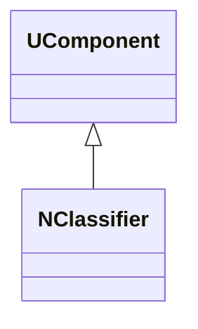
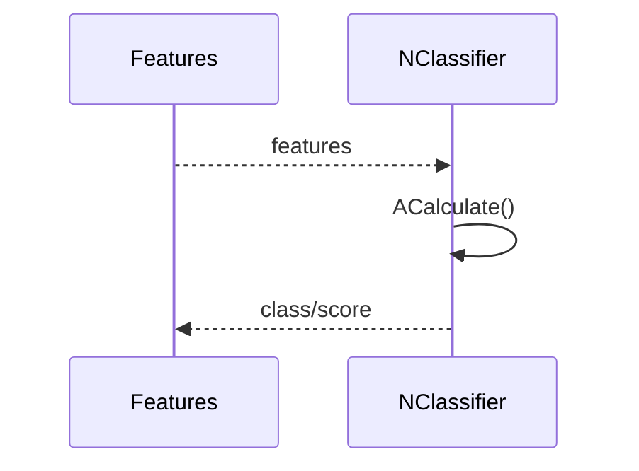
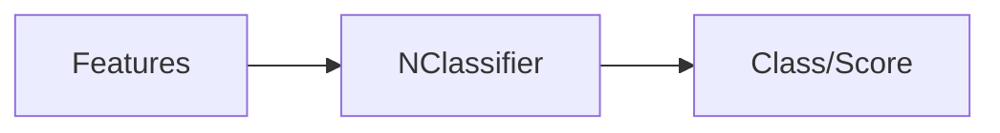
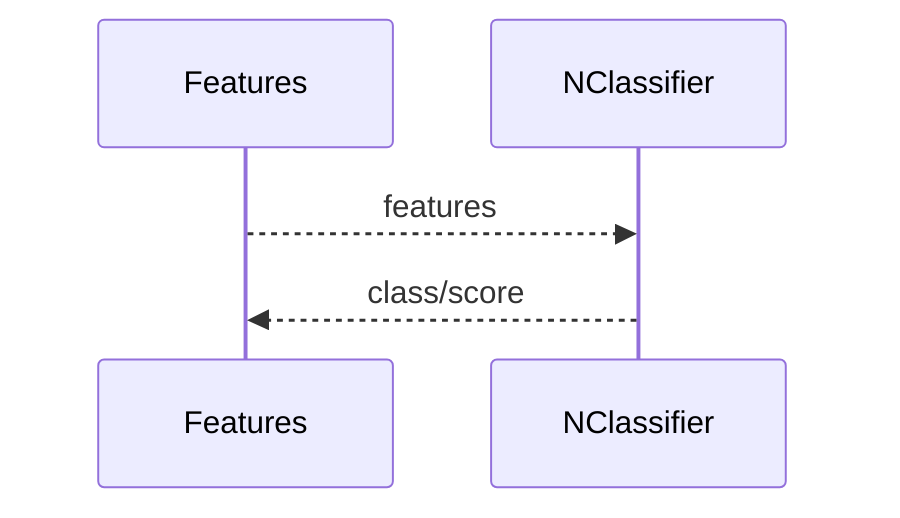

## NClassifier — классификатор (Nmsdk-PulseLib)

**Класс**: `NClassifier` — базовый классификатор по активности/признакам сети.  
**Регистрация**: `NPulseLibrary.cpp` → `UploadClass("NClassifier", ...)`.  
**Storage**: `ClassName = "NClassifier"`.

### Lifecycle
- **ADefault**: инициализация параметров классификации.
- **ABuild**: подключение входных признаков.
- **AReset**: сброс состояния/статистик.
- **ACalculate**: вычисление класса/скор.

### I/O
- Вход: признаки/активность.
- Выход: метка класса/скор.



Пояснение: диаграмма классов показывает место компонента в иерархии и ключевые связи.



Пояснение: диаграмма последовательности показывает типовой сценарий взаимодействия и порядок вызовов.



Пояснение: блок-схема показывает поток данных/сигналов (входы → компонент → выходы).

### Config snippet

```ini
[Component]
ClassName = NClassifier
Name = Classifier1
```

---

## NClassifier — classifier (EN)

Base classifier consuming features and producing class/score.


Description: this class diagram shows the component position in the type hierarchy and key relations.



Description: this sequence diagram shows a typical runtime interaction and call order.


Description: this flowchart shows the data/signal flow (inputs → component → outputs).
