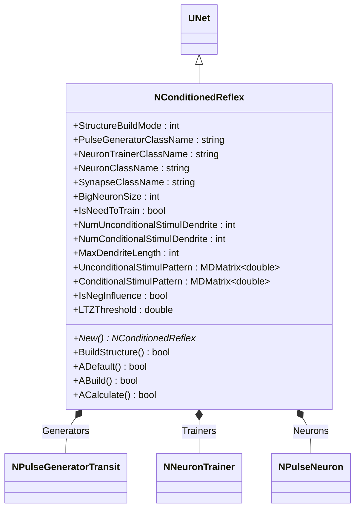
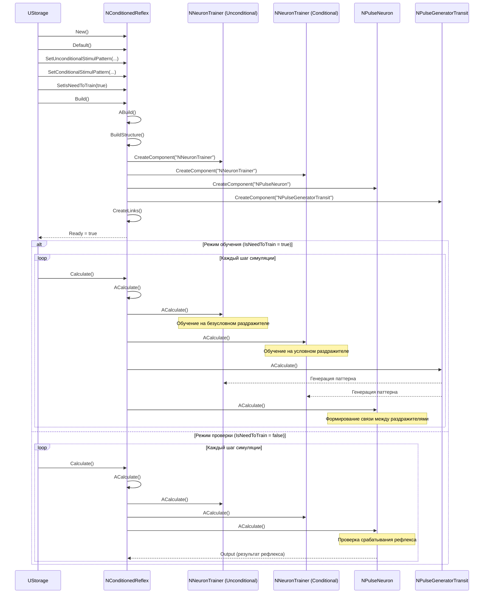
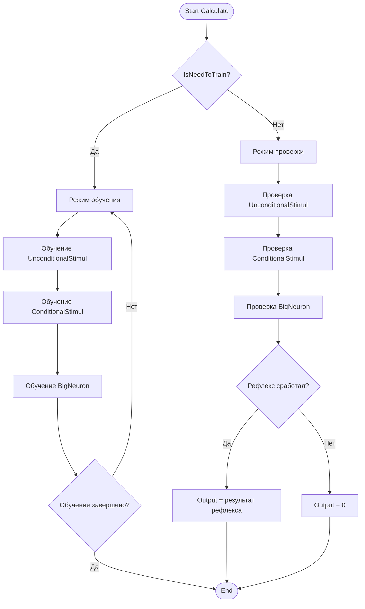
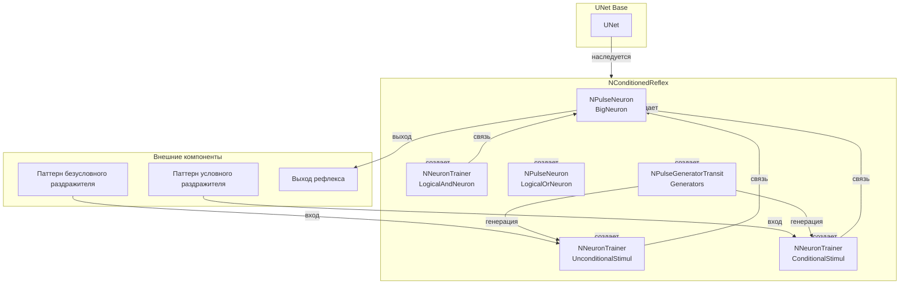
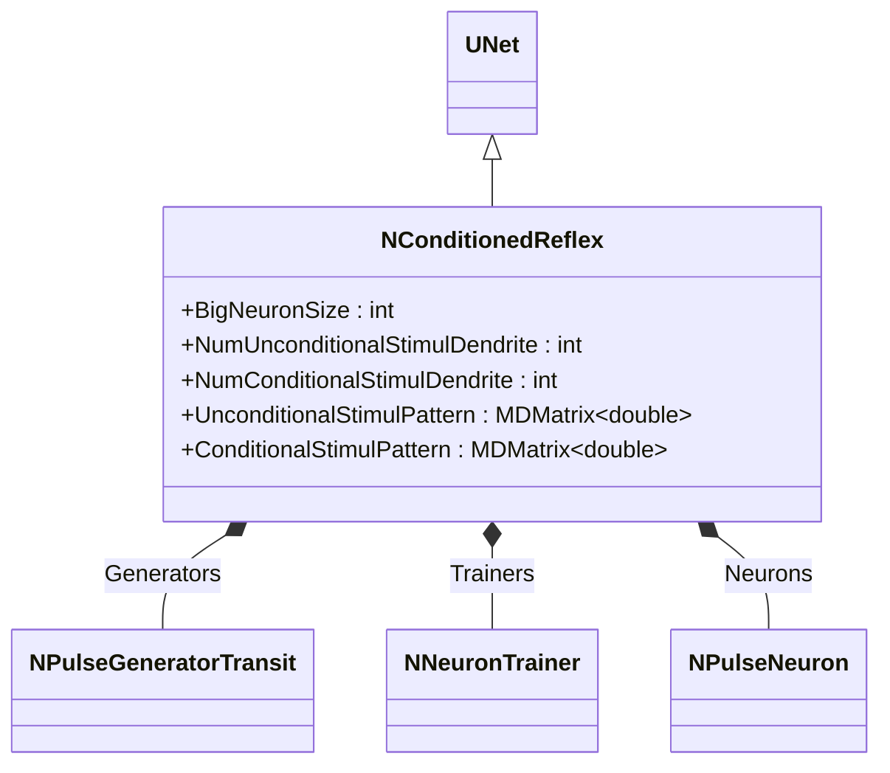
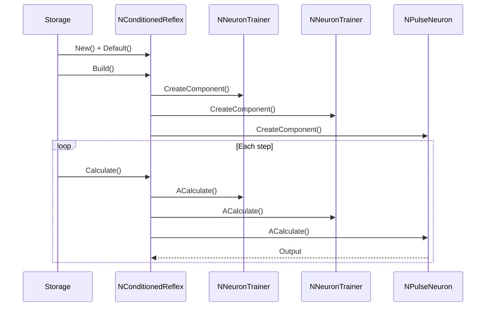
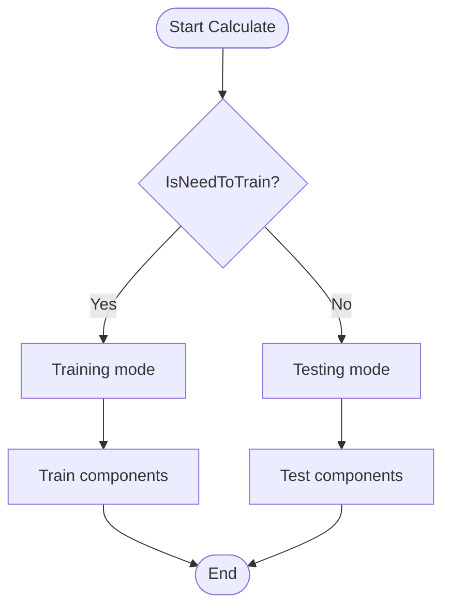
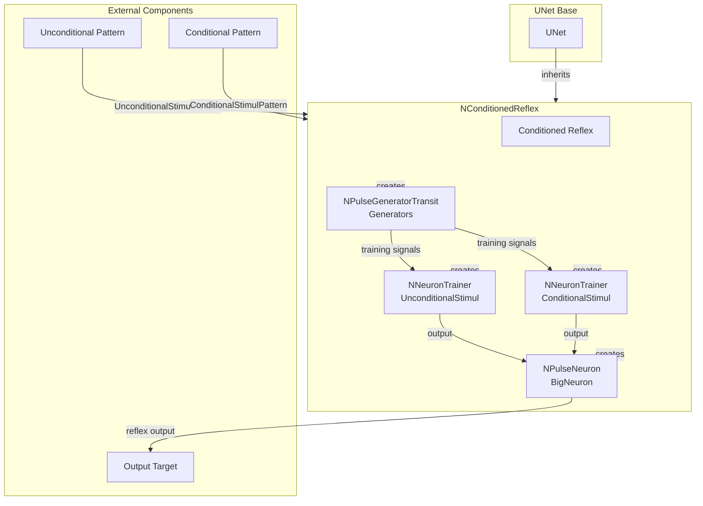

# NConditionedReflex — условный рефлекс

## RU

### Назначение

**Класс**: `NConditionedReflex` — компонент для моделирования условного рефлекса.  
**Регистрация**: `NPulseLibrary.cpp` → `UploadClass("NConditionedReflex", ...)`.  
**Storage-инстансы**: `ClassName = "NConditionedReflex"` в `Bin/Configs/*/Model_*.xml`.

`NConditionedReflex` реализует модель условного рефлекса, создавая группу нейронов для моделирования условного и безусловного раздражителей. Классический условный рефлекс формируется при совместном предъявлении условного и безусловного раздражителей, что приводит к образованию связи между ними.

**Использование:** Моделирование условных рефлексов, обучение ассоциациям

### UML-диаграмма классов



**Иерархия наследования:**
- `UNet` — базовая сеть Rdk Framework
- `NConditionedReflex` — условный рефлекс

**Внутренняя структура:**
- **UnconditionalStimul** (`NNeuronTrainer`) — нейрон-тренер для безусловного раздражителя
- **ConditionalStimul** (`NNeuronTrainer`) — нейрон-тренер для условного раздражителя
- **LogicalAndNeuron** (`NNeuronTrainer`) — нейрон-тренер для логической операции И
- **BigNeuron** (`NPulseNeuron`) — большой выходной нейрон рефлекса
- **LogicalOrNeuron** (`NPulseNeuron`) — нейрон для логической операции ИЛИ
- **Generators** (`NPulseGeneratorTransit`) — генераторы импульсов для обучения

### UML-диаграмма последовательности



**Жизненный цикл:**
1. **Инициализация**: Установка параметров условного рефлекса
2. **Сборка структуры**: Создание нейронов-тренеров, большого нейрона, генераторов
3. **Режим обучения**: Совместное предъявление условного и безусловного раздражителей
4. **Режим проверки**: Проверка срабатывания рефлекса при предъявлении условного раздражителя

### UML-диаграмма состояний

```mermaid
stateDiagram-v2
    [*] --> Uninitialized: New()
    Uninitialized --> Defaulted: Default()
    Defaulted --> Building: Build()
    Building --> CreatingTrainers: Создание нейронов-тренеров
    CreatingTrainers --> CreatingBigNeuron: Создание большого нейрона
    CreatingBigNeuron --> CreatingGenerators: Создание генераторов
    CreatingGenerators --> Linking: Создание связей
    Linking --> Built: Структура построена
    Built --> Ready: Ready = true
    Ready --> CheckMode{IsNeedToTrain?}
    CheckMode -->|Да| Training: Режим обучения
    CheckMode -->|Нет| Testing: Режим проверки
    Training --> TrainUnconditional: Обучение безусловного
    TrainUnconditional --> TrainConditional: Обучение условного
    TrainConditional --> TrainBigNeuron: Обучение большого нейрона
    TrainBigNeuron --> CheckTrained{Обучение завершено?}
    CheckTrained -->|Нет| Training
    CheckTrained -->|Да| Ready: Обучение завершено
    Testing --> TestUnconditional: Проверка безусловного
    TestUnconditional --> TestConditional: Проверка условного
    TestConditional --> TestBigNeuron: Проверка большого нейрона
    TestBigNeuron --> Ready: Шаг завершен
    Ready --> Resetting: Reset()
    Resetting --> Ready: Состояния сброшены
```

**Состояния:**
- **Uninitialized** — создан, но не инициализирован
- **Defaulted** — параметры установлены по умолчанию
- **Building** — выполняется сборка структуры
- **CreatingTrainers** — создание нейронов-тренеров
- **CreatingBigNeuron** — создание большого нейрона
- **CreatingGenerators** — создание генераторов
- **Linking** — создание связей между компонентами
- **Built** — структура рефлекса построена
- **Ready** — готов к выполнению расчетов
- **Training** — режим обучения
- **TrainUnconditional** — обучение безусловного раздражителя
- **TrainConditional** — обучение условного раздражителя
- **TrainBigNeuron** — обучение большого нейрона
- **CheckTrained** — проверка завершения обучения
- **Testing** — режим проверки
- **TestUnconditional** — проверка безусловного раздражителя
- **TestConditional** — проверка условного раздражителя
- **TestBigNeuron** — проверка большого нейрона
- **Resetting** — выполняется сброс состояний

### UML-диаграмма активности



**Алгоритм расчета:**
1. Проверка режима работы: обучение или проверка
2. **Режим обучения**:
   - Обучение нейрона безусловного раздражителя
   - Обучение нейрона условного раздражителя
   - Обучение большого нейрона (формирование связи)
3. **Режим проверки**:
   - Проверка срабатывания безусловного раздражителя
   - Проверка срабатывания условного раздражителя
   - Проверка срабатывания большого нейрона (рефлекса)
4. Генерация выходного сигнала

### UML-диаграмма компонентов



**Зависимости:**
- **Базовый класс**: `UNet`
- **Внутренние компоненты**: `NNeuronTrainer` (тренеры для раздражителей), `NPulseNeuron` (большой нейрон), `NPulseGeneratorTransit` (генераторы)
- **Внешние компоненты**: паттерны раздражителей (источники входных данных), выход рефлекса (получатель результатов)

### Свойства

#### Параметры (ptPubParameter)

- **`BigNeuronSize`** (int) — размер "большого" нейрона (выходного нейрона рефлекса). Значение по умолчанию: зависит от реализации

- **`NumUnconditionalStimulDendrite`** (int) — количество входных дендритов для нейрона безусловного раздражителя. Значение по умолчанию: зависит от реализации

- **`NumConditionalStimulDendrite`** (int) — количество входных дендритов для нейрона условного раздражителя. Значение по умолчанию: зависит от реализации

- **`UnconditionalStimulPattern`** (MDMatrix<double>) — паттерн безусловного раздражителя. Значение по умолчанию: зависит от реализации

- **`ConditionalStimulPattern`** (MDMatrix<double>) — паттерн условного раздражителя. Значение по умолчанию: зависит от реализации

- **`IsNegInfluence`** (bool) — флаг отрицательного влияния. Если `true`, условный раздражитель оказывает тормозное влияние. Значение по умолчанию: зависит от реализации

**Остальные параметры аналогичны `NClassifier`.**

### Методы

- **`BuildStructure()`** → `bool` — строит структуру условного рефлекса:
  1. Создает нейрон безусловного раздражителя
  2. Создает нейрон условного раздражителя
  3. Создает выходной нейрон (большой нейрон)
  4. Настраивает связи между нейронами

- **`ACalculate()`** → `bool` — выполняет расчет условного рефлекса:
  1. Если `IsNeedToTrain = true`, выполняет обучение (совместное предъявление условного и безусловного раздражителей)
  2. Если `IsNeedToTrain = false`, проверяет срабатывание рефлекса

### Использование в конфигурациях

`NConditionedReflex` используется в экспериментах с условными рефлексами:

- **Условные рефлексы**: `Bin/Configs/!OldConfigs/OldExperiments/ConditionedReflex/`

**Типичные значения параметров:**
- **StructureBuildMode**: 0 (без пересборки), 1 (классическая структура), 2 (расширенная структура)
- **PulseGeneratorClassName**: "NPulseGeneratorTransit" (генератор импульсов)
- **NeuronTrainerClassName**: "NNeuronTrainer" (тренер нейронов)
- **NeuronClassName**: "NPulseNeuron" (импульсный нейрон)
- **SynapseClassName**: "NPulseSynapse" (импульсный синапс)
- **BigNeuronSize**: 1-5 (размер большого нейрона)
- **IsNeedToTrain**: true (режим обучения), false (режим проверки)
- **NumUnconditionalStimulDendrite**: 1-10 (количество дендритов для безусловного раздражителя)
- **NumConditionalStimulDendrite**: 1-10 (количество дендритов для условного раздражителя)
- **IsNegInfluence**: false (возбуждающее влияние), true (тормозное влияние)

## Источники

См. [Literature-References.md](../Literature-References.md): **1**, **6**, **8**, **9**, **10**.

### См. также

- [`NPainReflexSimple`](NPainReflexSimple.md) — простой болевой рефлекс
- [`NNeuronTrainer`](NNeuronTrainer.md) — тренер нейронов
- [`NPulseNeuron`](NPulseNeuron.md) — импульсный нейрон
- [`NPulseGeneratorTransit`](NPulseGeneratorTransit.md) — генератор импульсов
- [Architecture.md](../Architecture.md) — архитектура библиотеки

---

## EN

### Purpose

**Class**: `NConditionedReflex` — component for modeling conditioned reflex.  
**Registration**: `NPulseLibrary.cpp` → `UploadClass("NConditionedReflex", ...)`.  
**Instances**: `ClassName = "NConditionedReflex"` in `Bin/Configs/*/Model_*.xml`.

`NConditionedReflex` implements conditioned reflex model, creating group of neurons for modeling conditional and unconditional stimuli. Classical conditioned reflex is formed when conditional and unconditional stimuli are presented together, leading to association formation.

**Usage:** Modeling conditioned reflexes, learning associations

### UML Class Diagram



### UML Sequence Diagram



### UML State Diagram

```mermaid
stateDiagram-v2
    [*] --> Uninitialized: New()
    Uninitialized --> Defaulted: Default()
    Defaulted --> Building: Build()
    Building --> Built: Structure built
    Built --> Ready: Ready = true
    Ready --> CheckMode{IsNeedToTrain?}
    CheckMode -->|Yes| Training: Training mode
    CheckMode -->|No| Testing: Testing mode
    Training --> Ready: Step completed
    Testing --> Ready: Step completed
    Ready --> Resetting: Reset()
    Resetting --> Ready
```

### UML Activity Diagram



### UML Component Diagram



### Properties

- `StructureBuildMode` — режим пересборки структуры
- `PulseGeneratorClassName` — имя класса генератора импульсов
- `NeuronTrainerClassName` — имя класса тренера нейронов
- `NeuronClassName` — имя класса нейрона
- `SynapseClassName` — имя класса синапса
- `BigNeuronSize` — размер большого нейрона
- `IsNeedToTrain` — необходимость обучения
- `NumUnconditionalStimulDendrite` — количество дендритов для безусловного стимула
- `NumConditionalStimulDendrite` — количество дендритов для условного стимула
- `MaxDendriteLength` — максимальная длина дендрита
- `UnconditionalStimulPattern` — паттерн безусловного стимула
- `ConditionalStimulPattern` — паттерн условного стимула
- `IsNegInfluence` — отрицательное влияние
- `LTZThreshold` — порог LT-зоны

### Methods

- `ADefault()` — установка параметров по умолчанию
- `ABuild()` — сборка структуры рефлекса
- `ACalculate()` — выполнение шага обучения или проверки
- `BuildStructure()` — построение структуры нейронов и тренеров

### Usage in configurations

`NConditionedReflex` is used for modeling conditioned reflexes:

- **Conditioned reflexes**: `Bin/Configs/*/Model_*.xml` (where conditioned reflex modeling is required)
- **Association learning**: experiments with learning associations between stimuli
- **Reflex training**: training reflexes on conditional and unconditional stimuli

**Features:**
- Automatic structure building: creates neurons and trainers for stimuli
- Training mode: trains neurons on conditional and unconditional stimuli
- Testing mode: tests trained reflex responses
- Flexible configuration: supports various neuron and synapse types

**Typical parameter values:**
- **NeuronClassName**: "NPulseNeuron" (spiking neuron)
- **NeuronTrainerClassName**: "NNeuronTrainer" (neuron trainer)
- **PulseGeneratorClassName**: "NPulseGeneratorTransit" (transit pulse generator)
- **SynapseClassName**: "NPulseSynapse" (pulse synapse)

### References

See [Literature-References.md](../Literature-References.md): **1**, **6**, **8**, **9**, **10**.

### See Also

- [`NPainReflexSimple`](NPainReflexSimple.md) — simple pain reflex
- [`NNeuronTrainer`](NNeuronTrainer.md) — neuron trainer
- [`NPulseNeuron`](NPulseNeuron.md) — spiking neuron
- [`NPulseGeneratorTransit`](NPulseGeneratorTransit.md) — pulse generator
- [Architecture.md](../Architecture.md) — library architecture
