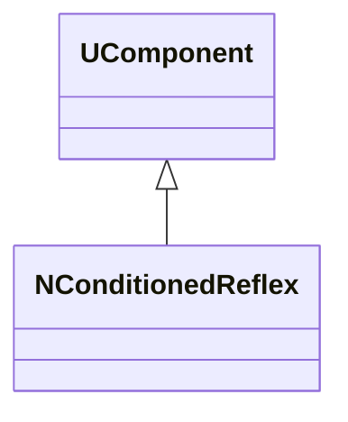
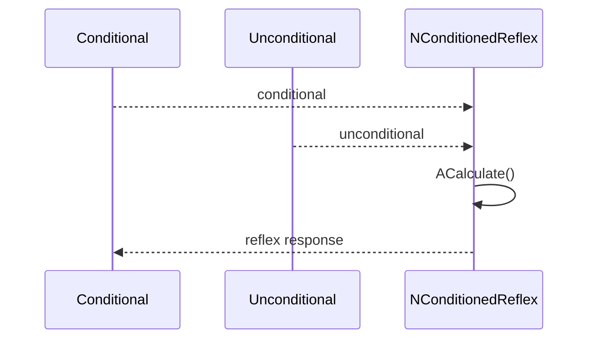
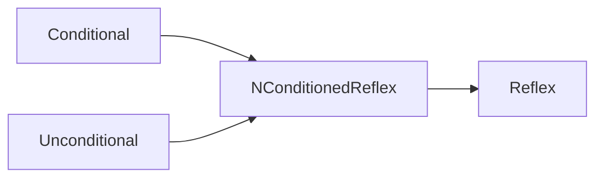
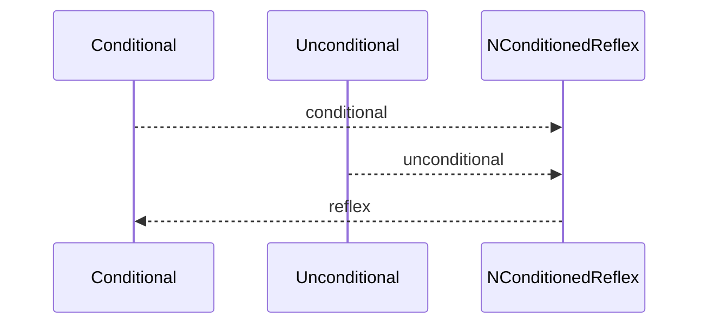

## NConditionedReflex — условный рефлекс (Nmsdk-PulseLib)

**Класс**: `NConditionedReflex` — реализует условный рефлекс на основе активности/сигналов.  
**Регистрация**: `NPulseLibrary.cpp` → `UploadClass("NConditionedReflex", ...)`.  
**Storage**: `ClassName = "NConditionedReflex"`.

### Lifecycle
- **ADefault**: параметры рефлекса (усиление/порог).
- **ABuild**: подключение условных/безусловных сигналов.
- **AReset**: сброс состояния.
- **ACalculate**: срабатывание рефлекса при выполнении условий.

### I/O
- Вход: условный сигнал, безусловный сигнал.
- Выход: реакция/рефлекторный отклик.



Пояснение: диаграмма классов показывает место компонента в иерархии и ключевые связи.



Пояснение: диаграмма последовательности показывает типовой сценарий взаимодействия и порядок вызовов.



Пояснение: блок-схема показывает поток данных/сигналов (входы → компонент → выходы).

### Config snippet

```ini
[Component]
ClassName = NConditionedReflex
Name = Reflex1
```

---

## NConditionedReflex — conditioned reflex (EN)

Implements conditioned reflex combining conditional/unconditional signals.


Description: this class diagram shows the component position in the type hierarchy and key relations.



Description: this sequence diagram shows a typical runtime interaction and call order.


Description: this flowchart shows the data/signal flow (inputs → component → outputs).
