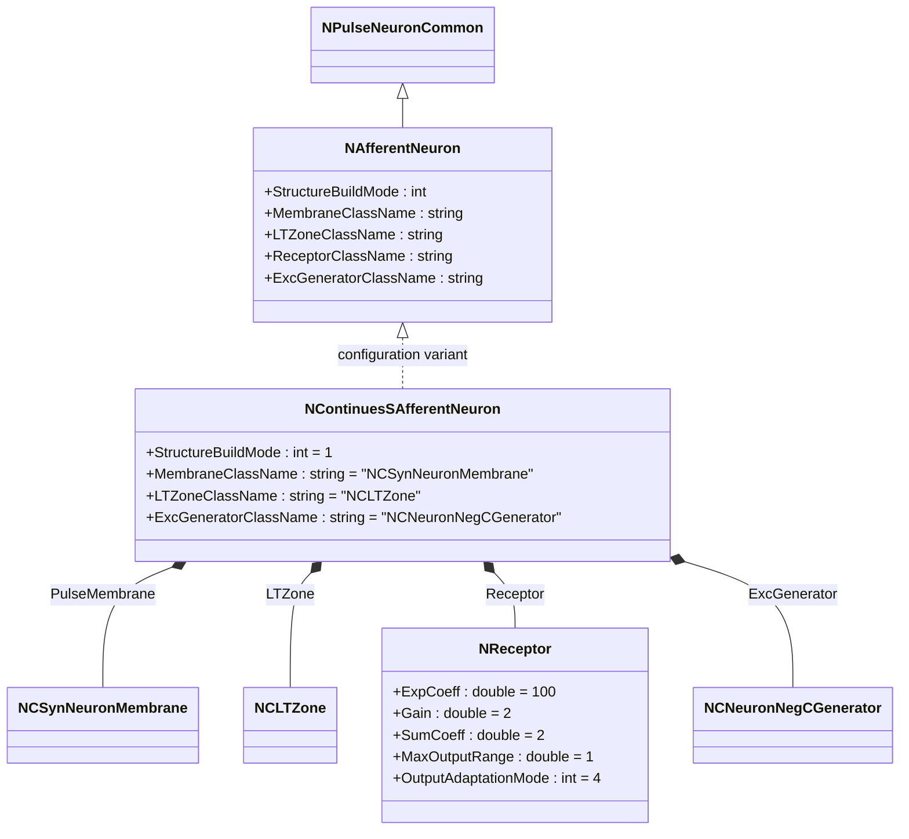
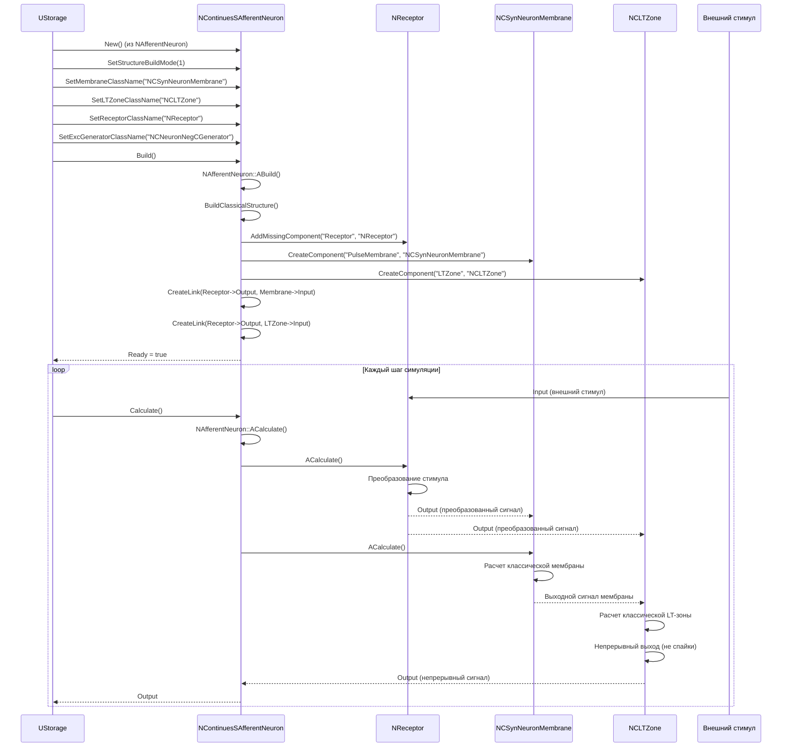
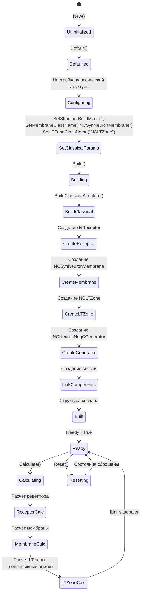
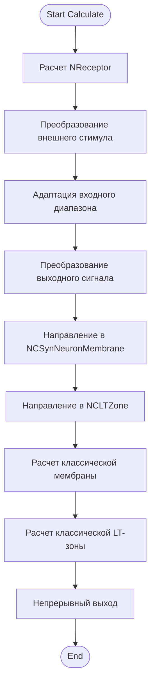
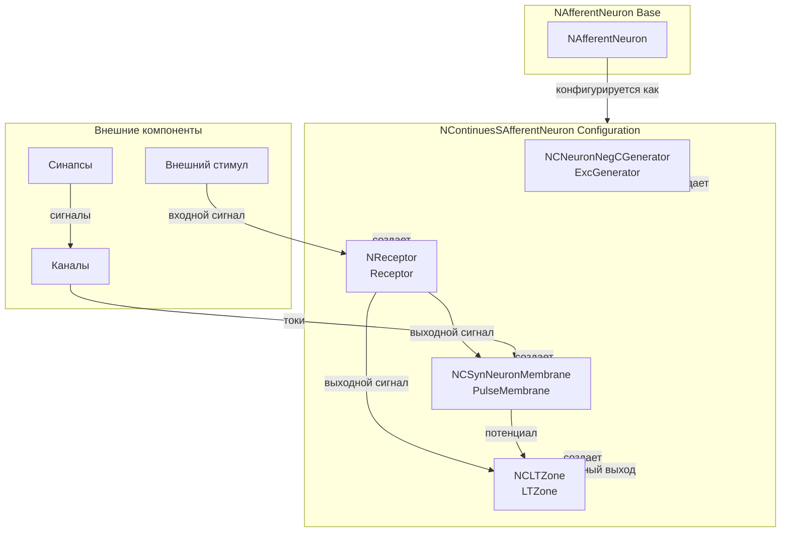
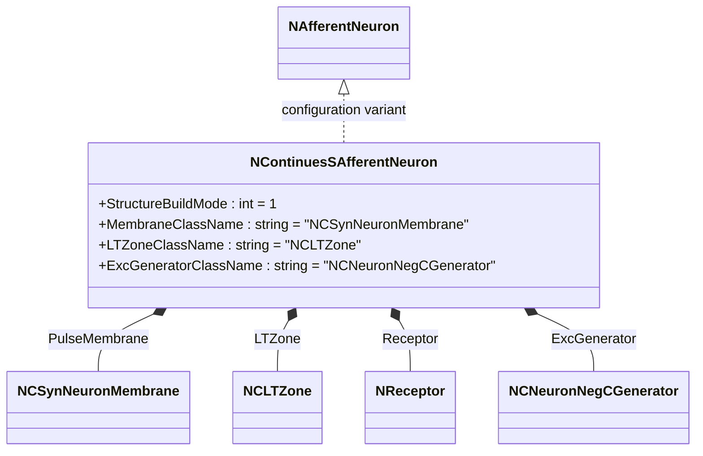
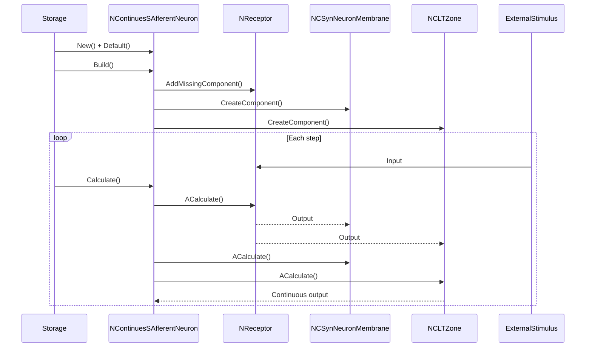
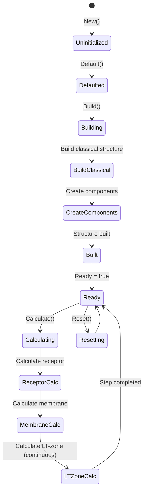
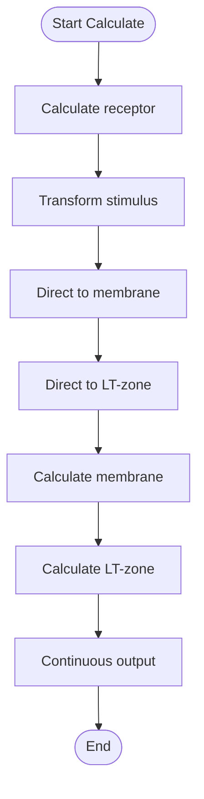
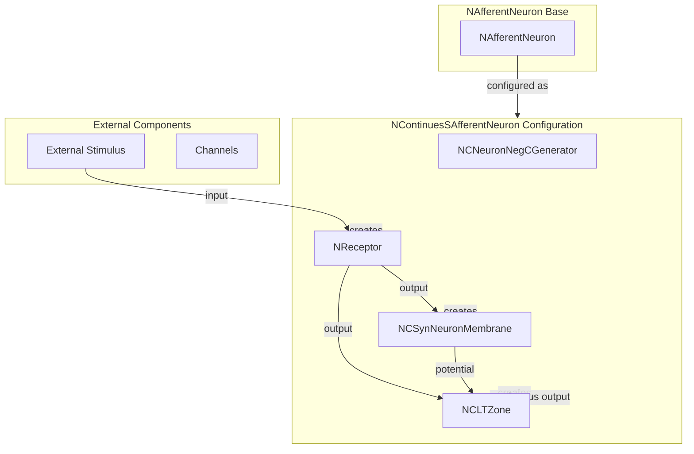

# NContinuesSAfferentNeuron — непрерывный классический афферентный нейрон

## RU

### Назначение

**Класс**: `NContinuesSAfferentNeuron` — конфигурационный вариант классического афферентного нейрона с непрерывным выходом.  
**Префикс**: `NContinues` — **Continues** (Continuous, непрерывный вариант компонента).  
**Регистрация**: `NPulseLibrary.cpp` → `UploadClass("NContinuesSAfferentNeuron", ...)`.  
**Storage-инстансы**: `ClassName = "NContinuesSAfferentNeuron"` в `Bin/Configs/*/Model_*.xml`.

`NContinuesSAfferentNeuron` является конфигурационным вариантом базового класса `NAfferentNeuron` с классической структурой и непрерывным выходом. Создается из `NAfferentNeuron` с настройками:
- `StructureBuildMode = 1` — классическая структура
- `MembraneClassName = "NCSynNeuronMembrane"` — классическая мембрана, оптимизированная для синапсов
- `LTZoneClassName = "NCLTZone"` — классическая LT-зона
- `ExcGeneratorClassName = "NCNeuronNegCGenerator"` — классический генератор
- Параметры рецептора: `ExpCoeff = 100`, `Gain = 2`, `SumCoeff = 2`, `MaxOutputRange = 1`, `OutputAdaptationMode = 4`

Классическая структура включает мембрану, LT-зону и рецептор. Непрерывный выход означает, что LT-зона выдает непрерывный сигнал вместо дискретных спайков.

**Использование:** Моделирование сенсорных систем с непрерывным выходом

### UML-диаграмма классов



**Иерархия наследования:**
- `NPulseNeuronCommon` — общий импульсный нейрон
- `NAfferentNeuron` — базовый афферентный нейрон
- `NContinuesSAfferentNeuron` — конфигурационный вариант с классической структурой и непрерывным выходом

**Внутренняя структура:**
- **PulseMembrane** (`NCSynNeuronMembrane`) — классическая мембрана, оптимизированная для синапсов
- **LTZone** (`NCLTZone`) — классическая LT-зона с непрерывным выходом
- **Receptor** (`NReceptor`) — рецептор для приема внешних стимулов
- **ExcGenerator** (`NCNeuronNegCGenerator`) — классический генератор

### UML-диаграмма последовательности



**Жизненный цикл:**
1. **Создание**: `NContinuesSAfferentNeuron` создается из `NAfferentNeuron` с настройкой параметров
2. **Настройка**: Устанавливается классическая структура, классические мембрана и LT-зона
3. **Сборка**: Автоматически создается структура нейрона с мембраной, LT-зоной, рецептором и генератором
4. **Расчет**: На каждом шаге рассчитываются рецептор, мембрана и LT-зона с непрерывным выходом

### UML-диаграмма состояний



**Состояния:**
- **Uninitialized** — создан, но не инициализирован
- **Defaulted** — параметры установлены по умолчанию
- **Configuring** — настройка параметров для классической структуры
- **SetClassicalParams** — установка параметров (классическая структура, классические компоненты)
- **Building** — выполняется сборка структуры
- **BuildClassical** — сборка классической структуры
- **CreateReceptor** — создание рецептора
- **CreateMembrane** — создание классической мембраны
- **CreateLTZone** — создание классической LT-зоны
- **CreateGenerator** — создание классического генератора
- **LinkComponents** — создание связей между компонентами
- **Built** — структура нейрона построена
- **Ready** — готов к выполнению расчетов
- **Calculating** — выполняется расчет нейрона
- **ReceptorCalc** — расчет рецептора
- **MembraneCalc** — расчет мембраны
- **LTZoneCalc** — расчет LT-зоны с непрерывным выходом
- **Resetting** — выполняется сброс состояний

### UML-диаграмма активности



**Алгоритм расчета:**
1. Расчет рецептора: преобразование внешнего стимула с адаптацией и преобразованием
2. Направление выходного сигнала рецептора в мембрану и LT-зону
3. Расчет классической мембраны с оптимизацией для синапсов
4. Расчет классической LT-зоны с непрерывным выходом (не дискретные спайки)

### UML-диаграмма компонентов



**Зависимости:**
- **Базовый класс**: `NAfferentNeuron` (конфигурационный вариант)
- **Внутренние компоненты**: `NReceptor` (рецептор), `NCSynNeuronMembrane` (классическая мембрана), `NCLTZone` (классическая LT-зона), `NCNeuronNegCGenerator` (классический генератор)
- **Внешние компоненты**: внешние стимулы, каналы, синапсы

### Свойства

`NContinuesSAfferentNeuron` использует все свойства базового класса `NAfferentNeuron` с параметрами:
- `StructureBuildMode = 1` — классическая структура
- `MembraneClassName = "NCSynNeuronMembrane"` — классическая мембрана, оптимизированная для синапсов
- `LTZoneClassName = "NCLTZone"` — классическая LT-зона
- `ExcGeneratorClassName = "NCNeuronNegCGenerator"` — классический генератор
- `ReceptorClassName = "NReceptor"` — рецептор

**Параметры рецептора (в NReceptor):**
- `ExpCoeff = 100` — экспоненциальный коэффициент
- `Gain = 2` — коэффициент усиления
- `SumCoeff = 2` — коэффициент суммы
- `MaxOutputRange = 1` — максимальный диапазон выходного сигнала
- `OutputAdaptationMode = 4` — режим адаптации выходного сигнала (линейный с усилением)

### Методы

`NContinuesSAfferentNeuron` использует все методы базового класса `NAfferentNeuron`:
- `BuildClassicalStructure()` → `bool` — сборка классической структуры (мембрана + LT-зона + рецептор)

### Примеры использования

#### Пример 1: Создание непрерывного классического афферентного нейрона в коде C++

```cpp
// Создание непрерывного классического афферентного нейрона
auto neuron = storage->CreateComponent("NContinuesSAfferentNeuron");
neuron->SetName("ContinuesSAfferentNeuron");

// Инициализация (использует параметры по умолчанию)
neuron->Default();

// Сборка (автоматически создает NCSynNeuronMembrane, NCLTZone, NReceptor, NCNeuronNegCGenerator)
neuron->Build();

// Использование
for (int step = 0; step < 1000; step++) {
    // Установка внешнего стимула
    // neuron->Receptor->Input = stimulus;
    neuron->Calculate();
    // Получение непрерывного выходного сигнала
    // auto output = neuron->Output;
}
```

#### Пример 2: Конфигурация XML

```xml
<ContinuesSAfferentNeuron1 Class="NContinuesSAfferentNeuron">
    <Parameters>
        <!-- Параметры наследуются от NAfferentNeuron -->
    </Parameters>
</ContinuesSAfferentNeuron1>
```

### Использование в конфигурациях

`NContinuesSAfferentNeuron` используется в экспериментах с сенсорными системами с непрерывным выходом:

- **Непрерывные сенсорные системы**: `Bin/Configs/!OldConfigs/*/Model_*.xml` (где используется непрерывный выход для классических афферентных нейронов)
- **Классическое моделирование**: эксперименты с классическими мембранами и LT-зонами

**Типичные значения параметров:**
- **StructureBuildMode**: 1 (классическая структура)
- **MembraneClassName**: "NCSynNeuronMembrane" (классическая мембрана)
- **LTZoneClassName**: "NCLTZone" (классическая LT-зона)
- **ExcGeneratorClassName**: "NCNeuronNegCGenerator" (классический генератор)

**Особенности:**
- Классическая структура: включает мембрану, LT-зону и рецептор
- Непрерывный выход: LT-зона выдает непрерывный сигнал вместо дискретных спайков
- Классические компоненты: использует классические мембраны и LT-зоны для непрерывного моделирования

## Источники

См. [Literature-References.md](../Literature-References.md): **25**, **29**.

### См. также

- [`NAfferentNeuron`](NAfferentNeuron.md) — базовый афферентный нейрон
- [`NSAfferentNeuron`](NSAfferentNeuron.md) — классический афферентный нейрон
- [`NContinuesSimpleAfferentNeuron`](NContinuesSimpleAfferentNeuron.md) — непрерывный простой афферентный нейрон
- [`NCSynNeuronMembrane`](NCSynNeuronMembrane.md) — классическая мембрана, оптимизированная для синапсов
- [`NCLTZone`](NCLTZone.md) — классическая LT-зона
- [`NReceptor`](NReceptor.md) — рецептор
- [Architecture.md](../Architecture.md) — архитектура библиотеки

---

## EN

### Purpose

**Class**: `NContinuesSAfferentNeuron` — configuration variant of classical afferent neuron with continuous output.  
**Registration**: `NPulseLibrary.cpp` → `UploadClass("NContinuesSAfferentNeuron", ...)`.  
**Instances**: `ClassName = "NContinuesSAfferentNeuron"` in `Bin/Configs/*/Model_*.xml`.

`NContinuesSAfferentNeuron` is a configuration variant of the base class `NAfferentNeuron` with classical structure and continuous output. Created from `NAfferentNeuron` with settings:
- `StructureBuildMode = 1` — classical structure
- `MembraneClassName = "NCSynNeuronMembrane"` — classic membrane optimized for synapses
- `LTZoneClassName = "NCLTZone"` — classic LT-zone
- `ExcGeneratorClassName = "NCNeuronNegCGenerator"` — classic generator
- Receptor parameters: `ExpCoeff = 100`, `Gain = 2`, `SumCoeff = 2`, `MaxOutputRange = 1`, `OutputAdaptationMode = 4`

Classical structure includes membrane, LT-zone, and receptor. Continuous output means LT-zone produces continuous signal instead of discrete spikes.

**Usage:** Modeling sensory systems with continuous output

### UML Class Diagram



### UML Sequence Diagram



### UML State Diagram



### UML Activity Diagram



### UML Component Diagram



### Properties

`NContinuesSAfferentNeuron` uses all properties of base class `NAfferentNeuron` with parameters:
- `StructureBuildMode = 1` — classical structure
- `MembraneClassName = "NCSynNeuronMembrane"` — classic membrane optimized for synapses
- `LTZoneClassName = "NCLTZone"` — classic LT-zone
- `ExcGeneratorClassName = "NCNeuronNegCGenerator"` — classic generator

**Receptor parameters (in NReceptor):**
- `ExpCoeff = 100` — exponential coefficient
- `Gain = 2` — gain coefficient
- `SumCoeff = 2` — sum coefficient
- `MaxOutputRange = 1` — maximum output range
- `OutputAdaptationMode = 4` — output adaptation mode (linear with gain)

### Methods

`NContinuesSAfferentNeuron` uses all methods of base class `NAfferentNeuron`:
- `BuildClassicalStructure()` → `bool` — build classical structure (membrane + LT-zone + receptor)

### Usage in configurations

`NContinuesSAfferentNeuron` is used in sensory system experiments with continuous output:

- **Continuous sensory systems**: `Bin/Configs/!OldConfigs/*/Model_*.xml` (where continuous output is used for classical afferent neurons)
- **Classical modeling**: experiments with classic membranes and LT-zones

**Typical parameter values:**
- **StructureBuildMode**: 1 (classical structure)
- **MembraneClassName**: "NCSynNeuronMembrane" (classic membrane)
- **LTZoneClassName**: "NCLTZone" (classic LT-zone)
- **ExcGeneratorClassName**: "NCNeuronNegCGenerator" (classic generator)

**Features:**
- Classical structure: includes membrane, LT-zone, and receptor
- Continuous output: LT-zone produces continuous signal instead of discrete spikes
- Classic components: uses classic membranes and LT-zones for continuous modeling

### References

See [Literature-References.md](../Literature-References.md): **25**, **29**.

### See Also

- [`NAfferentNeuron`](NAfferentNeuron.md) — base afferent neuron
- [`NSAfferentNeuron`](NSAfferentNeuron.md) — classical afferent neuron
- [`NContinuesSimpleAfferentNeuron`](NContinuesSimpleAfferentNeuron.md) — continuous simple afferent neuron
- [`NCSynNeuronMembrane`](NCSynNeuronMembrane.md) — classic membrane optimized for synapses
- [`NCLTZone`](NCLTZone.md) — classic LT-zone
- [`NReceptor`](NReceptor.md) — receptor
- [Architecture.md](../Architecture.md) — library architecture
