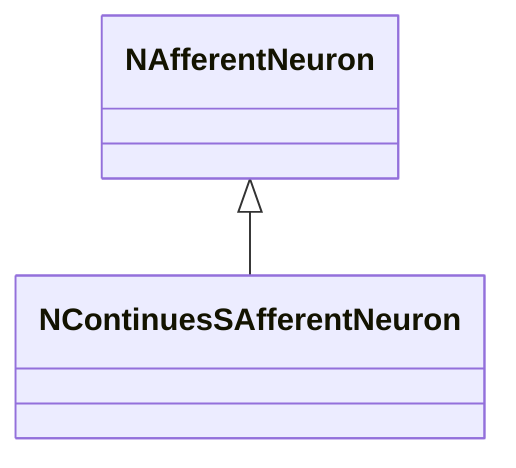
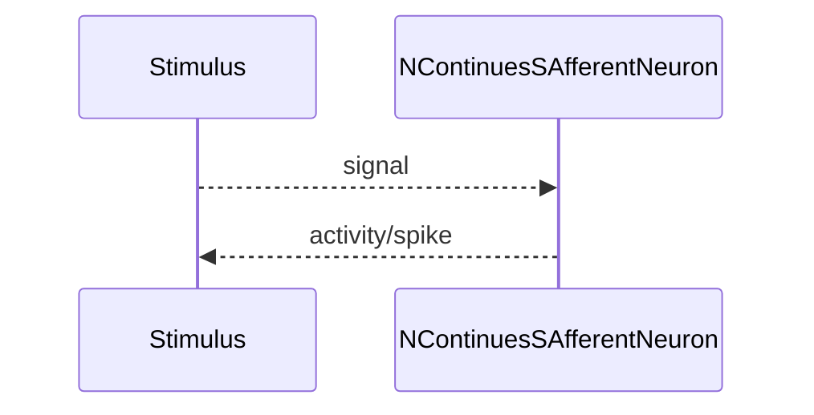
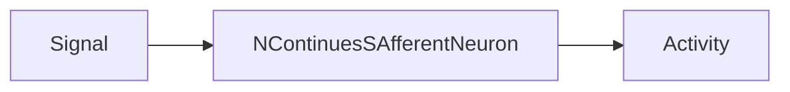
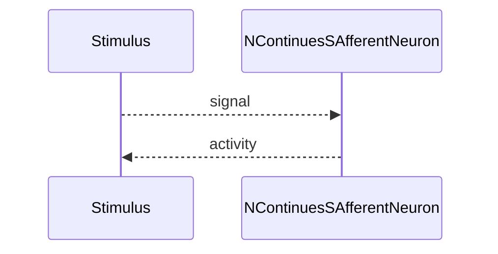

## NContinuesSAfferentNeuron — непрерывный афферент (Nmsdk-PulseLib)

**Класс**: `NContinuesSAfferentNeuron` — непрерывный вариант афферентного нейрона.  
**Регистрация**: `NPulseLibrary.cpp` → `UploadClass("NContinuesSAfferentNeuron", ...)`.  
**Storage**: `ClassName = "NContinuesSAfferentNeuron"`.

### Lifecycle
- **ADefault**: параметры непрерывной обработки.
- **ABuild**: подключение входа.
- **AReset**: сброс состояния.
- **ACalculate**: интеграция непрерывного стимула.

### I/O
- Вход: непрерывный сигнал/ток.
- Выход: активность/спайк.



Пояснение: диаграмма классов показывает место компонента в иерархии и ключевые связи.



Пояснение: диаграмма последовательности показывает типовой сценарий взаимодействия и порядок вызовов.



Пояснение: блок-схема показывает поток данных/сигналов (входы → компонент → выходы).

### Config snippet

```ini
[Component]
ClassName = NContinuesSAfferentNeuron
Name = CAfferent1
```

---

## NContinuesSAfferentNeuron — continuous afferent neuron (EN)

Continuous afferent neuron variant handling continuous stimuli.


Description: this class diagram shows the component position in the type hierarchy and key relations.



Description: this sequence diagram shows a typical runtime interaction and call order.


Description: this flowchart shows the data/signal flow (inputs → component → outputs).
