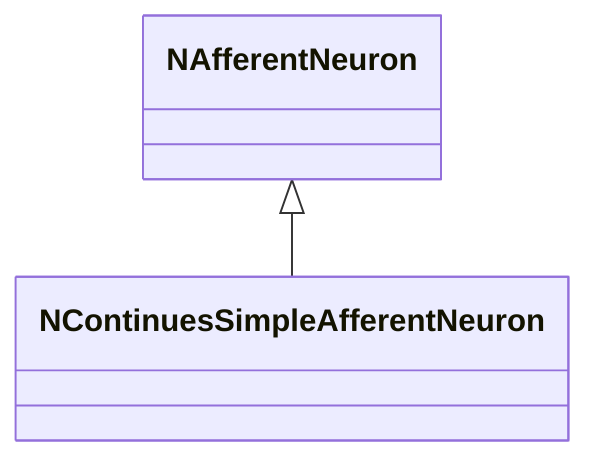
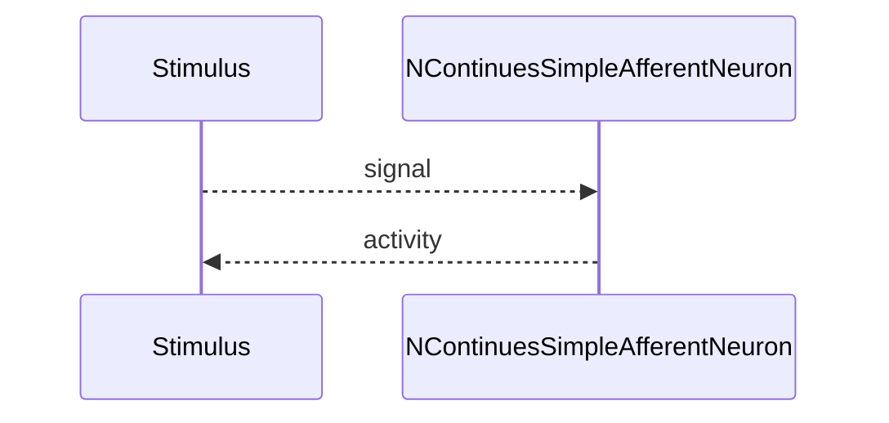

## NContinuesSimpleAfferentNeuron — непрерывный простой афферент

**Класс**: `NContinuesSimpleAfferentNeuron` — простой непрерывный афферентный нейрон.  
**Регистрация**: `UploadClass("NContinuesSimpleAfferentNeuron", ...)` в `NPulseLibrary.cpp`.  
**Storage**: `ClassName = "NContinuesSimpleAfferentNeuron"`.

### Lifecycle
- **ADefault**: параметры приёма.
- **ABuild**: подключение входа.
- **AReset**: сброс.
- **ACalculate**: интеграция непрерывного входа.

### I/O
- Вход: непрерывный сигнал.
- Выход: активность/спайк.



Пояснение: диаграмма классов показывает место компонента в иерархии и ключевые связи.



Пояснение: диаграмма последовательности показывает типовой сценарий взаимодействия и порядок вызовов.


Пояснение: блок-схема показывает поток данных/сигналов (входы → компонент → выходы).

### Config snippet

```ini
[Component]
ClassName = NContinuesSimpleAfferentNeuron
Name = CSAfferent1
```

---

## NContinuesSimpleAfferentNeuron — continuous simple afferent (EN)

Simple continuous afferent neuron producing activity from continuous input.


Description: this class diagram shows the component position in the type hierarchy and key relations.


Description: this sequence diagram shows a typical runtime interaction and call order.


Description: this flowchart shows the data/signal flow (inputs → component → outputs).
