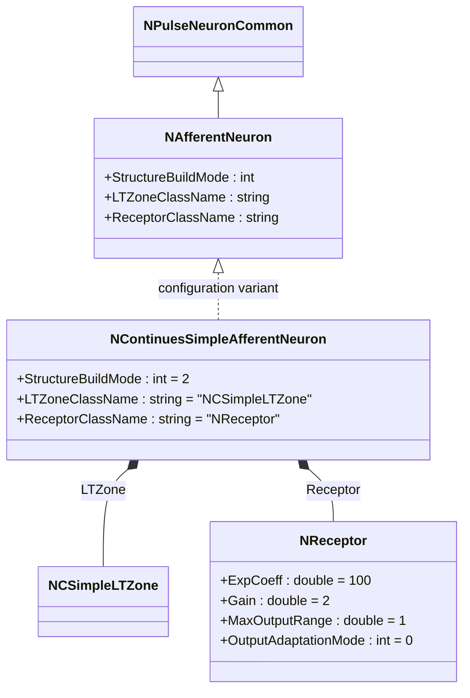
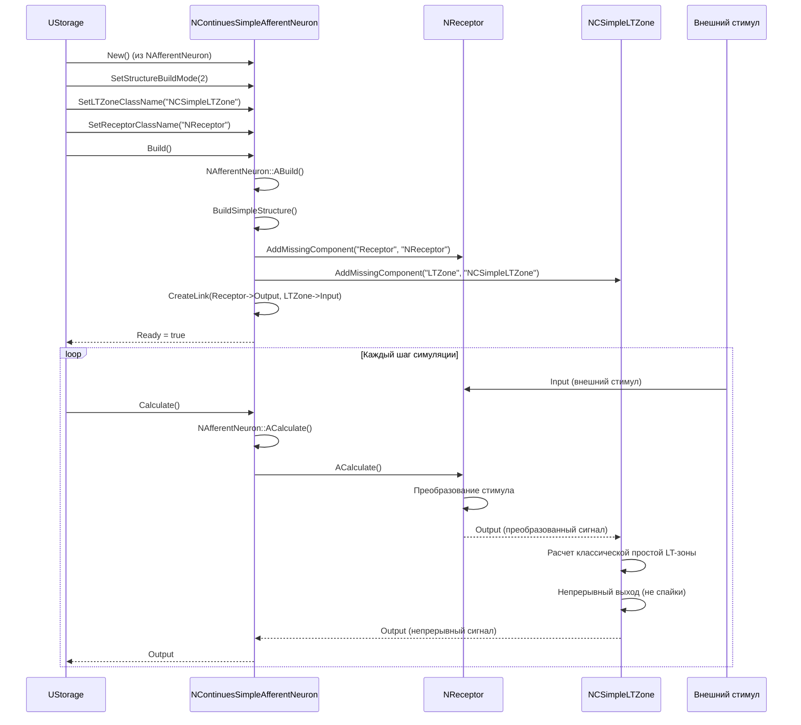
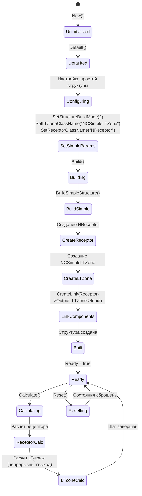
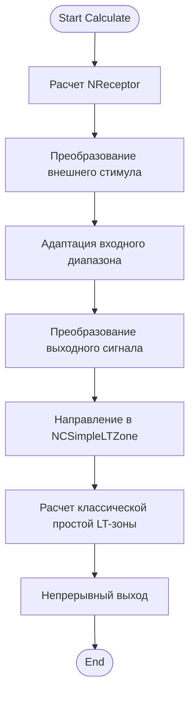
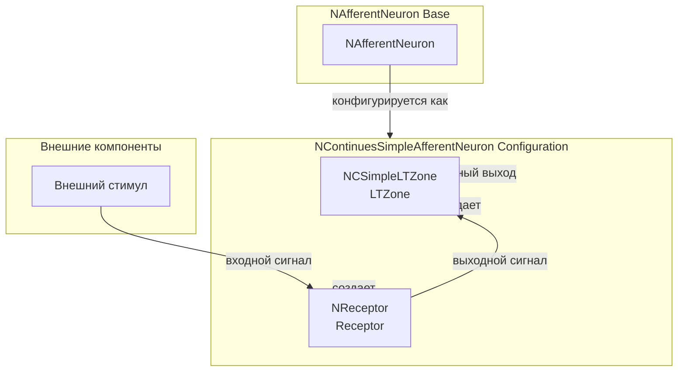
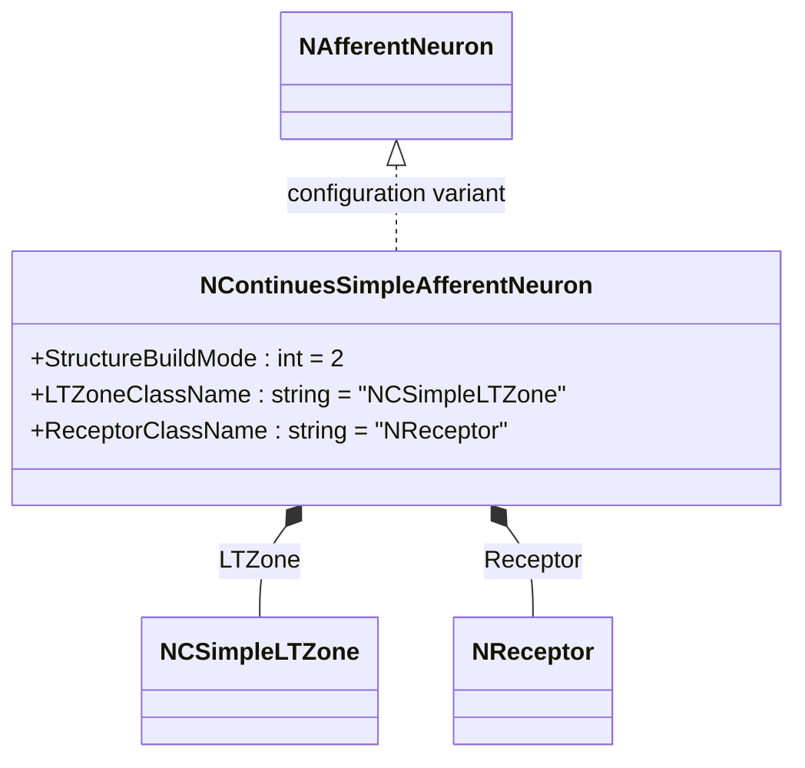
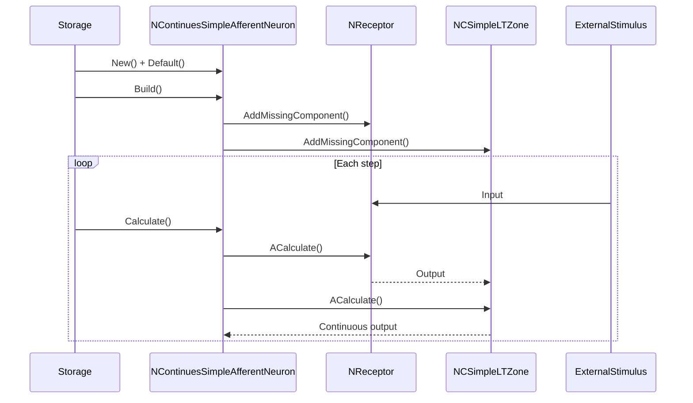
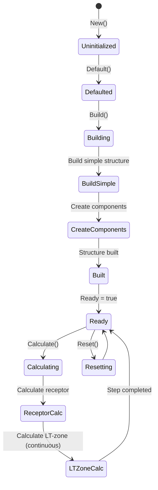
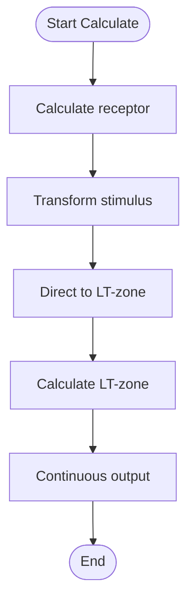
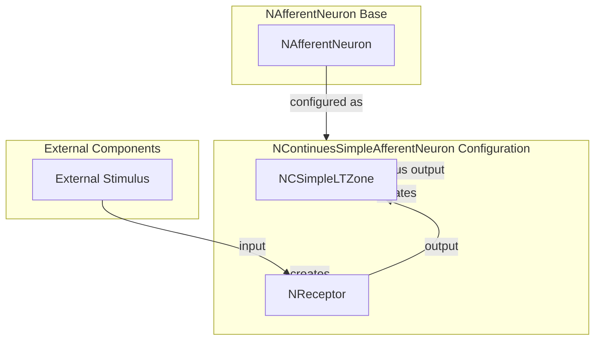

# NContinuesSimpleAfferentNeuron — непрерывный простой афферентный нейрон

## RU

### Назначение

**Класс**: `NContinuesSimpleAfferentNeuron` — конфигурационный вариант простого афферентного нейрона с непрерывным выходом.  
**Префикс**: `NContinues` — **Continues** (Continuous, непрерывный вариант компонента).  
**Регистрация**: `NPulseLibrary.cpp` → `UploadClass("NContinuesSimpleAfferentNeuron", ...)`.  
**Storage-инстансы**: `ClassName = "NContinuesSimpleAfferentNeuron"` в `Bin/Configs/*/Model_*.xml`.

`NContinuesSimpleAfferentNeuron` является конфигурационным вариантом базового класса `NAfferentNeuron` с простой структурой и непрерывным выходом. Создается из `NAfferentNeuron` с настройками:
- `StructureBuildMode = 2` — простая структура
- `LTZoneClassName = "NCSimpleLTZone"` — классическая простая LT-зона
- `ReceptorClassName = "NReceptor"` — рецептор
- Параметры рецептора: `ExpCoeff = 100`, `Gain = 2`, `MaxOutputRange = 1`, `OutputAdaptationMode = 0`

Простая структура включает только LT-зону и рецептор, без мембраны. Непрерывный выход означает, что LT-зона выдает непрерывный сигнал вместо дискретных спайков.

**Использование:** Моделирование простых сенсорных систем с непрерывным выходом

### UML-диаграмма классов



**Иерархия наследования:**
- `NPulseNeuronCommon` — общий импульсный нейрон
- `NAfferentNeuron` — базовый афферентный нейрон
- `NContinuesSimpleAfferentNeuron` — конфигурационный вариант с простой структурой и непрерывным выходом

**Внутренняя структура:**
- **LTZone** (`NCSimpleLTZone`) — классическая простая LT-зона с непрерывным выходом
- **Receptor** (`NReceptor`) — рецептор для приема внешних стимулов

### UML-диаграмма последовательности



**Жизненный цикл:**
1. **Создание**: `NContinuesSimpleAfferentNeuron` создается из `NAfferentNeuron` с настройкой параметров
2. **Настройка**: Устанавливается простая структура, классическая простая LT-зона
3. **Сборка**: Автоматически создается структура нейрона с LT-зоной и рецептором (без мембраны)
4. **Расчет**: На каждом шаге рассчитываются рецептор и LT-зона с непрерывным выходом

### UML-диаграмма состояний



**Состояния:**
- **Uninitialized** — создан, но не инициализирован
- **Defaulted** — параметры установлены по умолчанию
- **Configuring** — настройка параметров для простой структуры
- **SetSimpleParams** — установка параметров (простая структура, классическая простая LT-зона)
- **Building** — выполняется сборка структуры
- **BuildSimple** — сборка простой структуры
- **CreateReceptor** — создание рецептора
- **CreateLTZone** — создание классической простой LT-зоны
- **LinkComponents** — создание связи между рецептором и LT-зоной
- **Built** — структура нейрона построена
- **Ready** — готов к выполнению расчетов
- **Calculating** — выполняется расчет нейрона
- **ReceptorCalc** — расчет рецептора
- **LTZoneCalc** — расчет LT-зоны с непрерывным выходом
- **Resetting** — выполняется сброс состояний

### UML-диаграмма активности



**Алгоритм расчета:**
1. Расчет рецептора: преобразование внешнего стимула с адаптацией и преобразованием
2. Направление выходного сигнала рецептора в классическую простую LT-зону
3. Расчет классической простой LT-зоны с непрерывным выходом (не дискретные спайки)

### UML-диаграмма компонентов



**Зависимости:**
- **Базовый класс**: `NAfferentNeuron` (конфигурационный вариант)
- **Внутренние компоненты**: `NReceptor` (рецептор), `NCSimpleLTZone` (классическая простая LT-зона)
- **Внешние компоненты**: внешние стимулы

### Свойства

`NContinuesSimpleAfferentNeuron` использует все свойства базового класса `NAfferentNeuron` с параметрами:
- `StructureBuildMode = 2` — простая структура
- `LTZoneClassName = "NCSimpleLTZone"` — классическая простая LT-зона
- `ReceptorClassName = "NReceptor"` — рецептор

**Параметры рецептора (в NReceptor):**
- `ExpCoeff = 100` — экспоненциальный коэффициент
- `Gain = 2` — коэффициент усиления
- `MaxOutputRange = 1` — максимальный диапазон выходного сигнала
- `OutputAdaptationMode = 0` — режим адаптации выходного сигнала (линейный)

### Методы

`NContinuesSimpleAfferentNeuron` использует все методы базового класса `NAfferentNeuron`:
- `BuildSimpleStructure()` → `bool` — сборка простой структуры (LT-зона + рецептор)

### Примеры использования

#### Пример 1: Создание непрерывного простого афферентного нейрона в коде C++

```cpp
// Создание непрерывного простого афферентного нейрона
auto neuron = storage->CreateComponent("NContinuesSimpleAfferentNeuron");
neuron->SetName("ContinuesSimpleAfferentNeuron");

// Инициализация (использует параметры по умолчанию)
neuron->Default();

// Сборка (автоматически создает NCSimpleLTZone, NReceptor)
neuron->Build();

// Использование
for (int step = 0; step < 1000; step++) {
    // Установка внешнего стимула
    // neuron->Receptor->Input = stimulus;
    neuron->Calculate();
    // Получение непрерывного выходного сигнала
    // auto output = neuron->Output;
}
```

#### Пример 2: Конфигурация XML

```xml
<ContinuesSimpleAfferentNeuron1 Class="NContinuesSimpleAfferentNeuron">
    <Parameters>
        <!-- Параметры наследуются от NAfferentNeuron -->
    </Parameters>
</ContinuesSimpleAfferentNeuron1>
```

### Использование в конфигурациях

`NContinuesSimpleAfferentNeuron` используется в экспериментах с простыми сенсорными системами с непрерывным выходом:

- **Непрерывные простые сенсорные системы**: `Bin/Configs/!OldConfigs/*/Model_*.xml` (где используется непрерывный выход для простых афферентных нейронов)
- **Упрощенное моделирование**: эксперименты с простой структурой без мембраны

**Типичные значения параметров:**
- **StructureBuildMode**: 2 (простая структура)
- **LTZoneClassName**: "NCSimpleLTZone" (классическая простая LT-зона)
- **ReceptorClassName**: "NReceptor" (рецептор)

**Особенности:**
- Простая структура: включает только LT-зону и рецептор, без мембраны
- Непрерывный выход: LT-зона выдает непрерывный сигнал вместо дискретных спайков
- Упрощенное моделирование: минимальная структура для базовых сенсорных систем

### См. также

- [`NAfferentNeuron`](NAfferentNeuron.md) — базовый афферентный нейрон
- [`NSimpleAfferentNeuron`](NSimpleAfferentNeuron.md) — простой афферентный нейрон
- [`NContinuesSAfferentNeuron`](NContinuesSAfferentNeuron.md) — непрерывный классический афферентный нейрон
- [`NCSimpleLTZone`](NCSimpleLTZone.md) — классическая простая LT-зона
- [`NReceptor`](NReceptor.md) — рецептор
- [Architecture.md](../Architecture.md) — архитектура библиотеки

---

## EN

### Purpose

**Class**: `NContinuesSimpleAfferentNeuron` — configuration variant of simple afferent neuron with continuous output.  
**Registration**: `NPulseLibrary.cpp` → `UploadClass("NContinuesSimpleAfferentNeuron", ...)`.  
**Instances**: `ClassName = "NContinuesSimpleAfferentNeuron"` in `Bin/Configs/*/Model_*.xml`.

`NContinuesSimpleAfferentNeuron` is a configuration variant of the base class `NAfferentNeuron` with simple structure and continuous output. Created from `NAfferentNeuron` with settings:
- `StructureBuildMode = 2` — simple structure
- `LTZoneClassName = "NCSimpleLTZone"` — classic simple LT-zone
- `ReceptorClassName = "NReceptor"` — receptor
- Receptor parameters: `ExpCoeff = 100`, `Gain = 2`, `MaxOutputRange = 1`, `OutputAdaptationMode = 0`

Simple structure includes only LT-zone and receptor, without membrane. Continuous output means LT-zone produces continuous signal instead of discrete spikes.

**Usage:** Modeling simple sensory systems with continuous output

### UML Class Diagram



### UML Sequence Diagram



### UML State Diagram



### UML Activity Diagram



### UML Component Diagram



### Properties

`NContinuesSimpleAfferentNeuron` uses all properties of base class `NAfferentNeuron` with parameters:
- `StructureBuildMode = 2` — simple structure
- `LTZoneClassName = "NCSimpleLTZone"` — classic simple LT-zone
- `ReceptorClassName = "NReceptor"` — receptor

**Receptor parameters (in NReceptor):**
- `ExpCoeff = 100` — exponential coefficient
- `Gain = 2` — gain coefficient
- `MaxOutputRange = 1` — maximum output range
- `OutputAdaptationMode = 0` — output adaptation mode (linear)

### Methods

`NContinuesSimpleAfferentNeuron` uses all methods of base class `NAfferentNeuron`:
- `BuildSimpleStructure()` → `bool` — build simple structure (LT-zone + receptor)

### Usage in configurations

`NContinuesSimpleAfferentNeuron` is used in simple sensory system experiments with continuous output:

- **Continuous simple sensory systems**: `Bin/Configs/!OldConfigs/*/Model_*.xml` (where continuous output is used for simple afferent neurons)
- **Simplified modeling**: experiments with simple structure without membrane

**Typical parameter values:**
- **StructureBuildMode**: 2 (simple structure)
- **LTZoneClassName**: "NCSimpleLTZone" (classic simple LT-zone)
- **ReceptorClassName**: "NReceptor" (receptor)

**Features:**
- Simple structure: includes only LT-zone and receptor, without membrane
- Continuous output: LT-zone produces continuous signal instead of discrete spikes
- Simplified modeling: minimal structure for basic sensory systems

### See Also

- [`NAfferentNeuron`](NAfferentNeuron.md) — base afferent neuron
- [`NSimpleAfferentNeuron`](NSimpleAfferentNeuron.md) — simple afferent neuron
- [`NContinuesSAfferentNeuron`](NContinuesSAfferentNeuron.md) — continuous classical afferent neuron
- [`NCSimpleLTZone`](NCSimpleLTZone.md) — classic simple LT-zone
- [`NReceptor`](NReceptor.md) — receptor
- [Architecture.md](../Architecture.md) — library architecture
