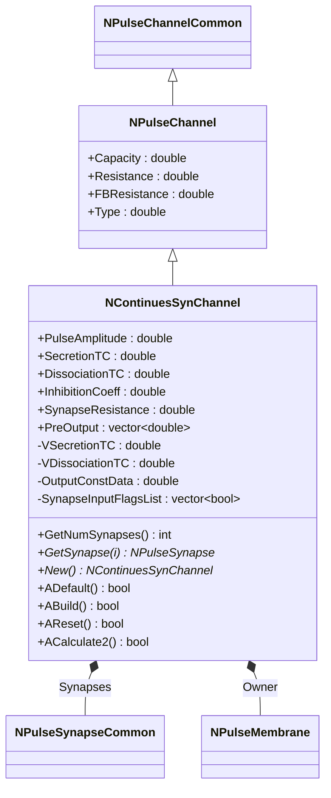
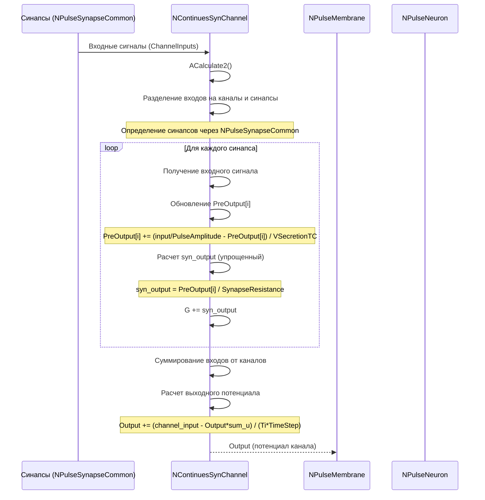
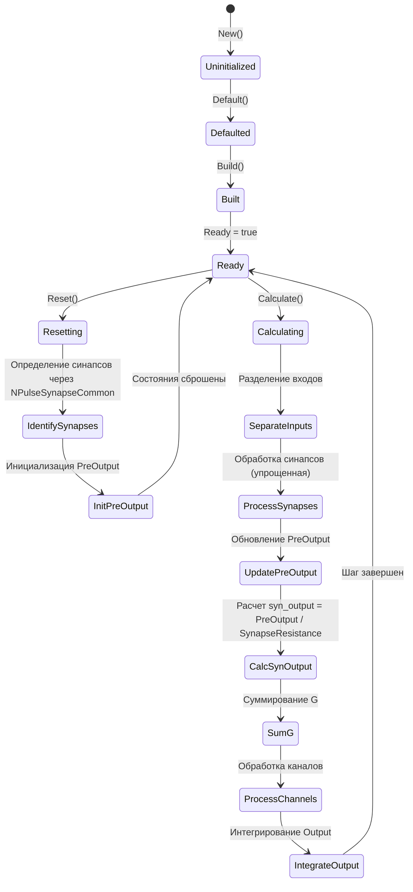
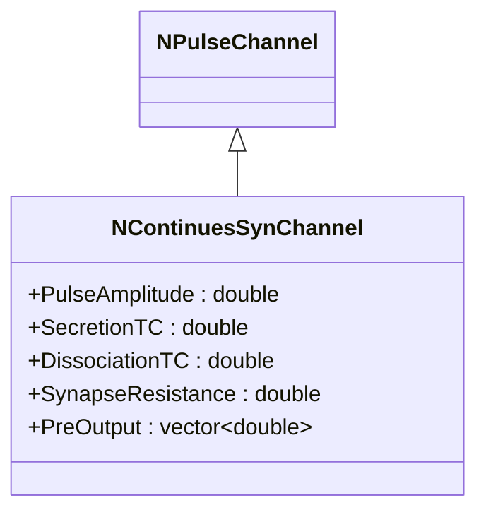

# NContinuesSynChannel — непрерывный синаптический канал

## RU

### Назначение

**Класс**: `NContinuesSynChannel` — непрерывный синаптический канал с упрощенной моделью динамики медиатора.  
**Регистрация**: `NPulseLibrary.cpp` → `UploadClass("NCSynChannel", ...)` (как алиас).  
**Storage-инстансы**: `ClassName = "NContinuesSynChannel"` или `"NCSynChannel"` в `Bin/Configs/*/Model_*.xml`.

`NContinuesSynChannel` реализует непрерывный синаптический канал, который обрабатывает входы от синапсов с упрощенной моделью динамики медиатора. Отличие от `NPulseSynChannel` заключается в упрощенном расчете выходного тока синапса: `syn_output = PreOutput / SynapseResistance` (вместо более сложной формулы с пресинаптическим торможением в `NPulseSynChannel`). Также использует `NPulseSynapseCommon` для определения синапсов (в отличие от `NPulseSynapse` в `NPulseSynChannel`).

**Использование:** Моделирование синаптических каналов с упрощенной моделью медиатора, непрерывная обработка синапсов

### UML-диаграмма классов



**Иерархия наследования:**
- `NPulseChannelCommon` — общий импульсный канал
- `NPulseChannel` — базовый импульсный канал
- `NContinuesSynChannel` — непрерывный синаптический канал

**Ключевые отличия от NPulseSynChannel:**
- Упрощенный расчет: `syn_output = PreOutput / SynapseResistance`
- Использует `NPulseSynapseCommon` для определения синапсов
- `InhibitionCoeff = 1.0` по умолчанию (в `NPulseSynChannel` — 0.0)

### UML-диаграмма последовательности



**Жизненный цикл:**
1. **Инициализация**: Установка параметров по умолчанию (`InhibitionCoeff=1.0`)
2. **Сборка**: Расчет `VSecretionTC` и `VDissociationTC`
3. **Сброс**: Инициализация `PreOutput`, определение синапсов через `NPulseSynapseCommon`
4. **Расчет**: Упрощенная обработка синапсов, интегрирование выходного потенциала

### UML-диаграмма состояний



### UML-диаграмма активности

```mermaid
flowchart TD
    Start([Start Calculate]) --> InitVars[channel_input_sum = 0, G = 0, num_connected_synapsis = 0]
    InitVars --> LoopInputs[Цикл по ChannelInputs]
    LoopInputs --> CheckSize{ChannelInputs[n].GetCols() > 0?}
    CheckSize -->|Нет| CheckMore{Еще входы?}
    CheckSize -->|Да| CheckSynapse{SynapseInputFlagsList[n]?}
    CheckSynapse -->|Нет| AddChannelInput[channel_input_sum += ChannelInputs[n]]
    CheckSynapse -->|Да| ProcessSynapse[Обработка синапса]
    AddChannelInput --> IncrementChannels[num_connected_channels++]
    IncrementChannels --> CheckMore
    ProcessSynapse --> ResizePreOutput{PreOutput.size() < num_connected_synapsis?}
    ResizePreOutput -->|Да| Resize[PreOutput.resize(num_connected_synapsis)]
    ResizePreOutput -->|Нет| GetInput[input = ChannelInputs[n](0,0)]
    Resize --> GetInput
    GetInput --> UpdatePreOutput{input > 0?}
    UpdatePreOutput -->|Да| PreOutputSecretion[PreOutput[i] += (input/PulseAmplitude - PreOutput[i]) / VSecretionTC]
    UpdatePreOutput -->|Нет| PreOutputDissociation[PreOutput[i] -= PreOutput[i] / VDissociationTC]
    PreOutputSecretion --> CalcSynOutput[syn_output = PreOutput[i] / SynapseResistance]
    PreOutputDissociation --> CalcSynOutput
    CalcSynOutput --> CheckSynOutput{syn_output > 0?}
    CheckSynOutput -->|Да| AddG[G += syn_output]
    CheckSynOutput -->|Нет| IncrementSynapses[num_connected_synapsis++]
    AddG --> IncrementSynapses
    IncrementSynapses --> CheckMore
    CheckMore -->|Да| LoopInputs
    CheckMore -->|Нет| AverageChannels{UseAveragePotential и num_connected_channels > 0?}
    AverageChannels -->|Да| AverageChannelInput[channel_input_sum /= num_connected_channels]
    AverageChannels -->|Нет| SetSumInput[SumChannelInput = channel_input_sum]
    AverageChannelInput --> SetSumInput
    SetSumInput --> AverageSynapses{UseAverageSynapsis и num_connected_synapsis > 0?}
    AverageSynapses -->|Да| AverageG[G /= num_connected_synapsis]
    AverageSynapses -->|Нет| DetermineResistance{Определение resistance}
    AverageG --> DetermineResistance
    DetermineResistance --> CalcTi[Ti = Capacity / (G + 1.0/resistance)]
    CalcTi --> CalcSumU[sum_u = 1.0 + G*resistance]
    CalcSumU --> Integrate[Output += (channel_input_sum - Output*sum_u) / (Ti*TimeStep)]
    Integrate --> End([End])
    
    Note1[Упрощенный расчет: syn_output = PreOutput / SynapseResistance]
    Note1 -.-> CalcSynOutput
```

**Алгоритм расчета:**
Аналогичен `NPulseSynChannel`, но с упрощенным расчетом выходного тока синапса: `syn_output = PreOutput[i] / SynapseResistance` (без учета пресинаптического торможения).

### UML-диаграмма компонентов

```mermaid
graph TB
    subgraph NPulseChannel["NPulseChannel Base"]
        BaseChannel[NPulseChannel]
    end
    
    subgraph NContinuesSynChannel["NContinuesSynChannel"]
        SimplifiedModel[Упрощенная модель медиатора]
        SynapseProcessor[Обработчик синапсов]
    end
    
    subgraph External["Внешние компоненты"]
        Synapses[NPulseSynapseCommon[]]
        Channels[NPulseChannel[]]
        Membrane[NPulseMembrane]
        Neuron[NPulseNeuron]
    end
    
    BaseChannel -->|наследуется| NContinuesSynChannel
    NContinuesSynChannel -->|обрабатывает| SimplifiedModel
    NContinuesSynChannel -->|обрабатывает| SynapseProcessor
    Synapses -->|ChannelInputs| NContinuesSynChannel
    Channels -->|ChannelInputs| NContinuesSynChannel
    NContinuesSynChannel -->|Output| Membrane
    Membrane -->|часть| Neuron
```

### Свойства

#### Параметры (ptPubParameter)

- **`PulseAmplitude`** (double) — амплитуда импульса. Значение по умолчанию: 1.0

- **`SecretionTC`** (double) — постоянная времени выделения медиатора. Значение по умолчанию: 0.001 (1 мс)

- **`DissociationTC`** (double) — постоянная времени распада медиатора. Значение по умолчанию: 0.01 (10 мс)

- **`InhibitionCoeff`** (double) — коэффициент пресинаптического торможения. Значение по умолчанию: 1.0 (отличается от `NPulseSynChannel`, где 0.0)

- **`SynapseResistance`** (double) — сопротивление синапса. Используется для упрощенного расчета: `syn_output = PreOutput / SynapseResistance`. Значение по умолчанию: 1.0e8 (100 МОм)

**Наследуемые параметры от NPulseChannel:**
- `Capacity`, `Resistance`, `FBResistance`, `RestingResistance`, `Type`

### Методы

Аналогичны `NPulseSynChannel`, но с упрощенным расчетом в `ACalculate2()`.

### Примеры использования

#### Пример 1: Создание канала в коде C++

```cpp
// Создание непрерывного синаптического канала
auto channel = storage->CreateComponent<NContinuesSynChannel>();
channel->SetName("ContinuesSynChannel");

// Инициализация
channel->Default();

// Настройка параметров
channel->PulseAmplitude = 1.0;
channel->SecretionTC = 0.001;
channel->DissociationTC = 0.01;
channel->InhibitionCoeff = 1.0;
channel->SynapseResistance = 1.0e8;

// Сборка
channel->Build();
```

### Использование в конфигурациях

`NContinuesSynChannel` используется в экспериментах с упрощенной моделью медиатора:

- Моделирование синаптических каналов с упрощенной моделью
- Непрерывная обработка синапсов
- Эксперименты с различными параметрами

**Особенности:**
- Упрощенный расчет выходного тока синапса
- Использует `NPulseSynapseCommon` для определения синапсов
- Подходит для случаев, когда не требуется сложная модель пресинаптического торможения

### См. также

- [`NPulseSynChannel`](NPulseSynChannel.md) — импульсный синаптический канал
- [`NCSynChannel`](NCSynChannel.md) — алиас для NContinuesSynChannel
- [`NCSynExcChannel`](NCSynExcChannel.md) — возбуждающий непрерывный синаптический канал
- [`NCSynInhChannel`](NCSynInhChannel.md) — тормозной непрерывный синаптический канал
- [`NPulseChannel`](NPulseChannel.md) — базовый импульсный канал
- [`NPulseSynapseCommon`](NPulseSynapseCommon.md) — общий импульсный синапс
- [Architecture.md](../Architecture.md) — архитектура библиотеки

---

## EN

### Purpose

**Class**: `NContinuesSynChannel` — continuous synaptic channel with simplified neurotransmitter dynamics model.  
**Registration**: `NPulseLibrary.cpp` → `UploadClass("NCSynChannel", ...)` (as alias).  
**Instances**: `ClassName = "NContinuesSynChannel"` or `"NCSynChannel"` in `Bin/Configs/*/Model_*.xml`.

`NContinuesSynChannel` implements a continuous synaptic channel that processes synapse inputs with simplified neurotransmitter dynamics model. Difference from `NPulseSynChannel` is simplified synapse output current calculation: `syn_output = PreOutput / SynapseResistance` (instead of more complex formula with presynaptic inhibition in `NPulseSynChannel`).

**Usage:** Modeling synaptic channels with simplified neurotransmitter model, continuous synapse processing

### UML Class Diagram



### See Also

- [`NPulseSynChannel`](NPulseSynChannel.md) — spiking synaptic channel
- [`NCSynChannel`](NCSynChannel.md) — alias for NContinuesSynChannel
- [`NCSynExcChannel`](NCSynExcChannel.md) — excitatory continuous synaptic channel
- [`NCSynInhChannel`](NCSynInhChannel.md) — inhibitory continuous synaptic channel
- [`NPulseChannel`](NPulseChannel.md) — base spiking channel
- [Architecture.md](../Architecture.md) — library architecture
