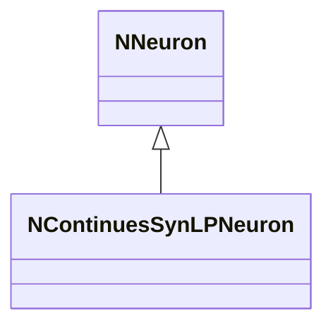
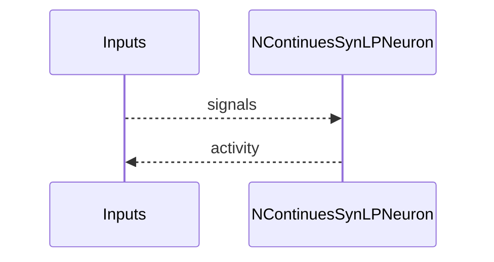
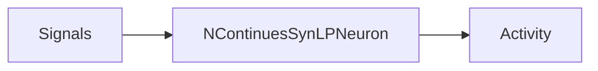

## NContinuesSynLPNeuron — непрерывный LP нейрон (syn)

**Класс**: `NContinuesSynLPNeuron` — непрерывный LP-нейрон в син. семействе.  
**Регистрация**: `UploadClass("NContinuesSynLPNeuron", ...)` в `NPulseLibrary.cpp`.  
**Storage**: `ClassName = "NContinuesSynLPNeuron"`.

### Lifecycle
- **ADefault**: параметры LP.
- **ABuild**: подключение входов/синапсов.
- **AReset**: сброс.
- **ACalculate**: непрерывный LP-расчёт.

### I/O
- Вход: сигналы/токи.
- Выход: активность/спайк.



Пояснение: диаграмма классов показывает место компонента в иерархии и ключевые связи.



Пояснение: диаграмма последовательности показывает типовой сценарий взаимодействия и порядок вызовов.



Пояснение: блок-схема показывает поток данных/сигналов (входы → компонент → выходы).

### Config snippet

```ini
[Component]
ClassName = NContinuesSynLPNeuron
Name = CSLP1
```

---

## NContinuesSynLPNeuron — continuous LP neuron (EN)

Continuous LP neuron variant (synaptic family).


Description: this class diagram shows the component position in the type hierarchy and key relations.


Description: this sequence diagram shows a typical runtime interaction and call order.


Description: this flowchart shows the data/signal flow (inputs → component → outputs).
