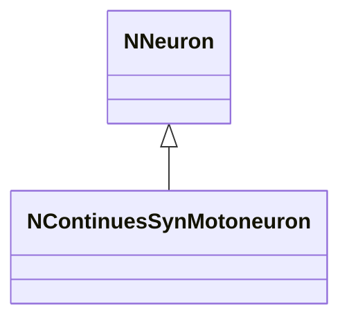
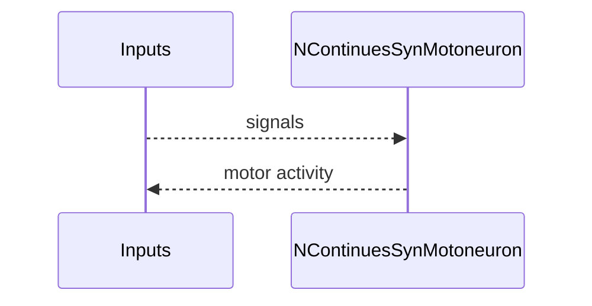
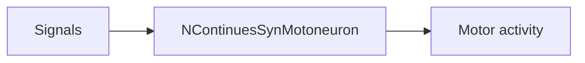
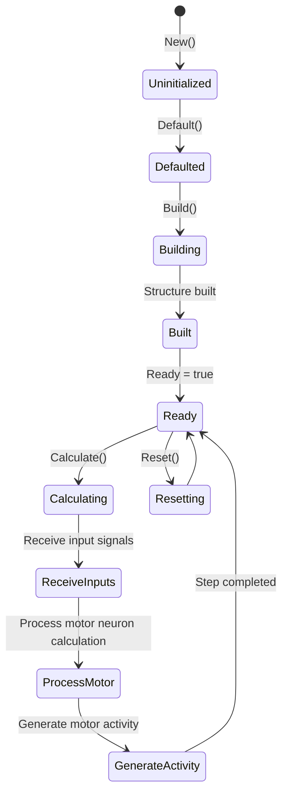
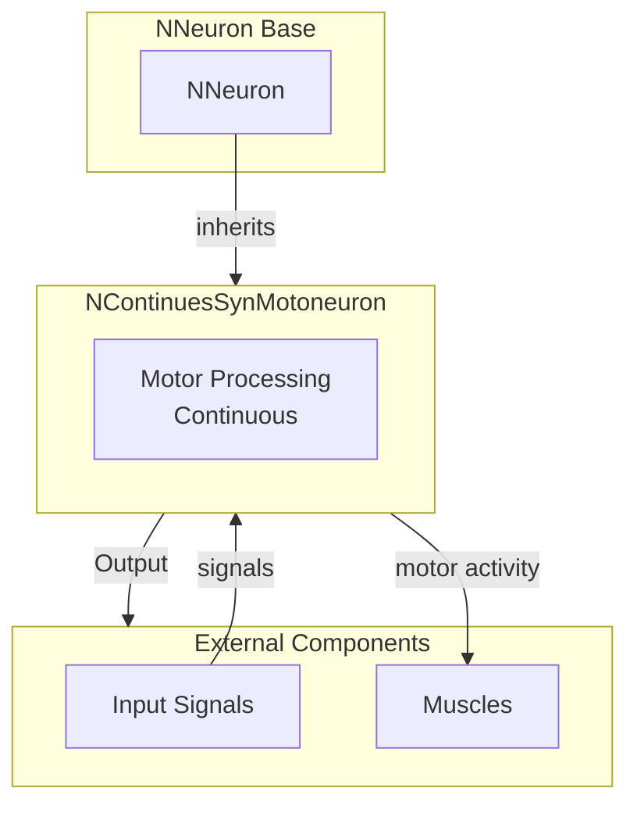

## NContinuesSynMotoneuron — непрерывный мотонейрон (syn)

**Класс**: `NContinuesSynMotoneuron` — вариант мотонейрона с непрерывной обработкой, син. семейство.
**Префикс**: `NContinues` — **Continues** (Continuous, непрерывный вариант компонента); **Аббревиатура**: `Syn` — **Syn**apse (синапс).
**Регистрация**: `UploadClass("NContinuesSynMotoneuron", ...)`.
**Storage**: `ClassName = "NContinuesSynMotoneuron"`.

### Lifecycle
- **ADefault**: параметры мотонейрона.
- **ABuild**: подключение входов/синапсов.
- **AReset**: сброс.
- **ACalculate**: вычисление управляющей активности.

### I/O
- Вход: сигналы/токи.
- Выход: моторная активность/спайк.



Пояснение: диаграмма классов показывает место компонента в иерархии и ключевые связи.



Пояснение: диаграмма последовательности показывает типовой сценарий взаимодействия и порядок вызовов.



Пояснение: блок-схема показывает поток данных/сигналов (входы → компонент → выходы).

### Config snippet

```ini
[Component]
ClassName = NContinuesSynMotoneuron
Name = CSMot1
```

## Источники

См. [Literature-References.md](../Literature-References.md): **19**, **28**, **31**.

---

## NContinuesSynMotoneuron — continuous motor neuron (EN)

Continuous motoneuron variant in synaptic family.


Description: this class diagram shows the component position in the type hierarchy and key relations.


Description: this sequence diagram shows a typical runtime interaction and call order.


Description: this flowchart shows the data/signal flow (inputs → component → outputs).

### UML State Diagram



### UML Component Diagram



### Properties

`NContinuesSynMotoneuron` uses all properties of base class `NNeuron`.

### Methods

`NContinuesSynMotoneuron` uses all methods of base class `NNeuron`:
- `ADefault()` → `bool` — sets motoneuron parameters
- `ABuild()` → `bool` — connects inputs/synapses
- `AReset()` → `bool` — resets states
- `ACalculate()` → `bool` — calculates motor activity

### Usage in configurations

`NContinuesSynMotoneuron` is used in continuous motoneuron experiments:

- **Continuous motoneurons**: Continuous motoneuron variant in synaptic family
- **Motor control**: Used in motor control experiments with continuous models

**Features:**
- Continuous processing: Performs continuous motor neuron calculation
- Synaptic family: Part of synaptic neuron family
- Motor activity: Generates motor activity for muscle control

### References

See [Literature-References.md](../Literature-References.md): **19**, **28**, **31**.
