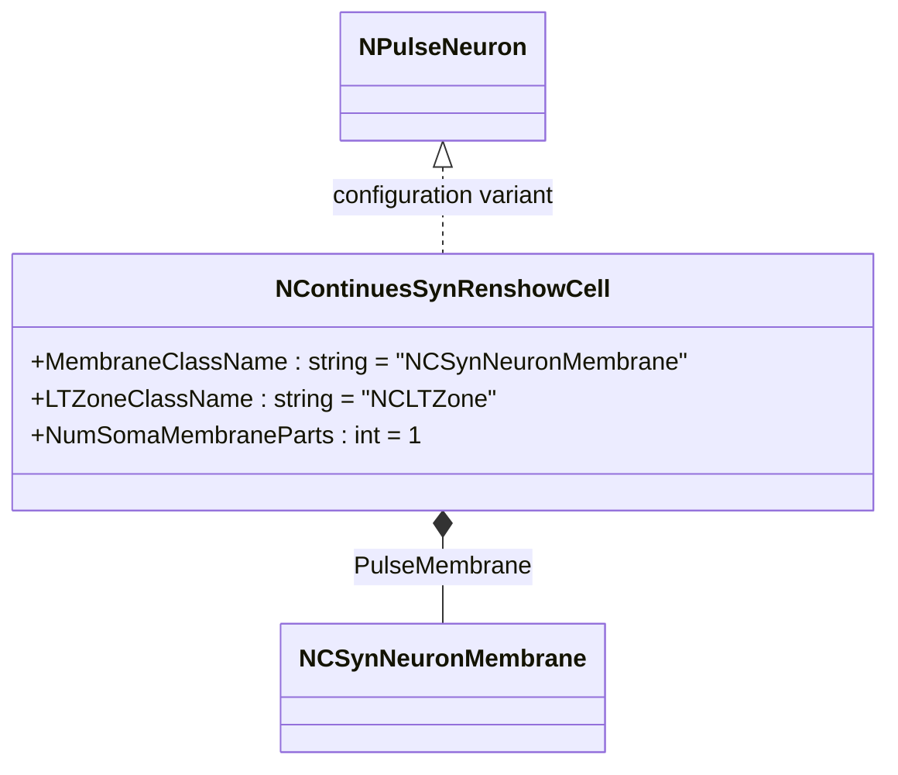
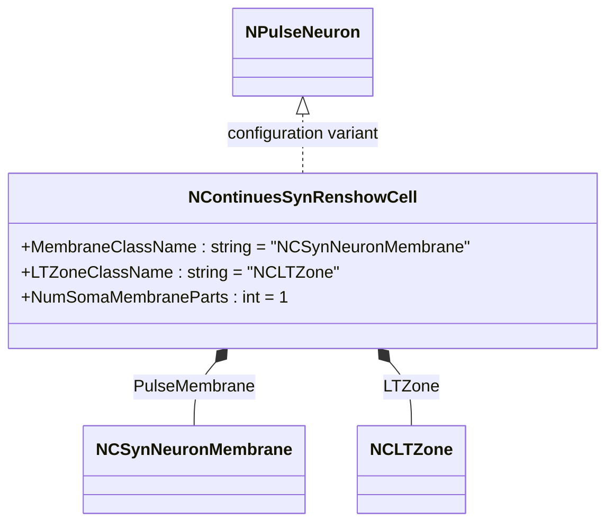
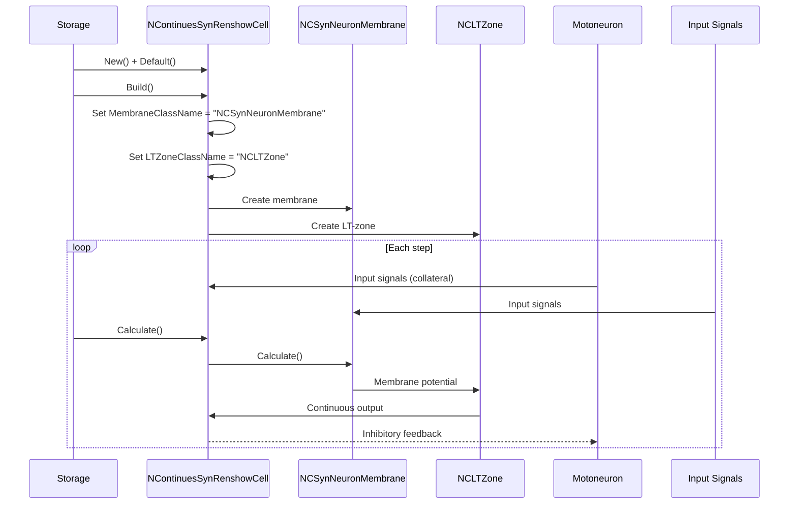
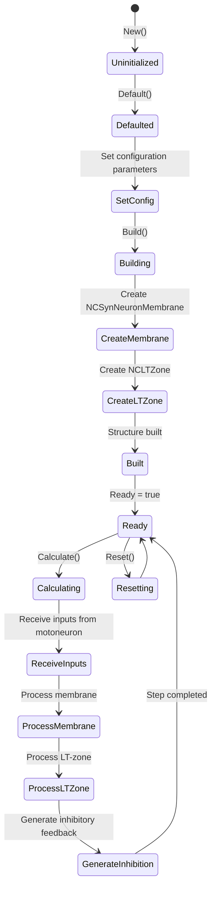
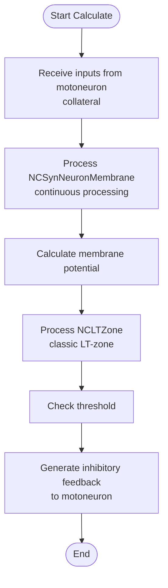
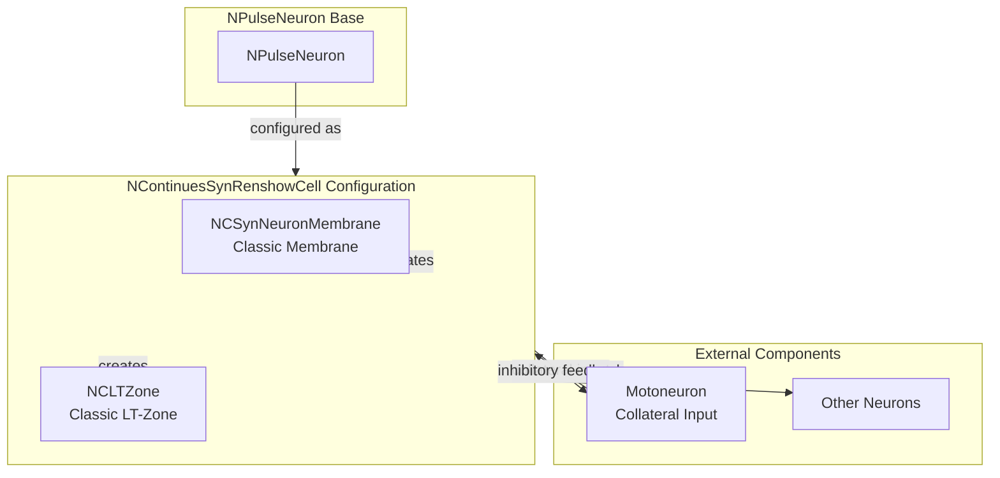

# NContinuesSynRenshowCell — непрерывный син-клетка Реншоу

## RU

### Назначение

**Класс**: `NContinuesSynRenshowCell` — конфигурационный вариант клетки Реншоу с непрерывной обработкой и оптимизированными синапсами.  
**Префикс**: `NContinues` — **Continues** (Continuous, непрерывный вариант компонента); **Аббревиатура**: `Syn` — **Syn**apse (синапс).  
**Регистрация**: `NPulseLibrary.cpp` → `UploadClass("NContinuesSynRenshowCell", ...)`.  
**Storage-инстансы**: `ClassName = "NContinuesSynRenshowCell"` в `Bin/Configs/*/Model_*.xml`.

`NContinuesSynRenshowCell` является конфигурационным вариантом базового класса `NPulseNeuron` для моделирования клеток Реншоу с непрерывной обработкой и оптимизированными синапсами. Создается из `NCNeuron` с настройками:
- `NumSomaMembraneParts = 1` — одна часть сомы
- `MembraneClassName = "NCSynNeuronMembrane"` — классическая мембрана, оптимизированная для синапсов
- `LTZoneClassName = "NCLTZone"` — классическая LT-зона

**Использование:** Моделирование реципрокного торможения с непрерывной обработкой

### UML-диаграмма классов

### Свойства

`NContinuesSynRenshowCell` использует все свойства базового класса `NPulseNeuron` с параметрами:
- `MembraneClassName = "NCSynNeuronMembrane"`
- `LTZoneClassName = "NCLTZone"`
- `NumSomaMembraneParts = 1`

### Методы

`NContinuesSynRenshowCell` использует все методы базового класса `NPulseNeuron`.

### См. также

- [`NPulseNeuron`](NPulseNeuron.md) — импульсный нейрон
- [`NSynRenshowCell`](NSynRenshowCell.md) — син-клетка Реншоу
- [`NCSynNeuronMembrane`](NCSynNeuronMembrane.md) — классическая мембрана, оптимизированная для синапсов
- [Architecture.md](../Architecture.md) — архитектура библиотеки

---

## EN

### Purpose

**Class**: `NContinuesSynRenshowCell` — configuration variant of Renshaw cell with continuous processing and optimized synapses.  
**Registration**: `NPulseLibrary.cpp` → `UploadClass("NContinuesSynRenshowCell", ...)`.  
**Instances**: `ClassName = "NContinuesSynRenshowCell"` in `Bin/Configs/*/Model_*.xml`.

`NContinuesSynRenshowCell` is a configuration variant of the base class `NPulseNeuron` for modeling Renshaw cells with continuous processing and optimized synapses. Created from `NCNeuron` with settings:
- `NumSomaMembraneParts = 1` — one soma part
- `MembraneClassName = "NCSynNeuronMembrane"` — classic membrane optimized for synapses
- `LTZoneClassName = "NCLTZone"` — classic LT-zone

**Usage:** Modeling reciprocal inhibition with continuous processing

### UML Class Diagram

### UML Sequence Diagram

### UML State Diagram

### UML Activity Diagram

### UML Component Diagram

### Properties

`NContinuesSynRenshowCell` uses all properties of base class `NPulseNeuron` with parameters:
- `MembraneClassName = "NCSynNeuronMembrane"` — classic membrane optimized for synapses
- `LTZoneClassName = "NCLTZone"` — classic LT-zone
- `NumSomaMembraneParts = 1` — one soma part

### Methods

`NContinuesSynRenshowCell` uses all methods of base class `NPulseNeuron`.

### Usage in configurations

`NContinuesSynRenshowCell` is used in experiments with reciprocal inhibition and continuous processing:

- **Reciprocal inhibition**: Modeling Renshaw cells for reciprocal inhibition of motoneurons
- **Continuous models**: Experiments with continuous (non-spiking) neuron models
- **Optimized synapses**: Uses classic membrane and LT-zone optimized for synapses

**Features:**
- Continuous output: Uses classic model with continuous output instead of spiking
- Optimized synapses: Membrane and LT-zone are optimized for synaptic processing
- Reciprocal inhibition: Provides inhibitory feedback to motoneurons

**Typical parameter values:**
- **MembraneClassName**: "NCSynNeuronMembrane" (classic membrane optimized for synapses)
- **LTZoneClassName**: "NCLTZone" (classic LT-zone)
- **NumSomaMembraneParts**: 1 (one soma part)

### See Also

- [`NPulseNeuron`](NPulseNeuron.md) — spiking neuron
- [`NSynRenshowCell`](NSynRenshowCell.md) — synaptic Renshaw cell
- [`NCSynNeuronMembrane`](NCSynNeuronMembrane.md) — classic membrane optimized for synapses
- [Architecture.md](../Architecture.md) — library architecture
