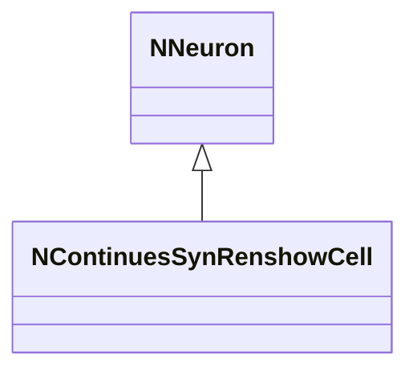
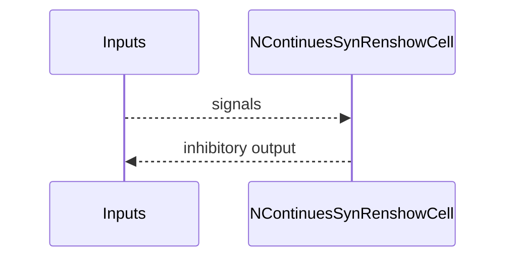
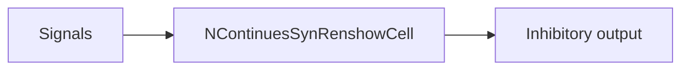

## NContinuesSynRenshowCell — непрерывная клетка Реншоу (syn)

**Класс**: `NContinuesSynRenshowCell` — вариант клетки Реншоу с непрерывной обработкой.  
**Регистрация**: `UploadClass("NContinuesSynRenshowCell", ...)`.  
**Storage**: `ClassName = "NContinuesSynRenshowCell"`.

### Lifecycle
- **ADefault**: параметры/пороги.
- **ABuild**: подключение входов/синапсов.
- **AReset**: сброс.
- **ACalculate**: расчёт тормозного ответа.

### I/O
- Вход: сигналы/токи.
- Выход: тормозная активность.



Пояснение: диаграмма классов показывает место компонента в иерархии и ключевые связи.



Пояснение: диаграмма последовательности показывает типовой сценарий взаимодействия и порядок вызовов.



Пояснение: блок-схема показывает поток данных/сигналов (входы → компонент → выходы).

### Config snippet

```ini
[Component]
ClassName = NContinuesSynRenshowCell
Name = CSRenshow1
```

---

## NContinuesSynRenshowCell — continuous Renshaw cell (EN)

Continuous inhibitory Renshaw cell variant.


Description: this class diagram shows the component position in the type hierarchy and key relations.


Description: this sequence diagram shows a typical runtime interaction and call order.


Description: this flowchart shows the data/signal flow (inputs → component → outputs).
