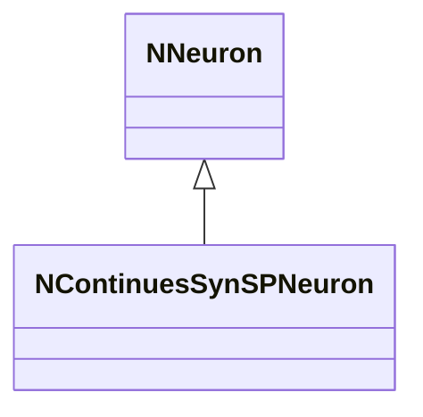
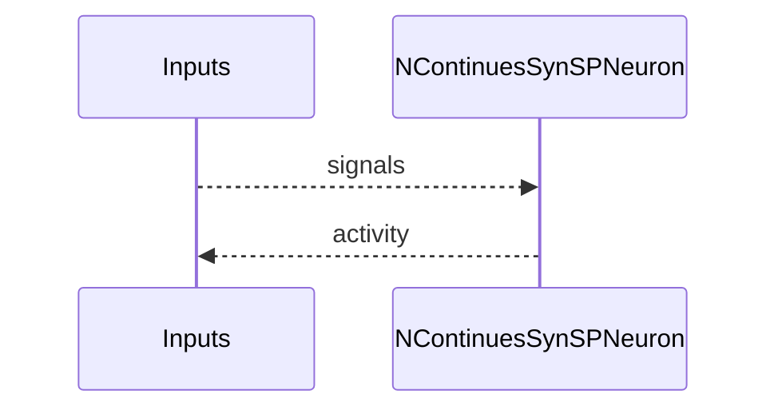
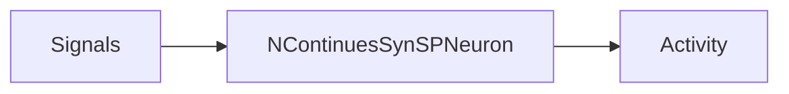

## NContinuesSynSPNeuron — непрерывный SP-нейрон (syn)

**Класс**: `NContinuesSynSPNeuron` — непрерывный вариант SP-нейрона в син. семействе.  
**Регистрация**: `UploadClass("NContinuesSynSPNeuron", ...)`.  
**Storage**: `ClassName = "NContinuesSynSPNeuron"`.

### Lifecycle
- **ADefault**: параметры SP.
- **ABuild**: подключение входов/синапсов.
- **AReset**: сброс.
- **ACalculate**: расчёт активности по SP-модели.

### I/O
- Вход: сигналы/токи.
- Выход: активность/спайк.



Пояснение: диаграмма классов показывает место компонента в иерархии и ключевые связи.



Пояснение: диаграмма последовательности показывает типовой сценарий взаимодействия и порядок вызовов.



Пояснение: блок-схема показывает поток данных/сигналов (входы → компонент → выходы).

### Config snippet

```ini
[Component]
ClassName = NContinuesSynSPNeuron
Name = CSSP1
```

---

## NContinuesSynSPNeuron — continuous SP neuron (EN)

Continuous SP neuron variant (synaptic family).


Description: this class diagram shows the component position in the type hierarchy and key relations.


Description: this sequence diagram shows a typical runtime interaction and call order.


Description: this flowchart shows the data/signal flow (inputs → component → outputs).
