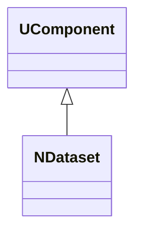
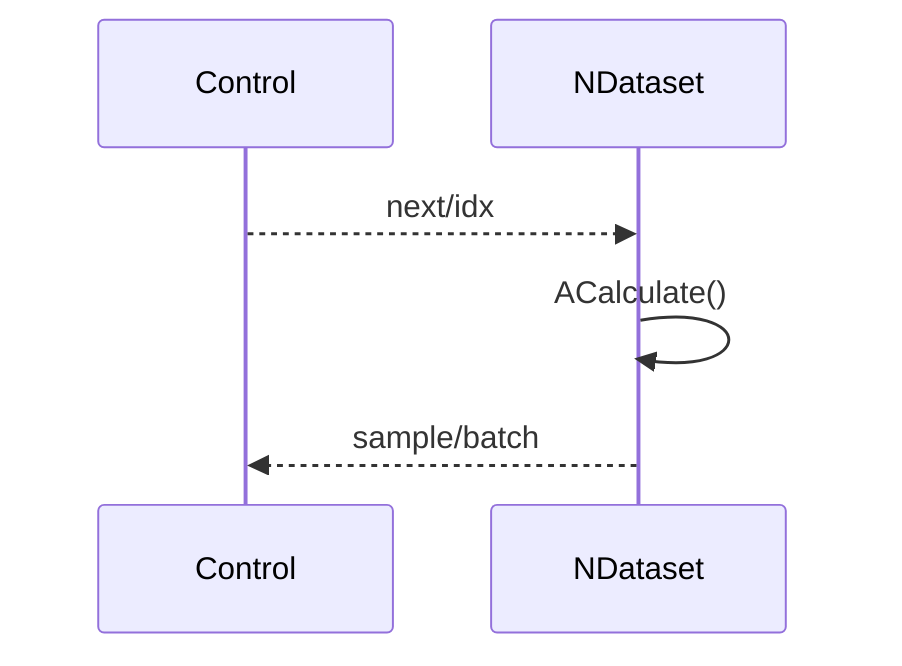
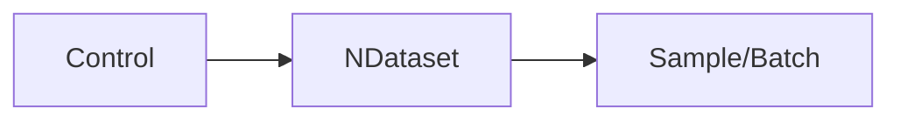
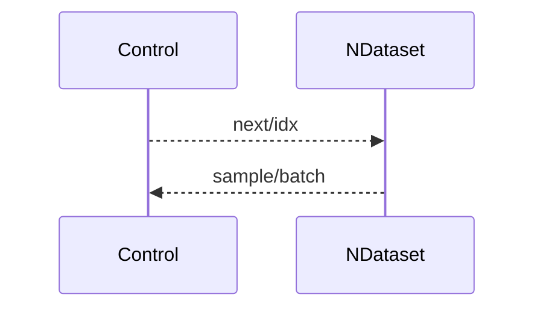

## NDataset — датасет/выборка (Nmsdk-PulseLib)

**Класс**: `NDataset` — управляет выборками/датасетами для обучения/тестов.  
**Регистрация**: `NPulseLibrary.cpp` → `UploadClass("NDataset", ...)`.  
**Storage**: `ClassName = "NDataset"`.

### Lifecycle
- **ADefault**: параметры источника данных.
- **ABuild**: загрузка/подготовка датасета.
- **AReset**: сброс указателей/итераторов.
- **ACalculate**: выдача следующего примера/батча.

### I/O
- Вход: управление (индекс/режим).
- Выход: пример/батч данных.



Пояснение: диаграмма классов показывает место компонента в иерархии и ключевые связи.



Пояснение: диаграмма последовательности показывает типовой сценарий взаимодействия и порядок вызовов.



Пояснение: блок-схема показывает поток данных/сигналов (входы → компонент → выходы).

### Config snippet

```ini
[Component]
ClassName = NDataset
Name = Dataset1
```

---

## NDataset — dataset component (EN)

Provides samples/batches from a dataset for training/testing.


Description: this class diagram shows the component position in the type hierarchy and key relations.



Description: this sequence diagram shows a typical runtime interaction and call order.


Description: this flowchart shows the data/signal flow (inputs → component → outputs).
