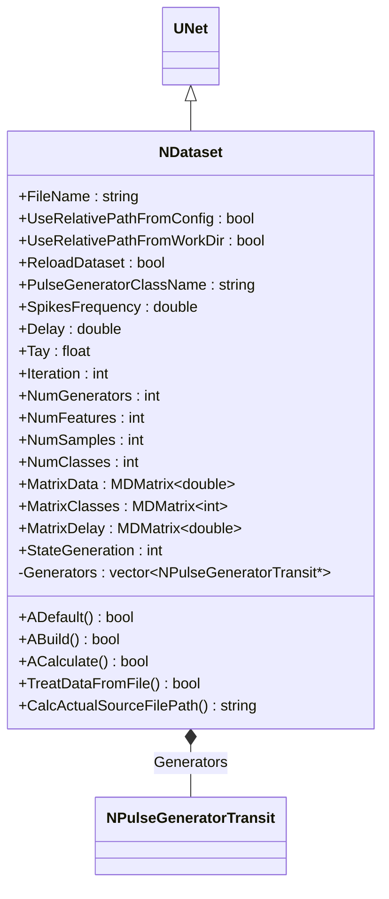

# NDataset — датасет

## RU

### Назначение

**Класс**: `NDataset` — компонент для загрузки датасета из файла и генерации спайковых паттернов.  
**Регистрация**: `NPulseLibrary.cpp` → `UploadClass("NDataset", ...)` (только `Default()`, без `Build()` — файл при регистрации может отсутствовать).  
**Storage-инстансы**: `ClassName = "NDataset"` в `Bin/Configs/*/Model_*.xml`.

`NDataset` читает файл с метками классов и признаками, вычисляет размеры и матрицы, создаёт по одному `NPulseGeneratorTransit` на каждый признак и управляет их задержками/частотой.

**Использование:** загрузка датасета, генерация паттернов для обучения/тестирования.

### UML-диаграмма классов

**Иерархия:** `UNet` → `NDataset`.  
**Связи:** создаёт и управляет дочерними `NPulseGeneratorTransit`.

### Свойства

#### Параметры (`ptPubParameter`) — задаются пользователем

| Свойство | Тип | Описание |
|----------|-----|----------|
| `FileName` | string | Путь к файлу датасета. Абсолютный, либо относительный к Config/Work по флагам |
| `UseRelativePathFromConfig` | bool | Относительно каталога Config/данных (`GetCurrentDataDir`). По умолчанию `true` |
| `UseRelativePathFromWorkDir` | bool | Относительно рабочей папки приложения (`GetSystemDir`). Взаимоисключает Config |
| `ReloadDataset` | bool | Перезагрузить файл на следующем Build/Calculate; после успеха сбрасывается в `false` |
| `PulseGeneratorClassName` | string | Класс дочерних генераторов (по умолчанию `NPulseGeneratorTransit`) |
| `SpikesFrequency` | double | Частота спайков генераторов (Гц) |
| `Delay` | double | Базовая задержка (сек) |
| `Tay` | float | Масштаб нормализации признаков → `MatrixDelay` |
| `Iteration` | int | Индекс текущего образца |

Если оба флага относительных путей выключены, `FileName` используется как есть (абсолютный путь или от cwd). Логика совпадает с `UMatrixSourceDataFile::CalcActualSourceFilePath`.

#### Состояния (`ptPubState`) — только из файла / расчёта

| Свойство | Тип | Описание |
|----------|-----|----------|
| `NumFeatures` | int | Число признаков; **вручную не задаётся** |
| `NumSamples` | int | Число образцов; **вручную не задаётся** |
| `NumGenerators` | int | Всегда `= NumFeatures` после успешной загрузки |
| `NumClasses` | int | Число уникальных меток в `MatrixClasses` |
| `MatrixData` | MDMatrix\<double\> | Признаки (строки × столбцы) |
| `MatrixClasses` | MDMatrix\<int\> | Метки классов (1 × NumSamples) |
| `MatrixDelay` | MDMatrix\<double\> | Задержки генераторов из `MatrixData` и `Tay` |
| `StateGeneration` | int | 0 — выкл., 1 — timed, 2 — непрерывно |
| `TimeGeneration` | double | Длительность timed-режима (сек) |
| `OperatingTime` | double | Метка старта timed-режима |
| `ResetDelay` | bool | Переприменить Delay/Frequency к генераторам |

### Формат файла

Разделитель `;`. Первая строка — заголовок (число `;` = `NumFeatures`). Далее строки данных: `класс;признак1;признак2;...`.

### Методы

- **`CalcActualSourceFilePath(file_name)`** — абсолютный / Config / Work путь.
- **`TreatDataFromFile()`** — атомарная загрузка: при ошибке размеры не сбрасываются; при успехе обновляются матрицы, размеры и `NumGenerators`.
- **`ABuild()`** — загрузка + sync дочерних `Generator1..N`; при ошибке файла возвращает `false`.
- **`ACalculate()`** — при `ReloadDataset` перечитывает файл и sync генераторов; управляет режимами `StateGeneration`.

### Favorites / ClDesc

ClDesc: `Bin/ClDesc/PulseLibrary/ru-RU/NDataset.xml`.

Primary Favorites: `FileName`, `ReloadDataset`, `UseRelativePathFromConfig`, `UseRelativePathFromWorkDir`, `SpikesFrequency`, `Delay`, `Tay`, `Iteration`, `PulseGeneratorClassName`, `NumFeatures`, `NumSamples`, `NumGenerators`, `NumClasses`.

### См. также

- [`NPattern`](NPattern.md) — паттерн данных
- [`NPulseGeneratorTransit`](NPulseGeneratorTransit.md) — генератор с транзитным сигналом
- [`NClassifier`](NClassifier.md) — классификатор
- [Architecture.md](../Architecture.md) — архитектура библиотеки
- `UMatrixSourceDataFile` (BasicLib) — эталон относительных путей Config/Work

### Источники

См. [Literature-References.md](../Literature-References.md): **[A]**, **4**, **25**.

---

## EN

### Purpose

**Class**: `NDataset` — loads a dataset from file and drives one pulse generator per feature.  
**Registration**: `NPulseLibrary.cpp` → `UploadClass("NDataset", ...)` (`Default()` only; no `Build()` at upload).  
**Instances**: `ClassName = "NDataset"` in `Bin/Configs/*/Model_*.xml`.

Sizes and matrices are **derived from the file** (States). Users configure `FileName`, path flags, reload, and generation parameters.

### Path resolution

Same rules as `UMatrixSourceDataFile::CalcActualSourceFilePath`:

- both relative flags off → use `FileName` as-is (absolute / cwd);
- `UseRelativePathFromConfig` → `GetCurrentDataDir() + FileName`;
- `UseRelativePathFromWorkDir` → `GetSystemDir() + FileName`;
- flags are mutually exclusive in setters.

### Properties

**Parameters:** `FileName`, `UseRelativePathFromConfig`, `UseRelativePathFromWorkDir`, `ReloadDataset`, `PulseGeneratorClassName`, `SpikesFrequency`, `Delay`, `Tay`, `Iteration`.

**States (read-only from GUI intent):** `NumFeatures`, `NumSamples`, `NumGenerators` (= `NumFeatures`), `NumClasses`, `MatrixData`, `MatrixClasses`, `MatrixDelay`, `StateGeneration`, `TimeGeneration`, `OperatingTime`, `ResetDelay`.

### Methods

- `CalcActualSourceFilePath` — resolve path
- `TreatDataFromFile` — atomic load (no wipe on failure)
- `ABuild` — load + sync generators; fail if file missing
- `ACalculate` — honor `ReloadDataset`; drive generation modes

### Favorites / ClDesc

See `Bin/ClDesc/PulseLibrary/ru-RU/NDataset.xml`.

### See Also

- [`NPattern`](NPattern.md)
- [`NPulseGeneratorTransit`](NPulseGeneratorTransit.md)
- [`NClassifier`](NClassifier.md)
- [Architecture.md](../Architecture.md)
- `UMatrixSourceDataFile` (BasicLib)

### References

See [Literature-References.md](../Literature-References.md): **[A]**, **4**, **25**.
