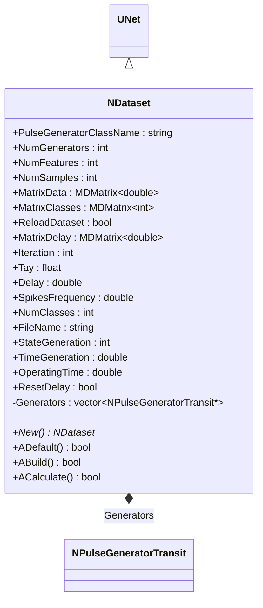
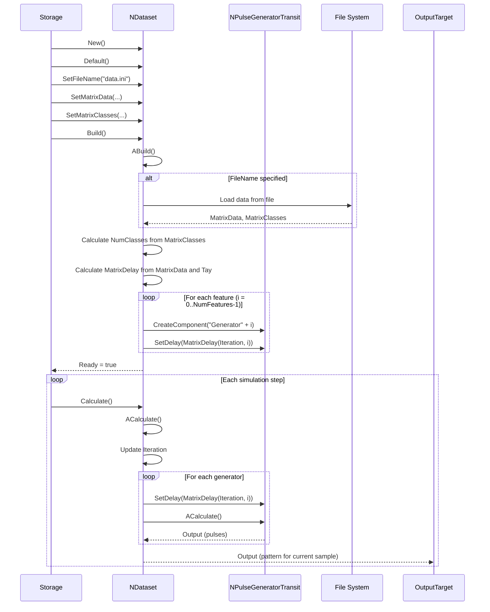
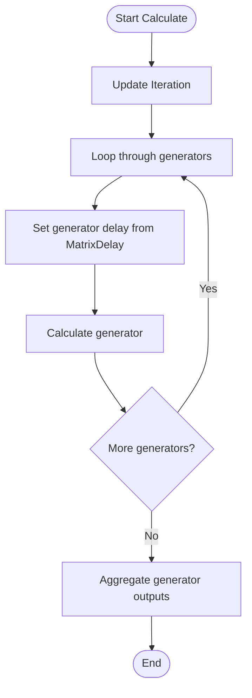
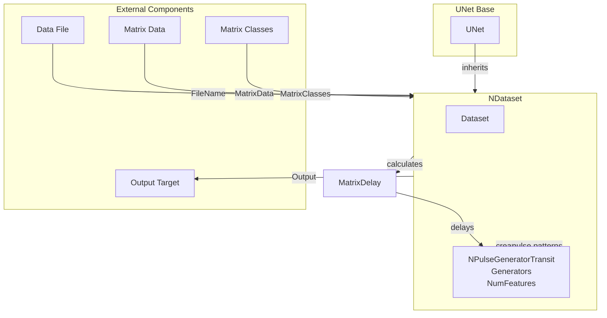

# NDataset — датасет

## RU

### Назначение

**Класс**: `NDataset` — компонент для управления датасетами (выборками данных) для обучения и тестирования.  
**Регистрация**: `NPulseLibrary.cpp` → `UploadClass("NDataset", ...)`.  
**Storage-инстансы**: `ClassName = "NDataset"` в `Bin/Configs/*/Model_*.xml`.

`NDataset` реализует компонент для управления датасетами, который создает генераторы импульсов для каждого признака данных и управляет их работой на основе матрицы данных (`MatrixData`) и классов (`MatrixClasses`). Компонент может загружать данные из файла и генерировать паттерны импульсов для обучения и тестирования нейронных сетей.

**Использование:** Управление датасетами, генерация паттернов для обучения

### UML-диаграмма классов



**Иерархия наследования:**
- `UNet` — базовая сеть Rdk Framework
- `NDataset` — датасет

**Связи:**
- Создает и управляет генераторами импульсов (`NPulseGeneratorTransit`)

### Свойства

#### Параметры (ptPubParameter)

- **`NumFeatures`** (int) — количество признаков (измерений) в датасете. Значение по умолчанию: зависит от реализации

- **`NumSamples`** (int) — количество образцов (примеров) в датасете. Значение по умолчанию: зависит от реализации

- **`MatrixData`** (MDMatrix<double>) — матрица данных. Строки — образцы, столбцы — признаки. Значение по умолчанию: зависит от реализации

- **`MatrixClasses`** (MDMatrix<int>) — матрица классов. Содержит метки классов для каждого образца. Значение по умолчанию: зависит от реализации

- **`ReloadDataset`** (bool) — флаг перезагрузки датасета. Значение по умолчанию: зависит от реализации

- **`MatrixDelay`** (MDMatrix<double>) — матрица временных сдвигов запусков генераторов. Вычисляется на основе `MatrixData` и `Tay`. Значение по умолчанию: зависит от реализации

- **`Iteration`** (int) — текущая итерация (индекс образца). Значение по умолчанию: зависит от реализации

- **`Tay`** (float) — параметр для расчета задержек. Значение по умолчанию: зависит от реализации

- **`NumClasses`** (int) — количество классов в датасете. Вычисляется автоматически из `MatrixClasses`. Значение по умолчанию: зависит от реализации

- **`FileName`** (string) — путь к файлу с данными. Значение по умолчанию: зависит от реализации

**Остальные параметры аналогичны `NPattern`.**

### Методы

- **`ABuild()`** → `bool` — строит структуру датасета:
  1. Загружает данные из файла (если указан `FileName`)
  2. Вычисляет `NumClasses` из `MatrixClasses`
  3. Вычисляет `MatrixDelay` на основе `MatrixData` и `Tay`
  4. Создает генераторы импульсов для каждого признака

- **`ACalculate()`** → `bool` — выполняет расчет датасета:
  1. Управляет генераторами для текущего образца (`Iteration`)
  2. Устанавливает задержки генераторов на основе `MatrixDelay`
  3. Обновляет состояние генерации

## Источники

См. [Literature-References.md](../Literature-References.md): **[A]**, **4**, **25**.

### См. также

- [`NPattern`](NPattern.md) — паттерн данных
- [`NPulseGeneratorTransit`](NPulseGeneratorTransit.md) — генератор с транзитным сигналом
- [`NClassifier`](NClassifier.md) — классификатор
- [Architecture.md](../Architecture.md) — архитектура библиотеки

---

## EN

### Purpose

**Class**: `NDataset` — component for managing datasets (data samples) for training and testing.  
**Registration**: `NPulseLibrary.cpp` → `UploadClass("NDataset", ...)`.  
**Instances**: `ClassName = "NDataset"` in `Bin/Configs/*/Model_*.xml`.

`NDataset` implements dataset management component that creates pulse generators for each data feature and manages their operation based on data matrix (`MatrixData`) and classes (`MatrixClasses`). Component can load data from file and generate pulse patterns for training and testing neural networks.

**Usage:** Dataset management, pattern generation for training

### UML Class Diagram


### UML Sequence Diagram



### UML State Diagram

```mermaid
stateDiagram-v2
    [*] --> Uninitialized: New()
    Uninitialized --> Defaulted: Default()
    Defaulted --> Building: Build()
    Building --> LoadData{FileName specified?}
    LoadData -->|Yes| LoadFromFile: Load from file
    LoadData -->|No| CalcNumClasses: Calculate NumClasses
    LoadFromFile --> CalcNumClasses
    CalcNumClasses --> CalcMatrixDelay: Calculate MatrixDelay
    CalcMatrixDelay --> CreateGenerators: Create generators
    CreateGenerators --> Built: Structure built
    Built --> Ready: Ready = true
    Ready --> Calculating: Calculate()
    Calculating --> UpdateIteration: Update Iteration
    UpdateIteration --> UpdateGenerators: Update generator delays
    UpdateGenerators --> Ready: Step completed
    Ready --> Resetting: Reset()
    Resetting --> ResetIteration: Iteration = 0
    ResetIteration --> Ready
```

### UML Activity Diagram



### UML Component Diagram



### Properties

- `PulseGeneratorClassName` — pulse generator class name
- `NumGenerators` — number of generators (matches NumFeatures)
- `NumFeatures` — number of features (measurements) in dataset
- `NumSamples` — number of samples in dataset
- `MatrixData` — data matrix (rows — samples, columns — features)
- `MatrixClasses` — class matrix (class labels per sample)
- `ReloadDataset` — dataset reload flag
- `MatrixDelay` — matrix of generator start time shifts
- `Iteration` — current iteration (sample index)
- `Tay` — parameter for delay calculation
- `Delay` — base delay
- `SpikesFrequency` — spike frequency
- `NumClasses` — number of classes in dataset
- `FileName` — path to data file
- `StateGeneration` — generation state
- `TimeGeneration` — generation time
- `OperatingTime` — operating time
- `ResetDelay` — delay reset flag

### Methods

- `SetPulseGeneratorClassName(value)` — setting generator class name
- `SetNumGenerators(value)` — setting number of generators
- `SetNumFeatures(value)` — setting number of features
- `SetMatrixData(value)` — setting data matrix
- `SetMatrixClasses(value)` — setting class matrix
- `ADefault()` — setting default parameters
- `ABuild()` — building dataset structure (load data, create generators)
- `ACalculate()` — pattern generation step for current sample

### Usage in configurations

`NDataset` is used for dataset management:

- **Dataset management**: `Bin/Configs/*/Model_*.xml` (where dataset management is required)
- **Pattern generation**: generating pulse patterns for training and testing
- **Data loading**: loading data from files for neural network training

**Features:**
- Automatic structure building: creates generators for each feature
- Data loading: supports loading data from files
- Class management: automatically calculates number of classes
- Delay calculation: calculates generator delays from data matrix
- Iteration management: manages current sample iteration

**Typical parameter values:**
- **PulseGeneratorClassName**: "NPulseGeneratorTransit" (transit pulse generator)
- **NumFeatures**: 5-50 (number of features in dataset)
- **NumSamples**: 10-1000 (number of samples in dataset)
- **Tay**: 0.1-1.0 (parameter for delay calculation)

### References

See [Literature-References.md](../Literature-References.md): **[A]**, **4**, **25**.

### See Also

- [`NPattern`](NPattern.md) — data pattern
- [`NPulseGeneratorTransit`](NPulseGeneratorTransit.md) — generator with transit signal
- [`NClassifier`](NClassifier.md) — classifier
- [Architecture.md](../Architecture.md) — library architecture
