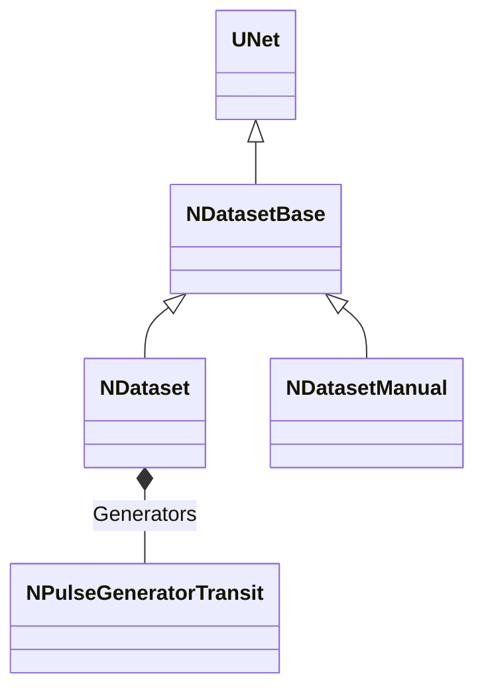

# NDataset — датасет из файла

## RU

### Назначение

**Класс**: `NDataset` — загрузка датасета из файла и генерация спайковых паттернов.  
**Регистрация**: `NPulseLibrary.cpp` → `UploadClass("NDataset", ...)` (только `Default()`, без `Build()`).  
**База**: [`NDatasetBase`](NDatasetBase.md).  
**Sibling**: [`NDatasetManual`](NDatasetManual.md) — ручной ввод матриц.

`NDataset` читает файл с метками классов и признаками, заполняет `MatrixData`/`MatrixClasses`, затем общая база считает размеры, `MatrixDelay` и создаёт по одному `NPulseGeneratorTransit` на признак.

### UML

### Свойства

#### Параметры файла (`ptPubParameter`)

| Свойство | Описание |
|----------|----------|
| `FileName` | Путь к файлу (абсолютный или относительный к Config/Work) |
| `UseRelativePathFromConfig` | База `GetCurrentDataDir()` (по умолчанию `true`) |
| `UseRelativePathFromWorkDir` | База `GetSystemDir()`; взаимоисключает Config |
| `ReloadDataset` | Перечитать файл на Build/Calculate; после успеха сбрасывается |

Если оба флага относительных путей выключены, `FileName` используется как есть. Логика как у `UMatrixSourceDataFile::CalcActualSourceFilePath`.

Общие параметры генерации и States — см. [`NDatasetBase`](NDatasetBase.md). Матрицы и размеры у file-класса остаются **State** (из файла).

### Формат файла

Разделитель `;`. Первая строка — заголовок (число `;` = `NumFeatures`). Далее: `класс;признак1;признак2;...`.

### Методы

- `PrepareDataset()` → `TreatDataFromFile()` — загрузка матриц.
- `ACalculate()` — при `ReloadDataset` перечитывает файл, затем `NDatasetBase::ACalculate()`.

### Ключевые свойства / Favorites

ClDesc: `Bin/ClDesc/PulseLibrary/ru-RU/NDataset.xml`.

Favorites: `FileName`, `ReloadDataset`, path-флаги, `SpikesFrequency`, `Delay`, `Tay`, `Iteration`, `PulseGeneratorClassName`, размеры-state.

### См. также

- [`NDatasetBase`](NDatasetBase.md)
- [`NDatasetManual`](NDatasetManual.md)
- [`NPulseGeneratorTransit`](NPulseGeneratorTransit.md)
- [`NClassifier`](NClassifier.md)
- [Architecture.md](../Architecture.md)

### Источники

См. [Literature-References.md](../Literature-References.md): **[A]**, **4**, **25**.

---

## EN

### Purpose

**Class**: `NDataset` — file-backed spike dataset (leaf of `NDatasetBase`).  
**Registration**: `UploadClass("NDataset", ...)` without `Build()` at upload.  
**Sibling**: [`NDatasetManual`](NDatasetManual.md) for manual matrices.

### Path resolution

Same rules as `UMatrixSourceDataFile::CalcActualSourceFilePath` (absolute / Config / Work).

### Favorites / ClDesc

See `Bin/ClDesc/PulseLibrary/ru-RU/NDataset.xml`.

### See Also

- [`NDatasetBase`](NDatasetBase.md)
- [`NDatasetManual`](NDatasetManual.md)
- [`NPulseGeneratorTransit`](NPulseGeneratorTransit.md)
