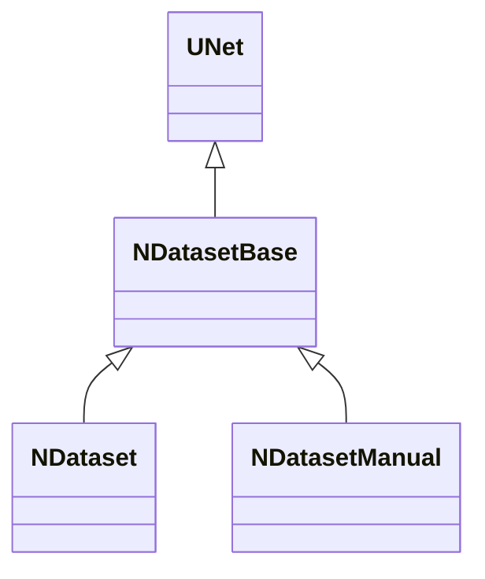

# NDatasetBase — общая база датасетов

## RU

### Назначение

**Класс**: `NDatasetBase` — абстрактная база для компонентов датасета спайков.  
**Регистрация**: **не регистрируется** в Storage (только листья `NDataset`, `NDatasetManual`).

Общая логика: матрицы → размеры / расписание спайков → дочерние `NPulseGeneratorTransit` → режимы генерации в `ACalculate`.

### Иерархия

### Контракт сборки

1. **`PrepareDataset()`** (pure virtual) — заполнить или проверить матрицы.
2. **`ApplyFromMatrices()`** — выставить `NumSamples`/`NumFeatures`/`NumClasses`; legacy: `MatrixDelay`; spike-train: из `MatrixSpikeDelays`.
3. **`SyncGenerators()`** — создать/удалить `Generator1..N` по `NumFeatures`.

`ABuild()` вызывает эти три шага по порядку.

### Два режима данных

**Legacy (single-spike):** `MaxSpikesPerFeature == 1` и `MatrixSpikeDelays` пуста / все слоты `-1`. Источник — `MatrixData` → `MatrixDelay` (через `Tay`) → постоянный `SpikesFrequency` на генераторах.

**Spike-train:** иначе primary — `MatrixSpikeDelays` размера `NumSamples × (NumFeatures × MaxSpikesPerFeature)`.

Layout колонок: `col = f * M + s` (`f` — признак, `s` — слот спайка, `M = MaxSpikesPerFeature`).

- Значение `≥ 0` — ISI в секундах (`s=0` — от старта сэмпла до 1-го спайка; далее — между спайками).
- Sentinel **`-1`** — слот пропущен; `cumsum` только по валидным слотам по порядку `s`.
- Базовый параметр `Delay` добавляется ко всем абсолютным временам.
- На событии — one-shot на генераторе фичи (Frequency/Reset на `PulseLength`, затем Frequency=0).

### Общие свойства

**Parameters:** `PulseGeneratorClassName`, `SpikesFrequency`, `Delay`, `Tay`, `Iteration`, `MaxSpikesPerFeature`.

**States (default):** `MatrixData`, `MatrixClasses`, `MatrixSpikeDelays`, `MatrixDelay`, `NumFeatures`, `NumSamples`, `NumClasses`, `StateGeneration`, `TimeGeneration`, `OperatingTime`, `ResetDelay`.

У `NDatasetManual` runtime-тип размеров и матриц (включая `MaxSpikesPerFeature`, `MatrixSpikeDelays`) переключается в Parameter через `ChangeLookupPropertyType`.

### См. также

- [`NDataset`](NDataset.md) — загрузка из файла
- [`NDatasetManual`](NDatasetManual.md) — ручной ввод матриц

---

## EN

### Purpose

**Class**: `NDatasetBase` — shared abstract base for spike dataset components.  
**Registration**: not uploaded to Storage.

Supports legacy single-spike (`MatrixData`/`Tay`) and multi-spike trains via `MatrixSpikeDelays` (ISI, sentinel `-1`).

### See Also

- [`NDataset`](NDataset.md) — file-backed
- [`NDatasetManual`](NDatasetManual.md) — manual matrices
