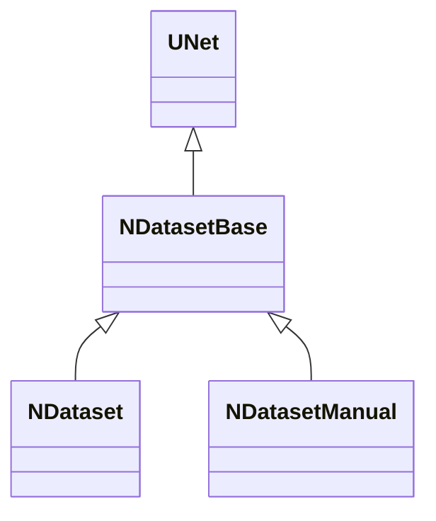

# NDatasetBase — общая база датасетов

## RU

### Назначение

**Класс**: `NDatasetBase` — абстрактная база для компонентов датасета спайков.  
**Регистрация**: **не регистрируется** в Storage (только листья `NDataset`, `NDatasetManual`).

Общая логика: матрицы признаков/классов → `MatrixDelay` / размеры → дочерние `NPulseGeneratorTransit` → режимы генерации в `ACalculate`.

### Иерархия

### Контракт сборки

1. **`PrepareDataset()`** (pure virtual) — заполнить или проверить `MatrixData` / `MatrixClasses`.
2. **`ApplyFromMatrices()`** — выставить `NumSamples`/`NumFeatures`/`NumClasses`, пересчитать `MatrixDelay`.
3. **`SyncGenerators()`** — создать/удалить `Generator1..N` по `NumFeatures`.

`ABuild()` вызывает эти три шага по порядку.

### Общие свойства

**Parameters:** `PulseGeneratorClassName`, `SpikesFrequency`, `Delay`, `Tay`, `Iteration`.

**States (default):** `MatrixData`, `MatrixClasses`, `MatrixDelay`, `NumFeatures`, `NumSamples`, `NumClasses`, `StateGeneration`, `TimeGeneration`, `OperatingTime`, `ResetDelay`.

У `NDatasetManual` runtime-тип `MatrixData`/`MatrixClasses` переключается в Parameter через `ChangeLookupPropertyType`.

### См. также

- [`NDataset`](NDataset.md) — загрузка из файла
- [`NDatasetManual`](NDatasetManual.md) — ручной ввод матриц

---

## EN

### Purpose

**Class**: `NDatasetBase` — shared abstract base for spike dataset components.  
**Registration**: not uploaded to Storage.

Pipeline: matrices → delays/sizes → child generators → generation modes.

### See Also

- [`NDataset`](NDataset.md) — file-backed
- [`NDatasetManual`](NDatasetManual.md) — manual matrices
